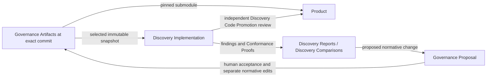

# Governed Exploratory Development Glossary

This repository is intended to provide reusable workflows for exploring software designs while keeping project authority, releasable implementation, and Conformance Proofs from Discovery Implementations separate. Its central rule is: **Discovery Implementation inherits obligations, not solutions.**

Terms are alphabetized across all categories. Each term carries linked
**Category** metadata preserving its responsibility grouping. The [category
descriptions](#terminology-categories) define those groupings, including [Shared](#shared)
for language shared across all categories. Categories describe usage, not implementation
modules or exclusive ownership. A term may list multiple categories as needed.

Emphasized references identify domain terms. `_Avoid_` identifies misleading
substitutions, not a ban on ordinary prose. The definitions describe specified behavior;
they do not claim that production workflows are implemented. [Source and implementation notes](planning/terminology-notes.md) document provenance and open implementation details. This glossary is authoritative for terminology throughout this repository; production implementation remains separately authorized.

## Terminology categories

### Category index

- [Discovery lifecycle](#discovery-lifecycle)
- [Governance authority and findings](#governance-authority-and-findings)
- [Product integration and adoption](#product-integration-and-adoption)
- [Shared](#shared)
- [Workflow delivery](#workflow-delivery)

### Category descriptions

#### Discovery lifecycle

The language for defining, creating, conducting, and closing a Discovery Implementation, including its charter, identity, context, access boundaries, provenance, and retention choices.

[back to category index](#category-index)

#### Governance authority and findings

The language for project requirements, their authority and supersession, and the durable findings, records, and proposals that inform decisions without becoming requirements themselves.

[back to category index](#category-index)

#### Product integration and adoption

The language for bringing Discovery Implementation code or designs into Product, exposing approved contracts to Discovery Implementation, and deliberately adopting Governance revisions.

[back to category index](#category-index)

#### Shared

Shared project language used across all categories. These terms retain the same meaning wherever they appear; Shared usage does not imply shared ownership or equal authority.

[back to category index](#category-index)

#### Workflow delivery

The language for distributing reusable workflow capabilities and connecting them to project repositories, including routing, Project Setup, Local Project Configuration, and ownership of generated instructions.

[back to category index](#category-index)

## Terminology Index

- [A](#a): [Active ADR](#active-adr), [Adopted Governance Revision](#adopted-governance-revision), [Architectural Sediment](#architectural-sediment)
- [B](#b): [Beeline-Technologies Marketplace](#beeline-technologies-marketplace)
- [C](#c): [Comparison Target](#comparison-target), [Conformance Proofs](#conformance-proofs), [Constitution](#constitution), [Contract Export](#contract-export)
- [D](#d): [Discovery Charter](#discovery-charter), [Discovery Code Promotion](#discovery-code-promotion), [Discovery Comparison](#discovery-comparison), [Discovery Disposition](#discovery-disposition), [Discovery Framing](#discovery-framing), [Discovery Governance Promotion](#discovery-governance-promotion), [Discovery ID](#discovery-id), [Discovery Implementation](#discovery-implementation), [Discovery Manifest](#discovery-manifest), [Discovery Report](#discovery-report), [Discovery Review](#discovery-review), [Discovery Type](#discovery-type)
- [F](#f): [Finding](#finding)
- [G](#g): [Governance](#governance), [Governance Adoption](#governance-adoption), [Governance Artifacts](#governance-artifacts), [Governance Proposal](#governance-proposal), [Governance Snapshot](#governance-snapshot), [Governed Development skill](#governed-development-skill)
- [L](#l): [Local Project Configuration](#local-project-configuration)
- [M](#m): [Materialized Governance](#materialized-governance)
- [P](#p): [Policy](#policy), [Product](#product), [Product Access Mode](#product-access-mode), [Product Impact Assessment](#product-impact-assessment), [Project Setup](#project-setup)
- [S](#s): [Shimmy Onboarding](#shimmy-onboarding), [Specification](#specification), [Successor Discovery Implementation](#successor-discovery-implementation), [Supersession](#supersession)

## A

### Active ADR

**Category:** [Governance authority and findings](#governance-authority-and-findings)

An architectural decision record that is still applicable and has not been explicitly superseded by another ADR. Active ADRs occupy the fourth normative authority level and cannot override higher-level requirements.

Sources: [Governance model](planning/handoffs/docs/02-governance-model.md), [Promotion and adoption](planning/handoffs/docs/04-promotion-and-adoption.md), [Discovery Report template](planning/handoffs/templates/DISCOVERY-REPORT.md), [Discovery Comparison template](planning/handoffs/templates/DISCOVERY-COMPARISON.md), decisions 5–8, 12, 23, 31–35.

### Adopted Governance Revision

**Category:** [Product integration and adoption](#product-integration-and-adoption)

The exact ***Governance*** commit pinned by ***Product***'s read-only submodule. The pin expresses deliberate adoption and a belief in conformance; it is neither automatic proof of conformance nor necessarily the revision selected for a new ***Discovery Implementation***.

Sources: [Promotion and adoption](planning/handoffs/docs/04-promotion-and-adoption.md), [Product layout](planning/handoffs/reference-layouts/product-repo.md), [Isolation modes](planning/handoffs/docs/08-security-and-isolation.md), decisions 5, 16, 24, 32–33.

### Architectural Sediment

**Category:** [Shared](#shared)

Accumulated implementation structure whose continued presence reflects project history rather than current architectural intent. A repeated ***Product*** pattern does not, by itself, establish a current requirement.

Sources: [Architecture](planning/handoffs/docs/01-architecture.md), [Governance model](planning/handoffs/docs/02-governance-model.md), decisions 1, 15–17.

[back to index](#terminology-index)

## B

### Beeline-Technologies Marketplace

**Category:** [Workflow delivery](#workflow-delivery)

The intended catalog and distribution boundary for independent, cohesive plugins. `Beeline-Technologies` is the handoff's marketplace name; `blt-agent-skills` is the current checkout name.

Sources: [Plugin architecture](planning/handoffs/docs/05-plugin-architecture.md), [Onboarding contract](planning/handoffs/plugin-reference/plugins/shimmy-onboarding/skills/shimmy-onboarding/references/onboarding-contract.md), decisions 17–18, 28–30, 36–37.

[back to index](#terminology-index)

## C

### Comparison Target

**Category:** [Discovery lifecycle](#discovery-lifecycle)

An optional reference against which a ***Discovery Implementation*** is evaluated using approved comparison dimensions. It may be ***Product***, another Discovery Implementation, a ***Discovery Report***, a quantitative baseline, or none; comparison does not establish ancestry or grant access permission.

Sources: [Discovery Implementation lifecycle](planning/handoffs/docs/03-discovery-lifecycle.md), [Security and isolation](planning/handoffs/docs/08-security-and-isolation.md), [Discovery Manifest schema](planning/handoffs/schemas/discovery-manifest.schema.json), [Snapshot template](planning/handoffs/templates/GOVERNANCE-SNAPSHOT.yaml), decisions 2–4, 9–14, 19–22, 25–26.

### Conformance Proofs

**Category:** [Governance authority and findings](#governance-authority-and-findings)

Material used to support or challenge a Finding, explain a decision, or assess whether requirements are met. This includes tests, measurements, benchmarks, code, logs, observations, failed approaches, and negative results, including material unrelated to conformance with requirements.

“Proofs” names the supporting material; it does not imply mathematical certainty, a successful result, complete coverage, or certification of conformance. Preserve limitations, uncertainty, and conflicting results. Conformance Proofs cannot create or override Governance requirements.

Sources: [Governance model](planning/handoffs/docs/02-governance-model.md), [Promotion and adoption](planning/handoffs/docs/04-promotion-and-adoption.md), [Discovery Report template](planning/handoffs/templates/DISCOVERY-REPORT.md), [Discovery Comparison template](planning/handoffs/templates/DISCOVERY-COMPARISON.md), decisions 5–8, 12, 23, 31–35.

### Constitution

**Category:** [Governance authority and findings](#governance-authority-and-findings)

The narrow, highest-authority part of the ***Governance Artifacts*** containing foundational principles, non-negotiable invariants, project philosophy, and governance rules.

Sources: [Governance model](planning/handoffs/docs/02-governance-model.md), [Promotion and adoption](planning/handoffs/docs/04-promotion-and-adoption.md), [Discovery Report template](planning/handoffs/templates/DISCOVERY-REPORT.md), [Discovery Comparison template](planning/handoffs/templates/DISCOVERY-COMPARISON.md), decisions 5–8, 12, 23, 31–35.

### Contract Export

**Category:** [Product integration and adoption](#product-integration-and-adoption)

An explicitly approved set of public interfaces, schemas, formats, compatibility constraints, or extension contracts available to a Contract-aware ***Discovery Implementation***. It excludes implementation internals and history and does not gain normative authority merely by being included in the Discovery Implementation context.

Sources: [Promotion and adoption](planning/handoffs/docs/04-promotion-and-adoption.md), [Product layout](planning/handoffs/reference-layouts/product-repo.md), [Isolation modes](planning/handoffs/docs/08-security-and-isolation.md), decisions 5, 16, 24, 32–33.

[back to index](#terminology-index)

## D

### Discovery Charter

**Category:** [Discovery lifecycle](#discovery-lifecycle)

The developer-approved definition of a ***Discovery Implementation***'s objective, research question, success criteria, and non-goals. It governs Discovery Implementation scope relative to descriptive metadata and remains subject to normative ***Governance***.

_Avoid_: Framing objective as a substitute for the complete charter; charter as a fifth authority level.

Sources: [Discovery Implementation lifecycle](planning/handoffs/docs/03-discovery-lifecycle.md), [Security and isolation](planning/handoffs/docs/08-security-and-isolation.md), [Discovery Manifest schema](planning/handoffs/schemas/discovery-manifest.schema.json), [Snapshot template](planning/handoffs/templates/GOVERNANCE-SNAPSHOT.yaml), decisions 2–4, 9–14, 19–22, 25–26.

### Discovery Code Promotion

**Category:** [Product integration and adoption](#product-integration-and-adoption)

A form of ***Discovery Disposition*** that transfers a Discovery Implementation’s code or design into ***Product*** through developer-reviewed Transplant, Adapt, or Reimplement. It does not imply acceptance of a ***Governance Proposal***.

Sources: [Promotion and adoption](planning/handoffs/docs/04-promotion-and-adoption.md), [Product layout](planning/handoffs/reference-layouts/product-repo.md), [Isolation modes](planning/handoffs/docs/08-security-and-isolation.md), decisions 5, 16, 24, 32–33.

### Discovery Comparison

**Category:** [Governance authority and findings](#governance-authority-and-findings)

A durable, non-normative comparison of related ***Discovery Implementations***, identified by `CMPR-*` and stored in the ***Governance*** repository's `discoveries/` directory. It preserves convergence, disagreement, tradeoffs, and uncertainty and may support a ***Governance Proposal***.

Sources: [Governance model](planning/handoffs/docs/02-governance-model.md), [Promotion and adoption](planning/handoffs/docs/04-promotion-and-adoption.md), [Discovery Report template](planning/handoffs/templates/DISCOVERY-REPORT.md), [Discovery Comparison template](planning/handoffs/templates/DISCOVERY-COMPARISON.md), decisions 5–8, 12, 23, 31–35.

### Discovery Disposition

**Category:** [Discovery lifecycle](#discovery-lifecycle)

The developer’s decisions about what happens to a Discovery Implementation and its results. These include two independent forms of promotion—***Discovery Code Promotion*** and ***Discovery Governance Promotion***—plus an independent repository retention choice: Archive, Report + Delete, or Keep Active. Both promotions may be selected, either may be declined or deferred, and neither implies a retention choice or closed status.

Sources: [Discovery Implementation lifecycle](planning/handoffs/docs/03-discovery-lifecycle.md), [Security and isolation](planning/handoffs/docs/08-security-and-isolation.md), [Discovery Manifest schema](planning/handoffs/schemas/discovery-manifest.schema.json), [Snapshot template](planning/handoffs/templates/GOVERNANCE-SNAPSHOT.yaml), decisions 2–4, 9–14, 19–22, 25–26.

### Discovery Framing

**Category:** [Discovery lifecycle](#discovery-lifecycle)

The deliberately selected lens for a ***Discovery Implementation***: Neutral, Optimize a quality, Challenge assumptions, or Custom. Framing describes the optimization or challenge perspective, not the Discovery Implementation's type or access permissions.

Sources: [Discovery Implementation lifecycle](planning/handoffs/docs/03-discovery-lifecycle.md), [Security and isolation](planning/handoffs/docs/08-security-and-isolation.md), [Discovery Manifest schema](planning/handoffs/schemas/discovery-manifest.schema.json), [Snapshot template](planning/handoffs/templates/GOVERNANCE-SNAPSHOT.yaml), decisions 2–4, 9–14, 19–22, 25–26.

### Discovery Governance Promotion

**Category:** [Governance authority and findings](#governance-authority-and-findings)

A form of ***Discovery Disposition*** that proposes changes to project requirements based on findings from a ***Discovery Implementation***. A human resolves the ***Governance Proposal***; acceptance requires separate edits to authoritative Governance Artifacts. Findings, Conformance Proofs, and the proposal remain non-normative. This decision is independent of ***Discovery Code Promotion***.

_Avoid_: Promotion without identifying whether knowledge or code is meant.

Sources: [Governance model](planning/handoffs/docs/02-governance-model.md), [Promotion and adoption](planning/handoffs/docs/04-promotion-and-adoption.md), [Discovery Report template](planning/handoffs/templates/DISCOVERY-REPORT.md), [Discovery Comparison template](planning/handoffs/templates/DISCOVERY-COMPARISON.md), decisions 5–8, 12, 23, 31–35.

### Discovery ID

**Category:** [Discovery lifecycle](#discovery-lifecycle)

An immutable sequential `DISC-*` identifier allocated from ***Governance*** and shared by the Discovery Implementation manifest, repository naming, durable record, and related references. The descriptive slug aids recognition but does not replace the ID.

Sources: [Discovery Implementation lifecycle](planning/handoffs/docs/03-discovery-lifecycle.md), [Security and isolation](planning/handoffs/docs/08-security-and-isolation.md), [Discovery Manifest schema](planning/handoffs/schemas/discovery-manifest.schema.json), [Snapshot template](planning/handoffs/templates/GOVERNANCE-SNAPSHOT.yaml), decisions 2–4, 9–14, 19–22, 25–26.

### Discovery Implementation

**Category:** [Shared](#shared)

A bounded exploratory development effort conducted in its own repository under an approved ***Discovery Charter*** and an immutable ***Governance Snapshot***. Its code and repository may be disposable even when its findings remain useful.

_Avoid_: Product branch, worktree, Discovery Report when referring to the Discovery Implementation.

Sources: [Architecture](planning/handoffs/docs/01-architecture.md), [Governance model](planning/handoffs/docs/02-governance-model.md), decisions 1, 15–17.

### Discovery Manifest

**Category:** [Discovery lifecycle](#discovery-lifecycle)

The `DISCOVERY.yaml` record of a ***Discovery Implementation***'s identity, Governance provenance and artifact selection, framing, Product access, charter, comparison, predecessor, workflow version, and status. It describes the Discovery Implementation rather than replacing its later ***Discovery Report***.

Sources: [Discovery Implementation lifecycle](planning/handoffs/docs/03-discovery-lifecycle.md), [Security and isolation](planning/handoffs/docs/08-security-and-isolation.md), [Discovery Manifest schema](planning/handoffs/schemas/discovery-manifest.schema.json), [Snapshot template](planning/handoffs/templates/GOVERNANCE-SNAPSHOT.yaml), decisions 2–4, 9–14, 19–22, 25–26.

### Discovery Report

**Category:** [Governance authority and findings](#governance-authority-and-findings)

A durable, non-normative account of a ***Discovery Implementation***, identified by its `DISC-*` ID and stored in `discoveries/` relative to the ***Governance*** repository root. It preserves the charter, results, Conformance Proofs, limitations, rejected approaches, and separate promotion decisions even if the Discovery Implementation repository is removed.

_Avoid_: Discovery Implementation repository, accepted requirement.

Sources: [Governance model](planning/handoffs/docs/02-governance-model.md), [Promotion and adoption](planning/handoffs/docs/04-promotion-and-adoption.md), [Discovery Report template](planning/handoffs/templates/DISCOVERY-REPORT.md), [Discovery Comparison template](planning/handoffs/templates/DISCOVERY-COMPARISON.md), decisions 5–8, 12, 23, 31–35.

### Discovery Review

**Category:** [Discovery lifecycle](#discovery-lifecycle)

The process that first generates and surfaces a durable ***Discovery Report***, then records the developer’s ***Discovery Disposition*** choices. It may also include an optional ***Discovery Comparison***. Choosing Keep Active continues the work; a review does not imply that the Discovery Implementation is closed.

Sources: [Discovery Implementation lifecycle](planning/handoffs/docs/03-discovery-lifecycle.md), [Security and isolation](planning/handoffs/docs/08-security-and-isolation.md), [Discovery Manifest schema](planning/handoffs/schemas/discovery-manifest.schema.json), [Snapshot template](planning/handoffs/templates/GOVERNANCE-SNAPSHOT.yaml), decisions 2–4, 9–14, 19–22, 25–26.

### Discovery Type

**Category:** [Discovery lifecycle](#discovery-lifecycle)

Descriptive classification of a ***Discovery Implementation*** as Architecture Candidate, Spike, Prototype/PoC, Benchmark, Compatibility Check, Adversarial Investigation, or Other. Type describes the work being performed; ***Discovery Framing*** describes the perspective applied. An Adversarial Investigation is a kind of work, while Challenge assumptions is a lens that can also be applied to other types. The classification does not override the ***Discovery Charter***.

Sources: [Discovery Implementation lifecycle](planning/handoffs/docs/03-discovery-lifecycle.md), [Security and isolation](planning/handoffs/docs/08-security-and-isolation.md), [Discovery Manifest schema](planning/handoffs/schemas/discovery-manifest.schema.json), [Snapshot template](planning/handoffs/templates/GOVERNANCE-SNAPSHOT.yaml), decisions 2–4, 9–14, 19–22, 25–26.

[back to index](#terminology-index)

## F

### Finding

**Category:** [Governance authority and findings](#governance-authority-and-findings)

An observation from a Discovery Implementation or comparison. A finding is distinct from its supporting ***Conformance Proofs*** and its possible implication for project requirements.

Sources: [Governance model](planning/handoffs/docs/02-governance-model.md), [Promotion and adoption](planning/handoffs/docs/04-promotion-and-adoption.md), [Discovery Report template](planning/handoffs/templates/DISCOVERY-REPORT.md), [Discovery Comparison template](planning/handoffs/templates/DISCOVERY-COMPARISON.md), decisions 5–8, 12, 23, 31–35.

[back to index](#terminology-index)

## G

### Governance

**Category:** [Shared](#shared)

The system of project requirements and decision authority. The Governance repository stores ***Governance Artifacts***; only their normative classes establish requirements.

_Avoid_: Governance as shorthand for every document being binding.

Sources: [Architecture](planning/handoffs/docs/01-architecture.md), [Governance model](planning/handoffs/docs/02-governance-model.md), decisions 1, 15–17.

### Governance Adoption

**Category:** [Product integration and adoption](#product-integration-and-adoption)

An explicit ***Product*** decision to advance its pinned ***Governance*** revision after reviewing impact, implementation, conformance, tests, and incompatibilities. The workflow recommends readiness or deferral while leaving the final choice to the developer.

_Avoid_: Proposal acceptance, automatic synchronization, automatic conformance certification.

Sources: [Promotion and adoption](planning/handoffs/docs/04-promotion-and-adoption.md), [Product layout](planning/handoffs/reference-layouts/product-repo.md), [Isolation modes](planning/handoffs/docs/08-security-and-isolation.md), decisions 5, 16, 24, 32–33.

### Governance Artifacts

**Category:** [Shared](#shared)

The documents and other material stored in the Governance repository: requirements, Conformance Proofs, Discovery Reports, Discovery Comparisons, and proposals. Each artifact retains its authority classification; storage in Governance does not make every artifact binding.

A Discovery Implementation selects Governance Artifacts in one of two ways:

- **Full:** include all material at the selected commit, preserving authority classifications.
- **Curated:** always include the Constitution, then make explicit, item-by-item inclusion choices. Record reasons for materially relevant exclusions; include reports, comparisons, and proposals only by explicit choice.

The selection determines what enters the ***Governance Snapshot***. It is independent of ***Product Access Mode***.

_Avoid_: Constitution as a name for the complete set of Governance Artifacts.

Sources: [Architecture](planning/handoffs/docs/01-architecture.md), [Governance model](planning/handoffs/docs/02-governance-model.md), decisions 1, 15–17.

### Governance Proposal

**Category:** [Governance authority and findings](#governance-authority-and-findings)

A structured, non-normative request to change ***Governance***, connecting findings and Conformance Proofs to a target artifact and suggested change. Acceptance authorizes separate normative edits; the proposal itself remains non-normative.

_Avoid_: Policy, Specification, or accepted Governance when referring only to a proposal.

Sources: [Governance model](planning/handoffs/docs/02-governance-model.md), [Promotion and adoption](planning/handoffs/docs/04-promotion-and-adoption.md), [Discovery Report template](planning/handoffs/templates/DISCOVERY-REPORT.md), [Discovery Comparison template](planning/handoffs/templates/DISCOVERY-COMPARISON.md), decisions 5–8, 12, 23, 31–35.

### Governance Snapshot

**Category:** [Discovery lifecycle](#discovery-lifecycle)

A form of ***Materialized Governance***: the generated, immutable copy of selected ***Governance Artifacts*** inside a ***Discovery Implementation***'s `.governance/`, accompanied by `SNAPSHOT.yaml` provenance. It identifies the exact source repository and commit, artifacts selection, selection decisions, authority model, and integrity information.

_Avoid_: Submodule, live Governance checkout, refreshable context.

Sources: [Discovery Implementation lifecycle](planning/handoffs/docs/03-discovery-lifecycle.md), [Security and isolation](planning/handoffs/docs/08-security-and-isolation.md), [Discovery Manifest schema](planning/handoffs/schemas/discovery-manifest.schema.json), [Snapshot template](planning/handoffs/templates/GOVERNANCE-SNAPSHOT.yaml), decisions 2–4, 9–14, 19–22, 25–26.

### Governed Development skill

**Category:** [Workflow delivery](#workflow-delivery)

The single public `governed-development` skill of the `governed-exploratory-development` plugin. It interprets user intent and conducts concise interviews while internal lifecycle workflows remain supporting modules rather than a user-facing menu.

Sources: [Plugin architecture](planning/handoffs/docs/05-plugin-architecture.md), [Onboarding contract](planning/handoffs/plugin-reference/plugins/shimmy-onboarding/skills/shimmy-onboarding/references/onboarding-contract.md), decisions 17–18, 28–30, 36–37.

[back to index](#terminology-index)

## L

### Local Project Configuration

**Category:** [Workflow delivery](#workflow-delivery)

User-local plugin data associating a project with its Product path, Governance path, Governance submodule path, and Discovery Implementation parent directory. It is workstation configuration rather than repository-intrinsic provenance; another workstation repeats Project Setup.

Sources: [Plugin architecture](planning/handoffs/docs/05-plugin-architecture.md), [Onboarding contract](planning/handoffs/plugin-reference/plugins/shimmy-onboarding/skills/shimmy-onboarding/references/onboarding-contract.md), decisions 17–18, 28–30, 36–37.

[back to index](#terminology-index)

## M

### Materialized Governance

**Category:** [Shared](#shared), [Workflow delivery](#workflow-delivery)

Concrete artifacts generated or derived from Governance for use in a repository or workflow. Examples include Governance Snapshots, generated role-specific `AGENTS.md` instructions, and derived checks or other artifacts that express Governance requirements.

Materialization describes how an artifact is produced, not a new authority level or a single ownership policy:

- A ***Governance Snapshot*** is immutable for its Discovery Implementation. Copied artifacts retain their original authority classification and source provenance.
- Generated `AGENTS.md` instructions are created when missing, then owned and maintained by the receiving repository. They remain operational instructions subordinate to Governance and are not silently regenerated by plugin upgrades.
- Other derived artifacts retain traceability to their source requirements. They cannot create or override requirements merely by being generated; checks and their results are ***Conformance Proofs***.

Not all Conformance Proofs are Materialized Governance: an exploratory benchmark or observation may have no Governance source.

Sources: [Plugin architecture](planning/handoffs/docs/05-plugin-architecture.md), [Onboarding contract](planning/handoffs/plugin-reference/plugins/shimmy-onboarding/skills/shimmy-onboarding/references/onboarding-contract.md), decisions 17–18, 28–30, 36–37.

[back to index](#terminology-index)

## P

### Policy

**Category:** [Governance authority and findings](#governance-authority-and-findings)

A general project rule governing how work or decisions must be carried out. Policies sit below the ***Constitution*** and above ***Specifications*** in the authority hierarchy.

Sources: [Governance model](planning/handoffs/docs/02-governance-model.md), [Promotion and adoption](planning/handoffs/docs/04-promotion-and-adoption.md), [Discovery Report template](planning/handoffs/templates/DISCOVERY-REPORT.md), [Discovery Comparison template](planning/handoffs/templates/DISCOVERY-COMPARISON.md), decisions 5–8, 12, 23, 31–35.

### Product

**Category:** [Shared](#shared)

The releasable implementation maintained in its own repository, with production history and compatibility obligations. Its code provides Conformance Proofs about implementation, not an additional level of ***Governance*** authority.

Sources: [Architecture](planning/handoffs/docs/01-architecture.md), [Governance model](planning/handoffs/docs/02-governance-model.md), decisions 1, 15–17.

### Product Access Mode

**Category:** [Discovery lifecycle](#discovery-lifecycle)

The developer-selected boundary on ***Product*** implementation exposure: Isolated, Contract-aware, or Full-reference. It applies across local files, Git, web access, connected tools, previous Discovery Implementations, and other agents.

Sources: [Discovery Implementation lifecycle](planning/handoffs/docs/03-discovery-lifecycle.md), [Security and isolation](planning/handoffs/docs/08-security-and-isolation.md), [Discovery Manifest schema](planning/handoffs/schemas/discovery-manifest.schema.json), [Snapshot template](planning/handoffs/templates/GOVERNANCE-SNAPSHOT.yaml), decisions 2–4, 9–14, 19–22, 25–26.

### Product Impact Assessment

**Category:** [Governance authority and findings](#governance-authority-and-findings)

The required assessment accompanying an accepted ***Governance Proposal*** that identifies consequences for ***Product***. Its categories are none, documentation, conformance/tests, implementation, migration/compatibility, and unknown requiring investigation.

Sources: [Governance model](planning/handoffs/docs/02-governance-model.md), [Promotion and adoption](planning/handoffs/docs/04-promotion-and-adoption.md), [Discovery Report template](planning/handoffs/templates/DISCOVERY-REPORT.md), [Discovery Comparison template](planning/handoffs/templates/DISCOVERY-COMPARISON.md), decisions 5–8, 12, 23, 31–35.

### Project Setup

**Category:** [Workflow delivery](#workflow-delivery)

The setup interview establishing a confirmed ***Product***/***Governance*** repository pair and its local paths and submodule relationship. Its workstation-specific result is ***Local Project Configuration***.

Sources: [Plugin architecture](planning/handoffs/docs/05-plugin-architecture.md), [Onboarding contract](planning/handoffs/plugin-reference/plugins/shimmy-onboarding/skills/shimmy-onboarding/references/onboarding-contract.md), decisions 17–18, 28–30, 36–37.

[back to index](#terminology-index)

## S

### Shimmy Onboarding

**Category:** [Workflow delivery](#workflow-delivery)

The separate sibling plugin capability that locates and invokes a verified, ***Product***-owned Shimmy bootstrap contract with appropriate authorization. It owns delegation and validation, not the bootstrap implementation.

Sources: [Plugin architecture](planning/handoffs/docs/05-plugin-architecture.md), [Onboarding contract](planning/handoffs/plugin-reference/plugins/shimmy-onboarding/skills/shimmy-onboarding/references/onboarding-contract.md), decisions 17–18, 28–30, 36–37.

### Specification

**Category:** [Governance authority and findings](#governance-authority-and-findings)

A statement of required project behavior or properties. Specifications sit below ***Policies*** and above ***Active ADRs*** in the authority hierarchy.

Sources: [Governance model](planning/handoffs/docs/02-governance-model.md), [Promotion and adoption](planning/handoffs/docs/04-promotion-and-adoption.md), [Discovery Report template](planning/handoffs/templates/DISCOVERY-REPORT.md), [Discovery Comparison template](planning/handoffs/templates/DISCOVERY-COMPARISON.md), decisions 5–8, 12, 23, 31–35.

### Successor Discovery Implementation

**Category:** [Discovery lifecycle](#discovery-lifecycle)

A new ***Discovery Implementation*** repository continuing a predecessor when material ***Governance*** changes require a new snapshot. Its manifest records the predecessor's ID in `derived_from` and a reason; the predecessor's snapshot remains unchanged.

_Avoid_: Snapshot refresh, new branch of the predecessor, Comparison Target as a synonym for predecessor.

Sources: [Discovery Implementation lifecycle](planning/handoffs/docs/03-discovery-lifecycle.md), [Security and isolation](planning/handoffs/docs/08-security-and-isolation.md), [Discovery Manifest schema](planning/handoffs/schemas/discovery-manifest.schema.json), [Snapshot template](planning/handoffs/templates/GOVERNANCE-SNAPSHOT.yaml), decisions 2–4, 9–14, 19–22, 25–26.

### Supersession

**Category:** [Governance authority and findings](#governance-authority-and-findings)

An explicit relationship in which a normative artifact replaces a predecessor at the same authority level. It cannot make a lower-level artifact override a higher-level one.

Sources: [Governance model](planning/handoffs/docs/02-governance-model.md), [Promotion and adoption](planning/handoffs/docs/04-promotion-and-adoption.md), [Discovery Report template](planning/handoffs/templates/DISCOVERY-REPORT.md), [Discovery Comparison template](planning/handoffs/templates/DISCOVERY-COMPARISON.md), decisions 5–8, 12, 23, 31–35.

[back to index](#terminology-index)

## Responsibility and ownership boundaries

| Boundary | Owns | Relationship to the other boundaries |
|---|---|---|
| Governance repository | Normative artifacts, Conformance Proofs, durable Discovery Reports and Discovery Comparisons, proposals | Governs Product and Discovery Implementation; classifies Conformance Proofs separately from authority |
| Product repository | Releasable code, production history, compatibility, tests, delivery, Product-specific bootstrap logic | Consumes Governance through a pinned, read-only submodule; reviews Discovery Implementation code for promotion |
| Discovery Implementation repository | One Discovery Implementation, its charter, Discovery Implementation code, and immutable Governance snapshot | Produces Conformance Proofs under explicit Governance Artifacts selection and Product-access choices |
| This marketplace repository | Reusable plugins, skills, workflow references, templates, schemas, and helpers | Operates workflows across project repositories; supplies neither project authority nor Product implementation |

Governance, Product, and each Discovery Implementation are separate Git repositories. A Discovery Implementation is not a Product branch or worktree. These are target roles in projects using the workflows, not directories to create inside this repository.

Sources: [Architecture](planning/handoffs/docs/01-architecture.md), [Plugin architecture](planning/handoffs/docs/05-plugin-architecture.md), [Repository layouts](planning/handoffs/reference-layouts/beeline-technologies.md).

## Relationships and invariants

The records and proposals in the diagram live in Governance but remain non-normative. The reusable workflow mechanism operates these relationships from the independent marketplace repository.

1. **Authority is fixed:** Constitution > Policies > Specifications > Active ADRs. Same-level supersession must be explicit; unresolved conflicts are surfaced. Tests, Product code, proposals, records, and `AGENTS.md` add no authority levels.
2. **Recommendations are not choices:** Governance Artifacts selection, framing, Product access, and the charter require explicit developer decisions. Curated selection always includes the Constitution and records selection decisions. An earlier explicit choice need not be asked again for the same action.
3. **Initial creation is minimal:** the only non-Git root entries are `AGENTS.md`, `DISCOVERY.yaml`, and `.governance/`. Full-reference access permits inspection; it does not select an inherited scaffold.
4. **Provenance is stable:** the snapshot is immutable. Charter and provenance fields should be treated as immutable after coding starts; later findings belong in durable records. Material Governance changes lead to a successor repository.
5. **Conformance Proofs survive retention choices:** every Discovery Review generates and surfaces its Discovery Report before Discovery Disposition choices. `active`/`closed` manifest status and the promotion and retention choices within Discovery Disposition are distinct concepts; a surfaced record does not by itself mean the Discovery Implementation is finished.
6. **Promotion decisions remain independent:** approving Discovery Governance Promotion can accompany rejecting Discovery Code Promotion, and accepting code can accompany no Governance change. Accepted proposals require Product impact assessment; they do not automatically change Product or its pin.
7. **Access and scope must agree:** a comparison target or a full snapshot selection cannot waive the Product-access boundary. Version 1 provides policy and workflow guardrails, not a hard technical sandbox.
8. **Repository actions preserve developer control:** production workflows do not create commits, stage changes, push, or operate remote hosting. The plan records a narrow approved exception for commits in disposable test-fixture setup; it does not permit commits here or in real project repositories.

Sources: [Settled decisions](planning/handoffs/decisions/DECISIONS.md), [Lifecycle](planning/handoffs/docs/03-discovery-lifecycle.md), [Persisted review decisions](planning/notional/governed-exploratory-development.md#recorded-design-decisions).

## Required choices and state distinctions

| Concept | Values and meaning |
|---|---|
| Discovery Framing | Neutral: no imposed optimization bias. Optimize a quality: optimize an explicit quality. Challenge assumptions: challenge assumptions and seek failure modes. Custom: developer-defined lens. |
| Product access | Isolated: no Product implementation exposure. Contract-aware: approved public contract exports only. Full-reference: implementation and history may be inspected in a separate Discovery Implementation repository. |
| Discovery Code Promotion approach | Transplant: reuse code that fits Product with minimal change. Adapt: reuse selected code with production changes. Reimplement: retain the design or behavior but implement it fresh in Product. |
| Proposal state | `proposals/pending/` → human resolution → `proposals/resolved/`. Resolved metadata records accepted/rejected and optionally a resolving commit. Acceptance leads to separate normative edits. |
| Discovery Implementation status | Manifest values are `active` and `closed`. Findings are recorded separately from the original charter. |
| Repository retention within Discovery Disposition | Archive: retain implementation and history read-only. Report + Delete: retain Conformance Proofs and allow manual repository removal. Keep Active: continue the Discovery Implementation. Concrete local archival mechanics remain an implementation detail. |

Sources: [Lifecycle](planning/handoffs/docs/03-discovery-lifecycle.md), [Promotion and adoption](planning/handoffs/docs/04-promotion-and-adoption.md), [Governance model](planning/handoffs/docs/02-governance-model.md), [Open implementation details](planning/handoffs/codex/OPEN-IMPLEMENTATION-DETAILS.md).

## Boundary scenarios

These scenarios exercise the specified model; they are not executed acceptance tests.

| Scenario | Expected interpretation |
|---|---|
| A test passes while its asserted behavior contradicts a Specification. | Surface the Governance inconsistency. Passing Conformance Proofs do not override the requirement. |
| A resolved proposal is accepted, but no normative artifact was edited. | The proposal remains Conformance Proofs of a decision; moving or accepting it alone did not change Governance. |
| Governance advances from G1 to G2 while a Discovery Implementation uses G1. | Preserve the G1 snapshot. A material update requires a successor with a new ID and predecessor reference. Product may still pin G1 independently. |
| DISC-0043 compares with DISC-0042 but does not continue it. | Record a comparison target; do not infer `derived_from` or permission to inspect its implementation. |
| Isolated mode is selected with Full Governance Artifacts that contain Product-derived implementation Conformance Proofs. | Surface the incompatible choices. The plan proposes requiring a revised choice; silently filtering the content would misrepresent a full snapshot. |
| A Discovery Implementation fails its success criteria but reveals a missing invariant. | Preserve the negative result and supporting Conformance Proofs. Discovery Governance Promotion may be useful even if Discovery Code Promotion is rejected. |
| A Discovery Report is surfaced and the developer chooses Keep Active. | Preserve the durable record without treating its existence as proof of closed status or immutable final findings. |
| A plugin update includes a new AGENTS template for an existing Product repository. | Repository ownership continues; do not silently replace the existing instructions. |
| Both promotion types are approved, followed by Archive. | Record Discovery Code Promotion, Discovery Governance Promotion, and repository retention independently; neither promotion implies the other or Governance adoption. |
| A benchmark fails and measures a quality unrelated to requirements. | Preserve its measurements and limitations as Conformance Proofs without claiming successful conformance. |
| A repository edits generated instructions while its Governance Snapshot stays fixed. | Both are Materialized Governance with different update rules; instruction ownership does not permit snapshot mutation or overriding requirements. |
