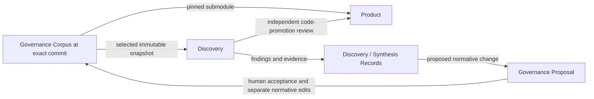

# Governed Exploratory Development Glossary

This repository is intended to provide reusable workflows for exploring software designs while keeping project authority, releasable implementation, and experimental evidence separate. Its central rule is: **Discovery inherits obligations, not solutions.**

Terms are alphabetized across all usage domains. Each term carries linked
**Usage Domain** metadata preserving its responsibility grouping. The [domain
terms](#bounded-domains) define those groupings, including [Universal](#universal)
for language shared across all domains. Domains describe usage, not implementation
modules or exclusive ownership. A term may list multiple usage domains as needed.

Emphasized references identify domain terms. `_Avoid_` identifies misleading
substitutions, not a ban on ordinary prose. The definitions describe specified behavior;
they do not claim that production workflows are implemented. See [Scope and source
status](#scope-and-source-status) for provenance and implementation status.

## Bounded Domains

### Domain index

- [Experiment definition and lifecycle](#experiment-definition-and-lifecycle)
- [Governance authority and institutional evidence](#governance-authority-and-institutional-evidence)
- [Product integration and adoption](#product-integration-and-adoption)
- [Universal](#universal)
- [Workflow delivery](#workflow-delivery)

### Domain terminology

#### Experiment definition and lifecycle

The language for defining, creating, conducting, and closing a Discovery, including its charter, identity, context, access boundaries, provenance, and retention choices.

[back to domain index](#domain-index)

#### Governance authority and institutional evidence

The language for project requirements, their authority and supersession, and the durable findings, records, and proposals that inform decisions without becoming requirements themselves.

[back to domain index](#domain-index)

#### Product integration and adoption

The language for bringing experimental code or designs into Product, exposing approved contracts to Discovery, and deliberately adopting Governance revisions.

[back to domain index](#domain-index)

#### Universal

Shared project language used across all bounded domains. These terms retain the same meaning wherever they appear; Universal usage does not imply shared ownership or equal authority.

[back to domain index](#domain-index)

#### Workflow delivery

The language for distributing reusable workflow capabilities and connecting them to project repositories, including routing, onboarding, registration, and ownership of generated instructions.

[back to domain index](#domain-index)

## Terminology Index

- [A](#a): [Active ADR](#active-adr), [Adopted Governance Revision](#adopted-governance-revision), [Architectural Sediment](#architectural-sediment)
- [B](#b): [Beeline-Technologies Marketplace](#beeline-technologies-marketplace)
- [C](#c): [Closeout](#closeout), [Code Promotion](#code-promotion), [Comparison Target](#comparison-target), [Conformance Artifact](#conformance-artifact), [Constitution](#constitution), [Contract Export](#contract-export), [Curated Discovery Context](#curated-discovery-context)
- [D](#d): [Discovery](#discovery), [Discovery ID](#discovery-id), [Discovery Manifest](#discovery-manifest), [Discovery Record](#discovery-record), [Disposition](#disposition)
- [E](#e): [Evidence](#evidence), [Experiment Charter](#experiment-charter), [Experiment Framing](#experiment-framing), [Experiment Type](#experiment-type)
- [F](#f): [Finding](#finding), [Full Governance Corpus](#full-governance-corpus)
- [G](#g): [Governance](#governance), [Governance Adoption](#governance-adoption), [Governance Context Mode](#governance-context-mode), [Governance Corpus](#governance-corpus), [Governance Implication](#governance-implication), [Governance Proposal](#governance-proposal), [Governance Snapshot](#governance-snapshot), [Governed Development Router](#governed-development-router)
- [K](#k): [Knowledge Promotion](#knowledge-promotion)
- [P](#p): [Policy](#policy), [Product](#product), [Product Access Mode](#product-access-mode), [Product Impact Assessment](#product-impact-assessment), [Project Onboarding](#project-onboarding), [Project Registration](#project-registration)
- [S](#s): [Seed-and-transfer Ownership](#seed-and-transfer-ownership), [Shimmy Onboarding](#shimmy-onboarding), [Specification](#specification), [Successor Discovery](#successor-discovery), [Supersession](#supersession), [Synthesis Record](#synthesis-record)

## A

### Active ADR

**Usage Domain:** [Governance authority and institutional evidence](#governance-authority-and-institutional-evidence)

An architectural decision record that remains applicable under explicit same-level ***Supersession***. Active ADRs occupy the fourth normative authority level and cannot override higher-level requirements.

Sources: [Governance model](planning/handoffs/docs/02-governance-model.md), [Promotion and adoption](planning/handoffs/docs/04-promotion-and-adoption.md), [Discovery Record template](planning/handoffs/templates/DISCOVERY-RECORD.md), [Synthesis Record template](planning/handoffs/templates/SYNTHESIS-RECORD.md), decisions 5–8, 12, 23, 31–35.

### Adopted Governance Revision

**Usage Domain:** [Product integration and adoption](#product-integration-and-adoption)

The exact ***Governance*** commit pinned by ***Product***'s read-only submodule. The pin expresses deliberate adoption and a belief in conformance; it is neither automatic proof of conformance nor necessarily the revision selected for a new ***Discovery***.

Sources: [Promotion and adoption](planning/handoffs/docs/04-promotion-and-adoption.md), [Product layout](planning/handoffs/reference-layouts/product-repo.md), [Isolation modes](planning/handoffs/docs/08-security-and-isolation.md), decisions 5, 16, 24, 32–33.

### Architectural Sediment

**Usage Domain:** [Universal](#universal)

Accumulated implementation structure whose continued presence reflects project history rather than current architectural intent. A repeated ***Product*** pattern does not, by itself, establish a current requirement.

Sources: [Architecture](planning/handoffs/docs/01-architecture.md), [Governance model](planning/handoffs/docs/02-governance-model.md), decisions 1, 15–17.

[back to index](#terminology-index)

## B

### Beeline-Technologies Marketplace

**Usage Domain:** [Workflow delivery](#workflow-delivery)

The intended catalog and distribution boundary for independent, cohesive plugins. `Beeline-Technologies` is the handoff's marketplace name; `blt-agent-skills` is the current checkout name.

Sources: [Plugin architecture](planning/handoffs/docs/05-plugin-architecture.md), [Onboarding contract](planning/handoffs/plugin-reference/plugins/shimmy-onboarding/skills/shimmy-onboarding/references/onboarding-contract.md), decisions 17–18, 28–30, 36–37.

[back to index](#terminology-index)

## C

### Closeout

**Usage Domain:** [Experiment definition and lifecycle](#experiment-definition-and-lifecycle)

The process that first generates and surfaces a durable ***Discovery Record*** and then asks for a ***Disposition***. Closeout may also lead to optional synthesis, ***Knowledge Promotion***, or ***Code Promotion***.

Sources: [Discovery lifecycle](planning/handoffs/docs/03-discovery-lifecycle.md), [Security and isolation](planning/handoffs/docs/08-security-and-isolation.md), [Discovery schema](planning/handoffs/schemas/discovery.schema.json), [Snapshot template](planning/handoffs/templates/GOVERNANCE-SNAPSHOT.yaml), decisions 2–4, 9–14, 19–22, 25–26.

### Code Promotion

**Usage Domain:** [Product integration and adoption](#product-integration-and-adoption)

The developer-reviewed transfer of an experimental implementation or design into ***Product*** using Transplant, Adapt, or Reimplement. It does not imply acceptance of a ***Governance Proposal***.

Sources: [Promotion and adoption](planning/handoffs/docs/04-promotion-and-adoption.md), [Product layout](planning/handoffs/reference-layouts/product-repo.md), [Isolation modes](planning/handoffs/docs/08-security-and-isolation.md), decisions 5, 16, 24, 32–33.

### Comparison Target

**Usage Domain:** [Experiment definition and lifecycle](#experiment-definition-and-lifecycle)

An optional reference against which a ***Discovery*** is evaluated using approved comparison dimensions. It may be ***Product***, another Discovery, a ***Discovery Record***, a quantitative baseline, or none; comparison does not establish ancestry or grant access permission.

Sources: [Discovery lifecycle](planning/handoffs/docs/03-discovery-lifecycle.md), [Security and isolation](planning/handoffs/docs/08-security-and-isolation.md), [Discovery schema](planning/handoffs/schemas/discovery.schema.json), [Snapshot template](planning/handoffs/templates/GOVERNANCE-SNAPSHOT.yaml), decisions 2–4, 9–14, 19–22, 25–26.

### Conformance Artifact

**Usage Domain:** [Governance authority and institutional evidence](#governance-authority-and-institutional-evidence)

Derived evidence that supports or challenges satisfaction of ***Governance*** requirements, including relevant tests. A conformance artifact cannot create or override a requirement.

Sources: [Governance model](planning/handoffs/docs/02-governance-model.md), [Promotion and adoption](planning/handoffs/docs/04-promotion-and-adoption.md), [Discovery Record template](planning/handoffs/templates/DISCOVERY-RECORD.md), [Synthesis Record template](planning/handoffs/templates/SYNTHESIS-RECORD.md), decisions 5–8, 12, 23, 31–35.

### Constitution

**Usage Domain:** [Governance authority and institutional evidence](#governance-authority-and-institutional-evidence)

The narrow, highest-authority part of the ***Governance Corpus*** containing foundational principles, non-negotiable invariants, project philosophy, and governance rules.

Sources: [Governance model](planning/handoffs/docs/02-governance-model.md), [Promotion and adoption](planning/handoffs/docs/04-promotion-and-adoption.md), [Discovery Record template](planning/handoffs/templates/DISCOVERY-RECORD.md), [Synthesis Record template](planning/handoffs/templates/SYNTHESIS-RECORD.md), decisions 5–8, 12, 23, 31–35.

### Contract Export

**Usage Domain:** [Product integration and adoption](#product-integration-and-adoption)

An explicitly approved set of public interfaces, schemas, formats, compatibility constraints, or extension contracts available to a Contract-aware ***Discovery***. It excludes implementation internals and history and does not gain normative authority merely by being included in the experiment context.

Sources: [Promotion and adoption](planning/handoffs/docs/04-promotion-and-adoption.md), [Product layout](planning/handoffs/reference-layouts/product-repo.md), [Isolation modes](planning/handoffs/docs/08-security-and-isolation.md), decisions 5, 16, 24, 32–33.

### Curated Discovery Context

**Usage Domain:** [Experiment definition and lifecycle](#experiment-definition-and-lifecycle)

A ***Governance Context Mode*** containing the ***Constitution*** plus material selected through explicit, decision-by-decision developer choices. Materially relevant exclusions require rationale; non-normative Discovery and proposal evidence requires explicit inclusion.

Sources: [Discovery lifecycle](planning/handoffs/docs/03-discovery-lifecycle.md), [Security and isolation](planning/handoffs/docs/08-security-and-isolation.md), [Discovery schema](planning/handoffs/schemas/discovery.schema.json), [Snapshot template](planning/handoffs/templates/GOVERNANCE-SNAPSHOT.yaml), decisions 2–4, 9–14, 19–22, 25–26.

[back to index](#terminology-index)

## D

### Discovery

**Usage Domain:** [Universal](#universal)

A bounded experiment conducted in its own repository under an approved ***Experiment Charter*** and an immutable ***Governance Snapshot***. Experimental implementation may be disposable even when its findings remain useful.

_Avoid_: Product branch, worktree, Discovery Record when referring to the experiment.

Sources: [Architecture](planning/handoffs/docs/01-architecture.md), [Governance model](planning/handoffs/docs/02-governance-model.md), decisions 1, 15–17.

### Discovery ID

**Usage Domain:** [Experiment definition and lifecycle](#experiment-definition-and-lifecycle)

An immutable sequential `DISC-*` identifier allocated from ***Governance*** and shared by the experiment manifest, repository naming, durable record, and related references. The descriptive slug aids recognition but does not replace the ID.

Sources: [Discovery lifecycle](planning/handoffs/docs/03-discovery-lifecycle.md), [Security and isolation](planning/handoffs/docs/08-security-and-isolation.md), [Discovery schema](planning/handoffs/schemas/discovery.schema.json), [Snapshot template](planning/handoffs/templates/GOVERNANCE-SNAPSHOT.yaml), decisions 2–4, 9–14, 19–22, 25–26.

### Discovery Manifest

**Usage Domain:** [Experiment definition and lifecycle](#experiment-definition-and-lifecycle)

The `DISCOVERY.yaml` record of a ***Discovery***'s identity, Governance provenance and context, framing, Product access, charter, comparison, predecessor, workflow version, and status. It describes the experiment rather than replacing its later ***Discovery Record***.

Sources: [Discovery lifecycle](planning/handoffs/docs/03-discovery-lifecycle.md), [Security and isolation](planning/handoffs/docs/08-security-and-isolation.md), [Discovery schema](planning/handoffs/schemas/discovery.schema.json), [Snapshot template](planning/handoffs/templates/GOVERNANCE-SNAPSHOT.yaml), decisions 2–4, 9–14, 19–22, 25–26.

### Discovery Record

**Usage Domain:** [Governance authority and institutional evidence](#governance-authority-and-institutional-evidence)

A durable, non-normative account of a ***Discovery***, identified by its `DISC-*` ID and stored in `discoveries/` relative to the ***Governance*** repository root. It preserves the charter, results, evidence, limitations, rejected approaches, and separate promotion decisions even if the experimental repository is removed.

_Avoid_: Discovery repository, accepted requirement.

Sources: [Governance model](planning/handoffs/docs/02-governance-model.md), [Promotion and adoption](planning/handoffs/docs/04-promotion-and-adoption.md), [Discovery Record template](planning/handoffs/templates/DISCOVERY-RECORD.md), [Synthesis Record template](planning/handoffs/templates/SYNTHESIS-RECORD.md), decisions 5–8, 12, 23, 31–35.

### Disposition

**Usage Domain:** [Experiment definition and lifecycle](#experiment-definition-and-lifecycle)

The developer's choice about retaining an experiment after its record is surfaced: Archive, Record + Delete, or Keep Active. Repository retention is separate from findings and promotion decisions.

Sources: [Discovery lifecycle](planning/handoffs/docs/03-discovery-lifecycle.md), [Security and isolation](planning/handoffs/docs/08-security-and-isolation.md), [Discovery schema](planning/handoffs/schemas/discovery.schema.json), [Snapshot template](planning/handoffs/templates/GOVERNANCE-SNAPSHOT.yaml), decisions 2–4, 9–14, 19–22, 25–26.

[back to index](#terminology-index)

## E

### Evidence

**Usage Domain:** [Governance authority and institutional evidence](#governance-authority-and-institutional-evidence)

Material supporting the credibility of a ***Finding***. Evidence can inform a human decision without becoming normative ***Governance***.

Sources: [Governance model](planning/handoffs/docs/02-governance-model.md), [Promotion and adoption](planning/handoffs/docs/04-promotion-and-adoption.md), [Discovery Record template](planning/handoffs/templates/DISCOVERY-RECORD.md), [Synthesis Record template](planning/handoffs/templates/SYNTHESIS-RECORD.md), decisions 5–8, 12, 23, 31–35.

### Experiment Charter

**Usage Domain:** [Experiment definition and lifecycle](#experiment-definition-and-lifecycle)

The developer-approved definition of a ***Discovery***'s objective, research question, success criteria, and non-goals. It governs experimental scope relative to descriptive metadata and remains subject to normative ***Governance***.

_Avoid_: Framing objective as a substitute for the complete charter; charter as a fifth authority level.

Sources: [Discovery lifecycle](planning/handoffs/docs/03-discovery-lifecycle.md), [Security and isolation](planning/handoffs/docs/08-security-and-isolation.md), [Discovery schema](planning/handoffs/schemas/discovery.schema.json), [Snapshot template](planning/handoffs/templates/GOVERNANCE-SNAPSHOT.yaml), decisions 2–4, 9–14, 19–22, 25–26.

### Experiment Framing

**Usage Domain:** [Experiment definition and lifecycle](#experiment-definition-and-lifecycle)

The deliberately selected lens for a ***Discovery***: Neutral, Divergent, Adversarial, or Custom. Framing describes the optimization or challenge perspective, not the experiment's type or access permissions.

Sources: [Discovery lifecycle](planning/handoffs/docs/03-discovery-lifecycle.md), [Security and isolation](planning/handoffs/docs/08-security-and-isolation.md), [Discovery schema](planning/handoffs/schemas/discovery.schema.json), [Snapshot template](planning/handoffs/templates/GOVERNANCE-SNAPSHOT.yaml), decisions 2–4, 9–14, 19–22, 25–26.

### Experiment Type

**Usage Domain:** [Experiment definition and lifecycle](#experiment-definition-and-lifecycle)

Descriptive classification of a ***Discovery*** as Architecture Candidate, Spike, Prototype/PoC, Benchmark, Compatibility Experiment, Adversarial Investigation, or Other. The classification does not override the ***Experiment Charter***.

Sources: [Discovery lifecycle](planning/handoffs/docs/03-discovery-lifecycle.md), [Security and isolation](planning/handoffs/docs/08-security-and-isolation.md), [Discovery schema](planning/handoffs/schemas/discovery.schema.json), [Snapshot template](planning/handoffs/templates/GOVERNANCE-SNAPSHOT.yaml), decisions 2–4, 9–14, 19–22, 25–26.

[back to index](#terminology-index)

## F

### Finding

**Usage Domain:** [Governance authority and institutional evidence](#governance-authority-and-institutional-evidence)

An observation from an experiment or comparison. A finding is distinct from its supporting ***Evidence*** and its possible ***Governance Implication***.

Sources: [Governance model](planning/handoffs/docs/02-governance-model.md), [Promotion and adoption](planning/handoffs/docs/04-promotion-and-adoption.md), [Discovery Record template](planning/handoffs/templates/DISCOVERY-RECORD.md), [Synthesis Record template](planning/handoffs/templates/SYNTHESIS-RECORD.md), decisions 5–8, 12, 23, 31–35.

### Full Governance Corpus

**Usage Domain:** [Experiment definition and lifecycle](#experiment-definition-and-lifecycle)

A ***Governance Context Mode*** carrying a complete, version-pinned Governance projection while preserving artifact classes and authority markings. Non-normative material remains non-normative when included.

Sources: [Discovery lifecycle](planning/handoffs/docs/03-discovery-lifecycle.md), [Security and isolation](planning/handoffs/docs/08-security-and-isolation.md), [Discovery schema](planning/handoffs/schemas/discovery.schema.json), [Snapshot template](planning/handoffs/templates/GOVERNANCE-SNAPSHOT.yaml), decisions 2–4, 9–14, 19–22, 25–26.

[back to index](#terminology-index)

## G

### Governance

**Usage Domain:** [Universal](#universal)

The project's authority model and the corpus maintained in its dedicated repository. Authority belongs only to normative artifact classes within that corpus, not to everything stored there.

_Avoid_: Governance as shorthand for every document being binding.

Sources: [Architecture](planning/handoffs/docs/01-architecture.md), [Governance model](planning/handoffs/docs/02-governance-model.md), decisions 1, 15–17.

### Governance Adoption

**Usage Domain:** [Product integration and adoption](#product-integration-and-adoption)

An explicit ***Product*** decision to advance its pinned ***Governance*** revision after reviewing impact, implementation, conformance, tests, and incompatibilities. The workflow recommends readiness or deferral while leaving the final choice to the developer.

_Avoid_: Proposal acceptance, automatic synchronization, automatic conformance certification.

Sources: [Promotion and adoption](planning/handoffs/docs/04-promotion-and-adoption.md), [Product layout](planning/handoffs/reference-layouts/product-repo.md), [Isolation modes](planning/handoffs/docs/08-security-and-isolation.md), decisions 5, 16, 24, 32–33.

### Governance Context Mode

**Usage Domain:** [Experiment definition and lifecycle](#experiment-definition-and-lifecycle)

The developer's explicit choice of Full Governance Corpus or Curated Discovery Context for a ***Discovery***. It determines which Governance material is carried into the snapshot, separately from ***Product Access Mode***.

Sources: [Discovery lifecycle](planning/handoffs/docs/03-discovery-lifecycle.md), [Security and isolation](planning/handoffs/docs/08-security-and-isolation.md), [Discovery schema](planning/handoffs/schemas/discovery.schema.json), [Snapshot template](planning/handoffs/templates/GOVERNANCE-SNAPSHOT.yaml), decisions 2–4, 9–14, 19–22, 25–26.

### Governance Corpus

**Usage Domain:** [Universal](#universal)

The durable body of material held in the ***Governance*** repository, including normative artifacts, derived conformance evidence, and non-normative institutional evidence.

_Avoid_: Constitution as a name for the entire corpus.

Sources: [Architecture](planning/handoffs/docs/01-architecture.md), [Governance model](planning/handoffs/docs/02-governance-model.md), decisions 1, 15–17.

### Governance Implication

**Usage Domain:** [Governance authority and institutional evidence](#governance-authority-and-institutional-evidence)

A reason that a ***Finding*** may justify changing project intent. It does not itself change ***Governance***; approved changes require separate normative edits.

Sources: [Governance model](planning/handoffs/docs/02-governance-model.md), [Promotion and adoption](planning/handoffs/docs/04-promotion-and-adoption.md), [Discovery Record template](planning/handoffs/templates/DISCOVERY-RECORD.md), [Synthesis Record template](planning/handoffs/templates/SYNTHESIS-RECORD.md), decisions 5–8, 12, 23, 31–35.

### Governance Proposal

**Usage Domain:** [Governance authority and institutional evidence](#governance-authority-and-institutional-evidence)

A structured, non-normative request to change ***Governance***, connecting findings and evidence to a target artifact and suggested change. Acceptance authorizes separate normative edits; the proposal itself remains non-normative.

_Avoid_: Policy, Specification, or accepted Governance when referring only to a proposal.

Sources: [Governance model](planning/handoffs/docs/02-governance-model.md), [Promotion and adoption](planning/handoffs/docs/04-promotion-and-adoption.md), [Discovery Record template](planning/handoffs/templates/DISCOVERY-RECORD.md), [Synthesis Record template](planning/handoffs/templates/SYNTHESIS-RECORD.md), decisions 5–8, 12, 23, 31–35.

### Governance Snapshot

**Usage Domain:** [Experiment definition and lifecycle](#experiment-definition-and-lifecycle)

The generated, immutable copy of selected ***Governance Corpus*** material inside a ***Discovery***'s `.governance/`, accompanied by `SNAPSHOT.yaml` provenance. It identifies the exact source repository and commit, context mode, selection decisions, authority model, and integrity information.

_Avoid_: Submodule, live Governance checkout, refreshable context.

Sources: [Discovery lifecycle](planning/handoffs/docs/03-discovery-lifecycle.md), [Security and isolation](planning/handoffs/docs/08-security-and-isolation.md), [Discovery schema](planning/handoffs/schemas/discovery.schema.json), [Snapshot template](planning/handoffs/templates/GOVERNANCE-SNAPSHOT.yaml), decisions 2–4, 9–14, 19–22, 25–26.

### Governed Development Router

**Usage Domain:** [Workflow delivery](#workflow-delivery)

The single public `governed-development` skill of the `governed-exploratory-development` plugin. It interprets user intent and conducts concise interviews while internal lifecycle workflows remain supporting modules rather than a user-facing menu.

Sources: [Plugin architecture](planning/handoffs/docs/05-plugin-architecture.md), [Onboarding contract](planning/handoffs/plugin-reference/plugins/shimmy-onboarding/skills/shimmy-onboarding/references/onboarding-contract.md), decisions 17–18, 28–30, 36–37.

[back to index](#terminology-index)

## K

### Knowledge Promotion

**Usage Domain:** [Governance authority and institutional evidence](#governance-authority-and-institutional-evidence)

The process of bringing experimental findings into normative ***Governance*** through a ***Governance Proposal*** and human resolution. It is independent of ***Code Promotion*** into ***Product***.

_Avoid_: Promotion without identifying whether knowledge or code is meant.

Sources: [Governance model](planning/handoffs/docs/02-governance-model.md), [Promotion and adoption](planning/handoffs/docs/04-promotion-and-adoption.md), [Discovery Record template](planning/handoffs/templates/DISCOVERY-RECORD.md), [Synthesis Record template](planning/handoffs/templates/SYNTHESIS-RECORD.md), decisions 5–8, 12, 23, 31–35.

[back to index](#terminology-index)

## P

### Policy

**Usage Domain:** [Governance authority and institutional evidence](#governance-authority-and-institutional-evidence)

A normative project rule below the ***Constitution*** and above ***Specifications*** in the authority hierarchy.

Sources: [Governance model](planning/handoffs/docs/02-governance-model.md), [Promotion and adoption](planning/handoffs/docs/04-promotion-and-adoption.md), [Discovery Record template](planning/handoffs/templates/DISCOVERY-RECORD.md), [Synthesis Record template](planning/handoffs/templates/SYNTHESIS-RECORD.md), decisions 5–8, 12, 23, 31–35.

### Product

**Usage Domain:** [Universal](#universal)

The releasable implementation maintained in its own repository, with production history and compatibility obligations. Its code is evidence about implementation, not an additional level of ***Governance*** authority.

Sources: [Architecture](planning/handoffs/docs/01-architecture.md), [Governance model](planning/handoffs/docs/02-governance-model.md), decisions 1, 15–17.

### Product Access Mode

**Usage Domain:** [Experiment definition and lifecycle](#experiment-definition-and-lifecycle)

The developer-selected boundary on ***Product*** implementation exposure: Isolated, Contract-aware, or Full-reference. It applies across local files, Git, web access, connected tools, previous experiments, and other agents.

Sources: [Discovery lifecycle](planning/handoffs/docs/03-discovery-lifecycle.md), [Security and isolation](planning/handoffs/docs/08-security-and-isolation.md), [Discovery schema](planning/handoffs/schemas/discovery.schema.json), [Snapshot template](planning/handoffs/templates/GOVERNANCE-SNAPSHOT.yaml), decisions 2–4, 9–14, 19–22, 25–26.

### Product Impact Assessment

**Usage Domain:** [Governance authority and institutional evidence](#governance-authority-and-institutional-evidence)

The required assessment accompanying an accepted ***Governance Proposal*** that identifies consequences for ***Product***. Its categories are none, documentation, conformance/tests, implementation, migration/compatibility, and unknown requiring investigation.

Sources: [Governance model](planning/handoffs/docs/02-governance-model.md), [Promotion and adoption](planning/handoffs/docs/04-promotion-and-adoption.md), [Discovery Record template](planning/handoffs/templates/DISCOVERY-RECORD.md), [Synthesis Record template](planning/handoffs/templates/SYNTHESIS-RECORD.md), decisions 5–8, 12, 23, 31–35.

### Project Onboarding

**Usage Domain:** [Workflow delivery](#workflow-delivery)

The one-time interview establishing a confirmed ***Product***/***Governance*** repository pair and its local paths and submodule relationship. Its workstation-specific result is a ***Project Registration***.

Sources: [Plugin architecture](planning/handoffs/docs/05-plugin-architecture.md), [Onboarding contract](planning/handoffs/plugin-reference/plugins/shimmy-onboarding/skills/shimmy-onboarding/references/onboarding-contract.md), decisions 17–18, 28–30, 36–37.

### Project Registration

**Usage Domain:** [Workflow delivery](#workflow-delivery)

User-local plugin data associating a project with its Product path, Governance path, Governance submodule path, and Discovery parent directory. It is workstation configuration rather than repository-intrinsic provenance; another workstation repeats onboarding.

Sources: [Plugin architecture](planning/handoffs/docs/05-plugin-architecture.md), [Onboarding contract](planning/handoffs/plugin-reference/plugins/shimmy-onboarding/skills/shimmy-onboarding/references/onboarding-contract.md), decisions 17–18, 28–30, 36–37.

[back to index](#terminology-index)

## S

### Seed-and-transfer Ownership

**Usage Domain:** [Workflow delivery](#workflow-delivery)

The ownership rule under which the plugin generates a missing role-specific `AGENTS.md` once and the receiving repository owns it thereafter. These files provide operational instructions, cannot override ***Governance***, and are not silently regenerated by plugin upgrades.

Sources: [Plugin architecture](planning/handoffs/docs/05-plugin-architecture.md), [Onboarding contract](planning/handoffs/plugin-reference/plugins/shimmy-onboarding/skills/shimmy-onboarding/references/onboarding-contract.md), decisions 17–18, 28–30, 36–37.

### Shimmy Onboarding

**Usage Domain:** [Workflow delivery](#workflow-delivery)

The separate sibling plugin capability that locates and invokes a verified, ***Product***-owned Shimmy bootstrap contract with appropriate authorization. It owns delegation and validation, not the bootstrap implementation.

Sources: [Plugin architecture](planning/handoffs/docs/05-plugin-architecture.md), [Onboarding contract](planning/handoffs/plugin-reference/plugins/shimmy-onboarding/skills/shimmy-onboarding/references/onboarding-contract.md), decisions 17–18, 28–30, 36–37.

### Specification

**Usage Domain:** [Governance authority and institutional evidence](#governance-authority-and-institutional-evidence)

A normative statement of project requirements below ***Policies*** and above ***Active ADRs*** in the authority hierarchy.

Sources: [Governance model](planning/handoffs/docs/02-governance-model.md), [Promotion and adoption](planning/handoffs/docs/04-promotion-and-adoption.md), [Discovery Record template](planning/handoffs/templates/DISCOVERY-RECORD.md), [Synthesis Record template](planning/handoffs/templates/SYNTHESIS-RECORD.md), decisions 5–8, 12, 23, 31–35.

### Successor Discovery

**Usage Domain:** [Experiment definition and lifecycle](#experiment-definition-and-lifecycle)

A new ***Discovery*** repository continuing a predecessor when material ***Governance*** changes require a new snapshot. Its manifest records the predecessor's ID in `derived_from` and a reason; the predecessor's snapshot remains unchanged.

_Avoid_: Snapshot refresh, new branch of the predecessor, Comparison Target as a synonym for predecessor.

Sources: [Discovery lifecycle](planning/handoffs/docs/03-discovery-lifecycle.md), [Security and isolation](planning/handoffs/docs/08-security-and-isolation.md), [Discovery schema](planning/handoffs/schemas/discovery.schema.json), [Snapshot template](planning/handoffs/templates/GOVERNANCE-SNAPSHOT.yaml), decisions 2–4, 9–14, 19–22, 25–26.

### Supersession

**Usage Domain:** [Governance authority and institutional evidence](#governance-authority-and-institutional-evidence)

An explicit relationship in which a normative artifact replaces a predecessor at the same authority level. It cannot make a lower-level artifact override a higher-level one.

Sources: [Governance model](planning/handoffs/docs/02-governance-model.md), [Promotion and adoption](planning/handoffs/docs/04-promotion-and-adoption.md), [Discovery Record template](planning/handoffs/templates/DISCOVERY-RECORD.md), [Synthesis Record template](planning/handoffs/templates/SYNTHESIS-RECORD.md), decisions 5–8, 12, 23, 31–35.

### Synthesis Record

**Usage Domain:** [Governance authority and institutional evidence](#governance-authority-and-institutional-evidence)

A durable, non-normative comparison of related ***Discoveries***, identified by `SYNTH-*` and stored in the ***Governance*** repository's `discoveries/` directory. It preserves convergence, disagreement, tradeoffs, and uncertainty and may support a ***Governance Proposal***.

Sources: [Governance model](planning/handoffs/docs/02-governance-model.md), [Promotion and adoption](planning/handoffs/docs/04-promotion-and-adoption.md), [Discovery Record template](planning/handoffs/templates/DISCOVERY-RECORD.md), [Synthesis Record template](planning/handoffs/templates/SYNTHESIS-RECORD.md), decisions 5–8, 12, 23, 31–35.

[back to index](#terminology-index)

## Scope and source status

This is the repository's working glossary, derived from its current artifacts. The artifacts share one vocabulary across Governance, Product, Discovery, and workflow delivery; those responsibilities are described through term metadata and the ownership boundaries below without introducing new implementation modules.

As of 2026-09-14, the repository contains a design handoff, reference scaffolding, and a persisted implementation plan. There is no production plugin or test suite. Behavior described here is specified behavior, not a claim that it is implemented. The [persisted plan](planning/notional/governed-exploratory-development.md#plan-status-and-authorization) remains awaiting implementation authorization; maintaining this glossary does not start an implementation milestone.

Source precedence within the handoff is [settled decisions](planning/handoffs/decisions/DECISIONS.md), architecture and governance documentation, workflow specifications, templates and schemas, then reference skeletons. This glossary summarizes that language; it does not replace the handoff or become Governance for projects using the future plugins. The plan distinguishes approved review decisions from proposed implementation details.

[AGENTS.md](AGENTS.md) names an absent `docs/handoffs/governed-exploratory-development/` directory. The persisted plan records user confirmation of [planning/handoffs/](planning/handoffs/README.md) as the authoritative handoff location. Both the handoff and the existing plan are preserved.

## Responsibility and ownership boundaries

| Boundary | Owns | Relationship to the other boundaries |
|---|---|---|
| Governance repository | Normative artifacts, conformance evidence, durable Discovery and synthesis records, proposals | Governs Product and Discovery; classifies evidence separately from authority |
| Product repository | Releasable code, production history, compatibility, tests, delivery, Product-specific bootstrap logic | Consumes Governance through a pinned, read-only submodule; reviews experimental code for promotion |
| Discovery repository | One experiment, its charter, experimental code, and immutable Governance snapshot | Produces evidence under explicit Governance context and Product-access choices |
| This marketplace repository | Reusable plugins, skills, workflow references, templates, schemas, and helpers | Operates workflows across project repositories; supplies neither project authority nor Product implementation |

Governance, Product, and each Discovery are separate Git repositories. A Discovery is not a Product branch or worktree. These are target roles in projects using the workflows, not directories to create inside this repository.

Sources: [Architecture](planning/handoffs/docs/01-architecture.md), [Plugin architecture](planning/handoffs/docs/05-plugin-architecture.md), [Repository layouts](planning/handoffs/reference-layouts/beeline-technologies.md).

## Relationships and invariants

The records and proposals in the diagram live in Governance but remain non-normative. The reusable workflow mechanism operates these relationships from the independent marketplace repository.

1. **Authority is fixed:** Constitution > Policies > Specifications > Active ADRs. Same-level supersession must be explicit; unresolved conflicts are surfaced. Tests, Product code, proposals, records, and `AGENTS.md` add no authority levels.
2. **Recommendations are not choices:** Governance context, framing, Product access, and the charter require explicit developer decisions. Curated context always includes the Constitution and records selection decisions. An earlier explicit choice need not be asked again for the same action.
3. **Initial creation is minimal:** the only non-Git root entries are `AGENTS.md`, `DISCOVERY.yaml`, and `.governance/`. Full-reference access permits inspection; it does not select an inherited scaffold.
4. **Provenance is stable:** the snapshot is immutable. Charter and provenance fields should be treated as immutable after coding starts; later findings belong in durable records. Material Governance changes lead to a successor repository.
5. **Evidence survives retention choices:** every closeout generates and surfaces its record before disposition. `active`/`closed` manifest status and Archive/Record + Delete/Keep Active disposition are distinct concepts; a surfaced record does not by itself mean the experiment is finished.
6. **Promotion decisions remain independent:** accepting knowledge can accompany rejecting code, and accepting code can accompany no Governance change. Accepted proposals require Product impact assessment; they do not automatically change Product or its pin.
7. **Access and scope must agree:** a comparison target or a full snapshot selection cannot waive the Product-access boundary. Version 1 provides policy and workflow guardrails, not a hard technical sandbox.
8. **Repository actions preserve developer control:** production workflows do not create commits, stage changes, push, or operate remote hosting. The plan records a narrow approved exception for commits in disposable test-fixture setup; it does not permit commits here or in real project repositories.

Sources: [Settled decisions](planning/handoffs/decisions/DECISIONS.md), [Lifecycle](planning/handoffs/docs/03-discovery-lifecycle.md), [Persisted review decisions](planning/notional/governed-exploratory-development.md#recorded-design-decisions).

## Required choices and state distinctions

| Concept | Values and meaning |
|---|---|
| Experiment framing | Neutral: no imposed optimization bias. Divergent: optimize an explicit quality. Adversarial: challenge assumptions and seek failure modes. Custom: developer-defined lens. |
| Product access | Isolated: no Product implementation exposure. Contract-aware: approved public contract exports only. Full-reference: implementation and history may be inspected in a separate experiment repository. |
| Code-promotion approach | Transplant: reuse code that fits Product with minimal change. Adapt: reuse selected code with production changes. Reimplement: retain the design or behavior but implement it fresh in Product. |
| Proposal state | `proposals/pending/` → human resolution → `proposals/resolved/`. Resolved metadata records accepted/rejected and optionally a resolving commit. Acceptance leads to separate normative edits. |
| Discovery status | Manifest values are `active` and `closed`. Findings are recorded separately from the original charter. |
| Closeout disposition | Archive: retain implementation and history read-only. Record + Delete: retain evidence and allow manual repository removal. Keep Active: continue the experiment. Concrete local archival mechanics remain an implementation detail. |

Sources: [Lifecycle](planning/handoffs/docs/03-discovery-lifecycle.md), [Promotion and adoption](planning/handoffs/docs/04-promotion-and-adoption.md), [Governance model](planning/handoffs/docs/02-governance-model.md), [Open implementation details](planning/handoffs/codex/OPEN-IMPLEMENTATION-DETAILS.md).

## Boundary scenarios

These scenarios exercise the specified model; they are not executed acceptance tests.

| Scenario | Expected interpretation |
|---|---|
| A test passes while its asserted behavior contradicts a Specification. | Surface the Governance inconsistency. Passing evidence does not override the requirement. |
| A resolved proposal is accepted, but no normative artifact was edited. | The proposal remains evidence of a decision; moving or accepting it alone did not change Governance. |
| Governance advances from G1 to G2 while a Discovery uses G1. | Preserve the G1 snapshot. A material update requires a successor with a new ID and predecessor reference. Product may still pin G1 independently. |
| DISC-0043 compares with DISC-0042 but does not continue it. | Record a comparison target; do not infer `derived_from` or permission to inspect its implementation. |
| Isolated mode is selected with Full Governance that contains Product-derived implementation evidence. | Surface the incompatible choices. The plan proposes requiring a revised choice; silently filtering the content would misrepresent a full snapshot. |
| An experiment fails its success criteria but reveals a missing invariant. | Preserve the negative result and supporting evidence. Knowledge promotion may be useful even if code promotion is rejected. |
| A closeout record is surfaced and the developer chooses Keep Active. | Preserve the durable record without treating its existence as proof of closed status or immutable final findings. |
| A plugin update includes a new AGENTS template for an existing Product repository. | Repository ownership continues; do not silently replace the existing instructions. |

## Artifact differences and open details

The [persisted plan's inconsistency register](planning/notional/governed-exploratory-development.md#package-inconsistencies-and-proposed-handling) already identifies the principal reference mismatches. This glossary uses settled domain semantics without modifying the source artifacts or treating proposed fixes as completed work.

| Artifact difference or open detail | Model treatment |
|---|---|
| Reference provenance permits workstation paths despite user-local registration; contract storage and content hashing are underspecified. | Keep local configuration distinct from durable provenance. Stable repository identities, separate contract namespaces, and canonical content manifests are proposed implementation details. |
| The Discovery layout suggests inherited scaffolding may be justified; the Product AGENTS template lists implementation as a fifth precedence item. | Decisions 13 and 15 establish minimal creation and code as evidence. Neither reference changes those rules. |
| The proposal template includes `resolution: pending`; the closeout reference requires record approval before disposition. | Decisions 34 and 11 establish directory-based pending state and a generated-and-surfaced record. Do not add redundant pending-resolution metadata or an extra mandatory approval gate from the lower-priority templates. |
| The plan proposes consumed ID reservations and coordination against one Governance checkout. | Sequential immutable identity is settled. Gaps, reservation storage, recovery, and cross-clone coordination are implementation concerns, not established runtime guarantees. |
| Repeated closeout after Keep Active is not fully specified. | Status, disposition, and durable record remain distinct. The exact record update/versioning behavior needs resolution before implementing that case. |
| Marketplace spellings differ: the [Discovery schema](planning/handoffs/schemas/discovery.schema.json) uses `Beeline-Technologies`, while the [marketplace reference](planning/handoffs/plugin-reference/.agents/plugins/marketplace.json) uses `beeline-technologies` for `name` and `Beeline Technologies` for display. | Preserve the observed values. Their cross-field identity or normalization contract is not established by this glossary. |
| The Shimmy bootstrap entrypoint is not supplied by the handoff. | Its contract must be established from Product sources before implementation of Shimmy onboarding; do not invent it. |
| Plugin packaging and runtime support require current official validation. | Reference manifests and the plan's earlier verification are design artifacts, not fresh installation evidence. This glossary makes no packaging compatibility claim. |

No new ADR is introduced: the domain decisions summarized here already exist in the handoff. New implementation choices remain subject to the existing review process.
