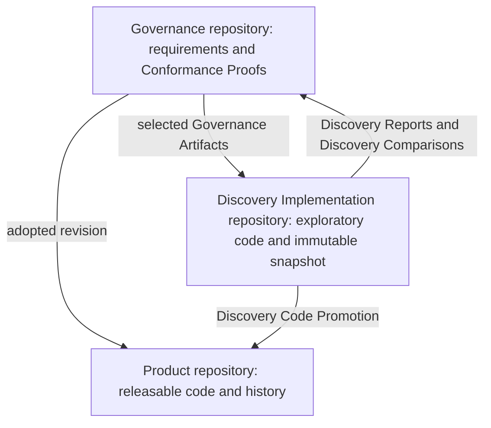

# Architecture

## Three distinct repository roles



The key relationship is:

> **Discovery Implementation inherits obligations, not solutions.**

A Discovery Implementation repository is governed by an immutable snapshot of project intent but is not implicitly shaped by Product source code, history, scaffolding, dependencies, or prior Discovery Implementations unless the developer explicitly selects a Product-access mode that allows them.

## Independent workflow mechanism

```text
┌─────────────────────────────────────────┐
│ Beeline-Technologies marketplace repo   │
│                                         │
│ governed-exploratory-development plugin │
│ shimmy-onboarding plugin                │
│ unrelated sibling plugins               │
└───────────────────┬─────────────────────┘
                    │ creates and operates workflows
                    ▼
       Governance / Product / Discovery Implementation repos
```

The plugin repository is neither project authority nor Product implementation. It contains reusable operational mechanisms.

## Architectural sediment

> **Architectural sediment is accumulated implementation structure whose continued presence reflects project history rather than current architectural intent.**

Examples include:

- abandoned design directions;
- compatibility artifacts;
- transitional abstractions;
- obsolete conventions;
- workarounds that outlived their cause;
- Discovery Implementations that accidentally became permanent;
- implementation choices made under superseded requirements;
- duplicated approaches left by partial migrations; and
- structures whose original rationale no longer applies.

Existing code contains both intentional current architecture and architectural sediment. An agent cannot safely assume that a repeated or common code pattern represents current intent. This is why Product code provides Conformance Proofs rather than authority, and why clean Discovery Implementation repositories are valuable.

## Goals

- Encourage broad architectural exploration without accumulating false starts in Product.
- Make the exact Governance Artifacts input to each Discovery Implementation reproducible.
- Use disagreement between independent Discovery Implementations to expose ambiguity in Governance.
- Use convergence between independent Discovery Implementations as design Conformance Proofs with stated uncertainty.
- Preserve lessons and negative knowledge even when Discovery Implementation code is deleted.
- Keep normative authority, implementation, Conformance Proofs from Discovery Implementations, and workflow automation separate.
- Minimize user-facing complexity through context-aware routing and concise interviews.

## Non-goals

- Hard security isolation from a malicious agent in version 1.
- Automatic remote repository hosting, archival, or deletion.
- Automatic Git commits.
- Automatic promotion of Discovery Implementation findings into Governance.
- Automatic Product conformance claims.
- A general-purpose governance database or issue tracker.
- Automatic synchronization of previously generated `AGENTS.md` files.

## Core data flow

```text
Governance Artifacts @ exact commit
             │
             ├── Product consumes through pinned submodule
             │
             └── Discovery Implementation receives generated immutable snapshot
                              │
                              ▼
                       Conformance Proofs from Discovery Implementations
                              │
                  ┌───────────┴───────────┐
                  ▼                       ▼
          Governance proposal       Discovery Code Promotion review
                  │                       │
            human decision           human decision
```
