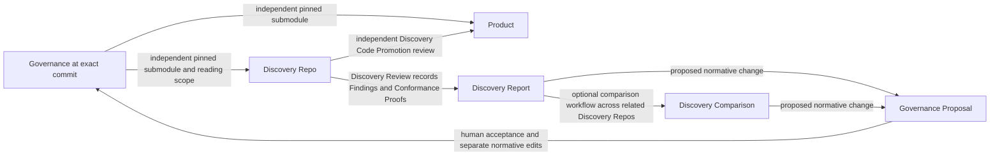

# Governed exploratory development

## Plan status and authorization

[GLOSSARY.md](../../GLOSSARY.md) is authoritative for terminology and explicitly defined relationships. The user authorized repository-wide terminology alignment on 2026-09-14, including this plan and the handoff. Production implementation remains unapproved.

- State: **PLAN — persisted for review; implementation is not authorized.**
- Authoritative plan: `planning/notional/governed-exploratory-development.md`.
- Objective and planning root were confirmed by the user.
- The user confirmed `planning/handoffs/` as the authoritative handoff, replacing the absent `docs/handoffs/governed-exploratory-development/` location named in the original request and root instructions.
- The user authorized creation of this plan only: “do not start implementation until I have reviewed from persisted plan”.
- This document persists the proposed plan presented in chat. Its design choices and implementation chunks remain subject to review; permission to create this file is not approval to execute them.
- No implementation chunk is active. Do not move this plan to `wip`, install dependencies, or modify implementation files until explicitly authorized.
- The latest review prohibits a Python dependency and makes simplicity a standing goal and review metric. Bash is acceptable; any additional tool must address a specific capability and be chosen by the user before it becomes a requirement.
- The user selected Mike Farah’s `yq` for YAML/JSON processing and `jv` from santhosh-tekuri/jsonschema for schema validation. No Python dependency is permitted.
- The user approved the governed-development project-creation Git contract on 2026-09-14: stage approved generated files, create one initial commit in each new Governance/Product repository, and configure their local submodule connection. This capability-specific contract is recorded in R5 and must be carried into production skill instructions. It excludes existing repositories, Discovery creation, later workflows, pushes, hosting, and commits in this implementation repository.
- The user approved separating marketplace Git permissions, capability runtime contracts, and disposable test setup on 2026-09-14. Root guidance now permits test-owned temporary repository initialization, staging, commits, and local submodule relationships, with separate auditing of the workflow under test.
- The user approved common pinned Governance submodules for Product and Discovery, with Curated Governance Reading Scope enforced through agent exclusions, on 2026-09-14. This authorizes the associated plan, glossary, decision, schema, template, and handoff maintenance. R8 records the replacement architecture and its accepted physical-access tradeoff.
- The user requested review and reordering/rebundling of tasks on 2026-09-14. The ten-chunk sequence below replaces the original six-chunk breakdown while preserving behavior, open decisions, milestone scope, and per-chunk review gates. This authorizes plan maintenance only.
- These design and guidance approvals do not authorize starting a chunk or installing dependencies.

## Objective

Implement the capability in this repository, preserving separate Governance, Product, and Discovery Repos.

The first increment comprises the handoff’s first two milestones:

1. Marketplace/plugin skeletons and validation infrastructure.
2. Router-directed project creation of the initial Governance and Product repositories, their Governance submodule relationship, and Local Project Configuration; separately, on-demand creation of a valid local Discovery Repo.

Retain a human review checkpoint between those milestones. Chunk 1 delivers Milestone 1; Chunks 2–4 deliver Milestone 2 with additional focused review gates. The first increment ends at Chunk 4 acceptance. Subsequent lifecycle operations require separate approval.

Success means the single public router can create a new Product/Governance pair
through its project-creation workflow, then independently create a Discovery Repo
when requested. Each workflow conducts its own interview and honors explicit
choices. Project creation does not automatically create a Discovery Repo.
Discovery creation validates its fixed Governance pin and approved reading scope. Simplicity is a
success criterion: minimize setup steps, extra tools, custom mechanisms, and
the amount of code needed to maintain the workflow.

Pushes, hosted repository creation, and duplicated Shimmy bootstrap logic remain
excluded. The approved initial project-creation exception permits only the
staging, initial commits, and local submodule connection recorded in R5 for this capability.
It does not authorize starting implementation or running project creation now.

## Verified implementation inventory

At the planning baseline, the repository contained only root `AGENTS.md` and the handoff. There was no production code, test suite, runtime configuration, or existing plan. The glossary and its companion terminology notes were subsequently authorized as documentation work.

The complete handoff was inspected, including its package README, the six required documents in order, all referenced documentation, schemas, templates, reference layouts, workflow specifications, and open implementation details. Decisions take precedence over lower-level package material.

The following planning checks completed:

| Check | Result |
|---|---|
| Complete handoff inventory and reading | 52 files inspected |
| JSON parsing | All six JSON files passed |
| `git diff --check` | Passed |
| `git status --short` | Clean at the planning baseline |
| Baseline runtime inspection | Python 3.9.6 was available during investigation; this does not establish or authorize a repository dependency. |
| Shell/tool inspection during plan review | Bash 3.2.57, Git 2.50.1, and SHA-256 utilities are available locally. |
| Codex command inspection | No `plugin validate` or `--plugin-dir` command |

These are planning diagnostics, not implementation acceptance tests. This inventory is a verified baseline, not permission to ignore newly discovered dependencies.

Earlier resumed review, 2026-09-14: HEAD was `bb67b2d5b0c007f02ecaae618002e1340bfa9fc5`.
`git diff --stat bb67b2d..HEAD` and the staged diff were empty; the existing
untracked session-resume note was read and preserved (later consolidated into
this plan's Session bootstrap). There are
still no production plugins or tests. The review initially updated only this
plan; the user subsequently authorized root `AGENTS.md` changes, including
separation of marketplace permissions, capability contracts, and test setup.
The source handoff was unchanged at that earlier review. The subsequent user-approved R8 revision updates it, the glossary, and this plan together; production implementation remains unstarted.

Task-sequencing review, 2026-09-14: inspected HEAD `ea64234` with a clean worktree,
root guidance, the current plan, glossary, required handoff documents in order,
relevant workflow/schema/template references, and the repository file inventory.
There are still no production plugins or tests and no applicable child instructions
outside reference templates. This review changes only the authoritative plan.

## Packaging verification and differences

**Keep the reference portable packaging.** Current official documentation supports root `plugin.json`, `$schema`, and `extensions.com.openai.interface`. A `.codex-plugin/plugin.json` overlay is optional; no layout conversion is needed. [OpenAI packaging documentation](https://developers.openai.com/plugins/build/plugins)

Rechecked that portable-root and inline-extension support on 2026-09-14 against
the official page. This is documentation verification, not an installation test;
the earlier app-server invocation has not been revalidated or executed here.

The task-sequencing review rechecked the same packaging rules and the documented
local-install/new-conversation testing flow. This supports bringing the smoke
test forward to Chunk 1; the actual host behavior remains to be verified during
authorized execution. [Local plugin testing](https://learn.chatgpt.com/docs/build-plugins)

The marketplace location, sibling plugin layout, and `skills/<name>/SKILL.md` structure also match current documentation. Internal workflows can remain supporting references beneath the router. [Build plugins](https://learn.chatgpt.com/docs/build-plugins), [Build skills](https://developers.openai.com/plugins/build/skills)

Two tooling differences affect the plan:

- The installed plugin-creator validator targets the compatibility manifest and cannot validate these portable manifests unchanged. Implement documented portable-format checks instead of changing valid packaging to satisfy that validator.
- `PLUGIN_DATA` is documented for hooks; its presence is not established for ordinary skill-launched scripts. Use it when supplied, with an explicit local-storage fallback. [OpenAI hooks documentation](https://learn.chatgpt.com/docs/hooks)

Standalone skill discovery can be checked through the app-server `skills/list` API using additional skill roots. Packaged installation and namespacing require a separate local installation smoke test. [App-server skills API](https://learn.chatgpt.com/docs/app-server#skills)

The documented standalone check starts `codex app-server --stdio`, completes the `initialize`/`initialized` handshake, and calls `skills/list` with the two production skill roots supplied through `perCwdExtraUserRoots`. It does not install the plugins or prove marketplace loading. No `CODEX_HOME` override is required. This check was not executed during read-only planning.

## Target layout and terminology

All implementation paths below are repository-relative.

Abbreviations:

- `P` = `plugins/governed-exploratory-development`
- `S` = `plugins/governed-exploratory-development/skills/governed-development`
- `H` = `plugins/shimmy-onboarding`

These identify exact path prefixes, not additional directories.

Use the [glossary definitions](../../GLOSSARY.md#terminology-index) for domain
terms throughout this plan. **Project Setup** covers the interview establishing
the confirmed Product/Governance pair, paths, and submodule relationship;
new-project creation and existing-project registration are its two paths here.
Both produce **Local Project Configuration**. **Discovery Repo** names the
separate exploratory repository, **Discovery Review** names the process, and
**Discovery Report** and **Discovery Comparison** name its written outputs.
The comparison workflow produces the optional separate Discovery Comparison;
charter-required comparison results also belong in the individual Discovery Report.

```text
.agents/plugins/marketplace.json
plugins/
  governed-exploratory-development/
    plugin.json
    skills/governed-development/
      SKILL.md
      assets/
        schemas/
        templates/
      references/
        runtime-contract.md
        workflows/
      scripts/
        governed.sh
        lib/
  shimmy-onboarding/
    plugin.json
    skills/shimmy-onboarding/
      SKILL.md
      references/onboarding-contract.md
scripts/
tests/
docs/
planning/
  handoffs/                 # read-only
  notional/
  wip/
  complete/
```

Generated Discovery Repo layout:

```text
<project>-disc-0001-<slug>/
  .git/
  .gitmodules
  AGENTS.md
  DISCOVERY.yaml
  GOVERNANCE-READING-SCOPE.yaml
  .governance/              # complete read-only submodule at fixed commit
  .contracts/               # contract-aware mode only
    EXPORT.yaml
    files/<approved exports>
```

Decision 13 now includes the Git submodule metadata and external reading-scope
record. Contract exports remain Product-derived Conformance Proofs with their own
source identity and file hashes; they live outside the Governance submodule and
gain no Governance authority. No copied Governance content manifest is needed.

`discoveries/` means a directory relative to the Governance repository root. No extra nested `governance/` directory will be introduced.

## Capabilities and dependency choices

**No Python dependency.** Remove the earlier Python runtime, package requirements, virtual environment, and Python test-runner proposal. Do not replace them with another general-purpose runtime requirement by default.

Use Bash for straightforward orchestration and tests, Git for repository operations, and existing platform utilities for file operations and hashing. The proposed shell scripts must work with the available Bash 3.2 baseline unless a specific need for a newer version is demonstrated and approved. No external shell test framework is required.

The user approved the following narrow data dependencies:

| Capability | Where needed | Why it is needed | Selection status |
|---|---|---|---|
| Read and write YAML/JSON, including safe string escaping and deterministic output | Governed-development metadata, configuration, templates, and packaging checks | The handoff supplies structured manifests, schemas, and Markdown frontmatter. Text matching is not a reliable substitute for parsing them. | Mike Farah’s `yq` — approved |
| Check data against JSON Schema Draft 2020-12, including the required date/format assertions | Governed-development validation and tests | Preserve the supplied validation contract without writing a schema engine in shell. | santhosh-tekuri/jsonschema `jv` — approved |

Use direct, documented calls to these two tools; do not build a configurable provider framework. Scope the requirement to the governed-development operations and checks that need it; unrelated sibling plugins and reading this repository must not inherit it. Approval of the dependency choices does not start implementation or dependency installation.

Selected tools:

- Mike Farah’s `yq` reads/writes YAML and JSON and is distributed as a standalone binary. Use it for structured-data processing; schema validation belongs to `jv`. [Upstream yq documentation](https://github.com/mikefarah/yq)
- `jv` from santhosh-tekuri/jsonschema validates YAML/JSON against JSON Schema, including Draft 2020-12 and explicit format assertions. Do not impose a Go toolchain on consumers merely because its upstream build uses Go. [Upstream jv documentation](https://github.com/santhosh-tekuri/jsonschema)

During authorized implementation, verify the exact tool identity/version and the required behavior, including duplicate-key rejection, safe handling of values, deterministic output, and offline schema resolution. Record the tested versions and acquisition instructions in `docs/dependencies.md`. Do not silently substitute another tool named `yq` or weaken checks if either selected tool fails a requirement; report the concrete gap. Neither tool has been installed or behavior-tested during planning.

Bash alone is sufficient for much of the workflow. Preserving general YAML handling and the supplied schema contract using Bash alone would require substantial custom parsing/validation code. That would increase maintenance complexity. Do not silently reduce accepted formats, omit schema checks, or claim that grep/sed checks implement JSON Schema. Any deliberate reduction of the handoff’s validation scope requires an explicit reviewed decision.

Initial platform verification targets macOS and Linux. Other hosts remain unverified until tested. Git and available hashing/file utilities are operational prerequisites; a dependency on Python, Node, a compiler, a package manager, or a container engine is not proposed.

## Simplicity goal and metrics

Choose the simplest implementation that satisfies the approved behavior and safety requirements. Simplicity means low total operating and maintenance effort, not just a low count of installed tools.

At each chunk review, report:

| Metric | Review target |
|---|---|
| Additional required tools | Count and name each tool, the exact capability it supplies, and which operations require it. Add none without the user’s choice. |
| Setup steps | Count documented actions needed before the first successful run; avoid automatic bootstrap and unnecessary setup layers. |
| Implementation size | Report production script count and nonblank source lines, explaining material growth. These are comparison signals, not quotas that reward compressed code. |
| Custom mechanisms | Identify any new parser, framework, storage mechanism, or abstraction; prefer existing tools and direct operations. |
| Developer effort | Count avoidable manual steps and repeated questions; preserve the explicit choices required by the handoff. |
| Repeatability | A documented command runs each test group without an extra test framework or manual repository preparation, using the approved disposable test fixtures. |

Start with a small shell entrypoint and a few supporting files. Add modules only for concrete responsibilities, not one module per concept in the handoff. A focused external utility can be simpler than maintaining a custom implementation. Record that tradeoff for the user instead of deciding it silently.

## Recorded design decisions

The following combine settled handoff constraints, explicitly approved review decisions, and proposed implementation details. The dependency selection and disposable-test-fixture exception are approved. Starting implementation still requires explicit authorization.

| Area | Proposed behavior |
|---|---|
| Authority | Constitution > Policies > Specifications > Active ADRs. Resolve explicit same-level supersession; surface ambiguous conflicts. Conformance Proofs and operational instructions never become additional normative levels. |
| Simplicity | Minimize setup, dependencies, custom mechanisms, and maintenance effort; report the metrics above at every review. |
| Dependencies | No Python requirement. Bash and Git cover straightforward work; Mike Farah’s `yq` and santhosh-tekuri/jsonschema `jv` are the approved data-processing and validation dependencies. |
| Test fixtures | Root guidance permits initialization, staging, commits, and local submodule setup in test-owned temporary repositories. Audit fixture preparation separately; tests must verify the production workflow's own permissions. |
| Installation verification | Successful local packaged installation, skill discovery, and namespacing remain required by the first-increment gate, now Chunk 4. Rebundling moves the smoke harness and its first required pass to Chunk 1 and repeats it at Chunk 4; broader hardening belongs to Chunk 10. The original R5 requirement was approved on 2026-09-14; checks remain unexecuted. |
| Router | One public governed-development skill routes project creation and on-demand Discovery Repo creation to separate internal workflows. Do not expose those internal modules as a user-facing menu. Project creation never implies a Discovery Repo request. Natural-language routing and recommendations belong in the skill; deterministic helpers validate state and perform filesystem operations. |
| Repository boundaries | Governance, Product, and each Discovery Repo are separate Git repositories. Do not combine them into one repository or replace Discovery Repos with branches or worktrees. This governs this capability's projects, not the architecture of unrelated marketplace plugins. |
| Interviews | One outstanding decision at a time. Persist answers locally with their relevant inputs. Preserve applicable approvals on resume and revisit only affected decisions; explain uncertain applicability before re-asking. Recommendations never populate missing choices. Resumption rule approved on 2026-09-14. |
| Creation decisions | Preserve portable creation decisions and their approval context in `DISCOVERY.yaml` after successful creation: approved choices, relevant inputs, provided rationale, approval dates, and material revisions/exposure. Reference the detailed reading-scope record. Workstation paths and recovery logs remain local. Approved on 2026-09-14; detailed schema adaptation remains R1 work. |
| Initial Governance maturity | Constitution must exist and may begin as an empty placeholder with no constitutional rules until matured Governance is deliberately promoted. Do not turn setup goals into starter rules. Provide non-normative guidance from domain questions through Discovery and promotion. Existence/empty-content distinction approved on 2026-09-14. |
| Local Project Configuration | Store confirmed project paths and a stable, credential-free Governance identity outside repositories. |
| Governance identity | Use the canonical repository URL when established, otherwise a developer-confirmed stable identifier for a local-only repository. Record that identity in provenance; keep workstation checkout locations in local configuration. Approved on 2026-09-14. |
| Governance retrieval | Use an established portable clone URL when available, otherwise a confirmed relative source for local-only projects. Keep absolute paths/local overrides on the workstation. Explain the source, availability, and next action in plain language; guide location repairs without requiring Git configuration knowledge. Approved on 2026-09-14. |
| Data location | Explicit `--data-dir`, otherwise supplied `PLUGIN_DATA`, otherwise `${XDG_DATA_HOME:-$HOME/.local/share}/beeline-technologies/governed-exploratory-development`. Reject storage inside project repositories or the installed plugin tree. |
| Project creation | Create the initial Governance and Product repositories and establish Product's Governance submodule, then save Local Project Configuration. This user clarification supersedes the earlier registration-only assumption. The approved initialization Git contract belongs to this capability's R5 and future skill instructions; chunk execution remains separately gated. |
| Existing-project setup | Allow ordinary unfinished edits outside the read-only Governance submodule when identity/path/Git checks pass; report and preserve them. Diagnose unresolved conflicts, changed Governance contents, and unexplained pin discrepancies before completing registration. Preserve history/index and never repair automatically. Approved on 2026-09-14; pending adoption is reviewed separately. |
| Existing files | Seed missing role `AGENTS.md` files once as Materialized Governance. The receiving repository owns them thereafter; they remain subordinate to Governance. Preserve existing files and surface conflicts. |
| Revision selection | Discovery Repo creation interviews for Governance revision, offering the registered Governance checkout's HEAD as the default. Resolve and confirm its exact commit, then freeze that choice. Product's adopted pin remains independent and unchanged. Approved clarification on 2026-09-14. |
| Discovery independence | Discovery creation validates its selected Governance source and its own resulting submodule. It does not inspect or verify Product adoption as a prerequisite, rerun Product registration, or wait for Product commits. Product-derived inputs are checked only when explicitly selected and permitted. Corrected on 2026-09-14 to preserve the accepted independent-pin model. |
| Governance source | Initialize a read-only submodule at the approved exact commit; validate source identity, Git link, checkout, and clean state. Never consume dirty source-checkout content. |
| Git compatibility | Initially support the handoff’s SHA-1 commit format. Reject unsupported object formats explicitly. |
| Governance Reading Scope | Full permits the pinned tree; Curated permits explicit paths and excludes all other bodies across agent transports. Both retain the complete submodule and remain subject to Product Access Mode. |
| Contract exports | Explicit allowlist, source identity, optional source commit, and per-file hashes. No arbitrary Product scanning or inferred exports. |
| Discovery IDs | Governance-owned `discoveries/.reservations/DISC-xxxx.json`; atomic exclusive creation and collision retries. Failed reservations remain consumed; IDs are sequential, not necessarily gapless. |
| Concurrency | Guarantee local uniqueness against the same Governance checkout. Do not claim coordination across independent clones. |
| Recovery | Offer exactly Resume and Roll back after failed/interrupted setup. Explain the failure, show remaining resources, and recommend recovery based on observed state. Preview cleanup before rollback; preserve unexpected edits and report anything retained. Approved on 2026-09-14. |
| Isolation | Policy and workflow guardrails across transports. Detect obvious contamination and surface exposure; make no hard-sandbox claim. |

## Package inconsistencies and proposed handling

The terminology alignment updates the handoff to match the authoritative glossary. The rows below distinguish resolved documentation drift from remaining implementation proposals.

| Finding | Proposed production handling |
|---|---|
| Handoff path drift — resolved | Root `AGENTS.md` now names the confirmed `planning/handoffs/` location. |
| Project creation scope — clarified by user on 2026-09-14 | The agent creates the initial Governance/Product pair and submodule relationship. Earlier plan text and the reference Project Setup workflow only registered existing repos. The glossary's Project Setup definition covers establishing the pair and relationship; this plan specifies creation and registration paths within that term. Preserve the reference workflow as historical source and adapt its production counterpart under R3/R5; no glossary change is needed. |
| Templates permit workstation paths in provenance, conflicting with Decision 29 | Add `governance_repository` to the production configuration model; write that stable identity into Discovery Repo provenance. |
| Contract export location/provenance is unspecified | Use the separate immutable contract namespace and manifest shown above. |
| Governance storage — resolved by R8 | Use Git pin and dirty-state validation; remove copied-tree integrity infrastructure. Validate reading-scope and manifest agreement separately. |
| Concurrency is required but deferred by phase outlines | Implement basic atomic reservations and recovery in the first increment. |
| Inherited-scaffold wording — resolved | The reference layout now explicitly requires minimal creation, including full-reference mode. |
| Full reading scope may allow Product-derived implementation Conformance Proofs | Require compatible Product access or an explicit Curated scope before body reads. Curated excludes reading, not local file presence. |
| Product authority-list drift — resolved | Implementation appears in a separate Conformance Proofs paragraph beneath the four normative levels. |
| Pending proposal metadata drift — resolved | The template uses directory location for pending state; resolution metadata records accepted/rejected outcomes. |
| Discovery Review approval-gate drift — resolved | The reference requires a generated-and-surfaced Discovery Report before independent Discovery Disposition choices. |

## Approved test-fixture approach

A **test fixture** means sample data used by a test: here, a tiny example Governance repository and a tiny example Product repository.

The user approved creating these examples automatically, including their initial Git commits, under a dedicated temporary directory. This keeps the tests repeatable and avoids manual preparation or maintaining prebuilt repository archives.

The 2026-09-14 guidance-separation approval resolved the fixture-staging and
submodule-setup boundary. Root guidance now explicitly permits this test setup.

Only test setup may create these example commits. Before doing so, it must verify that the target repositories are inside its own temporary directory and that inherited Git settings cannot redirect writes to a real repository. Test-only identity and configuration must not modify global Git configuration. Cleanup is limited to files owned by that test run.

Fixture permission does not permit commits in this repository or real Product,
Governance, or Discovery Repos. Tests may configure local submodule relationships
inside their temporary workspace; they must not push or create hosted repositories.
The production workflow under test follows its own contract: initial project
creation may make its approved initial commits, while Discovery creation stages
only its submodule metadata/link, leaves source history unchanged, and creates no
Discovery commit. Test setup and
workflow execution must be distinguishable in the command audit so fixture
commits cannot mask a workflow violation.

## Unresolved

The resumed consistency review on 2026-09-14 found that the first increment is
not yet decision-complete. The following register distinguishes approved rules
from proposals awaiting review; neither grants permission to execute a chunk. Existing
dependency choices and glossary relationships remain recorded decisions.

| Gate | Owner / required before | Recommendation and tradeoff | Status |
|---|---|---|---|
| R1 — Data pipeline and schemas | Shared formats before Chunk 1; normative metadata before 2, local state before 3, reservation/export and creation integration before 4 | Adopt the constrained metadata profile and cross-document checks below. Broader YAML support would preserve more input flexibility but needs a demonstrated validation mechanism. | Constrained YAML, offline-schema approach, and portable creation-decision content approved on 2026-09-14; creation-decision schema and remaining general schema details require adaptation/review; reading-scope schema adapted under R8; tool canaries unexecuted |
| R2 — Authority and selection | Chunk 2; schema shape in Chunk 1 | Classify the complete source tree before selection; reject ambiguous supersession. This can reject a curated source because of invalid excluded metadata, but avoids silently changing authority. | Source-wide authority validation, no reactivation through exclusion, and blocking broken/ambiguous supersession approved; Constitution is required but may have no promoted rules; R8 scope applies to the placeholder too. Detailed classification/metadata and supported paths remain open |
| R3 — Identity, topology, approval binding | Shared field implications before Chunk 1; setup/local-state details before 3; Discovery-specific bindings before 4 | Create the original Governance and Product repositories through project creation; retain Product's pinned submodule and interview for Discovery Governance revision with Governance HEAD as default. Retain unaffected answers on resume. | Initial pair creation, independent pins, source/identity rules, guidance, recovery, decision records, reuse of approvals, and registration with ordinary unfinished edits are approved. Constitution must exist but may start empty; premature rules are rejected. Exact guide/metadata representation, pending-adoption details, and persisted schemas remain open |
| R4 — Allocation | Chunk 4; independent CMPR/GOVP sequences in Chunk 6 | Validate choices before reservation; count reports and consumed reservations. Reserve independent later namespaces. This allows gaps and provides only local coordination. | Allocation after interview approval, no reuse of occupied IDs, gaps, independent sequences, and same-checkout concurrency approved on 2026-09-14; reference-order conflict resolved in favor of approved plan behavior |
| R5 — Git contracts and packaging gate | Before fixture execution in Chunk 1 and each runtime mutation; installed smoke in Chunk 1 and again by Chunk 4 acceptance | Keep marketplace Git permissions and disposable test setup in root guidance; put initialization permissions in this capability's contract. Require basic installation verification at the first usable increment. | Resolved: Git scope separation, test setup, and first-increment installation gate approved on 2026-09-14; rebundled timing is described in R5; root guidance applied; installation verification unexecuted |
| R6 — Repeat review and retention | Before Chunk 5 | Preserve human edits and append reviewed report updates; journal finalization; record promotion intentions separately from execution. Specify local Archive mechanics. | Proposed; detailed state contract still required |
| R7 — Proposal resolution and Product handoff | Proposal details before Chunk 6; code handoff before 7; adoption recovery before 8 | Keep modified proposals pending until revised content is accepted/rejected; perform code promotion in Product context without returning Product knowledge to an isolated investigation. | Proposed; detailed handoff contract still required |
| R8 — Common Governance submodules and reading scope | Shared contract in Chunk 1; validation in 2; setup/creation in 3–4; later workflows preserve it | Reuse pinned submodules; enforce Curated scope through agent exclusions over the complete checkout. Native Git checks replace custom Governance hashing. | Approved on 2026-09-14, including locally present excluded files; documentation/reference adaptation authorized; runtime unimplemented |

### R8 — Approved Governance submodule and reading-scope contract

Approved on 2026-09-14: Product and Discovery use read-only Governance submodules
at independently selected exact commits. Decision 16 owns the common mechanism;
Decision 3 is retired. The user accepted the complete Governance checkout in
Curated mode and authorized removing obsolete terminology and machinery from
all documentation and reference assets. Production execution remains unapproved.

**Pinned Governance Revision** identifies the exact commit for either repository.
**Adopted Governance Revision** retains Product's deliberate-adoption and belief-
in-conformance meaning. A Discovery pin establishes a fixed baseline without
that claim. Changes to its revision require a successor, preserving the original
pin, charter, and prior reading decisions.

**Governance Reading Scope** has Full and Curated modes. Full permits artifact
bodies in the pinned tree subject to Product Access Mode. Neither mode authorizes
other Governance commits or history. Curated always allows
the Constitution and records an explicit allow/exclude decision for every tracked
file path. Excluded or unlisted bodies must not enter agent context through file
reads, searches, Git, links, nested instructions, connectors, summaries, or
another agent. These are workflow/agent rules; excluded files remain present.

Write `GOVERNANCE-READING-SCOPE.yaml` outside the submodule. Bind it to Discovery
ID, source identity and commit, `.governance` path, mode, and generating workflow
identity/version. Record each Curated path's relevance, benefit, reading risk,
exclusion risk, and developer decision. Full records an empty decisions list.
Use exact normalized repository-relative file paths; no globs or implicit directory
expansion. Validate unique paths, source membership, Constitution coverage, and
complete Curated coverage. Do not infer choices or silently fall back to Full.

Read root instructions, manifest, and scope record before any Governance bodies.
Allow only path names and minimal authority frontmatter (ID, title, class,
supersession links) for excluded candidates during interviews and authority
validation. Body exposure cannot be screened by first reading the prohibited body;
unknown exposure requires developer classification before allowing access. A
reading exclusion cannot remove obligations or reactivate superseded artifacts.
Both reading scope and Product Access Mode must permit access. Scope amendments
need explicit affected choices and rationale; retain the scope used by previous
reviews and record prior exposure. Instruction edits alone grant no new access.

Git supplies the pinned commit and change detection. Check manifest/scope/source
agreement, parent HEAD and index links, checkout commit, and modified, untracked,
or ignored submodule contents. Preserve and surface discrepancies. There is no
custom Governance content inventory, duplicate hashing format, or copy builder.
Contract Exports still require their own approved paths and source/file provenance
under `.contracts/`; they are not stored in the read-only submodule.

Apply consuming-repository checks to the workflow's actual subject: Discovery's
own submodule during creation, and Product's during explicit Product setup or
adoption. They are not a mandate to inspect both consumers during either workflow.

Native submodule initialization needs `.gitmodules`, a staged Governance Git link,
and local submodule configuration. Carry this narrow Discovery creation allowance
into R5 and reference Decision 30; leave all other generated files unstaged and
create no Discovery commit. The staged pin is pending the developer's commit.
Fresh clones need submodule initialization and access to the retained Governance
commit. Source identities remain portable; workstation-specific clone locations
belong in local configuration, with `.gitmodules` using a confirmed portable
source locator. Do not invent a remote or treat a logical URN as a fetch URL.

Official behavior was checked against [Git submodules](https://git-scm.com/docs/gitsubmodules)
and [submodule commands](https://git-scm.com/docs/git-submodule). This was
read-only documentation verification, not execution of a workflow or a Git fixture.

### R1 — Metadata and schema contract

Scope this profile to structured workflow metadata and normative frontmatter,
not arbitrary Governance body text or copied binary files. Require exactly one
UTF-8 YAML document with string mapping keys and JSON-compatible values. Reject
duplicate decoded keys at every nesting level **on original input before
conversion**, anchors/aliases, merge keys, custom tags, and non-string keys.
Comments and ordinary multiline strings remain supported. Require dates and
versions to be strings; schema types constrain numeric values. Do not implement
a YAML parser using shell text matching. If the selected tools cannot enforce
this profile before losing information, stop and report that capability gap.

Package self-contained production schemas with internal fragment references
only. Validate schemas and instances offline, using the validator's bundled
Draft 2020-12 support and explicit format assertions. Reject external references
before resolution; do not fetch schema URLs from instance data. This restriction
was approved during the guided review on 2026-09-14; it is a production design
choice, not an existing handoff requirement. The general schema details below remain proposed until the Chunk 1 scope review;
R8 separately approves the reading-scope representation.

Add required `discovery_repo.objective` for the Charter, separate from
`framing.objective`. Add asserted `format: date` to `created_at`; require both
predecessor/reason values to be null or both populated. Keep pre-production
schema version `1.0`; no migration is required. Validate semantic agreement of
Discovery ID, Governance identity and exact lowercase commit, artifact selection,
submodule/scope-record paths, and generating workflow identity/version across
manifest, reading record, reservation, and generated instruction metadata. Later plugin upgrades must not compare
old provenance against the currently installed version or rewrite owned files.

Adapt the production Discovery Manifest schema/template to carry the approved
[portable creation-decision record](#approved-portable-creation-decision-record)
under R3. Define its structured fields in the Chunk 1 schema review. Validation
must bind approvals to the actual approved values and relevant input revisions,
not merely to field names whose values may later change. At creation, final
approved choices must agree with the manifest and referenced reading-scope record;
clearly identified superseded choices remain historical and may differ. Validate
approval dates and references, preserve provided rationale without inventing it,
and reject workstation paths or local recovery data in the portable record.
Reading-scope amendments must preserve the creation record's original context
under R8. This schema work is planned; the reference schema has not been changed
to implement the newly approved record.

Preserve the marketplace mapping explicitly: provenance `Beeline-Technologies`,
catalog name `beeline-technologies`, display name `Beeline Technologies`. They
identify the same distribution boundary in different fields; do not require
literal equality or apply generic case normalization.

Use deterministic UTF-8 YAML/JSON rendering for metadata and safe string
round-trips. Governance byte provenance uses Git; no canonical JSON hashing
standard or Governance content-manifest schema is required. Contract Export
hashes cover the exact approved export bytes independently of Governance.

Chunk 1 canaries must exercise nested/escaped duplicate keys, a second YAML
document, forbidden YAML features, invalid leap dates, unavailable external
references, and safe string round-trips. The selected tools have not been
installed or behavior-tested here. Record exact tested binary versions during
authorized implementation. General schema adaptations, such as Charter objective
and calendar-date assertions, remain separate R1 review items.

### R2 — Proposed source classification and coverage

Approved on 2026-09-14: validate authority across the entire selected Governance
commit before selection; exclusion cannot reactivate a superseded artifact.
Broken or ambiguous supersession blocks creation even for excluded artifacts.
The detailed classification, coverage, and exposure rules below remain proposals
where they extend beyond that approved rule.

Enumerate the entire selected Git commit before curation, including committed
reservation metadata and unknown/supporting files. Use the source's normative
directories (`constitution/`, `policies/`, `specs/`, `adr/`) and validated
frontmatter; classify other content as non-normative supporting material, with
operational instructions explicitly distinguished. Approved on 2026-09-14:
require at least one valid Constitution artifact, while accepting an initial
placeholder containing no constitutional rules. Existence and identifying
metadata are distinct from substantive requirements; do not require starter
clauses to pass validation. Detailed metadata representation remains under R1/R2
review. A missing or malformed artifact is not an empty valid Constitution.
Surface ambiguous class/path or missing required metadata in artifacts
instead of inferring authority from prose or filename alone.

Build the normative ID/supersession graph source-wide. Reject duplicate IDs,
missing targets, self-links, cycles, and cross-level supersession links. For competing
successors, require a unique descendant resolving the branches; otherwise surface
the ambiguity. Preserve superseded status even when a superseder is excluded.
Derive the source-wide ID/class/relationship index from minimal metadata at the
pinned commit. This validation does not grant access to excluded artifact bodies
or require a duplicate provenance database.

R8 settles coverage semantics: the complete submodule is present in both modes.
Curated records allow/exclude choices for every path, including supporting and
operational files; always allow the Constitution. Full permits the complete pinned
tree only with compatible Product access. Grouping for display cannot conceal
individual Curated choices. Unknown exposure is resolved by the developer before
body reading. R8 and source Decision 20 define the agent reading boundary.

The initial implementation proposes rejecting unsupported symlinks, nested
Git links, unsafe paths, and filesystem name collisions before initialization.
This avoids bypassing reading permissions through indirection. Detailed authority
classification and these supported-entry limits remain Chunk 2 review items.

### R3 — Proposed identity, topology, and resumed choices

User clarification, 2026-09-14: initial project creation establishes Governance
at its first commit and Product's submodule points to that same commit. Governance
can advance independently while Product retains the older pin. The writable
Governance checkout means that original Governance repository, not an additional
third copy introduced by this plugin. A workflow separate from initial project
creation owns Product releases and must account for the Governance submodule
revision. The existing adoption workflow addresses pin changes; a complete
Product release workflow is not yet specified or approved for implementation.

Discovery Repo creation interviews for the Governance revision with the registered
Governance checkout's HEAD as the default. Present the resolved commit for
confirmation, permit another revision, and preserve the chosen commit even if
HEAD later moves. This never advances Product's pin and does not implicitly fetch
or choose a remote branch's tip. Product G1 with Governance HEAD G2 is an ordinary
supported state, not an inconsistency requiring repair.

**Discovery creation is independent of Product adoption.** The user's
2026-09-14 correction identified an erroneous dependency in the pending-adoption
proposal below. For an already registered project, use the confirmed local
project/Governance configuration and validate the selected original Governance
source directly. Do not revalidate Product's HEAD/index/submodule, require
adoption intent, report its pending state, or wait for a Product commit merely
to create a Discovery. Product's inaccessible checkout or unfinished adoption
does not block an Isolated Discovery with valid independent inputs.

Validate the selected Governance identity/commit, Constitution and authority,
reading scope, destination, reservations, and the new Discovery's own submodule
and metadata. Product state is relevant only to an explicitly selected input,
such as a permitted comparison or Contract Export; validate that input's own
source/provenance, not Product's general adoption readiness. Permission to use
Full-reference access does not itself require scanning Product. First-time
project creation/registration retains its separately reviewed contract; Discovery
does not silently rerun that operation on every request.

Scope resolved by the user on 2026-09-14: the agent's project-creation workflow
creates both initial repositories and their relationship. It is not merely a
registration workflow for an externally prepared pair. Discovery Repo creation
is a separate internal workflow invoked on demand through the same public router.
The plan's earlier registration-only assumption is withdrawn. Git initialization
permissions are approved under the narrow R5 exception; initial Governance content
must be specified before Chunk 3, with its metadata representation validated in
Chunk 2. Recovery is approved below. Existing-project registration remains
available without modifying history or advancing the pin.

Approved on 2026-09-14: confirm a credential-free logical Governance identity
once during Project Setup. Use a canonical repository URL when established, or
a developer-confirmed stable identifier (represented as a URN) for a local-only
repository. Record this identity in provenance; keep workstation checkout paths
in local configuration. Moving a checkout does not change its identity. Do not
invent a remote or treat a shared commit alone as proof of repository identity.
Another workstation confirms the same identity during its own setup. The approved
retrieval rule below separately establishes where Git obtains that repository.

#### Approved Governance retrieval and user guidance

Approved on 2026-09-14: retain the confirmed source identity in
provenance and use a separately confirmed clone location for Git. Use a
credential-free clone URL in `.gitmodules` when an established portable URL is
available. For a local-only project, use a developer-approved relative
source location reflecting a portable project layout, such as
`../payments-governance` for sibling repositories. Keep the actual absolute
checkout path and any local source override in workstation configuration.
Initialize from the registered local Governance source under the approved R5
allowance; do not add an unrequested network fetch or top-level remote.

Git requires the submodule URL and supports relative locations; those locations
resolve against the parent repository's default remote, or its working directory
when no default remote exists. These behaviors were checked against the official
[gitmodules documentation](https://git-scm.com/docs/gitmodules) and
[submodule command documentation](https://git-scm.com/docs/git-submodule).
Validate the resolved source identity and availability of the selected exact
commit before initialization. Moving repositories or adding/changing remotes
requires rechecking retrieval assumptions; never substitute another commit.

If no portable URL or acceptable relative layout can be confirmed, surface the
missing source arrangement before creation rather than recording a machine path,
inventing a remote, or treating a logical URN as a clone URL. A new workstation
must have an available copy of the retained commit and may need an explicit local
override; registration still preserves existing Git state under R5. Do not claim
that verifying a local source proves the portable URL serves the commit. Any
needed existing-repository repair or remote access remains separately directed.

Accepted tradeoff: this supports local-only projects and keeps machine paths out of
versioned files, while requiring a confirmed relative layout or local override
when retrieval conditions differ. No submodule or fixture operations were
executed during review.

The user required understandable, actionable guidance because the explanation
of Git's resolution rules was difficult to follow. Apply this to setup, creation,
resumption, and recovery guidance in Chunks 3–4:

- Lead with the practical result: where Governance will come from, whether the
  required revision is available, and what the user needs to do next. Use the
  project name and an understandable folder location or repository link. Keep
  Git configuration keys and resolution details in supporting diagnostics.
- Use previously confirmed configuration and permitted checks to identify the
  source before asking. Reuse applicable approvals. If input is needed, ask one
  concrete question, such as where the Governance folder was moved; do not ask
  the user to calculate relative URLs or edit Git configuration by hand.
- Distinguish a moved/missing folder, unavailable server or access, wrong
  repository, and missing required revision. Describe the observed problem and
  recommend a specific next step; identify suspected causes as uncertain. Do
  not present every retrieval failure as a request to choose another revision.
- Explain the effect of any proposed repair: which local setting or shared
  source declaration would change, and that a location fix retains the selected
  Governance revision. Preview concrete changes and apply only what the current
  authorization permits under R5; guide separately directed repairs to existing
  repositories. User-friendly handling does not expand Git or network permissions.
- When initialization succeeds from a local source, say that the local source
  was verified. If retrieval from a shared URL is unverified, describe the
  consequence plainly: another computer will need access to a copy containing
  this revision. Never imply that a local check verified a remote source.
- Include short examples in `docs/project-setup.md`,
  `docs/discovery-creation.md`, and `docs/recovery.md`. A useful success summary
  is: "I found this project's Governance in [folder] and verified the required
  revision. Setup can continue." A missing-folder summary is: "I couldn't find
  Governance in [old folder]. If you moved it, tell me its new location so I can
  check it." Include details only when they help resolve the actual problem.

#### Initial Governance correction and promotion guidance

User direction, 2026-09-14: retain a minimal starting point, but do not turn vague
getting-started goals into constitutional rules before understanding their durable
requirements. Premature canonical rules can drive repeated architectural changes
and leave Architectural Sediment. The earlier proposal to draft a starting
Constitution from setup goals is withdrawn. Approval of initial file wording is
not, by itself, a finding that those goals belong at the highest authority level.

Provide a visible trail from current understanding to the appropriate promotion
process. The user explicitly invoked the domain-modeling skill: clarify terms
against the canonical glossary, probe concrete scenarios and edge cases, compare
claims with available implementation/Conformance Proofs, record resolved language
within authorization, and offer ADRs sparingly. That skill does not itself specify
the entire Governance promotion workflow; this capability's report, proposal,
resolution, and adoption contracts supply those steps.

The following content direction is established. The required-but-possibly-empty
Constitution rule is approved below; exact guide layout and metadata representation
remain under review:

1. **Orient:** explain what is known, what remains uncertain, and where existing
   authoritative requirements come from. Preserve any genuinely established
   obligations supplied by the developer. Label goals, assumptions, and candidate
   meanings accurately; none become requirements merely by being saved.
2. **Clarify and investigate:** guide a user from an unclear term or assumption
   to concrete scenarios, a bounded Discovery Charter, and relevant investigation.
   Keep resolved vocabulary in the canonical glossary and supporting context in
   its assigned location. A vocabulary decision cannot smuggle a new requirement
   into Governance. Create documents lazily when there is content to record.
3. **Preserve what was learned:** link the Discovery Report to Findings and their
   Conformance Proofs, including uncertainty, counterexamples, and failed ideas.
   Do not invent Findings or supporting material during setup.
4. **Propose:** when a change to requirements is warranted, connect the source
   report and supporting material to a Governance Proposal with concrete wording,
   rationale, alternatives, and an appropriate target. Recommendations for further
   investigation or no normative change belong in the Discovery Report or
   Discovery Comparison; a Governance Proposal requests a Governance change.
   A durable behavior may belong in a Specification; a Policy
   governs work; an ADR records a qualifying architectural decision. Constitution
   is reserved for understood foundational commitments, never the default target.
5. **Resolve and consider adoption:** a human resolves the Governance Proposal;
   acceptance requires a Product Impact Assessment and separate normative edits.
   The proposal remains non-normative. Preserve rejection reasons. Governance
   Adoption is a separate Product decision, and existing Discovery pins stay fixed.

For example, "must work offline" begins with clarifying which users, tasks,
outages, and failure consequences matter. A Discovery might investigate editing
saved work without a connection and record reconnection failures. Its report
could support a precise Specification about saved-work editing while leaving
other offline behavior unresolved. There is no automatic promotion to a blanket
constitutional rule. Existing externally established requirements need their
source and scope understood, not an invented experiment to make them binding.

Recommended artifact arrangement, still proposed: put a short non-normative
"Start here" guide in Governance's `README.md`, reached from the generated role
instructions. It should explain each next step in ordinary language, name the
artifact it produces, and link to available local material and the single public
router. It must not become a new source of requirements. Resolve context/glossary
locations from repository conventions and create them when needed. Create the
required Constitution placeholder, but do not seed empty ADRs, fake reports, or
invented normative clauses. Keep Discovery's minimal
layout unless a separate reviewed change is needed. Links into Governance obey
the reading scope and Product Access Mode; navigation grants no additional access.
Do not make generated guidance depend on a personal absolute skill-install path.

**Approved R2/R3 starting Constitution:** the user clarified on 2026-09-14 that
a Constitution must exist, but may simply be an empty placeholder until matured
Governance has been promoted into it. This replaces the proposal to allow no
Constitution at all. Initial Discovery can proceed with that placeholder after
the normal approval and validation checks; it cannot proceed without the required
Constitution artifact.

"Empty" means no constitutional rules have yet been established. Identification
metadata and a document heading may identify the artifact without supplying
rules; the exact schema/template form remains R1/R2 work. Keep explanatory
promotion guidance in the non-normative guide and role instructions. Do not add
sample principles, TODO requirements, or getting-started advice as constitutional
clauses. A missing file, malformed required metadata, or unexplained change to
previously populated content is not silently accepted as an initial placeholder.
Existing-project registration must not repair those states by replacing content.

R8 still requires Full/Curated coverage of the Constitution path, even while
empty, and the complete submodule stays pinned. The creation record and summary
must describe that starting revision accurately: Constitution present, no
constitutional rules yet. This makes no claim that the project has no other
requirements or is proven conformant; any established Policies, Specifications,
Active ADRs, charter limits, and operational controls retain their roles.

Later constitutional content requires deliberate promotion and separate
authoritative edits with the associated rationale and Product Impact Assessment.
Its new Governance revision does not rewrite creation history or advance existing
Discovery pins. Work requiring that revision follows the successor rule; Product
adoption stays independent. No new authority level or mandatory lifecycle-status
database is introduced by the placeholder distinction.

**Chunk dependency:** basic guidance belongs in Chunk 3 with new-project setup;
report automation arrives in Chunk 5 and proposal/resolution automation in Chunk
6. The guide must distinguish documented manual review steps from available
handlers and never claim unavailable automation completed. Guidance does not
authorize starting later chunks or modifying normative files automatically. Any
change to milestone scope must be explicit. Exact starting-artifact and bootstrap
representation choices remain open rather than silently expanding the first
increment.

#### Existing-project and pending-adoption details

Approved on 2026-09-14: permit registration with ordinary uncommitted edits
outside the read-only Governance submodule when identity, paths, and the relevant
Git relationship validate. For example, an edited Product README does not by
itself require cleanup before registration. Report that existing work and preserve
it; registration is not an assessment of those edits or of Product conformance.
Unresolved Git conflicts, modified consuming Governance contents, and unexplained
relationship/pin discrepancies require diagnosis before registration completes.
The pending-adoption state below remains a separate case to finalize. This policy
avoids unnecessary interruption of normal work while requiring checks to identify
the actual source of a discrepancy instead of treating every edit the same way.

Use the original writable Governance checkout outside Product, distinct from
Product's and Discovery's read-only Governance submodules. Verify logical
identity and commit availability. Existing-project registration preserves dirty
files and never stages or repairs the relationship automatically. Record three observations separately: Product HEAD gitlink,
Product index gitlink, and checked-out submodule commit.

**R3 pending Product adoption (proposed, Product-scoped):** permit explicit
existing-project registration while an approved Product adoption is applied
locally but not yet committed. Show the saved Product revision and the pending
revision separately and preserve both. This proposal concerns registration and
Product-side adoption handling only. Its earlier extension to Discovery creation
was incorrect and is withdrawn; Discovery requires no pending-adoption check.

After this workflow's unstaged adoption, HEAD and index remain at G1 while the
checkout is G2. Recognize a verified intentional change as pending adoption
rather than silently calling G2 the committed Adopted Governance Revision.
An operation record or explicit developer confirmation must establish adoption
intent; differing commits alone do not prove an approved adoption occurred.
Require the expected source identity, exact commits, and clean submodule contents.

| Product HEAD link | Product index link | Submodule checkout | Proposed interpretation |
|---|---|---|---|
| G1 | G1 | G1 | Committed baseline; no pending pin change |
| G1 | G1 | G2 | Approved adoption applied locally and unstaged; pending commit |
| G1 | G2 | G2 | Approved adoption staged by the developer; still pending commit |
| G2 | G2 | G2 | New revision recorded in Product history |

For either pending row, show the state and preserve HEAD, index, and checkout;
the workflow does not stage, unstage, commit, or reset them. Conflicts, unexpected
combinations, unverified intent, or modified submodule files require diagnosis
instead of automatic repair or a guessed state. A completed Git commit alone
is not conformance proof. Unrelated index conflicts remain diagnostic failures.

In an explicit Product setup/adoption workflow, explain: "Product's saved revision
is G1. Your approved update to G2 is present locally but hasn't been committed."
The proposed tradeoff is permitting registration while making that provisional
Product state visible. Test adoption followed by explicit registration in Chunk
8; establish the Product state interpretation with synthetic inputs in Chunk 3.
Separately verify that Discovery creation does not consult this state or depend
on its verification. Pending-adoption recovery remains R7 work, and the
Product-scoped proposal remains unapproved.

#### Approved interview resumption

Approved on 2026-09-14: preserve previously approved answers that remain
applicable; revisit only decisions affected by changed inputs. Record each
answer's relevant inputs locally and check them on resume and before creation.
If applicability is uncertain, explain the uncertainty and revisit that answer.
The accepted tradeoff is dependency bookkeeping in exchange for fewer repeated
questions without carrying stale approval into creation.

Bind each persisted answer to its project identity and relevant input revisions,
with the destination recorded only in local state. Source-commit changes require
fresh classification and reading-scope approval; retain charter/type/framing answers
unless their inputs changed. Access-mode changes revisit affected reading permissions,
exports and comparisons. Export-byte changes invalidate export approval and
integrity. Destination-only changes revalidate containment, collision and final
creation approval, retaining source and Charter choices. A changed project
identity starts a new interview. Never infer approval from elapsed time or a
recommendation. Revalidate bindings immediately before reservation and writes.

Preserve previous answers and approvals as history when superseded; distinguish
them from the current approved state and identify why a decision needs renewal.
The local interview record describes approved choices; the operation journal
describes attempted/completed side effects. Consult both before continuing so
reusing an approval does not repeat completed work. On successful creation,
retain the portable decision content in the manifest as specified below.
Exact persisted field structure remains schema work; this approval resolves
the resumption behavior. It does not permit changing an existing Discovery pin.

#### Approved portable creation-decision record

Approved on 2026-09-14: retain creation decisions and their approval context in
the Discovery Manifest after successful creation, so they remain understandable
on another workstation and during later Discovery Reviews. The manifest already
records the selected Governance revision, charter, framing, and Product access;
the new record explains the basis and approval of those choices.

- Preserve developer-approved choices, the relevant inputs/revisions considered,
  the approval date, and rationale when provided. Do not invent a reason or
  convert an agent recommendation into developer approval.
- Retain material revisions to those choices, their recorded reasons, and any
  relevant prior exposure. Distinguish superseded choices from the final approved
  creation state; a later access choice cannot erase earlier exposure.
- Reference `GOVERNANCE-READING-SCOPE.yaml` for detailed per-path decisions rather
  than copying that full list into the manifest. Preserve the scope context used
  at creation if an approved later amendment occurs, as required by R8.
- Use portable project/source identities, exact commits, and repository-relative
  artifact references. Keep workstation paths, failed commands, local session
  details, and cleanup progress in local interview/operation records. The
  manifest must remain useful without access to those local records. Summaries
  must respect the approved reading and Product-access boundaries.
- Preserve this as historical creation provenance. Later changes follow their
  own approval rules and must not silently rewrite the creation record. It does
  not authorize subsequent actions, change normative authority, or establish
  conformance.

For example, the record can show that Isolated Product access was approved for
the retry-handling charter under Governance G1, with the provided reason of
exploring independently of Product's implementation. A destination move between
local directories stays in the local session record.

The accepted tradeoff is a larger manifest and additional consistency checks in
exchange for durable decision provenance. Keep the addition within the existing
manifest and reading-scope artifacts; no new top-level file or lifecycle database
is needed. R1 owns the shared manifest schema/template adaptation in Chunk 1; Chunk 3 owns
local interview bindings; Chunk 4 owns generation from that approved interview,
complete cross-document validation, and preservation after successful creation. Exact field structure remains to be reviewed with R1.

#### Approved setup recovery and troubleshooting

Approved on 2026-09-14: offer exactly **Resume** and **Roll back** for failed or
interrupted setup, with substantial troubleshooting support. On a detected
failure, or the next invocation after interruption, explain the failure and
current state before asking for that choice. No destructive cleanup happens
without the user's selection. Closing the session or providing no answer is
not a recovery choice; re-present the two actions when work resumes.

- **Resume:** verify completed work against approved inputs and continue missing
  steps without repeating initial commits or overwriting subsequent edits.
  Identify prerequisites that must be fixed before continuing. Check an
  interrupted step's actual result before retrying; absence of a success message
  does not prove that the step made no changes.
- **Roll back:** show the exact resources to remove or restore, then reverse
  only setup-owned local effects that remain unchanged. A wholly new repository
  containing only setup's initial state may be removed, including its initial
  commit; never reset or rewrite a pre-existing source repository. Check known
  dependent submodules and remove operation-owned dependants first. Preserve
  user changes, unexpected commits, shared repositories, and unclear ownership;
  explain any cleanup limitation and seek revised direction for those resources.

The failure report must help the user act, not merely expose a raw error:

1. **Failure and cause:** identify the failed step, intended result, relevant
   tool error/exit status, and confirmed cause. Clearly label a suspected cause;
   when unknown, give the next diagnostic check rather than guessing.
2. **Current state:** list completed, failed, pending, and uncertain steps;
   identify affected paths, repository/pin/index state where relevant, and local
   configuration changes. Show what remains usable and what setup left behind.
3. **Recovery recommendation:** recommend Resume or Roll back with a specific
   reason, required fixes, expected effect, and limitations. Offer both actions
   even when one needs prerequisites resolved. Preserve developer choice.
4. **Actionable troubleshooting:** provide ordered diagnostic checks and fixes
   appropriate to the actual error, explain what each result would establish,
   and distinguish read-only checks from changes. Do not recommend blind reruns,
   forced resets, weakened checks, or bypassing normal signing/hooks. A recovery
   choice does not authorize unrelated configuration or external-system changes.
5. **Inspectible details:** retain a small local operation report with its ID,
   step/status history, relevant tool versions and diagnostic output, owned
   resources, cleanup progress, and references to the pertinent recovery guidance.
   Link it in the concise summary. Exclude credentials, unrelated environment
   dumps, and content outside the approved reading boundary; do not automatically
   transmit diagnostics. Use the existing operation journal, not another service
   or a separate troubleshooting framework.

Record intended writes and ownership before attempting side effects and reconcile
actual state after interruption. Restore only this operation's local configuration
entries, preserving unrelated entries and user changes. Both recovery actions
must tolerate retries. If rollback fails or is interrupted, retain cleanup
progress, explain what was removed and what remains, and allow another Roll back
selection to continue safely. Never claim a complete rollback while resources
remain. Arbitrary hook or external-system effects are outside the local rollback
guarantee and must be identified if observed.

For Discovery creation, consumed ID reservations remain consumed under R4 even
after its partial directory is removed. Report those small intentional records
separately from leftover working directories. Retain only the compact diagnostic
record needed to explain the outcome, not redundant temporary work trees.

Deliver user-facing recovery guidance with Project Setup in Chunk 3 and extend
it for Discovery creation in Chunk 4. Cover causes such as an
unavailable source commit, conflicting destination, permission failure,
commit/signing/hook failure, submodule mismatch, malformed metadata, and a
failure during cleanup. Examples must connect the observed symptom to evidence,
a fix or diagnostic next step, and the appropriate recovery action. Runtime
recovery behavior and these diagnostics remain unimplemented during this review.

### R4 — Proposed allocation and recovery

Approved on 2026-09-14: allocate only after the creation interview is approved;
existing reports and failed reserved attempts keep their IDs occupied, permitting
gaps but no reuse. Comparisons and proposals have independent sequences. Concurrent
allocation protection applies to the same Governance checkout. Detailed storage,
retry, and recovery mechanisms below remain implementation proposals.

After approved inputs validate, allocate one greater than the maximum occupied
numeric suffix, padded to at least four digits. Occupancy includes committed,
indexed and working-tree reports plus reservations in the registered Governance
checkout. A missing reservation does not make an existing report ID available.
Treat alternate spellings of the same numeric ID as a collision; malformed
reservation contents never free its filename. Preserve consumed failed IDs.

Use atomic exclusive reservations with bounded collision retries (initially 20,
then safe failure). Recheck destination and report occupancy before finalization.
Reservation contents carry ID, operation ID, portable project/source identity,
commit and creation time, never workstation paths. Local journals own paths and
recovery state. External manual writers and independent clones are outside the
local cooperating-writer guarantee; conflicts must still fail without overwrite.

Implement DISC allocation in Chunk 4. Extend the same allocator in Chunk 6 for
`CMPR-*` under `discoveries/.reservations/`, checking `discoveries/CMPR-*.md`, and
for `GOVP-*` under `proposals/.reservations/`, checking both pending and resolved
proposal directories. Each prefix has its own sequence. Reports reuse their
Discovery Repo's ID. The reference creation workflow now matches the approved
validate-before-reservation order as part of the authorized R8 maintenance.

### R5 — Approved Git contracts and verification gate

Root `AGENTS.md` governs Git actions affecting this marketplace repository and
permits disposable test setup. It no longer defines Git permissions for every
skill's runtime behavior. The following approved contract applies specifically
to governed-development and must be included in its production skill and workflow
instructions when those files are implemented:

> Governed-development workflows do not stage files, create commits, push,
> configure remotes, or create hosted repositories, except that initial project
> creation may stage its approved generated files, create one initial commit in
> each newly created Governance and Product repository, and configure their local
> Governance submodule connection to pin Product to that Governance commit.
> Discovery creation may configure its local Governance submodule and stage only
> `.gitmodules` and the Governance Git link required to initialize that relationship.
> It creates no commit and stages no other generated files. These initialization
> allowances do not apply to existing repositories or later lifecycle operations.
> They permit no marketplace commits, pushes, or hosted repository creation.

The contract does not authorize chunk execution or actual repository creation
during this review. The local submodule source declaration/checkout may require
local Git remote configuration; that is included only in the initialization
allowances for initial Product and Discovery submodule setup. No extra remote is
required on top-level Product, Governance, or Discovery repositories. No Product
remote is added to Discovery. Show staged submodule entries separately from other
unstaged generated files; the native Git pin becomes durable with the developer’s
Discovery commit.
The implementation must preserve normal Git author identity, signing and hook
behavior; a failure is surfaced without bypassing them. Before the initial
Governance commit, present all generated content for developer review, including
the required Constitution, which may initially contain no rules. Do not commit
invented project requirements as placeholder content. R3 distinguishes a valid
empty Constitution from starter rules; setup approval alone does not promote
goals into normative artifacts.
Retried creation must recognize completed initialization and never create a
second initial commit. Detailed interrupted-creation behavior belongs to Chunks 3–4 with each workflow.

Fixture preparation may initialize repositories, stage files, create multiple
commits representing different source revisions, and establish local submodule
relationships in the test run's temporary workspace. Verify containment and
isolate inherited Git settings; do not modify global configuration or real
project repositories. Audit fixture setup separately from the workflow under
test. No fixture execution has occurred during this review.

Approved on 2026-09-14: require successful local packaged installation, skill
discovery, and namespacing verification before the first-increment acceptance
(original Chunk 2, now Chunk 4). The task-sequencing revision moves the reusable
smoke harness and its first required success to Chunk 1, then reruns it at the
Chunk 4 gate. Broad installation hardening belongs to Chunk 10. Report structural
checks, standalone parsing, and installed-plugin
discovery separately. If the host cannot perform the smoke test, report it as a
blocking verification item; structural checks or standalone parsing do not
satisfy this gate. This approval establishes the acceptance requirement; no
installation or verification has occurred during this review.

### Later-chunk prerequisites

Before Chunk 5, specify repeated-review report revisions, human-edit preservation,
cancellation, interrupted durable writes, and local Archive mechanics, including
continued access to the pinned Governance commit. Recommend
one durable Discovery Report per Discovery ID with append-only review sections;
detect concurrent edits rather than overwriting them. Generate and surface the
report before recording Discovery Disposition choices, then preserve those choices
in the report and applicable manifest status. Recover a report/manifest mismatch
through an operation journal.
Keep Active remains active. Record promotion intentions as selected, declined,
or deferred; Chunk 5 must not claim Chunks 6–8 handlers have executed.

Before Chunk 6, specify revised-proposal review before accepted/rejected
resolution, retaining rationale. Before Chunk 7, define a Product-context
code-promotion handoff
that preserves source provenance and access history; promotion does not authorize
Product inspection from an ongoing isolated Discovery Repo context. Avoid feeding
Product-derived findings back into that investigation. The handoff mechanism
requires an explicit contract before Chunk 7;
pending-adoption recovery requires its own reviewed contract before Chunk 8.

The exact Shimmy Product bootstrap contract remains a prerequisite for approving Chunk 9, not a blocker for the first increment.

## Implementation sequence and ownership

Rebundled on 2026-09-14 at the user's request. The original six chunks mirrored
handoff milestones; subsequent decisions made the original setup/creation chunk
and promotion/adoption chunk too broad for a single implementation review.
The ten chunks below replace that task breakdown. The handoff remains read-only.
This changes delivery order and ownership, not approved behavior or authorization.

### Milestones and dependencies

The first increment still comprises handoff Milestones 1 and 2. Chunk 1 delivers
Milestone 1 and retains its human review gate. Chunks 2–4 divide Milestone 2 into
validated source inputs, operational Project Setup, and operational Discovery
creation. **The first increment is complete only after Chunk 4 is accepted.**
Chunks 2 and 3 are intentionally partial relative to that increment; neither may
advertise Discovery creation as available. Each chunk has its own acceptance gate.

| Order | Chunk / reviewable result | Implementation prerequisites | Original scope |
|---|---|---|---|
| 1 | Packaging, shared metadata validation, and installed skeleton | Applicable R1 shared-schema decisions; R5 | Original Chunk 1 plus early installation proof from 2/6 |
| 2 | Governance source, authority, and reading-boundary validation | Accepted Chunk 1; remaining R2 details | Read-only validation portion of original Chunk 2 |
| 3 | Project Setup with local state, resumable interviews, and recovery | Accepted Chunk 2; setup-specific R3 details | Original Chunk 2, Phase 1 |
| 4 | Independent Discovery creation, reservations, exports, and provenance | Accepted Chunk 3; creation-specific R1/R3/R4 details | Original Chunk 2, Phase 2; first-increment gate |
| 5 | Successor, Discovery Review, and retention | Accepted Chunk 4; R6 | Original Chunk 3 except separate comparison generation |
| 6 | Discovery Comparison and Governance Proposal lifecycle | Accepted Chunk 5; proposal-resolution part of R7 | Comparison from original Chunk 3; Governance-side part of 4 |
| 7 | Product-context Discovery Code Promotion | Accepted Chunk 5; code-handoff part of R7 | Code-promotion part of original Chunk 4 |
| 8 | Explicit Product Governance Adoption | Accepted Chunks 3 and 6; adoption-recovery part of R7 | Adoption part of original Chunk 4 |
| 9 | Shimmy onboarding delegation | Accepted Chunks 1 and 3; verified Product bootstrap contract | Original Chunk 5 |
| 10 | Cross-platform and complete-lifecycle hardening | Accepted Chunks 1–9 | Remaining original Chunk 6 |

The order is the default review sequence, not permission to execute any chunk.
The prerequisite column describes actual code/contract dependencies: code
promotion does not require a Governance Proposal, adoption does not require code
promotion, and Shimmy does not depend on Discovery lifecycle handlers. An explicitly
authorized scheduling change may use those boundaries without changing runtime
permissions. Independent capabilities remain separately installable.

### Why these boundaries

- Test the approved data tools before dependent helpers, and prove installation
  while the packages are small. Move the smoke harness to Chunk 1, then rerun it
  at Chunk 4's first-increment gate. This strengthens the timing of R5's existing
  requirement; it does not replace installed discovery with structural checks.
- Review source-wide authority and access rules before either creation workflow
  uses them. This gives unsafe paths, excluded bodies, fixed commits, and the
  empty Constitution distinction a focused validation checkpoint.
- Deliver each mutating workflow with its own interview, journal, diagnostics,
  recovery, documentation, and Git-boundary tests. Do not make recovery or basic
  concurrency contingent on final hardening.
- Keep the portable creation record and local interview bindings consistent,
  while implementing operation-specific schemas with their first writer and
  reader. Do not build speculative lifecycle state in the skeleton.
- Keep repeated reports and retention together because their durable writes
  must recover coherently. Bundle comparison and proposal resolution around the
  subsequent Governance-owned documents, with independent explicit invocation.
- Separate Product code changes from Product pin changes. Their inputs, access
  contexts, failure recovery, and approval effects differ.

### Shared work and review prerequisites

Chunk 1 owns the strict metadata pipeline, shared manifest/configuration/scope
schemas and templates, test harness, and package/discovery checks. Review their
shared field meanings and cross-document bindings before implementation. Chunk 2
owns normative metadata/Constitution assets and semantic source validation.
Chunk 3 adds local session/operation schemas with their runtime and Project Setup.
Chunk 4 adds reservation/export schemas with allocation/creation, and completes
cross-document validation against actual generated repositories. Later schema
extensions belong to the first workflow that needs them and must preserve earlier
accepted behavior. Every such change updates its producers, consumers, and tests
together; chunk boundaries do not permit a temporarily invalid format transition.

Helpers are responsibilities, not a mandate for one module per concept. Extend
existing files unless a concrete responsibility justifies separation. Each chunk
updates its router availability, workflow references, help, and relevant docs in
the same change. Future workflow references may be explicit placeholders until
their owner chunk; they must not silently execute historical reference behavior.

Resolve each open contract in this plan before authorizing its consuming chunk.
R1's shared schema implications belong before Chunk 1; R2's detailed authority
and supported-entry rules before Chunk 2; R3's setup/pending-registration and local
state details before Chunk 3; and remaining R1/R3 creation records plus R4's
allocation mechanism before Chunk 4. Shared fields needed earlier must be reviewed
earlier. R6 blocks Chunk 5; R7 is reviewed separately for Chunks 6, 7, and 8. No
reordering resolves those proposals or turns them into approved defaults.

### Acceptance coverage ownership

Add `docs/acceptance-coverage.md` in Chunk 1 and maintain it at each gate. For each
AT case and the plan-specific checks below, record its owning chunk, executable
test or reviewed agent scenario, result, and limitations. A scripted fixture
cannot by itself prove natural-language routing or behavior across arbitrary agent
transports. Report those scenario reviews separately. Future cases remain pending.
Keep one canonical test per behavior and extend it for new consumers; the table's
recurring AT IDs identify regression coverage, not duplicate suites to build.

| Acceptance cases | First complete coverage owner | Earlier checks / later regression |
|---|---|---|
| AT-001–003 | Chunk 3 | Chunk 1 packaging; Chunk 4 setup-to-creation walkthrough |
| AT-004–008 | Chunk 4 | Chunk 2 source/access validators; Chunk 3 interview primitives |
| AT-009–011 | Chunk 5 | Chunk 4 fixed-pin creation and recovery |
| AT-012 | Chunk 6 | Chunk 5 recommends related comparisons; generation remains unavailable |
| AT-013–015 | Chunk 6 | Chunk 2 authority checks; Chunk 5 report provenance |
| AT-016 | Chunk 7 | Regress independence from Governance promotion |
| AT-017–018 | Chunk 8 | Chunk 3 synthetic pending-adoption registration states |
| AT-019 | Every mutating workflow: Chunks 3–9 | Shared command audit from Chunk 1; applicable R5 boundary in each |
| AT-020–021 | Chunk 9 | Skeleton must not run bootstrap |
| AT-022–024 | Chunk 2 for validation and authority scenarios | Regress with real records/proposals in Chunks 5–8 |
| AT-025 | Chunk 4 | Extend independent namespace contention in Chunk 6; stress in Chunk 10 |
| AT-026–029 | Chunk 5 | Generated instruction ownership starts in Chunks 3–4; integration in 6–8 |
| AT-030–033 | Chunk 4 | Chunk 2 validators and agent scenarios; Chunk 5 prior-review scope preservation |
| All AT-001–033 and plan-specific cases | Chunk 10 completeness audit | No critical workflow check deferred solely to Chunk 10 |

## Progress Checklist

- [x] Read repository instructions and complete handoff.
- [x] Confirm source directory, objective, and planning root.
- [x] Verify current official packaging requirements.
- [x] Remove the Python dependency proposal and make simplicity an explicit goal and metric.
- [x] Choose the YAML/JSON processing and schema-validation tools: Mike Farah’s `yq` and santhosh-tekuri/jsonschema `jv`.
- [x] Record disposable-fixture initialization, staging, commit and local-submodule permissions in root guidance.
- [x] Approve and record the initial project-creation Git contract in this capability's plan, for inclusion in production skill instructions.
- [x] Scope root guidance to marketplace work and explicitly route capability-specific constraints to the applicable plan/contracts.
- [x] Persist proposed plan with explicit user permission, for review only.
- [x] Resolve R5: require successful local installation, discovery, and namespacing by first-increment acceptance; rebundled smoke runs in Chunks 1 and 4, with broader hardening in Chunk 10.
- [x] Resolve R8: common Governance submodules, Curated agent reading rules, and removal of obsolete copied-tree mechanisms.
- [x] Approve R3's portable Governance identity rule: canonical URL when established, otherwise a developer-confirmed stable local identifier; workstation checkout locations remain local configuration.
- [x] Approve exactly Resume and Roll back for setup recovery, with cause analysis, actionable diagnostics, a recovery recommendation, cleanup preview, and an account of retained resources.
- [x] Approve retaining portable creation decisions and approval context in the Discovery Manifest after successful creation; keep paths and recovery details local.
- [x] Approve preserving applicable interview answers on resume and revisiting only decisions affected by changed inputs, with uncertainty explained.
- [x] Approve the Governance source-location policy with practical source/status guidance and guided repairs that do not require Git configuration knowledge.
- [x] Record the user's rejection of premature starter constitutional rules and requirement for guidance from domain understanding through deliberate promotion.
- [x] Require a Constitution while permitting an empty placeholder until matured Governance is deliberately promoted; initial Discovery can use that baseline under normal checks.
- [x] Allow existing-project registration with ordinary unfinished edits outside the read-only Governance submodule when relevant checks pass; preserve/report them and diagnose conflicts or Governance discrepancies.
- [x] Correct the accidental Product-adoption prerequisite: Discovery creation uses independent Governance inputs and does not revalidate Product adoption or require its commit.
- [x] Review and rebundle tasks against current dependencies, preserving milestone scope and mapping all acceptance cases to owners.
- [ ] Finalize placeholder metadata/template representation, related validation/provenance checks, and minimal guidance in their assigned Chunks 1–3 review packets.
- [ ] Finalize R1 shared creation-decision fields before Chunk 1 and R3 persisted interview/operation schemas before Chunk 3; complete creation integration details before Chunk 4.
- [ ] Resolve remaining first-increment details in R1–R4; R5 and R8 design decisions are recorded.
- [ ] Obtain approval to start implementation.
- [ ] Chunk 1 — Packaging and shared validation; Milestone 1 gate.
- [ ] Chunk 2 — Governance source and reading-boundary validation.
- [ ] Chunk 3 — Project Setup, interviews, and recovery.
- [ ] Chunk 4 — Independent Discovery Repo creation; first-increment gate.
- [ ] Chunk 5 — Successor, Discovery Review, and retention.
- [ ] Chunk 6 — Discovery Comparison and Governance Proposals.
- [ ] Chunk 7 — Product-context Discovery Code Promotion.
- [ ] Chunk 8 — Product Governance Adoption.
- [ ] Chunk 9 — Shimmy onboarding delegation.
- [ ] Chunk 10 — Cross-platform and lifecycle hardening.

Active state: **PLAN**, awaiting review of this persisted document. No implementation chunk is active.

## Capability domain knowledge

Relocated from the final three sections of `GLOSSARY.md` by user direction.
These relationships, choices, and scenarios belong to
`governed-exploratory-development`; they are not shared marketplace policy or
requirements for unrelated plugins. The glossary continues to define terms.
Approved clarifications in this plan, including R5, govern the contracts below;
remaining proposals retain their recorded review status.

During authorized implementation, carry the applicable invariants and choices
into `S/SKILL.md`, `S/references/runtime-contract.md`, and the internal workflow
references. Map the boundary scenarios to the relevant chunk's acceptance checks
and record coverage or unresolved details at its review gate. Preserve this
material when the plan moves to `wip` and `complete`; relocation does not authorize
implementation or assert that these scenarios have been tested.

### Relationships and invariants



The records and proposals in the diagram live in Governance but remain non-normative. The reusable workflow mechanism operates these relationships from the independent marketplace repository.

1. **Authority is fixed:** Constitution > Policies > Specifications > Active ADRs. Same-level supersession must be explicit; unresolved conflicts are surfaced. Tests, Product code, proposals, records, and `AGENTS.md` add no authority levels.
2. **Recommendations are not choices:** Governance Reading Scope, framing, Product access, and the charter require explicit developer decisions. Curated scope always permits the Constitution and records reading decisions. An earlier explicit choice need not be asked again for the same action.
3. **Initial creation is minimal:** Decision 13 includes only the manifest, reading record, root instructions, Governance submodule and Git metadata, plus approved Contract Exports when selected. Full-reference permits inspection; it does not select an inherited implementation scaffold.
4. **Provenance is stable:** the Discovery Repo's Pinned Governance Revision stays fixed. Charter and provenance fields should be treated as immutable after coding starts; later Findings belong in durable records. Work requiring a different Governance revision uses a Successor Discovery Repo; advancement elsewhere alone does not force continuation or alter the predecessor.
5. **Conformance Proofs survive retention choices:** every Discovery Review generates and surfaces its Discovery Report before Discovery Disposition choices. `active`/`closed` manifest status and the promotion and retention choices within Discovery Disposition are distinct concepts; a surfaced record does not by itself mean the Discovery Repo is finished.
6. **Promotion decisions remain independent:** approving Discovery Governance Promotion can accompany rejecting Discovery Code Promotion, and accepting code can accompany no Governance change. Accepted proposals require a Product Impact Assessment and separate normative edits; they do not automatically change Product or its pin. Neither promotion determines retention or closed status. Governance Adoption remains a separate Product decision.
7. **Access and scope must agree:** a comparison target or Full reading scope cannot waive the Product-access boundary. Version 1 provides policy and workflow guardrails, not a hard technical sandbox.
8. **Repository actions preserve developer control:** governed-development workflows follow the [approved R5 Git contract](#r5--approved-git-contracts-and-verification-gate). Initial project creation may stage approved generated files, create the initial Governance and Product commits, and establish their local submodule connection. Discovery creation may stage only its `.gitmodules` and Governance Git link and configure that local submodule; it creates no commit. Existing-project registration and later workflows retain their index, commit, remote, and hosting restrictions. Marketplace Git permissions and disposable test setup are governed separately by root `AGENTS.md`. This supersedes the former glossary wording that recognized only the fixture exception.

Sources: [Settled decisions](../handoffs/decisions/DECISIONS.md), [Lifecycle](../handoffs/docs/03-discovery-lifecycle.md), [Persisted review decisions](#recorded-design-decisions).

### Required choices and state distinctions

| Concept | Values and meaning |
|---|---|
| Discovery Type | Architecture Candidate, Spike, Prototype/PoC, Benchmark, Compatibility Check, Adversarial Investigation, or Other. Describes the work, independently of Discovery Framing or access permissions, and does not override the Discovery Charter. |
| Discovery Charter | Developer-approved objective, research question, success criteria, and non-goals. Governs Discovery Repo scope relative to descriptive metadata and remains subject to normative Governance; framing objective is not a substitute. |
| Discovery Framing | Neutral: no imposed optimization bias. Optimize a quality: optimize an explicit quality. Challenge assumptions: challenge assumptions and seek failure modes. Custom: developer-defined lens. |
| Product Access Mode | Isolated: no Product implementation exposure. Contract-aware: approved Contract Exports only, excluding implementation internals and history. Full-reference: Product implementation and history may be inspected from a separate Discovery Repo. These permissions apply across transports; Governance Reading Scope independently constrains Governance reads. |
| Comparison Target | Product, another Discovery Repo, a Discovery Report, a quantitative baseline, or none. Approved comparison dimensions guide evaluation; a target establishes neither ancestry nor access permission. |
| Discovery Report and Discovery Comparison | The report records one Discovery Repo under its `DISC-*` ID, including charter-required comparison results and later disposition choices. The optional separate comparison document draws conclusions across related Discovery Repos under its own `CMPR-*` ID. Both live in Governance's `discoveries/` and remain non-normative. |
| Finding and Conformance Proofs | A Finding states what was learned, under which conditions, and with what limitations. Conformance Proofs provide material supporting or challenging it, including failures and results unrelated to conformance. Neither establishes requirements or certifies conformance. |
| Discovery Code Promotion approach | Transplant: reuse code that fits Product with minimal change. Adapt: reuse selected code with production changes. Reimplement: retain the design or behavior but implement it fresh in Product. |
| Proposal state | `proposals/pending/` → human resolution → `proposals/resolved/`. Resolved metadata records accepted/rejected and optionally a resolving commit. Acceptance leads to separate normative edits. |
| Discovery Repo status | Manifest values are `active` and `closed`. Findings are recorded separately from the original charter. |
| Repository retention within Discovery Disposition | Archive: retain implementation and history read-only. Report + Delete: preserve the Discovery Report, Findings, and supporting Conformance Proofs and allow manual repository removal. Keep Active: continue the Discovery Repo. Retention is independent of both promotions; concrete local archival mechanics remain an implementation detail. |

Sources: [Lifecycle](../handoffs/docs/03-discovery-lifecycle.md), [Promotion and adoption](../handoffs/docs/04-promotion-and-adoption.md), [Governance model](../handoffs/docs/02-governance-model.md), [Open implementation details](../handoffs/codex/OPEN-IMPLEMENTATION-DETAILS.md).

### Boundary scenarios

These scenarios exercise the specified model; they are not executed acceptance tests.

| Scenario | Expected interpretation |
|---|---|
| A test passes while its asserted behavior contradicts a Specification. | Surface the Governance inconsistency. Passing Conformance Proofs do not override the requirement. |
| A resolved proposal is accepted, but no normative artifact was edited. | The Governance Proposal remains a non-normative request, with its resolution recording the decision. Acceptance authorizes separate normative edits; moving or accepting the proposal alone did not change requirements. |
| Governance advances from G1 to G2 while a Discovery Repo uses G1. | Preserve the G1 submodule pin and reading scope. Work requiring G2 uses a Successor Discovery Repo with a new ID and predecessor reference; otherwise the investigation may continue at G1. Product may still pin G1 independently. |
| A registered project's Product has an unfinished adoption or is unavailable, while the selected Governance source is available. | Create an Isolated Discovery using its independently approved inputs without inspecting Product or requiring its adoption to be verified or committed. |
| DISC-0043 compares with DISC-0042 but does not continue it. | Record a Comparison Target; do not infer `derived_from` or permission to inspect its implementation. Record charter-required comparison results in DISC-0043's Discovery Report; a separate Discovery Comparison remains optional. |
| Isolated mode is selected with Full reading scope over Product-derived implementation Conformance Proofs. | Require a revised reading scope or compatible Product access before body reads. Curated excludes reading those bodies while the complete submodule remains present. |
| A Discovery Repo fails its success criteria but reveals a missing invariant. | Preserve the negative result and supporting Conformance Proofs. Discovery Governance Promotion may be useful even if Discovery Code Promotion is rejected. |
| A Discovery Report is surfaced and the developer chooses Keep Active. | Preserve the durable record without treating its existence as proof of closed status or immutable final findings. |
| A plugin update includes a new AGENTS template for an existing Product repository. | Repository ownership continues; do not silently replace the existing instructions. |
| Both promotion types are approved, followed by Archive. | Record Discovery Code Promotion, Discovery Governance Promotion, and repository retention independently; neither promotion implies the other or Governance Adoption. |
| A benchmark fails and measures a quality unrelated to requirements. | Preserve its measurements and limitations as Conformance Proofs without claiming successful conformance. |
| A repository edits generated instructions while its Governance pin and reading scope stay fixed. | Instruction ownership does not permit submodule writes, pin changes, broader reading, or overriding requirements. |
| An excluded report exists locally and a broad search would include its body. | Restrict the search to allowed paths before execution; local availability grants no reading permission. |

Read `GLOSSARY.md` and this plan's [Capability domain knowledge](#capability-domain-knowledge)
alongside the following protocol. Inspect context files where present; their absence
does not authorize inventing project requirements.

## Execution protocol

For every chunk:

1. Read `AGENTS.md`, `CONTEXT.md`, every child context on the path to a changed
   file, this plan, and the chunk's target files.
2. Execute only that chunk's scope.
3. Run its verification checklist and record `[x]`, `[ ]`, or `[~]` with notes.
4. Update the cumulative **Lessons learned** block.
5. Summarize changes, tests, failures, uncertainties, and remaining risks.
6. Stop for human review and explicit acceptance before starting the next
   chunk.

Repository paths in this plan are relative to `<repo>` so it remains portable
across workstations and sessions.

## Chunk 1 — Packaging and shared validation

### Goal

Deliver Milestone 1: independently installed plugin skeletons, the strict metadata
pipeline, and shared schemas/templates with repeatable checks. No project or
Discovery creation workflow is operational at this gate.

### Files

Create:

- `.agents/plugins/marketplace.json`, `README.md`, `.gitignore`
- `P/plugin.json`, `S/SKILL.md`, `S/references/runtime-contract.md`
- `S/references/workflows/` — `project-setup.md`, `discovery-repo-create.md`,
  `discovery-repo-successor.md`, `discovery-review.md`, `discovery-compare.md`,
  `discovery-governance-promote.md`, `governance-resolve.md`,
  `discovery-code-promote.md`, and `governance-adopt.md`; explicitly unavailable
  until their owning chunks implement them
- `S/assets/schemas/discovery-manifest.schema.json`
- `S/assets/schemas/governance-reading-scope.schema.json`
- `S/assets/schemas/local-project-configuration.schema.json`
- `S/assets/templates/DISCOVERY.yaml`
- `S/assets/templates/GOVERNANCE-READING-SCOPE.yaml`
- `S/assets/templates/LOCAL-PROJECT-CONFIGURATION.yaml`
- `S/assets/templates/agents/{product,governance,discovery-repo}/AGENTS.md`
- `S/scripts/governed.sh`, `S/scripts/lib/data.sh`
- `H/plugin.json`, `H/skills/shimmy-onboarding/SKILL.md`
- `H/skills/shimmy-onboarding/references/onboarding-contract.md`
- `scripts/check_packaging.sh`, `scripts/check_skill_discovery.sh`,
  `scripts/check_installation.sh`
- `tests/run.sh`, `tests/support.sh`, `tests/test_packaging.sh`,
  `tests/test_validation.sh`, `tests/test_templates.sh`, `tests/test_installation.sh`
- `docs/packaging.md`, `docs/testing.md`, `docs/dependencies.md`,
  `docs/installation.md`, `docs/acceptance-coverage.md`

Root `AGENTS.md` already records source/glossary authority and fixture permissions.
Preserve them; update its authoritative plan link when the authorized lifecycle
move to `wip` occurs. Braces above abbreviate three role directories.

### Implementation requirements and suggested reasoning level

Suggested reasoning: high for data and packaging contracts; medium for assets.
Resolve the shared R1 schema decisions and field bindings needed by these assets
before starting. Schema work does not decide open R2/R3 behavior by implication.

Run approved-tool canaries first, recording exact `yq`/`jv` identities and versions.
Stop on a capability gap before building dependent helpers. Implement original-input
YAML-profile enforcement, deterministic rendering, safe string handling, unresolved
substitution rejection, schema self-validation, offline references, and asserted
formats. Reject unknown versions from the first loader. Preserve pre-production
schema version `1.0` and the marketplace identity mapping. Document which semantic
checks require the later source/creation validators rather than claiming complete
repository validation from schema validation alone.

Keep portable root manifests and one public governed router. Carry approved R5/R8
boundaries into the runtime contract and role instructions. Skill-owned routing
and recommendations remain agent behavior; shell helpers validate and operate
explicit inputs. Shimmy remains a non-executing skeleton. No dependency installation
occurs without applicable authorization; no new runtime or automatic installer.

Build a disposable-fixture harness with containment, isolated test Git settings,
and separate fixture/workflow command auditing. Add only examples needed now.
Establish structural checks, standalone app-server discovery, and a successful
local packaged installation/namespacing smoke test as distinct results. Keep local
installation changes reviewable and reversible; no marketplace publication.

### Verification checklist

- [ ] Portable manifests, catalog paths, skill metadata, and references validate.
- [ ] One governed public router and the independent Shimmy skill are discoverable;
      unavailable handlers cannot execute or claim support.
- [ ] Reviewed R1 canaries pass: nested/escaped duplicates on original input,
      second YAML document, forbidden features, invalid leap dates, unavailable
      external references, safe string round-trips, and deterministic output.
- [ ] Templates satisfy reviewed shared schemas; missing/unknown fields, malformed
      dates, missing substitutions, and unsupported versions fail clearly.
- [ ] Shared creation-decision fixtures preserve approved values, input bindings,
      rationale when provided, dates and history; workstation/recovery data and
      conflicting final choices fail the applicable shared validation checks.
- [ ] Fixture containment and Git auditing cannot redirect setup writes to real
      repositories or global configuration.
- [ ] Standalone skill parsing and actual installed-plugin discovery/namespacing
      each pass and are reported separately. A missing installed test blocks this gate.
- [ ] No protected source/handoff changes, runtime project creation, or Shimmy
      bootstrap execution occurred.

Commands:

```text
bash scripts/check_packaging.sh
bash tests/run.sh packaging validation templates installation
bash scripts/check_skill_discovery.sh
bash scripts/check_installation.sh
git diff --check
```

### Human review gate

Review data-tool capability results, shared formats, package loading, and explicit
unavailable behavior. This is the retained Milestone 1 gate. Record installation
changes and reversal steps, acceptance coverage, and simplicity metrics. Acceptance
does not authorize Chunk 2. Rollback removes only unchanged chunk-owned additions;
preserve existing guidance and documentation.

## Chunk 2 — Governance source and reading-boundary validation

### Goal

Provide tested, read-only validation of a selected Governance commit and a
consumer's pin/reading scope before creation workflows rely on those checks.
Milestone 2 remains partial; no Project Setup or Discovery creation is available.

### Files

Create:

- `S/scripts/lib/git.sh` — exact-commit and repository inspection initially
- `S/scripts/lib/governance.sh` — authority, supported tree entries, scope checks
- `S/assets/templates/GOVERNANCE-ARTIFACT.md` and a minimal initial Constitution
  asset in the reviewed R2 representation
- `tests/test_authority.sh`, `tests/test_governance.sh`, `tests/test_path_safety.sh`

Update `data.sh`, CLI validation entrypoints, shared schemas/templates, role
instructions, runtime contract, and acceptance/testing docs as required by R2/R8.
Keep normative-frontmatter validation in the existing data/source helpers unless
a separate schema demonstrably simplifies it.

### Implementation requirements and suggested reasoning level

Suggested reasoning: high. Requires accepted Chunk 1 and reviewed R2 metadata,
classification, coverage and supported-entry limits, including the Constitution
placeholder. No new authority level or lifecycle-status database.

Validate the selected source identity and exact SHA-1 commit without replacement
objects, dirty-source content, implicit fetches, or consuming unrelated Product
state. Enumerate the committed tree and validate source-wide IDs/supersession
using only allowed minimal metadata for excluded candidates. Reject ambiguous
class/path metadata, duplicate IDs, broken targets, cycles, cross-level links,
and unresolved competing successors; exclusions cannot reactivate predecessors.

Validate normalized exact paths, supported entries, source membership, complete
Curated decisions, Constitution coverage, and manifest/scope agreement. Full and
Curated retain the complete submodule and both remain subject to Product Access
Mode. Unknown exposure requires developer classification before body reads.
Implement restricted helper reads and matching instructions/scenarios for searches,
Git, links, nested instructions, connectors, summaries, and delegated context.
These guardrails do not claim host-enforced isolation across arbitrary tools.

Distinguish parent HEAD link, index link, checkout commit, source identity, and
modified/untracked/ignored submodule files. Use fixture-created consumers for
these read-only tests; initialization belongs to Chunks 3–4. Callers supply the
actual subject: Discovery validation must not reach into Product. Preserve state
and provide useful diagnostics on discrepancies.

### Verification checklist

- [ ] AT-022–024 validator/agent scenarios pass; excluded superseders remain effective.
- [ ] Valid empty Constitution passes; absent/malformed metadata fails. The asset
      contains no starter rules, sample requirements, or promotion advice as clauses.
- [ ] Dirty source-checkout files never enter the committed input. Unsupported
      formats, symlinks/Git links, path traversal, unsafe Git source/configuration
      and administrative-path indirection, and name collisions fail under the
      reviewed limits without mutation or execution of source-controlled hooks/filters.
- [ ] Full/Curated checks honor Product access; Curated covers all source paths,
      including supporting/reservation files and the empty Constitution.
- [ ] AT-030–033 validators/scenarios reject invalid scope/pin state before body
      access, including indirect reads, ignored files, and edited instructions.
      Actual creation/amendment integration remains for Chunk 4.
- [ ] Minimal metadata checks do not expose excluded bodies, including through
      errors; command audits show no writes, fetches or unrelated Product inspection.

Commands:

```text
bash tests/run.sh validation templates authority governance path_safety
git diff --check
```

### Human review gate

Review authority resolution, permitted metadata reads, scope restrictions,
Constitution assets, and failure diagnostics. Record scenario evidence separately
from scripted tests and the intentionally partial Milestone 2 state. No operation
may rely on silently repaired Git state or claim physical isolation.

## Chunk 3 — Project Setup, interviews, and recovery

### Goal

Deliver operational new-project creation and existing-project registration through
the router, with Local Project Configuration, resumable interviews, and recovery.
This completes the setup part of Milestone 2; Discovery creation remains unavailable.

### Files

Create:

- `S/scripts/lib/files.sh` — containment, exclusive writes, owned recovery
- `S/scripts/lib/interview.sh` — approved answer bindings and resumption
- `S/scripts/lib/project_setup.sh` — new pair creation and existing registration
- `S/assets/schemas/interview-session.schema.json`
- `S/assets/schemas/operation.schema.json`
- Minimal non-normative Governance guide asset in the reviewed R3 location
- `tests/test_local_project_configuration.sh`, `tests/test_interview.sh`,
  `tests/test_project_setup.sh`, `tests/test_recovery.sh`, `tests/test_git_boundary.sh`
- `docs/project-setup.md`, `docs/recovery.md`

Extend `git.sh` with narrow initialization, the router, `project-setup.md`, runtime
contract, CLI, configuration schema/template, role assets, and acceptance docs.
Runtime outputs are local `projects.yaml`, `sessions/<uuid>.json`,
`operations/<uuid>.json`, new Governance/Product repositories, and safe missing
role instructions. Their schema/writer/reader changes ship together here.

### Implementation requirements and suggested reasoning level

Suggested reasoning: high. Requires accepted Chunk 2 and reviewed setup-specific
R3 details: guide placement, session/journal fields, approval bindings, existing
relationship diagnostics, and pending-adoption registration interpretation. R5 is
already approved; implement its boundary without reopening permissions.

Resolve local data storage using the approved precedence; reject repository/plugin
storage and preserve unrelated configuration entries. Bind interview answers to
project identity and relevant inputs. Ask one decision at a time, honor rejected
recommendations, retain applicable approvals, and explain uncertain applicability.
Keep intended/completed side effects in an ownership-aware journal distinct from
the answer record. Recheck actual state before retrying an interrupted step.

For a new project, confirm destinations, identity and portable Governance source
locator; present all generated content before initialization. Create the required
Constitution, possibly with no rules, and non-normative guidance from domain
clarification through investigation and deliberate promotion. Make only the
approved initial Governance and Product commits and their local submodule
connection; Product starts at that Governance commit. Preserve normal identity,
signing and hooks. Save configuration after validating the pair. No Discovery
Repo, invented requirements, top-level remote, push or hosted repository results.

For existing registration, preserve history/index/pins and existing instructions;
seed missing instructions only when safe. Permit ordinary unrelated edits;
diagnose conflicts, dirty Governance contents and unexplained pin relationships.
Registration cannot repair by entering the new-project initialization exception.
Implement the reviewed pending-adoption interpretation with synthetic fixture
states; generating adoption updates remains Chunk 8. Keep this Product-scoped
check out of the future Discovery creation preflight.

Deliver exactly Resume and Roll back, previews, step/cause diagnostics and compact
local operation reports under approved R3 recovery. Resume recognizes completed
commits and user edits. Rollback removes/restores only unchanged operation-owned
local effects, considers dependants, preserves unexpected work, and journals
interrupted cleanup. Both tolerate retries. Explain source locations, missing
commits, local-versus-remote verification and guided repairs in plain language.
Guide later lifecycle steps as manual/unavailable until their handlers exist.

### Verification checklist

- [ ] AT-001–003 and setup-specific AT-006/019 pass, including reviewed natural-
      language routing and the absence of a workflow-name menu.
- [ ] Storage precedence/containment, idempotence and independent workstation
      configuration pass; no portable metadata contains local paths or credentials.
- [ ] New pair creation yields one initial commit per repository, Product's exact
      submodule link, reviewed empty/populated Constitution content and no Discovery.
- [ ] Existing registration preserves ordinary staged/unstaged edits and role
      instructions; conflicts or unexplained Governance state produce diagnosis,
      never repair. Reviewed pending states preserve HEAD, index and checkout.
- [ ] Changed inputs revisit only affected answers; unchanged answers resume at the
      first unanswered decision; superseded decisions retain history. Saved approval
      cannot repeat completed side effects or approve a changed destination.
- [ ] Missing/moved source, unavailable commit, destination/permission failure,
      signing/hook failure and malformed metadata produce evidence-based guidance;
      repairs do not bypass protections or silently change source identity/pin.
- [ ] Fault injection before/after each creation write or commit verifies exactly
      Resume/Roll back, owned-resource previews, retry safety, uncertain-step
      reconciliation, partial rollback and preservation of subsequent user changes.
- [ ] Command audits separate fixture commits from workflow commits and exclude
      existing-repository initialization, global configuration changes and publishing.
- [ ] Non-normative guidance supports investigation and promotion without making
      goals constitutional rules or claiming unavailable automation has run.

Commands:

```text
bash tests/run.sh local_project_configuration interview project_setup recovery git_boundary path_safety
bash scripts/check_packaging.sh
git diff --check
```

### Human review gate

Review the complete setup walkthrough, generated pair/configuration, staged and
unstaged summaries, interview history, and failure/rollback demonstrations.
Record setup-specific recovery evidence and installation-doc updates. Discovery
creation is still intentionally unavailable; setup acceptance cannot stand in for
the first-increment acceptance in Chunk 4.

## Chunk 4 — Independent Discovery Repo creation

### Goal

Complete Milestone 2 and the first increment: independently create a valid minimal
Discovery Repo from registered Governance inputs, with safe reservations, exports,
portable decisions, resumed access rules, and verified packaged routing.

### Files

Create:

- `S/scripts/lib/discovery_repo.sh` — DISC allocation and minimal creation
- `S/assets/schemas/id-reservation.schema.json`
- `S/assets/schemas/contract-export.schema.json`
- `tests/test_ids.sh`, `tests/test_discovery_repo.sh`, `tests/test_concurrency.sh`
- `docs/discovery-creation.md`

Extend interview/files/Git/Governance helpers; manifest and scope assets/validation;
router, `discovery-repo-create.md`, runtime contract and CLI; recovery, Git-boundary,
installation and path-safety tests; relevant docs. Runtime outputs include consumed
Governance reservation files and the Discovery Repo in the target layout.

### Implementation requirements and suggested reasoning level

Suggested reasoning: high. Requires accepted Chunk 3 and reviewed R1/R3 creation
record/binding details, R4 reservation storage/retry/recovery, and export provenance.
Reuse the accepted source validators and setup state/recovery primitives.

Run only on a Discovery request. Interview for and freeze the exact Governance
commit, offering the original Governance checkout's HEAD as the default. Obtain
explicit scope, type, framing, access mode, Charter, optional comparison target
and dimensions. Curated makes every path decision explicit; recommendations never
supply missing approvals. Revalidate affected bindings before reservation/writes.

Use registered Governance inputs directly. Do not rerun Project Setup, inspect
Product adoption/status/index or require Product availability. Product access
occurs only for an explicitly selected permitted input, whose own provenance is
validated. Permission for Full-reference is not a request to scan Product.

After approved inputs validate, reserve DISC IDs atomically from report/reservation
occupancy under R4, with bounded retries and final collision checks. Keep failed
IDs consumed. Initialize a separate local repository without inherited templates;
initialize the complete Governance submodule at the approved commit. Stage only
`.gitmodules` and its Governance Git link; create no Discovery commit. Disable
replacement-object interpretation and implicit fetches. Generate other files
unstaged outside `.governance/`; copy only explicitly approved Contract Exports to
`.contracts/` with source identity, optional commit, and exact-byte hashes.

Generate portable creation decisions from the approved interview; validate their
agreement with manifest, reading record, reservation and instruction provenance.
Keep local paths/recovery logs local. Preserve original creation scope, superseded
choices and exposure history. Enforce the recorded scope on resume despite edited
instructions; approved amendments preserve original context and affect only
explicitly renewed choices. A revision change requires a successor, unavailable
until Chunk 5. No migration silently rewrites pins, owned instructions or provenance.

Extend exactly Resume/Roll back and diagnostics to Discovery initialization,
reservation and export failures. Detect actual completed steps before retry;
preview cleanup, retain consumed IDs and preserve user edits. Rerun actual local
installation/namespacing and demonstrate Project Setup followed by a separately
requested Discovery through the installed single router.

### Verification checklist

- [ ] AT-004–008, Discovery-specific AT-019, AT-025 and AT-030–033 pass;
      regress authority/ownership cases AT-022–024/029 in generated repositories.
- [ ] Full and Curated yield the same complete Governance checkout and distinct
      approved scope; excluded bodies stay out of agent context across reviewed
      transports. Missing choices never become defaults.
- [ ] With established configuration, Isolated creation succeeds with inaccessible
      Product, pending adoption or unrelated conflicts; command audit proves no
      Product status/adoption inspection. Explicit exports/comparisons check only
      their approved inputs and access scope.
- [ ] Source/destination problems give practical diagnostics without silent pin
      changes, network fetches or unapproved Git mutations. Dirty source content
      is unused; dirty/untracked/ignored Discovery submodule content blocks reliance.
- [ ] Empty Constitution succeeds with accurate provenance and Curated coverage;
      absent/malformed/excluded Constitution fails. Existing obligations and
      source-wide supersession remain effective.
- [ ] DISC occupancy includes existing reports without reservations, committed/
      indexed/working state, alternate numeric spellings and consumed failed IDs;
      malformed reservations do not free IDs. Concurrent requests yield unique
      IDs or safe failure without overwrite or unreported partial directories.
- [ ] New Discovery HEAD is unborn; only submodule metadata/link are staged;
      there is no Product remote or inherited scaffold, including Full-reference.
- [ ] Export allowlists, byte hashes and source provenance validate; changed bytes
      invalidate approval. No arbitrary Product scan or inferred export occurs.
- [ ] Portable choices, bindings, rationale, dates, superseded decisions and prior
      exposure survive without workstation session files and agree with final inputs.
- [ ] Resume and scope amendments preserve original creation context; edited
      instructions grant no additional access; changed inputs renew only affected
      approvals. Prior-review preservation receives integration coverage in Chunk 5.
- [ ] Fault injection covers reservations, partial submodule setup, metadata/export
      writes and cleanup; repeated Resume/Roll back preserves user edits, retains
      consumed IDs, avoids duplicated effects and reports remaining resources honestly.
- [ ] Installed router completes new-project setup then a separate Discovery
      request. Basic installation/discovery/namespacing passes for both plugins;
      unavailable or failing verification blocks first-increment acceptance.

Commands:

```text
bash tests/run.sh ids governance discovery_repo concurrency interview recovery git_boundary path_safety
bash tests/run.sh
bash scripts/check_packaging.sh
bash scripts/check_installation.sh
git diff --check
```

### Human review gate

Review the generated tree, exact staged/unstaged state, approved interview and
portable provenance, failure recovery, negative-access evidence, installation
results and complete first-increment coverage. Apply R5's distinct initialization
allowances. This is the original setup-and-creation milestone gate, now Chunk 4.
Acceptance leaves all later lifecycle operations separately gated.

## Chunk 5 — Successor, Discovery Review, and retention

### Goal

Continue at a new Governance revision without changing the predecessor, and
preserve a durable Discovery Report before independent disposition/retention.

### Files

Create `S/scripts/lib/lifecycle.sh`, `S/assets/templates/DISCOVERY-REPORT.md`,
`tests/test_successor.sh`, `tests/test_discovery_review.sh`, and
`docs/discovery-lifecycle.md`. Update successor/review workflow references,
router, CLI, validation, operation records and recovery tests/docs.

### Implementation requirements and suggested reasoning level

Suggested reasoning: high. Requires accepted Chunk 4 and the reviewed R6 report
revision, human-edit, cancellation, durable-write and local Archive contract.

Reuse creation for successors with explicit predecessor and reason; preserve the
predecessor's charter, pin, scope, contents and history. A Governance advance alone
does not require a successor when current work can continue at the old revision.

Generate and surface the durable report before any Discovery Disposition choices;
no extra report-approval gate is implied. Include charter-required comparison
results, Findings, Conformance Proofs, failed outcomes and uncertainty. Preserve
human edits and append/revise under the reviewed repeat-review contract. Journal
report/manifest transitions so an interrupted write cannot lose decisions or
falsely close a repo. Bind reviews to the scope/exposure context used then;
later amendments cannot rewrite those records or creation provenance.

Record Governance promotion, code promotion and retention independently. Keep
Active stays active. Archive follows the reviewed local mechanics and retains
access to the pinned commit. Report + Delete preserves required records/supporting
material and offers manual removal guidance; it does not delete repositories.
Recommend a related comparison when useful, clearly stating that separate CMPR
creation arrives in Chunk 6. Likewise record promotion intentions without claiming
Chunks 6–8 executed. Ordinary report comparison analysis remains available here.

### Verification checklist

- [ ] AT-009–011, AT-019 and AT-026–029 pass; predecessor remains unchanged.
- [ ] Every review surfaces its report before disposition, preserves subsequent
      independent choices and charter-required comparison results, and keeps
      selected active work active. Negative/unrelated results remain Conformance Proofs.
- [ ] Repeated review preserves human edits, prior review scope and exposure;
      concurrent edits/cancellation and interrupted report/manifest writes reconcile
      without overwrite, duplicate review sections or premature retention/status changes.
- [ ] Local Archive retains implementation/history and pinned-commit access;
      Report + Delete retains durable knowledge and performs no automatic deletion.
- [ ] Promotion intentions and comparison recommendations cannot invoke unavailable
      handlers or imply Governance Adoption. Later plugin versions preserve ownership.

Commands:

```text
bash tests/run.sh successor discovery_review recovery git_boundary
bash tests/run.sh
git diff --check
```

### Human review gate

Review successor causality, repeat-review recovery, generated report, disposition
ordering and retention evidence. Approve the concrete R6 behavior before execution;
record its verified outcome here before moving to Governance document workflows.

## Chunk 6 — Discovery Comparison and Governance Proposals

### Goal

Produce optional cross-Discovery synthesis and complete the Governance-owned
proposal path from pending request through human resolution and separate normative
edits. Neither operation requires the other to be selected.

### Files

Create `S/scripts/lib/proposals.sh`, `S/assets/templates/DISCOVERY-COMPARISON.md`,
`S/assets/templates/GOVERNANCE-PROPOSAL.md`, `tests/test_discovery_comparison.sh`,
`tests/test_proposals.sh`, and `docs/promotion-and-adoption.md`. Extend lifecycle
comparison handling, the allocator, normative assets, runtime/validation/journal
helpers, the three comparison/proposal/resolution workflow references, router,
CLI and acceptance/recovery docs.

### Implementation requirements and suggested reasoning level

Suggested reasoning: high. Requires accepted Chunk 5 and reviewed proposal-resolution
R7 details, including revised-content acceptance, human edits and interrupted
multi-file writes. Reuse the report/journal behavior; do not add a lifecycle database.

First add optional CMPR generation from explicitly selected reports/dimensions,
retaining provenance, uncertainty and each Discovery's disposition. Then add
proposal generation from reports or comparisons. A separate comparison is never
a prerequisite for a proposal. Extend allocation for independent CMPR and GOVP
sequences with occupancy from their respective records and pending/resolved
proposal directories. Include collision/recovery tests with each new namespace.

Proposals request concrete Governance changes; recommendations for no change or
further investigation remain in reports/comparisons. Require human accept/modify/
reject decisions under reviewed R7 rules; modified text cannot inherit approval
of a different revision. Preserve rejection rationale and non-normative status.
Accepted proposals require separate normative edits and a Product Impact Assessment
using the glossary categories, including unknown requiring investigation. Preserve
source links and surface authority conflicts; neither resolution nor moving a file
alone changes requirements. Do not modify Product, its index or pin. Respect
permitted access in impact assessment; unknown Product effects stay unknown until
authorized investigation. Preserve creation pins and records on later promotion.

### Verification checklist

- [ ] AT-012–015, AT-019 and AT-022–024 pass with actual reports/proposals.
- [ ] Optional comparisons preserve convergence/divergence, limitations, authority
      boundaries and independent dispositions; no comparison or proposal is forced.
- [ ] CMPR/GOVP occupancy, failed reservations, concurrent allocation and namespace
      independence pass; existing reports/proposals cannot be overwritten.
- [ ] Rejected reasoning survives resolution; modified content stays subject to
      the reviewed acceptance rule. Report/creation provenance remains unchanged.
- [ ] Accepted proposals remain non-normative, produce separate reviewed normative
      edits and impact assessment, and never silently modify Product or its pin.
- [ ] Interrupted/concurrent edits to proposal, resolution and normative files
      recover under the reviewed contract without losing human edits or duplicating effects.

Commands:

```text
bash tests/run.sh discovery_comparison proposals ids concurrency authority recovery git_boundary
bash tests/run.sh
git diff --check
```

### Human review gate

Review the CMPR output, proposal transitions, exact human-approved wording,
separate normative diffs and Product Impact Assessment. Verify there is no
implicit code promotion or adoption. Update the initial Governance guide to
identify the now-available report/proposal handlers accurately.

## Chunk 7 — Product-context Discovery Code Promotion

### Goal

Apply explicitly selected Discovery code/design changes in Product while preserving
Discovery's original access context, provenance and independent disposition.

### Files

Create `S/scripts/lib/promotion.sh` and `tests/test_promotion.sh`. Update
`discovery-code-promote.md`, router, CLI, runtime contract, journal/recovery tests,
`docs/promotion-and-adoption.md` and acceptance coverage.

### Implementation requirements and suggested reasoning level

Suggested reasoning: high at the context and mutation boundaries. Requires accepted
Chunk 5 and the reviewed R7 Product-context handoff. It does not depend on selecting
or accepting Governance promotion in Chunk 6.

Confirm the promotion choice independently of Governance and retention. Handoff
approved source identities, scope/exposure history and supporting records into an
explicit Product context. Do not inspect Product from an ongoing isolated Discovery
context or feed Product-derived findings back into it. Review Transplant, Adapt or
Reimplement against quality, dependencies, tests, conventions, security, portability,
integration and migration; require developer selection. Apply only approved
working-tree changes. Preserve existing edits, stage/commit nothing, and keep
source/pin history intact. Journal/recover owned changes without blanket resets.

### Verification checklist

- [ ] AT-016 and AT-019 pass for each approach and declined/deferred promotion.
- [ ] Code promotion works without a Governance Proposal or adoption; approving
      either promotion never implies the other or a retention choice.
- [ ] Reviewed context scenarios and command audits show Product inspection occurs
      only in the permitted Product context, with no feedback into isolated Discovery.
- [ ] Provenance/exposure history survives handoff; only approved working-tree
      changes occur, with source repositories, Product index and pins preserved.
- [ ] Failure/resume/rollback preserves existing edits and reports exact remaining
      changes; appropriate Product tests and their limitations are presented.

Commands:

```text
bash tests/run.sh promotion recovery git_boundary
bash tests/run.sh
git diff --check
```

### Human review gate

Review the context handoff, chosen approach, Product diff/test results, access
history and recovery. Product code changes make no automatic conformance claim
and do not advance Governance pins.

## Chunk 8 — Product Governance Adoption

### Goal

Review and apply an explicitly selected Product Governance revision while accurately
representing committed, staged and pending adoption and preserving Discovery independence.

### Files

Create `S/scripts/lib/adoption.sh` and `tests/test_adoption.sh`. Update
`governance-adopt.md`, router, CLI, Git/project-registration helpers, operation
records, registration/recovery/Git-boundary tests, and promotion/adoption docs.

### Implementation requirements and suggested reasoning level

Suggested reasoning: high. Requires accepted Chunks 3 and 6, the reviewed
Product-scoped R3 interpretation and R7 pending-adoption/recovery contract.
Code promotion is not an adoption prerequisite.

Review target identity/commit, intervening Governance changes, impact assessments,
implementation, conformance, tests and incompatibilities. Recommend readiness or
deferral, preserving the developer's final choice without certifying conformance.
Unsafe/invalid source state still requires diagnosis; a recommendation does not
waive Git/source validity. After explicit direction, update only Product's
submodule checkout; preserve HEAD/index and do not stage/commit or edit Governance
through the submodule. Journal the intended revision, reconcile interrupted
checkout updates, and distinguish pending adoption from the committed baseline.

Reuse Chunk 3's registration interpretation and test the actual adoption-to-
registration path, including later developer staging/commit in fixture setup.
Discovery creation must remain independent: no Product adoption preflight,
readiness check or wait for a Product commit. Existing Discovery pins stay fixed.

### Verification checklist

- [ ] AT-017–019 pass; failing conformance checks yield a recommendation and preserve
      developer choice, while successful checks do not claim proof of conformance.
- [ ] Approved adoption changes only the intended checkout; HEAD/index and unrelated
      edits remain unchanged. Declined adoption makes no change.
- [ ] Actual adoption followed by registration recognizes reviewed unstaged/staged/
      committed states; intent is never inferred from differing commits alone.
- [ ] Interruption/resume/rollback preserves developer changes and distinguishes
      uncertain, pending and completed effects without forced resets or commits.
- [ ] Independent Discovery creation still succeeds with inaccessible/conflicted/
      pending-adoption Product and performs no Product status/adoption inspection.

Commands:

```text
bash tests/run.sh adoption project_setup discovery_repo recovery git_boundary
bash tests/run.sh
git diff --check
```

### Human review gate

Review impact/readiness evidence, exact before/after HEAD/index/checkout states,
pending-adoption diagnostics, recovery and Discovery independence. Adoption
acceptance does not authorize a Product release workflow, which remains outside scope.

## Chunk 9 — Shimmy onboarding delegation

### Goal

Implement the independent sibling plugin's delegation to verified Product-owned
bootstrap logic and its optional contributor handoff to Project Setup.

### Files

Create `H/skills/shimmy-onboarding/scripts/onboard.sh`,
`tests/test_shimmy_onboarding.sh`, and `docs/shimmy-onboarding.md`. Update the
Shimmy skill, onboarding contract, manifest descriptions and installation tests.

### Implementation requirements and suggested reasoning level

Suggested reasoning: high at the execution boundary. Depends on accepted packaging
in Chunk 1 and Project Setup in Chunk 3 for the optional contributor handoff;
Discovery lifecycle handlers are not dependencies.

Establish the authoritative Product source/release, exact entrypoint, prerequisites,
effects and post-install checks before this chunk is approved. The source/bootstrap
contract remains open; a sibling checkout name is only a discovery lead. Invoke
only the verified contract with applicable authorization. No copied installer,
inferred historical command or automatic Product change. Keep governed-development's
`yq`/`jv` requirements out of independent Shimmy onboarding unless Product's own
verified contract independently requires them. Offer contributor setup separately.

### Verification checklist

- [ ] AT-020–021 pass using controlled test executables; unknown/contradictory
      contracts stop before execution and approved invocation is validated.
- [ ] Argument handling preserves boundaries without shell interpolation;
      post-install checks and recovery guidance come from Product's contract.
- [ ] Standalone installation has no accidental governed-development dependency;
      optional contributor handoff reaches Project Setup without creating Discovery.
- [ ] Applicable Git restrictions are audited; controlled delegation tests make
      no real installation, push or hosted repository.

Commands:

```text
bash tests/run.sh shimmy_onboarding installation
bash scripts/check_packaging.sh
bash scripts/check_installation.sh
git diff --check
```

### Human review gate

Review the verified Product contract, delegation tests and optional contributor
handoff. A real Shimmy installation is not required for controlled wrapper tests;
installation rollback belongs to Product documentation, not plugin-owned logic.

## Chunk 10 — Cross-platform and lifecycle hardening

### Goal

Complete integrated acceptance, macOS/Linux verification, installation/update
robustness and compatibility documentation for the already operational workflows.

### Files

Create `tests/test_schema_versions.sh` and `docs/schema-versioning.md`. Expand
existing concurrency, path-safety, recovery and installation tests/harnesses;
update affected helpers, docs, dependencies and root README. Add no duplicate
allocator, recovery framework or installation harness.

### Implementation requirements and suggested reasoning level

Suggested reasoning: high for platform behavior and multi-workflow failure cases.
Requires acceptance of Chunks 1–9. Basic safety, recovery, schema-version rejection,
local concurrency and installed discovery must already have passed with their
owning workflows; this chunk broadens coverage rather than repairing planned gaps.

Exercise repeated contention, mixed lifecycle operations, interrupted recovery,
fresh clones with retained Governance commits, independent workstation configuration,
and macOS/Linux path/file/Git differences. Run supported shell checks with the
Bash 3.2 baseline; document host/tool versions and platform-specific limitations.
Verify fresh-conversation loading, plugin updates and preservation of generated
instructions/old provenance. Unknown schema versions fail without mutation; no
automatic migration changes a Discovery pin, scope or owned files. Perform no
publishing or remote repository lifecycle operations.

### Verification checklist

- [ ] All AT-001–033 and plan-specific checks have recorded owners, results,
      evidence type and limitations; no future/pending case is reported as passed.
- [ ] Repeated contention/interruption and cross-workflow recovery pass without
      collisions, overwrites, unreported leftovers or lost human decisions.
- [ ] macOS and Linux checks establish supported behavior; any missing platform
      verification is explicit and cannot be represented as compatibility evidence.
- [ ] Fresh installation/conversation discovers both independent plugins with
      correct namespacing and exactly one governed router; update tests preserve
      existing instructions, fixed pins, scopes and creation provenance.
- [ ] Full integrated scenarios preserve authority and independent promotions,
      retention and adoption; agent scenarios are distinguished from shell tests.
- [ ] No protected handoff modifications or Git actions outside approved runtime/
      fixture boundaries occurred; no marketplace commits, pushes or hosting occurred.

Commands:

```text
bash scripts/check_packaging.sh
bash tests/run.sh
bash scripts/check_installation.sh
git diff --check
```

Run the documented suite on each supported platform and record results separately.

### Human review gate

Review final coverage, platform evidence, installation changes and reversal steps,
all partial checks and remaining limitations. Completion and the move to
`planning/complete/` require explicit final human acceptance. No remote release
or marketplace commit is part of this gate.

## Risk register

| Risk | Handling |
|---|---|
| Selected tool/version behaves differently than required | Verify `yq` and `jv` identities, tested versions, and required data/validation behavior; report concrete gaps without silently replacing tools. |
| Custom shell parsing becomes complex | Use a reviewed, focused utility rather than implement YAML or JSON Schema in shell. |
| Unnecessary implementation structure | Review dependency, setup, source-size, and custom-mechanism metrics; consolidate where it improves clarity. |
| Test-fixture exception escapes its scope | Assert temporary-directory ownership, isolate Git settings, and distinguish fixture setup from production workflow commands. |
| Packaging checks mistaken for installation proof | Report structural, standalone skill discovery, and installed-plugin checks separately. |
| Context contamination | Require explicit resolution of incompatible access/context selections; avoid hard-isolation claims. |
| Dirty files or interrupted writes | Fixed-commit validation, scope-restricted reads, exclusive creation, and ownership-aware recovery. |
| ID collisions across independent clones | State the local-concurrency boundary clearly. |
| Future functionality advertised prematurely | Keep router behavior and manifest descriptions aligned with implemented milestones. |
| Rebundling creates duplicated helpers or omitted checks | Assign shared work once, extend tests with each consumer, and maintain acceptance ownership from Chunk 1. |

## Lessons learned

Historical entries below retain the chunk numbers used when written. Use the
[implementation sequence and ownership](#implementation-sequence-and-ownership)
for current numbering, dependencies, and review gates.

### Initial

- Historical handoff path drift is resolved; root instructions now name `planning/handoffs/`.
- Current portable packaging is supported; the bundled validator targets a different format.
- Exact-commit provenance requires pre-existing source history.
- Basic concurrency and recovery cannot safely wait until final hardening.
- The supplied schemas need semantic checks beyond JSON Schema validation.
- Permission to persist this plan is explicitly separate from permission to implement it.

### Plan review — dependency scope and simplicity

- The earlier Python choice was broader than the demonstrated need and is withdrawn.
- Define needed capabilities first and let the user choose additional tools.
- Bash is acceptable for straightforward workflow and test orchestration; avoid a new test framework by default.
- A lower dependency count is not automatically simpler if it requires custom parsing or validation code.
- Explain test setup in terms of disposable example repositories, and keep its permissions separate from the production workflow.

### Plan review — approved dependencies and test setup

- The user approved `yq` and `jv` for their specific data-processing and validation capabilities.
- The user approved automatically creating commits only for disposable test fixtures, favoring repeatability and low manual effort.
- Resolving these choices does not authorize beginning implementation or installing dependencies during plan review.

### Resumed consistency review — 2026-09-14

- Reconciled the resume handoff against unchanged HEAD `bb67b2d`; modified only
  this plan and preserved the pre-existing untracked resume handoff.
- Replaced the unsupported first-increment readiness claim with R1–R7 and
  explicit proposals; corrected rollback text, Shimmy test naming, and bootstrap
  reading order. The constrained YAML and offline-schema approach was subsequently
  approved through the user's “Lets go” response to the first decision prompt.
- `git diff --check` passed. An inline Ruby document audit confirmed the plan's
  local Markdown file link resolves, R1–R7 are present, and stale readiness and
  Shimmy test-name text is absent. This is not schema or runtime validation.
- `rg --files -g AGENTS.md -g 'CONTEXT*.md'` initially failed inside the sandbox.
  `podman info` and the same `rg` inventory succeeded with narrow escalation;
  no engine startup or installation was necessary.
- Guided review has accepted R1's constrained metadata YAML and offline schemas.
  R2's source-wide authority validation and supersession failure boundary are
  also approved. Structured prompts were not visible to the user; continue with
  one plain-text question at a time. The user clarified normal Governance/Product
  pin divergence and approved Governance HEAD as the interviewed default for
  Discovery Repo creation. The user then explicitly confirmed that project
  creation creates both initial repositories; Discovery creation is a separate
  on-demand router workflow. The user approved the concrete R5 initialization
  Git contract, now recorded in this capability's R5. R4 allocation timing,
  occupied-ID retention, independent sequences and local concurrency are also
  approved. The subsequent guidance-separation request approved the disposable
  fixture boundary and moved capability runtime permissions out of root guidance.
  Next review remaining contract details. The subsequent installation-gate
  decision below resolves verification timing. Only after
  applicable decisions are recorded should the user be asked to authorize
  Chunk 1 execution and any necessary dependency acquisition.

### Installation-gate decision — 2026-09-14

- Compared the resume handoff with current HEAD `a8110c5`; the working tree was
  clean before this decision was recorded. Several handoff decisions are already
  approved, while R1–R4 and later lifecycle contracts remain partly proposed.
- The user approved a required local installation and skill-discovery check
  before accepting Chunk 2, with broader hardening retained in Chunk 6. Updated
  R5, the recorded decisions, progress, and the affected chunk requirements.
- This closes R5's design decision, not its future acceptance check. No
  implementation chunk or dependency installation is authorized by this answer.
- Documentation checks: `git diff --check` passed; a targeted `rg` scan found
  no stale R5 proposal wording or references to its former heading anchor.
  `git diff --stat` confirmed that only this plan changed.

### Root-guidance scope review — 2026-09-14

- Separated marketplace Git permissions, disposable test setup, and each skill's
  runtime contract. The governed-development initialization allowance remains
  approved in R5 and must be included in its future production skill instructions.
- Scoped the handoff reading order to the capabilities covered by that package.
  Its read-only source protection remains in root guidance.
- Kept the milestone sequence, one-router experience, separate repository roles,
  prohibition on Discovery branches/worktrees, and Shimmy delegation within this
  plan's capability scope. Unrelated plugins do not inherit those requirements.
- Preserved glossary authority for its defined terms without imposing the domain
  architecture on every future skill. Reference `AGENTS.md` templates describe
  generated project roles rather than general marketplace instructions.
- This was authorized guidance and plan maintenance; no production skill files,
  dependencies, fixtures, commits, or protected handoff files were created or changed.
- Validation: `git diff --check` passed; `git diff --exit-code -- planning/handoffs
  GLOSSARY.md planning/terminology-notes.md` confirmed those sources unchanged.
  An inline Ruby audit passed for two local document links, six required-reading
  paths, and seven guidance consistency checks. Its first attempt used a method
  unavailable in the installed Ruby; the compatible rerun passed. These were
  documentation checks, not runtime acceptance tests.

### Governance submodule and reading-scope revision — 2026-09-14

- The user accepted Curated scope as agent exclusions over a complete Governance
  checkout and authorized the plan, glossary, decisions, and reference cleanup.
  Decision 3 is retired into Decision 16. R8 records the resulting contract.
- Git supplies Governance pinning and change detection. The old separate copy
  machinery is removed; Contract Export provenance remains independently needed.
- Native Discovery submodule initialization stages only its relationship, creates
  no Discovery commit, and requires retrieval of the retained commit in fresh
  clones. Pinning does not make a Discovery conformance claim.
- Curated permission must be checked before reading, searching, following links,
  loading nested instructions, or retrieving summaries. Physical presence and
  reading permission are deliberately distinct. AT-030–033 cover these boundaries.
- Documentation/reference checks are recorded in `planning/terminology-notes.md`.
  Runtime tests, installed-plugin checks, and tool canaries remain unexecuted.

### Governance identity decision — 2026-09-14

- The user approved the canonical-URL-or-stable-local-identifier rule after an
  explanation of moving checkouts and using multiple machines. R3 now marks
  this rule approved; retrieval details and recovery remain open.
- Updated the decision table, progress checklist, terminology notes, and resume
  handoff to avoid reopening the identity choice. This is planning maintenance;
  no repository identities were assigned and no runtime files were created.

### Setup recovery decision — 2026-09-14

- The user selected exactly Resume and Roll back and required substantial help
  understanding failures and recommended recovery. R3 now records both choices,
  troubleshooting output, retry/cleanup boundaries, and diagnostic preservation.
- Recovery guidance moves into Chunk 2 with the first usable workflows; Chunk 6
  expands it. The verification checklist covers uncertain side effects,
  interrupted cleanup, useful diagnosis, and preservation of user changes.
- Current HEAD is `5cfaaf7`, containing the preceding submodule/reading-scope
  revision committed outside this review. Preserve the ongoing identity and
  recovery plan edits. This turn changes planning documents only.
- Validation: `git diff --check` and the temporary document/reference audit
  passed. A targeted search confirmed the withdrawn third recovery choice is
  absent. No runtime recovery tests were executed.

### Portable creation-decision approval — 2026-09-14

- The user approved retaining portable creation decisions and approval context
  in the Discovery Manifest after successful creation. R3 records the content
  and ownership boundary; R1 and Chunks 1–2 own its schema and generation checks.
- The approval followed an explanation of local interview bookkeeping. It
  approved durable manifest content; reuse of unaffected answers remained
  unanswered at that checkpoint and was approved separately below.
- Preserve the existing identity/recovery edits. Only planning documents are
  updated for this decision; reference schemas/templates and production files
  remain unchanged. Runtime and full schema validation remain unexecuted.
- Validation: `git diff --check` passed; `git diff --exit-code --
  planning/handoffs GLOSSARY.md` confirmed those sources unchanged. An inline
  Ruby audit passed for 28 local links/anchors and five planning consistency
  checks across the three planning documents. `git diff --stat` confirmed the
  change surface remains those three documents, including preserved earlier edits.

### Interview-resumption approval — 2026-09-14

- The user approved retaining applicable interview answers and revisiting only
  decisions affected by changed inputs. Destination changes repeat path checks
  and creation confirmation; selected Governance commit changes repeat authority
  classification and reading-scope approval. Uncertain applicability is explained.
- Updated R3, the recorded decisions, progress, and Chunk 2 verification. Exact
  persisted schema fields and the remaining source retrieval, initial Governance,
  existing-project, and pending-adoption details remain open.
- This is planning maintenance only. Preserve all earlier planning edits; no
  implementation, dependency installation, commits, or publication is authorized.
- Validation: `git diff --check` passed; `git diff --exit-code --
  planning/handoffs GLOSSARY.md` confirmed reference/glossary preservation. The
  inline Ruby audit passed for 28 local links/anchors and six planning consistency
  checks. `git diff --stat` showed only the same three planning documents changed.
  Official Git documentation informed the next source-location proposal; no
  runtime, fixture, or full schema checks ran.

### Governance retrieval and guidance approval — 2026-09-14

- The user approved the recommended source-location rule and required more
  understandable guidance. R3 now requires practical source/status summaries,
  one concrete question when needed, specific recovery advice, and details of
  proposed repairs. Technical Git mechanics belong in supporting diagnostics.
- Updated the decision register, progress, and Chunk 2 requirements/verification.
  The source-location behavior is settled; existing-project state validation and
  exact schema fields remain open. Initial Governance content is the next proposal.
- Only the same three planning documents are changed; preserve earlier edits.
  No source templates, runtime files, dependencies, or Git state were changed.
- Validation: `git diff --check` and `git diff --exit-code --
  planning/handoffs GLOSSARY.md` passed. The inline Ruby audit passed for 28 local
  links/anchors and seven planning consistency checks. `git diff --stat` confirmed
  the same three-document scope. Runtime and full schema checks remain unexecuted.

### Initial-Governance correction — 2026-09-14

- The user rejected drafting a starter Constitution from getting-started goals:
  durable requirements must be understood first. Recorded the requested guidance
  toward domain clarification and deliberate promotion, using domain-modeling
  practices alongside this capability's promotion contracts.
- Withdrew the earlier R3 starting-content proposal and flagged its conflict with
  R2's proposed mandatory Constitution and Chunk 2's missing-Constitution test.
  Initial Discovery without a Constitution was proposed at that checkpoint; the
  user subsequently resolved this below by requiring a possibly empty placeholder.
  Exact guidance and metadata representation still need finalization.
- A read-only parallel review confirmed that blocking the first Discovery until
  constitutional rules exist would reproduce the pressure the user described.
  Existing glossary meanings support the correction; no new term or ADR is needed.
- Preserve the three documents' prior edits. Only planning maintenance is in
  scope; source references, glossary, production code, and Git state remain unchanged.
- Validation: `git diff --check` and `git diff --exit-code --
  planning/handoffs GLOSSARY.md` passed. An inline Ruby audit passed for 28 local
  links/anchors and eight planning consistency checks. `git diff --stat` confirmed
  only the same three planning documents are modified. Runtime and schema
  acceptance checks remain unexecuted.

### Required Constitution placeholder — 2026-09-14

- The user clarified that a Constitution must exist but may be an empty
  placeholder until matured Governance is promoted into it. Recorded this in the
  glossary and R2/R3, replacing the proposal to permit no Constitution.
- Restored required existence in R5 and Chunk 2 while allowing no substantive
  constitutional rules. Added placeholder coverage, provenance, and missing/
  malformed/removal distinctions to planned checks. The guide remains
  non-normative and later promotion does not advance existing Discovery pins.
- A read-only parallel review confirmed that the existing reference layout and
  minimal metadata can support this distinction without a new lifecycle database.
  Exact metadata/template representation remains R1/R2 work; source template
  rationales must eventually describe both empty and populated Constitutions.
- This update changes planning documents and the glossary clarification only.
  Preserve all earlier edits. Source references, implementation files, dependencies,
  and Git state remain unchanged; no runtime or schema acceptance tests have run.
- Validation: `git diff --check` and `git diff --exit-code -- planning/handoffs`
  passed. The inline Ruby audit passed for 269 local links/anchors and nine
  planning consistency checks across four documents. The glossary diff contains
  only the placeholder clarification; all pre-existing planning edits remain.

### Existing-project unfinished-work approval — 2026-09-14

- The user approved allowing ordinary unfinished edits during existing-project
  setup when the relevant Governance checks pass. Updated R3, the decision table,
  progress, and Chunk 2 verification; preserve and report work without claiming
  to have assessed Product conformance or repaired Git state.
- Pending Product adoption remains a separate proposed decision. R3 now makes
  saved, staged, and checked-out revisions explicit, including developer-staged
  adoption. Recognition requires established intent and valid submodule state.
  Its initial extension to Discovery creation was subsequently corrected below.
- Used the available Shimmy-backed `rg` successfully for repository searches,
  following the user's correction. No tool installation or engine repair was needed.
- Preserve the existing glossary and planning edits. Only planning documents
  are updated in this turn; implementation and Git mutations remain unapproved.
- Validation: `git diff --check` and `git diff --exit-code -- planning/handoffs`
  passed. Targeted `rg -n -F` checks confirmed the approved registration wording
  and separately proposed adoption wording. The inline Ruby audit resolved all
  269 local links/anchors across four documents. Runtime checks remain unexecuted.

### Discovery/Product independence correction — 2026-09-14

- The user questioned why Discovery creation needed to verify Product's pending
  Governance update. It does not: the prior proposal conflated explicit Product
  registration/adoption with an independent Discovery request. Removed that
  prerequisite and corrected the stale "valid committed pair" dependency.
- R3 and Chunk 2 now validate Discovery's own inputs and submodule without
  Product status inspection. Product-derived inputs remain subject to their
  explicit access/provenance choices. Pending-adoption handling remains a
  Product-scoped proposal for separate review; no new approval is inferred.
- Added negative-access checks and a boundary scenario for unavailable Product,
  unrelated conflicts, and pending adoption. Source references and glossary
  definitions already support independent pins and remain unchanged this turn.
- Validation: `git diff --check`, source-reference preservation, and the inline
  Ruby audit of 269 local links/anchors passed. Targeted `rg` searches confirmed
  Discovery independence and the Product-only proposal scope. The first sandboxed
  search reported an unreachable Podman connection; the same read-only command
  succeeded with exact outer-command escalation (exit 0), as did the final
  targeted check. No profile/engine repair or installation occurred; persistent
  approval is not inferred. Runtime checks remain unexecuted.

### Resume handoff consolidation — 2026-09-14

- The user asked whether the separate resume handoff could be removed. Its
  decisions, artifact descriptions, and open work were already recorded here;
  consolidated the practical resume guidance into Session bootstrap and removed
  the redundant file. Review and implementation status remain unchanged.
- Current HEAD is `cce2f1d`, containing prior review decisions committed outside
  this turn. This cleanup changes only this plan and deletes the separate note.
- Validation: `git diff --check` and source-reference preservation passed;
  `rg -n -F` found no remaining Markdown references to the removed filename.
  The inline Ruby audit passed for 258 local links/anchors across the remaining
  plan, terminology notes, glossary, and root instructions, and confirmed the
  handoff is absent. No runtime tests were needed for this documentation cleanup.

### Plan/glossary consistency review — 2026-09-14

- Checked the plan against every glossary definition and its ownership boundaries.
  Project Setup already covers establishing the pair and relationship; removed
  the stale claim that its glossary alignment remains pending. Production
  adaptation of the historical registration-only reference remains planned.
- Distinguished Discovery Review from its Discovery Report, charter-required
  comparison results from the optional Discovery Comparison, and Findings from
  supporting Conformance Proofs. Updated the diagram, state table, Chunk 3
  requirements, and planned checks to preserve those distinctions and subsequent
  independent disposition choices.
- Kept no-change recommendations in reports; Governance Proposals request
  requirement changes and remain non-normative after acceptance. Clarified
  Product Impact Assessment and independent Governance Adoption, generated
  instruction ownership, supersession links, reading scope, and successor pins.
- This review changes only this plan, preserving prior edits and the previously
  deleted resume handoff. The glossary, terminology notes, and protected handoff
  are unchanged. Remaining design gates and implementation authorization are
  unchanged; this is documentation alignment, not runtime verification.
- Validation: `git diff --check` and `git diff --exit-code -- GLOSSARY.md
  planning/terminology-notes.md planning/handoffs` passed. An inline Ruby audit
  resolved 259 local Markdown links/anchors across the plan, glossary, terminology
  notes, and root instructions, and confirmed preservation of the prior Session
  bootstrap and handoff deletion. A targeted `rg -n` terminology scan passed;
  the Shimmy wrapper required narrow read-only escalation after a sandbox
  connection failure. No engine repair, installation, or runtime tests occurred.

### Task rebundling review — 2026-09-14

- Reviewed the current plan against the required handoff, selected workflow and
  metadata references, glossary relationships, repository inventory and clean
  baseline at `ea64234`. Implementation remains unstarted.
- Replaced six milestone-sized chunks with ten implementation/review units.
  Milestone 1 remains Chunk 1; source validation, Project Setup and Discovery
  creation divide Milestone 2 across Chunks 2–4. The first-increment acceptance
  remains after complete setup and separately requested Discovery creation.
- Moved basic installed-package verification to Chunk 1 and retained a repeat
  at Chunk 4. Kept recovery, access, Git-boundary and basic concurrency coverage
  with the workflows that introduce their risks. Chunk 10 broadens those checks.
- Kept durable report/retention transitions together; grouped subsequent
  comparison/proposal documents; separated Product code promotion from adoption.
  Recorded real dependencies so neither promotion nor Shimmy inherits unrelated
  workflow prerequisites. Updated current R1–R8 ownership and session bootstrap;
  historical lessons retain their original numbering.
- Added old-to-new scope mapping, shared-schema/helper ownership, explicit partial
  milestone states and coverage ownership for AT-001–033. Open contracts remain
  open and must be reviewed before their consuming chunks. Rebundling grants no
  implementation or dependency-installation authorization.
- Rechecked official portable packaging and local testing documentation. This
  was source verification only; no plugin, dependency, fixture or runtime test ran.
- Validation: `git diff --check` passed. `git diff --exit-code -- AGENTS.md
  GLOSSARY.md planning/terminology-notes.md planning/handoffs` passed, confirming
  those sources unchanged. `ruby /tmp/audit-governed-rechunk.rb` passed for ten
  ordered chunk/progress entries, all five required subsections per chunk,
  dependency order, ownership of all 33 AT cases, 260 local links/anchors, preserved
  historical lessons and authorization/milestone boundaries. The Ruby script is
  a temporary documentation audit, not a production dependency or runtime test.
  `git diff --stat` confirmed only this plan changed.

## Session bootstrap

This plan is the single resume source for the ongoing review. The separate
session handoff was consolidated and removed at the user's request; this does
not complete the review or change the source package in `planning/handoffs/`.

### Current review state

- Remain in **PLAN / REVIEW**. No implementation chunk, dependency installation,
  marketplace commit, push, or publication is authorized. Last inspected HEAD
  was `ea64234`; inspect current status and staged/unstaged/untracked changes
  rather than resetting to that historical revision. Preserve existing edits.
- Continue one plain-text decision question at a time. Explain the problem,
  concrete example, recommendation, and tradeoff first. Structured prompts were
  not visible to the user. Prefer practical effects over Git/configuration jargon.
- Do not reopen accepted identity/retrieval rules, recovery, interview resumption,
  portable creation decisions, ordinary unfinished-edit handling, R5, or R8.
  Constitution must exist but may contain no rules until deliberate promotion.
  Setup guidance must not turn tentative goals into constitutional requirements.
- Latest task review rebundled six chunks into ten. Chunk 1 retains the skeleton
  milestone gate; Chunks 2–4 divide source validation, Project Setup, and Discovery
  creation. The first increment ends at Chunk 4. Basic installed discovery moves
  to Chunk 1 and repeats at Chunk 4; hardening is Chunk 10. No chunk is active.
- Discovery creation validates its own Governance source and
  submodule without verifying Product adoption, inspecting Product status, or
  waiting for a Product commit. Product-derived inputs matter only when explicitly
  selected and permitted. The remaining pending-adoption proposal applies only
  to explicit Product/project registration and adoption; it is still unapproved.
- Remaining review: R1 schema/metadata representation, cross-document checks,
  and selected-tool validation requirements; R2 detailed classification and
  supported Git entries/paths; R3 exact guidance/placeholder/interview structures
  and Product-scoped pending adoption; R4 reservation storage/retries/recovery;
  R6–R7 repeated reviews, archival, proposal resolution and Product-context
  promotion; Chunk 9's authoritative Shimmy Product source/bootstrap contract.
  Sibling checkout names are discovery leads, not accepted bootstrap contracts.
- Documentation/link checks have passed as recorded above. Runtime tests, full
  schema validation, tool canaries, and the required installed-plugin check remain
  unexecuted. Reference schemas/templates still need the recorded production
  adaptations; the source packages are design artifacts, not installed capability.
- Use `rg` for repository searches. Its activated Shimmy wrapper has succeeded;
  a sandbox-only Podman connection failure was resolved with exact read-only
  outer-command escalation. Follow the installed escalation guidance before
  inferring that the tool is unavailable or that an engine repair is required.

### Reading order and execution boundary

Read root instructions, `GLOSSARY.md`, `planning/terminology-notes.md`, this plan
(including [Capability domain knowledge](#capability-domain-knowledge) and R1–R8
with their review status and the implementation sequence/coverage ownership),
the six required handoff documents in order, then the active chunk's references
and target files. Glossary-defined
relationships control alongside terminology. The confirmed handoff paths are:

1. `planning/handoffs/codex/IMPLEMENTATION-BRIEF.md`
2. `planning/handoffs/docs/01-architecture.md`
3. `planning/handoffs/decisions/DECISIONS.md`
4. `planning/handoffs/docs/05-plugin-architecture.md`
5. `planning/handoffs/codex/IMPLEMENTATION-PHASES.md`
6. `planning/handoffs/codex/ACCEPTANCE-TEST-MATRIX.md`

Preserve the read-only handoff, separate repository roles, single public router, explicit developer choices, and Git/bootstrap boundaries.

**Documentation maintenance includes the user-authorized glossary, common Governance submodules, and reading-scope alignment. Wait for the user to explicitly authorize production implementation.** Preserve the recorded `yq` and `jv` choices. Root guidance now permits disposable fixture setup; R5 defines this capability's separate runtime Git permissions. Do not reopen those settled approvals or infer chunk execution authorization from them. Do not reinstate a Python dependency. Treat simplicity as a goal and report its metrics at every review.

After explicit implementation approval, recheck instructions and repository state, then move this authoritative plan from `planning/notional/` to `planning/wip/` before changing implementation files. Start only the approved chunk after its open contract prerequisites are resolved. Update the root plan link for its lifecycle move, progress, acceptance coverage, tests, partial verification, and lessons before stopping at its review gate. Move to `planning/complete/` only after final human acceptance, adding `Completed: YYYY-MM-DD` immediately after the title. Never overwrite a colliding plan destination.

At every executed chunk’s review, include a distinct partial-verification section. For each `[~]` item, state what passed, what remains, why, its impact, the next action, and whether it blocks acceptance or is proposed for explicit deferral. If none exists, state `None`.
