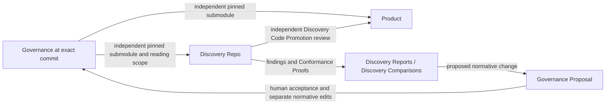

# Governed exploratory development

## Plan status and authorization

[GLOSSARY.md](../../GLOSSARY.md) is authoritative for terminology and explicitly defined relationships. The user authorized repository-wide terminology alignment on 2026-09-14, including this plan and the handoff. Production implementation remains unapproved.

- State: **PLAN — persisted for review; implementation is not authorized.**
- Authoritative plan: `planning/notional/governed-exploratory-development.md`.
- Objective and planning root were confirmed by the user.
- The user confirmed `planning/handoffs/` as the authoritative handoff, replacing the absent `docs/handoffs/governed-exploratory-development/` location named in the original request and root instructions.
- The user authorized creation of this plan only: “do not start implementation until I have reviewed from persisted plan”.
- This document persists the proposed plan presented in chat. Its design choices and implementation chunks remain subject to review; permission to create this file is not approval to execute them.
- No implementation chunk is active. Do not move this plan to `wip`, install dependencies, or modify implementation files until explicitly authorized.
- The latest review prohibits a Python dependency and makes simplicity a standing goal and review metric. Bash is acceptable; any additional tool must address a specific capability and be chosen by the user before it becomes a requirement.
- The user selected Mike Farah’s `yq` for YAML/JSON processing and `jv` from santhosh-tekuri/jsonschema for schema validation. No Python dependency is permitted.
- The user approved the governed-development project-creation Git contract on 2026-09-14: stage approved generated files, create one initial commit in each new Governance/Product repository, and configure their local submodule connection. This capability-specific contract is recorded in R5 and must be carried into production skill instructions. It excludes existing repositories, Discovery creation, later workflows, pushes, hosting, and commits in this implementation repository.
- The user approved separating marketplace Git permissions, capability runtime contracts, and disposable test setup on 2026-09-14. Root guidance now permits test-owned temporary repository initialization, staging, commits, and local submodule relationships, with separate auditing of the workflow under test.
- The user approved common pinned Governance submodules for Product and Discovery, with Curated Governance Reading Scope enforced through agent exclusions, on 2026-09-14. This authorizes the associated plan, glossary, decision, schema, template, and handoff maintenance. R8 records the replacement architecture and its accepted physical-access tradeoff.
- These design and guidance approvals do not authorize starting a chunk or installing dependencies.

## Objective

Implement the capability in this repository, preserving separate Governance, Product, and Discovery Repos.

The first increment comprises the handoff’s first two milestones:

1. Marketplace/plugin skeletons and validation infrastructure.
2. Router-directed project creation of the initial Governance and Product repositories, their Governance submodule relationship, and Local Project Configuration; separately, on-demand creation of a valid local Discovery Repo.

Retain a human review checkpoint between those milestones. Subsequent lifecycle operations require separate approval.

Success means the single public router can create a new Product/Governance pair
through its project-creation workflow, then independently create a Discovery Repo
when requested. Each workflow conducts its own interview and honors explicit
choices. Project creation does not automatically create a Discovery Repo.
Discovery creation validates its fixed Governance pin and approved reading scope. Simplicity is a
success criterion: minimize setup steps, extra tools, custom mechanisms, and
the amount of code needed to maintain the workflow.

Pushes, hosted repository creation, and duplicated Shimmy bootstrap logic remain
excluded. The approved initial project-creation exception permits only the
staging, initial commits, and local submodule connection recorded in R5 for this capability.
It does not authorize starting implementation or running project creation now.

## Verified implementation inventory

At the planning baseline, the repository contained only root `AGENTS.md` and the handoff. There was no production code, test suite, runtime configuration, or existing plan. The glossary and its companion terminology notes were subsequently authorized as documentation work.

The complete handoff was inspected, including its package README, the six required documents in order, all referenced documentation, schemas, templates, reference layouts, workflow specifications, and open implementation details. Decisions take precedence over lower-level package material.

The following planning checks completed:

| Check | Result |
|---|---|
| Complete handoff inventory and reading | 52 files inspected |
| JSON parsing | All six JSON files passed |
| `git diff --check` | Passed |
| `git status --short` | Clean at the planning baseline |
| Baseline runtime inspection | Python 3.9.6 was available during investigation; this does not establish or authorize a repository dependency. |
| Shell/tool inspection during plan review | Bash 3.2.57, Git 2.50.1, and SHA-256 utilities are available locally. |
| Codex command inspection | No `plugin validate` or `--plugin-dir` command |

These are planning diagnostics, not implementation acceptance tests. This inventory is a verified baseline, not permission to ignore newly discovered dependencies.

Earlier resumed review, 2026-09-14: HEAD was `bb67b2d5b0c007f02ecaae618002e1340bfa9fc5`.
`git diff --stat bb67b2d..HEAD` and the staged diff were empty; the existing
untracked `planning/review-resume-handoff.md` was read and preserved. There are
still no production plugins or tests. The review initially updated only this
plan; the user subsequently authorized root `AGENTS.md` changes, including
separation of marketplace permissions, capability contracts, and test setup.
The source handoff was unchanged at that earlier review. The subsequent user-approved R8 revision updates it, the glossary, and this plan together; production implementation remains unstarted.

## Packaging verification and differences

**Keep the reference portable packaging.** Current official documentation supports root `plugin.json`, `$schema`, and `extensions.com.openai.interface`. A `.codex-plugin/plugin.json` overlay is optional; no layout conversion is needed. [OpenAI packaging documentation](https://developers.openai.com/plugins/build/plugins)

Rechecked that portable-root and inline-extension support on 2026-09-14 against
the official page. This is documentation verification, not an installation test;
the earlier app-server invocation has not been revalidated or executed here.

The marketplace location, sibling plugin layout, and `skills/<name>/SKILL.md` structure also match current documentation. Internal workflows can remain supporting references beneath the router. [Build plugins](https://learn.chatgpt.com/docs/build-plugins), [Build skills](https://developers.openai.com/plugins/build/skills)

Two tooling differences affect the plan:

- The installed plugin-creator validator targets the compatibility manifest and cannot validate these portable manifests unchanged. Implement documented portable-format checks instead of changing valid packaging to satisfy that validator.
- `PLUGIN_DATA` is documented for hooks; its presence is not established for ordinary skill-launched scripts. Use it when supplied, with an explicit local-storage fallback. [OpenAI hooks documentation](https://learn.chatgpt.com/docs/hooks)

Standalone skill discovery can be checked through the app-server `skills/list` API using additional skill roots. Packaged installation and namespacing require a separate local installation smoke test. [App-server skills API](https://learn.chatgpt.com/docs/app-server#skills)

The documented standalone check starts `codex app-server --stdio`, completes the `initialize`/`initialized` handshake, and calls `skills/list` with the two production skill roots supplied through `perCwdExtraUserRoots`. It does not install the plugins or prove marketplace loading. No `CODEX_HOME` override is required. This check was not executed during read-only planning.

## Target layout and terminology

All implementation paths below are repository-relative.

Abbreviations:

- `P` = `plugins/governed-exploratory-development`
- `S` = `plugins/governed-exploratory-development/skills/governed-development`
- `H` = `plugins/shimmy-onboarding`

These identify exact path prefixes, not additional directories.

```text
.agents/plugins/marketplace.json
plugins/
  governed-exploratory-development/
    plugin.json
    skills/governed-development/
      SKILL.md
      assets/
        schemas/
        templates/
      references/
        runtime-contract.md
        workflows/
      scripts/
        governed.sh
        lib/
  shimmy-onboarding/
    plugin.json
    skills/shimmy-onboarding/
      SKILL.md
      references/onboarding-contract.md
scripts/
tests/
docs/
planning/
  handoffs/                 # read-only
  notional/
  wip/
  complete/
```

Generated Discovery Repo layout:

```text
<project>-disc-0001-<slug>/
  .git/
  .gitmodules
  AGENTS.md
  DISCOVERY.yaml
  GOVERNANCE-READING-SCOPE.yaml
  .governance/              # complete read-only submodule at fixed commit
  .contracts/               # contract-aware mode only
    EXPORT.yaml
    files/<approved exports>
```

Decision 13 now includes the Git submodule metadata and external reading-scope
record. Contract exports remain Product-derived Conformance Proofs with their own
source identity and file hashes; they live outside the Governance submodule and
gain no Governance authority. No copied Governance content manifest is needed.

`discoveries/` means a directory relative to the Governance repository root. No extra nested `governance/` directory will be introduced.

## Capabilities and dependency choices

**No Python dependency.** Remove the earlier Python runtime, package requirements, virtual environment, and Python test-runner proposal. Do not replace them with another general-purpose runtime requirement by default.

Use Bash for straightforward orchestration and tests, Git for repository operations, and existing platform utilities for file operations and hashing. The proposed shell scripts must work with the available Bash 3.2 baseline unless a specific need for a newer version is demonstrated and approved. No external shell test framework is required.

The user approved the following narrow data dependencies:

| Capability | Where needed | Why it is needed | Selection status |
|---|---|---|---|
| Read and write YAML/JSON, including safe string escaping and deterministic output | Governed-development metadata, configuration, templates, and packaging checks | The handoff supplies structured manifests, schemas, and Markdown frontmatter. Text matching is not a reliable substitute for parsing them. | Mike Farah’s `yq` — approved |
| Check data against JSON Schema Draft 2020-12, including the required date/format assertions | Governed-development validation and tests | Preserve the supplied validation contract without writing a schema engine in shell. | santhosh-tekuri/jsonschema `jv` — approved |

Use direct, documented calls to these two tools; do not build a configurable provider framework. Scope the requirement to the governed-development operations and checks that need it; unrelated sibling plugins and reading this repository must not inherit it. Approval of the dependency choices does not start implementation or dependency installation.

Selected tools:

- Mike Farah’s `yq` reads/writes YAML and JSON and is distributed as a standalone binary. Use it for structured-data processing; schema validation belongs to `jv`. [Upstream yq documentation](https://github.com/mikefarah/yq)
- `jv` from santhosh-tekuri/jsonschema validates YAML/JSON against JSON Schema, including Draft 2020-12 and explicit format assertions. Do not impose a Go toolchain on consumers merely because its upstream build uses Go. [Upstream jv documentation](https://github.com/santhosh-tekuri/jsonschema)

During authorized implementation, verify the exact tool identity/version and the required behavior, including duplicate-key rejection, safe handling of values, deterministic output, and offline schema resolution. Record the tested versions and acquisition instructions in `docs/dependencies.md`. Do not silently substitute another tool named `yq` or weaken checks if either selected tool fails a requirement; report the concrete gap. Neither tool has been installed or behavior-tested during planning.

Bash alone is sufficient for much of the workflow. Preserving general YAML handling and the supplied schema contract using Bash alone would require substantial custom parsing/validation code. That would increase maintenance complexity. Do not silently reduce accepted formats, omit schema checks, or claim that grep/sed checks implement JSON Schema. Any deliberate reduction of the handoff’s validation scope requires an explicit reviewed decision.

Initial platform verification targets macOS and Linux. Other hosts remain unverified until tested. Git and available hashing/file utilities are operational prerequisites; a dependency on Python, Node, a compiler, a package manager, or a container engine is not proposed.

## Simplicity goal and metrics

Choose the simplest implementation that satisfies the approved behavior and safety requirements. Simplicity means low total operating and maintenance effort, not just a low count of installed tools.

At each chunk review, report:

| Metric | Review target |
|---|---|
| Additional required tools | Count and name each tool, the exact capability it supplies, and which operations require it. Add none without the user’s choice. |
| Setup steps | Count documented actions needed before the first successful run; avoid automatic bootstrap and unnecessary setup layers. |
| Implementation size | Report production script count and nonblank source lines, explaining material growth. These are comparison signals, not quotas that reward compressed code. |
| Custom mechanisms | Identify any new parser, framework, storage mechanism, or abstraction; prefer existing tools and direct operations. |
| Developer effort | Count avoidable manual steps and repeated questions; preserve the explicit choices required by the handoff. |
| Repeatability | A documented command runs each test group without an extra test framework or manual repository preparation, using the approved disposable test fixtures. |

Start with a small shell entrypoint and a few supporting files. Add modules only for concrete responsibilities, not one module per concept in the handoff. A focused external utility can be simpler than maintaining a custom implementation. Record that tradeoff for the user instead of deciding it silently.

## Recorded design decisions

The following combine settled handoff constraints, explicitly approved review decisions, and proposed implementation details. The dependency selection and disposable-test-fixture exception are approved. Starting implementation still requires explicit authorization.

| Area | Proposed behavior |
|---|---|
| Authority | Constitution > Policies > Specifications > Active ADRs. Resolve explicit same-level supersession; surface ambiguous conflicts. Conformance Proofs and operational instructions never become additional normative levels. |
| Simplicity | Minimize setup, dependencies, custom mechanisms, and maintenance effort; report the metrics above at every review. |
| Dependencies | No Python requirement. Bash and Git cover straightforward work; Mike Farah’s `yq` and santhosh-tekuri/jsonschema `jv` are the approved data-processing and validation dependencies. |
| Test fixtures | Root guidance permits initialization, staging, commits, and local submodule setup in test-owned temporary repositories. Audit fixture preparation separately; tests must verify the production workflow's own permissions. |
| Installation verification | Successful local packaged installation, skill discovery, and namespacing verification are required before Chunk 2 acceptance. Broader installation hardening remains in Chunk 6. Approved on 2026-09-14; the checks have not run. |
| Router | One public governed-development skill routes project creation and on-demand Discovery Repo creation to separate internal workflows. Do not expose those internal modules as a user-facing menu. Project creation never implies a Discovery Repo request. Natural-language routing and recommendations belong in the skill; deterministic helpers validate state and perform filesystem operations. |
| Repository boundaries | Governance, Product, and each Discovery Repo are separate Git repositories. Do not combine them into one repository or replace Discovery Repos with branches or worktrees. This governs this capability's projects, not the architecture of unrelated marketplace plugins. |
| Interviews | One outstanding decision at a time. Persist answers locally. Recommendations never populate missing choices. Reuse explicit authorization already given for the same action. |
| Local Project Configuration | Store confirmed project paths and a stable, credential-free Governance identity outside repositories. |
| Governance identity | Use the canonical repository URL when established, otherwise a developer-confirmed stable identifier for a local-only repository. Record that identity in provenance; keep workstation checkout locations in local configuration. Approved on 2026-09-14. |
| Data location | Explicit `--data-dir`, otherwise supplied `PLUGIN_DATA`, otherwise `${XDG_DATA_HOME:-$HOME/.local/share}/beeline-technologies/governed-exploratory-development`. Reject storage inside project repositories or the installed plugin tree. |
| Project creation | Create the initial Governance and Product repositories and establish Product's Governance submodule, then save Local Project Configuration. This user clarification supersedes the earlier registration-only assumption. The approved initialization Git contract belongs to this capability's R5 and future skill instructions; chunk execution remains separately gated. |
| Existing-project setup | Retain registration and validation for an existing pair; preserve its history, Product pin/index, and owned files. Do not recreate repositories or treat registration as initial project creation. |
| Existing files | Seed missing role `AGENTS.md` files once. Preserve existing files and surface conflicts. |
| Revision selection | Discovery Repo creation interviews for Governance revision, offering the registered Governance checkout's HEAD as the default. Resolve and confirm its exact commit, then freeze that choice. Product's adopted pin remains independent and unchanged. Approved clarification on 2026-09-14. |
| Governance source | Initialize a read-only submodule at the approved exact commit; validate source identity, Git link, checkout, and clean state. Never consume dirty source-checkout content. |
| Git compatibility | Initially support the handoff’s SHA-1 commit format. Reject unsupported object formats explicitly. |
| Governance Reading Scope | Full permits the pinned tree; Curated permits explicit paths and excludes all other bodies across agent transports. Both retain the complete submodule and remain subject to Product Access Mode. |
| Contract exports | Explicit allowlist, source identity, optional source commit, and per-file hashes. No arbitrary Product scanning or inferred exports. |
| Discovery IDs | Governance-owned `discoveries/.reservations/DISC-xxxx.json`; atomic exclusive creation and collision retries. Failed reservations remain consumed; IDs are sequential, not necessarily gapless. |
| Concurrency | Guarantee local uniqueness against the same Governance checkout. Do not claim coordination across independent clones. |
| Recovery | Journal operation-owned files locally. Remove only unchanged files created by the failed operation; preserve unexpected edits. |
| Isolation | Policy and workflow guardrails across transports. Detect obvious contamination and surface exposure; make no hard-sandbox claim. |

## Package inconsistencies and proposed handling

The terminology alignment updates the handoff to match the authoritative glossary. The rows below distinguish resolved documentation drift from remaining implementation proposals.

| Finding | Proposed production handling |
|---|---|
| Handoff path drift — resolved | Root `AGENTS.md` now names the confirmed `planning/handoffs/` location. |
| Project creation scope — clarified by user on 2026-09-14 | The agent creates the initial Governance/Product pair and submodule relationship. Earlier plan text and the reference Project Setup workflow only registered existing repos. Preserve that reference as historical source; R5 records the approved initialization contract. Glossary/source wording alignment remains pending; no silent rename of the existing Project Setup term is made. |
| Templates permit workstation paths in provenance, conflicting with Decision 29 | Add `governance_repository` to the production configuration model; write that stable identity into Discovery Repo provenance. |
| Contract export location/provenance is unspecified | Use the separate immutable contract namespace and manifest shown above. |
| Governance storage — resolved by R8 | Use Git pin and dirty-state validation; remove copied-tree integrity infrastructure. Validate reading-scope and manifest agreement separately. |
| Concurrency is required but deferred by phase outlines | Implement basic atomic reservations and recovery in the first increment. |
| Inherited-scaffold wording — resolved | The reference layout now explicitly requires minimal creation, including full-reference mode. |
| Full reading scope may allow Product-derived implementation Conformance Proofs | Require compatible Product access or an explicit Curated scope before body reads. Curated excludes reading, not local file presence. |
| Product authority-list drift — resolved | Implementation appears in a separate Conformance Proofs paragraph beneath the four normative levels. |
| Pending proposal metadata drift — resolved | The template uses directory location for pending state; resolution metadata records accepted/rejected outcomes. |
| Discovery Review approval-gate drift — resolved | The reference requires a generated-and-surfaced Discovery Report before independent Discovery Disposition choices. |

## Approved test-fixture approach

A **test fixture** means sample data used by a test: here, a tiny example Governance repository and a tiny example Product repository.

The user approved creating these examples automatically, including their initial Git commits, under a dedicated temporary directory. This keeps the tests repeatable and avoids manual preparation or maintaining prebuilt repository archives.

The 2026-09-14 guidance-separation approval resolved the fixture-staging and
submodule-setup boundary. Root guidance now explicitly permits this test setup.

Only test setup may create these example commits. Before doing so, it must verify that the target repositories are inside its own temporary directory and that inherited Git settings cannot redirect writes to a real repository. Test-only identity and configuration must not modify global Git configuration. Cleanup is limited to files owned by that test run.

Fixture permission does not permit commits in this repository or real Product,
Governance, or Discovery Repos. Tests may configure local submodule relationships
inside their temporary workspace; they must not push or create hosted repositories.
The production workflow under test follows its own contract: initial project
creation may make its approved initial commits, while Discovery creation stages
only its submodule metadata/link, leaves source history unchanged, and creates no
Discovery commit. Test setup and
workflow execution must be distinguishable in the command audit so fixture
commits cannot mask a workflow violation.

## Unresolved

The resumed consistency review on 2026-09-14 found that the first increment is
not yet decision-complete. The following register distinguishes approved rules
from proposals awaiting review; neither grants permission to execute a chunk. Existing
dependency choices and glossary relationships remain recorded decisions.

| Gate | Owner / required before | Recommendation and tradeoff | Status |
|---|---|---|---|
| R1 — Data pipeline and schemas | Chunk 1 | Adopt the constrained metadata profile and cross-document checks below. Broader YAML support would preserve more input flexibility but needs a demonstrated validation mechanism. | Constrained YAML and offline-schema approach approved on 2026-09-14; remaining general schema details proposed; reading-scope schema adapted under R8; tool canaries unexecuted |
| R2 — Authority and selection | Chunk 2; schema shape in Chunk 1 | Classify the complete source tree before selection; reject ambiguous supersession. This can reject a curated source because of invalid excluded metadata, but avoids silently changing authority. | Source-wide authority validation, no reactivation through exclusion, and blocking broken/ambiguous supersession approved on 2026-09-14; R8 approves scope through agent exclusions; detailed authority classification still proposed |
| R3 — Identity, topology, approval binding | Chunk 2 | Create the original Governance and Product repositories through project creation; retain Product's pinned submodule and interview for Discovery Governance revision with Governance HEAD as default. Retain unaffected answers on resume. | Initial pair creation, separate on-demand Discovery creation, normal pin divergence, HEAD default, and URL-or-stable-local-identifier rule approved; source-locator details, initialization recovery, and resume mechanics remain proposed |
| R4 — Allocation | Chunk 2, extended in Chunks 3–4 | Validate choices before reservation; count reports and consumed reservations. Reserve independent later namespaces. This allows gaps and provides only local coordination. | Allocation after interview approval, no reuse of occupied IDs, gaps, independent sequences, and same-checkout concurrency approved on 2026-09-14; reference-order conflict resolved in favor of approved plan behavior |
| R5 — Git contracts and packaging gate | Before initial project creation or fixture execution; packaging by Chunk 2 acceptance | Keep marketplace Git permissions and disposable test setup in root guidance; put initialization permissions in this capability's contract. Require basic installation verification at the first usable increment. | Resolved: Git scope separation, test setup, and the required Chunk 2 installation gate approved on 2026-09-14; root guidance applied; installation verification unexecuted |
| R6 — Repeat review and retention | Before Chunk 3 | Preserve human edits and append reviewed report updates; journal finalization; record promotion intentions separately from execution. Specify local Archive mechanics. | Proposed; detailed state contract still required |
| R7 — Proposal resolution and Product handoff | Before Chunk 4 | Keep modified proposals pending until revised content is accepted/rejected; perform code promotion in Product context without returning Product knowledge to an isolated investigation. | Proposed; detailed handoff contract still required |
| R8 — Common Governance submodules and reading scope | Contract used by Chunks 1–2 | Reuse pinned submodules; enforce Curated scope through agent exclusions over the complete checkout. Native Git checks replace custom Governance hashing. | Approved on 2026-09-14, including locally present excluded files; documentation/reference adaptation authorized; runtime unimplemented |

### R8 — Approved Governance submodule and reading-scope contract

Approved on 2026-09-14: Product and Discovery use read-only Governance submodules
at independently selected exact commits. Decision 16 owns the common mechanism;
Decision 3 is retired. The user accepted the complete Governance checkout in
Curated mode and authorized removing obsolete terminology and machinery from
all documentation and reference assets. Production execution remains unapproved.

**Pinned Governance Revision** identifies the exact commit for either repository.
**Adopted Governance Revision** retains Product's deliberate-adoption and belief-
in-conformance meaning. A Discovery pin establishes a fixed baseline without
that claim. Changes to its revision require a successor, preserving the original
pin, charter, and prior reading decisions.

**Governance Reading Scope** has Full and Curated modes. Full permits artifact
bodies in the pinned tree subject to Product Access Mode. Curated always allows
the Constitution and records an explicit allow/exclude decision for every tracked
file path. Excluded or unlisted bodies must not enter agent context through file
reads, searches, Git, links, nested instructions, connectors, summaries, or
another agent. These are workflow/agent rules; excluded files remain present.

Write `GOVERNANCE-READING-SCOPE.yaml` outside the submodule. Bind it to Discovery
ID, source identity and commit, `.governance` path, mode, and generating workflow
identity/version. Record each Curated path's relevance, benefit, reading risk,
exclusion risk, and developer decision. Full records an empty decisions list.
Use exact normalized repository-relative file paths; no globs or implicit directory
expansion. Validate unique paths, source membership, Constitution coverage, and
complete Curated coverage. Do not infer choices or silently fall back to Full.

Read root instructions, manifest, and scope record before any Governance bodies.
Allow only path names and minimal authority frontmatter (ID, title, class,
supersession links) for excluded candidates during interviews and authority
validation. Body exposure cannot be screened by first reading the prohibited body;
unknown exposure requires developer classification before allowing access. A
reading exclusion cannot remove obligations or reactivate superseded artifacts.
Both reading scope and Product Access Mode must permit access. Scope amendments
need explicit affected choices and rationale; retain the scope used by previous
reviews and record prior exposure. Instruction edits alone grant no new access.

Git supplies the pinned commit and change detection. Check manifest/scope/source
agreement, parent HEAD and index links, checkout commit, and modified, untracked,
or ignored submodule contents. Preserve and surface discrepancies. There is no
custom Governance content inventory, duplicate hashing format, or copy builder.
Contract Exports still require their own approved paths and source/file provenance
under `.contracts/`; they are not stored in the read-only submodule.

Native submodule initialization needs `.gitmodules`, a staged Governance Git link,
and local submodule configuration. Carry this narrow Discovery creation allowance
into R5 and reference Decision 30; leave all other generated files unstaged and
create no Discovery commit. The staged pin is pending the developer's commit.
Fresh clones need submodule initialization and access to the retained Governance
commit. Source identities remain portable; workstation-specific clone locations
belong in local configuration, with `.gitmodules` using a confirmed portable
source locator. Do not invent a remote or treat a logical URN as a fetch URL.

Official behavior was checked against [Git submodules](https://git-scm.com/docs/gitsubmodules)
and [submodule commands](https://git-scm.com/docs/git-submodule). This was
read-only documentation verification, not execution of a workflow or a Git fixture.

### R1 — Metadata and schema contract

Scope this profile to structured workflow metadata and normative frontmatter,
not arbitrary Governance body text or copied binary files. Require exactly one
UTF-8 YAML document with string mapping keys and JSON-compatible values. Reject
duplicate decoded keys at every nesting level **on original input before
conversion**, anchors/aliases, merge keys, custom tags, and non-string keys.
Comments and ordinary multiline strings remain supported. Require dates and
versions to be strings; schema types constrain numeric values. Do not implement
a YAML parser using shell text matching. If the selected tools cannot enforce
this profile before losing information, stop and report that capability gap.

Package self-contained production schemas with internal fragment references
only. Validate schemas and instances offline, using the validator's bundled
Draft 2020-12 support and explicit format assertions. Reject external references
before resolution; do not fetch schema URLs from instance data. This restriction
was approved during the guided review on 2026-09-14; it is a production design
choice, not an existing handoff requirement. The general schema details below remain proposed until the Chunk 1 scope review;
R8 separately approves the reading-scope representation.

Add required `discovery_repo.objective` for the Charter, separate from
`framing.objective`. Add asserted `format: date` to `created_at`; require both
predecessor/reason values to be null or both populated. Keep pre-production
schema version `1.0`; no migration is required. Validate semantic agreement of
Discovery ID, Governance identity and exact lowercase commit, artifact selection,
submodule/scope-record paths, and generating workflow identity/version across
manifest, reading record, reservation, and generated instruction metadata. Later plugin upgrades must not compare
old provenance against the currently installed version or rewrite owned files.

Preserve the marketplace mapping explicitly: provenance `Beeline-Technologies`,
catalog name `beeline-technologies`, display name `Beeline Technologies`. They
identify the same distribution boundary in different fields; do not require
literal equality or apply generic case normalization.

Use deterministic UTF-8 YAML/JSON rendering for metadata and safe string
round-trips. Governance byte provenance uses Git; no canonical JSON hashing
standard or Governance content-manifest schema is required. Contract Export
hashes cover the exact approved export bytes independently of Governance.

Chunk 1 canaries must exercise nested/escaped duplicate keys, a second YAML
document, forbidden YAML features, invalid leap dates, unavailable external
references, and safe string round-trips. The selected tools have not been
installed or behavior-tested here. Record exact tested binary versions during
authorized implementation. General schema adaptations, such as Charter objective
and calendar-date assertions, remain separate R1 review items.

### R2 — Proposed source classification and coverage

Approved on 2026-09-14: validate authority across the entire selected Governance
commit before selection; exclusion cannot reactivate a superseded artifact.
Broken or ambiguous supersession blocks creation even for excluded artifacts.
The detailed classification, coverage, and exposure rules below remain proposals
where they extend beyond that approved rule.

Enumerate the entire selected Git commit before curation, including committed
reservation metadata and unknown/supporting files. Use the source's normative
directories (`constitution/`, `policies/`, `specs/`, `adr/`) and validated
frontmatter; classify other content as non-normative supporting material, with
operational instructions explicitly distinguished. Require at least one valid
Constitution artifact. Surface ambiguous class/path or missing normative metadata
instead of inferring authority from prose or filename alone.

Build the normative ID/supersession graph source-wide. Reject duplicate IDs,
missing targets, self-links, cycles, and cross-level references. For competing
successors, require a unique descendant resolving the branches; otherwise surface
the ambiguity. Preserve superseded status even when a superseder is excluded.
Derive the source-wide ID/class/relationship index from minimal metadata at the
pinned commit. This validation does not grant access to excluded artifact bodies
or require a duplicate provenance database.

R8 settles coverage semantics: the complete submodule is present in both modes.
Curated records allow/exclude choices for every path, including supporting and
operational files; always allow the Constitution. Full permits the complete pinned
tree only with compatible Product access. Grouping for display cannot conceal
individual Curated choices. Unknown exposure is resolved by the developer before
body reading. R8 and source Decision 20 define the agent reading boundary.

The initial implementation proposes rejecting unsupported symlinks, nested
Git links, unsafe paths, and filesystem name collisions before initialization.
This avoids bypassing reading permissions through indirection. Detailed authority
classification and these supported-entry limits remain Chunk 2 review items.

### R3 — Proposed identity, topology, and resumed choices

User clarification, 2026-09-14: initial project creation establishes Governance
at its first commit and Product's submodule points to that same commit. Governance
can advance independently while Product retains the older pin. The writable
Governance checkout means that original Governance repository, not an additional
third copy introduced by this plugin. A workflow separate from initial project
creation owns Product releases and must account for the Governance submodule
revision. The existing adoption workflow addresses pin changes; a complete
Product release workflow is not yet specified or approved for implementation.

Discovery Repo creation interviews for the Governance revision with the registered
Governance checkout's HEAD as the default. Present the resolved commit for
confirmation, permit another revision, and preserve the chosen commit even if
HEAD later moves. This never advances Product's pin and does not implicitly fetch
or choose a remote branch's tip. Product G1 with Governance HEAD G2 is an ordinary
supported state, not an inconsistency requiring repair.

Scope resolved by the user on 2026-09-14: the agent's project-creation workflow
creates both initial repositories and their relationship. It is not merely a
registration workflow for an externally prepared pair. Discovery Repo creation
is a separate internal workflow invoked on demand through the same public router.
The plan's earlier registration-only assumption is withdrawn. Git initialization
permissions are approved under the narrow R5 exception; initial Governance content and recovery
behavior must be specified before Chunk 2. Existing-project registration remains
available without modifying history or advancing the pin.

Approved on 2026-09-14: confirm a credential-free logical Governance identity
once during Project Setup. Use a canonical repository URL when established, or
a developer-confirmed stable identifier (represented as a URN) for a local-only
repository. Record this identity in provenance; keep workstation checkout paths
in local configuration. Moving a checkout does not change its identity. Do not
invent a remote or treat a shared commit alone as proof of repository identity.
Another workstation confirms the same identity during its own setup. The precise
retrieval-locator handling remains separate from this approved identity rule.

Use the original writable Governance checkout outside Product, distinct from
Product's and Discovery's read-only Governance submodules. Verify logical
identity and commit availability. Existing-project registration preserves dirty
files and never stages or repairs the relationship automatically. Record three observations separately: Product HEAD gitlink,
Product index gitlink, and checked-out submodule commit.

After unstaged adoption, HEAD and index remain at G1 while the checkout is G2.
Recognize this as pending adoption rather than silently calling G2 the committed
Adopted Governance Revision. Later setup/creation surfaces the state and requires
an explicit source-revision choice. Unrelated index conflicts remain diagnostic
failures. Test adoption followed by setup and creation in Chunk 4; establish the
state interpretation with synthetic inputs in Chunk 2.

Bind each persisted answer to its project identity and relevant input revisions,
with the destination recorded only in local state. Source-commit changes require
fresh classification and reading-scope approval; retain charter/type/framing answers
unless their inputs changed. Access-mode changes revisit affected reading permissions,
exports and comparisons. Export-byte changes invalidate export approval and
integrity. Destination-only changes revalidate containment, collision and final
creation approval, retaining source and Charter choices. A changed project
identity starts a new interview. Never infer approval from elapsed time or a
recommendation. Revalidate bindings immediately before reservation and writes.

### R4 — Proposed allocation and recovery

Approved on 2026-09-14: allocate only after the creation interview is approved;
existing reports and failed reserved attempts keep their IDs occupied, permitting
gaps but no reuse. Comparisons and proposals have independent sequences. Concurrent
allocation protection applies to the same Governance checkout. Detailed storage,
retry, and recovery mechanisms below remain implementation proposals.

After approved inputs validate, allocate one greater than the maximum occupied
numeric suffix, padded to at least four digits. Occupancy includes committed,
indexed and working-tree reports plus reservations in the registered Governance
checkout. A missing reservation does not make an existing report ID available.
Treat alternate spellings of the same numeric ID as a collision; malformed
reservation contents never free its filename. Preserve consumed failed IDs.

Use atomic exclusive reservations with bounded collision retries (initially 20,
then safe failure). Recheck destination and report occupancy before finalization.
Reservation contents carry ID, operation ID, portable project/source identity,
commit and creation time, never workstation paths. Local journals own paths and
recovery state. External manual writers and independent clones are outside the
local cooperating-writer guarantee; conflicts must still fail without overwrite.

Extend the same allocator in Chunk 3 for `CMPR-*` under
`discoveries/.reservations/`, checking `discoveries/CMPR-*.md`. Extend in Chunk 4
for `GOVP-*` under `proposals/.reservations/`, checking both pending and resolved
proposal directories. Each prefix has its own sequence. Reports reuse their
Discovery Repo's ID. The reference creation workflow now matches the approved
validate-before-reservation order as part of the authorized R8 maintenance.

### R5 — Approved Git contracts and verification gate

Root `AGENTS.md` governs Git actions affecting this marketplace repository and
permits disposable test setup. It no longer defines Git permissions for every
skill's runtime behavior. The following approved contract applies specifically
to governed-development and must be included in its production skill and workflow
instructions when those files are implemented:

> Governed-development workflows do not stage files, create commits, push,
> configure remotes, or create hosted repositories, except that initial project
> creation may stage its approved generated files, create one initial commit in
> each newly created Governance and Product repository, and configure their local
> Governance submodule connection to pin Product to that Governance commit.
> Discovery creation may configure its local Governance submodule and stage only
> `.gitmodules` and the Governance Git link required to initialize that relationship.
> It creates no commit and stages no other generated files. These initialization
> allowances do not apply to existing repositories or later lifecycle operations.
> They permit no marketplace commits, pushes, or hosted repository creation.

The contract does not authorize chunk execution or actual repository creation
during this review. The local submodule source declaration/checkout may require
local Git remote configuration; that is included only in the initialization
allowances for initial Product and Discovery submodule setup. No extra remote is
required on top-level Product, Governance, or Discovery repositories. No Product
remote is added to Discovery. Show staged submodule entries separately from other
unstaged generated files; the native Git pin becomes durable with the developer’s
Discovery commit.
The implementation must preserve normal Git author identity, signing and hook
behavior; a failure is surfaced without bypassing them. Before the initial
Governance commit, present the initial Constitution and other generated content
for developer review; do not commit invented project requirements as placeholders.
Retried creation must recognize completed initialization and never create a
second initial commit. Detailed interrupted-creation behavior belongs to Chunk 2.

Fixture preparation may initialize repositories, stage files, create multiple
commits representing different source revisions, and establish local submodule
relationships in the test run's temporary workspace. Verify containment and
isolate inherited Git settings; do not modify global configuration or real
project repositories. Audit fixture setup separately from the workflow under
test. No fixture execution has occurred during this review.

Approved on 2026-09-14: require successful local packaged installation, skill
discovery, and namespacing verification before Chunk 2 acceptance, with the
reusable smoke harness owned by Chunk 2. Keep broad installation hardening in
Chunk 6. Report structural checks, standalone parsing, and installed-plugin
discovery separately. If the host cannot perform the smoke test, report it as a
blocking verification item; structural checks or standalone parsing do not
satisfy this gate. This approval establishes the acceptance requirement; no
installation or verification has occurred during this review.

### Later-chunk prerequisites

Before Chunk 3, specify repeated-review report revisions, human-edit preservation,
cancellation, interrupted durable writes, and local Archive mechanics, including
continued access to the pinned Governance commit. Recommend
one durable report per DISC ID with append-only review sections; detect concurrent
edits rather than overwriting them. Finalize and surface the report before saving
disposition; recover a report/manifest mismatch through an operation journal.
Keep Active remains active. Record promotion intentions as selected, declined,
or deferred; Chunk 3 must not claim Chunk 4 handlers have executed.

Before Chunk 4, specify revised-proposal review before accepted/rejected
resolution, retaining rationale. Define a Product-context code-promotion handoff
that preserves source provenance and access history; promotion does not authorize
Product inspection from an ongoing isolated Discovery Repo context. Avoid feeding
Product-derived findings back into that investigation. The handoff mechanism and
pending-adoption recovery require explicit contracts before implementation.

The exact Shimmy Product bootstrap contract remains a prerequisite for approving Chunk 5, not a blocker for the first increment.

## Progress Checklist

- [x] Read repository instructions and complete handoff.
- [x] Confirm source directory, objective, and planning root.
- [x] Verify current official packaging requirements.
- [x] Remove the Python dependency proposal and make simplicity an explicit goal and metric.
- [x] Choose the YAML/JSON processing and schema-validation tools: Mike Farah’s `yq` and santhosh-tekuri/jsonschema `jv`.
- [x] Record disposable-fixture initialization, staging, commit and local-submodule permissions in root guidance.
- [x] Approve and record the initial project-creation Git contract in this capability's plan, for inclusion in production skill instructions.
- [x] Scope root guidance to marketplace work and explicitly route capability-specific constraints to the applicable plan/contracts.
- [x] Persist proposed plan with explicit user permission, for review only.
- [x] Resolve R5: require successful local installation, discovery, and namespacing verification before Chunk 2 acceptance; retain broader hardening in Chunk 6.
- [x] Resolve R8: common Governance submodules, Curated agent reading rules, and removal of obsolete copied-tree mechanisms.
- [x] Approve R3's portable Governance identity rule: canonical URL when established, otherwise a developer-confirmed stable local identifier; workstation checkout locations remain local configuration.
- [ ] Resolve remaining first-increment details in R1–R4; R5 and R8 design decisions are recorded.
- [ ] Obtain approval to start implementation.
- [ ] Chunk 1 — Skeleton and validation.
- [ ] Chunk 2 — Local Project Configuration, Project Setup, and Discovery Repo creation.
- [ ] Chunk 3 — Successor, Discovery Review, and Discovery Comparison.
- [ ] Chunk 4 — Governance, promotion, and adoption.
- [ ] Chunk 5 — Shimmy delegation.
- [ ] Chunk 6 — Hardening and installation verification.

Active state: **PLAN**, awaiting review of this persisted document. No implementation chunk is active.

## Capability domain knowledge

Relocated from the final three sections of `GLOSSARY.md` by user direction.
These relationships, choices, and scenarios belong to
`governed-exploratory-development`; they are not shared marketplace policy or
requirements for unrelated plugins. The glossary continues to define terms.
Approved clarifications in this plan, including R5, govern the contracts below;
remaining proposals retain their recorded review status.

During authorized implementation, carry the applicable invariants and choices
into `S/SKILL.md`, `S/references/runtime-contract.md`, and the internal workflow
references. Map the boundary scenarios to the relevant chunk's acceptance checks
and record coverage or unresolved details at its review gate. Preserve this
material when the plan moves to `wip` and `complete`; relocation does not authorize
implementation or assert that these scenarios have been tested.

### Relationships and invariants



The records and proposals in the diagram live in Governance but remain non-normative. The reusable workflow mechanism operates these relationships from the independent marketplace repository.

1. **Authority is fixed:** Constitution > Policies > Specifications > Active ADRs. Same-level supersession must be explicit; unresolved conflicts are surfaced. Tests, Product code, proposals, records, and `AGENTS.md` add no authority levels.
2. **Recommendations are not choices:** Governance Reading Scope, framing, Product access, and the charter require explicit developer decisions. Curated scope always permits the Constitution and records reading decisions. An earlier explicit choice need not be asked again for the same action.
3. **Initial creation is minimal:** Decision 13 includes only the manifest, reading record, root instructions, Governance submodule and Git metadata, plus approved Contract Exports when selected. Full-reference permits inspection; it does not select an inherited implementation scaffold.
4. **Provenance is stable:** the Discovery Governance pin stays fixed. Charter and provenance fields should be treated as immutable after coding starts; later findings belong in durable records. Material Governance changes lead to a successor repository.
5. **Conformance Proofs survive retention choices:** every Discovery Review generates and surfaces its Discovery Report before Discovery Disposition choices. `active`/`closed` manifest status and the promotion and retention choices within Discovery Disposition are distinct concepts; a surfaced record does not by itself mean the Discovery Repo is finished.
6. **Promotion decisions remain independent:** approving Discovery Governance Promotion can accompany rejecting Discovery Code Promotion, and accepting code can accompany no Governance change. Accepted proposals require Product impact assessment; they do not automatically change Product or its pin.
7. **Access and scope must agree:** a comparison target or Full reading scope cannot waive the Product-access boundary. Version 1 provides policy and workflow guardrails, not a hard technical sandbox.
8. **Repository actions preserve developer control:** governed-development workflows follow the [approved R5 Git contract](#r5--approved-git-contracts-and-verification-gate). Initial project creation may stage approved generated files, create the initial Governance and Product commits, and establish their local submodule connection. Discovery creation may stage only its `.gitmodules` and Governance Git link and configure that local submodule; it creates no commit. Existing-project registration and later workflows retain their index, commit, remote, and hosting restrictions. Marketplace Git permissions and disposable test setup are governed separately by root `AGENTS.md`. This supersedes the former glossary wording that recognized only the fixture exception.

Sources: [Settled decisions](../handoffs/decisions/DECISIONS.md), [Lifecycle](../handoffs/docs/03-discovery-lifecycle.md), [Persisted review decisions](#recorded-design-decisions).

### Required choices and state distinctions

| Concept | Values and meaning |
|---|---|
| Discovery Framing | Neutral: no imposed optimization bias. Optimize a quality: optimize an explicit quality. Challenge assumptions: challenge assumptions and seek failure modes. Custom: developer-defined lens. |
| Product access | Isolated: no Product implementation exposure. Contract-aware: approved public contract exports only. Full-reference: implementation and history may be inspected in a separate Discovery Repo. |
| Discovery Code Promotion approach | Transplant: reuse code that fits Product with minimal change. Adapt: reuse selected code with production changes. Reimplement: retain the design or behavior but implement it fresh in Product. |
| Proposal state | `proposals/pending/` → human resolution → `proposals/resolved/`. Resolved metadata records accepted/rejected and optionally a resolving commit. Acceptance leads to separate normative edits. |
| Discovery Repo status | Manifest values are `active` and `closed`. Findings are recorded separately from the original charter. |
| Repository retention within Discovery Disposition | Archive: retain implementation and history read-only. Report + Delete: retain Conformance Proofs and allow manual repository removal. Keep Active: continue the Discovery Repo. Concrete local archival mechanics remain an implementation detail. |

Sources: [Lifecycle](../handoffs/docs/03-discovery-lifecycle.md), [Promotion and adoption](../handoffs/docs/04-promotion-and-adoption.md), [Governance model](../handoffs/docs/02-governance-model.md), [Open implementation details](../handoffs/codex/OPEN-IMPLEMENTATION-DETAILS.md).

### Boundary scenarios

These scenarios exercise the specified model; they are not executed acceptance tests.

| Scenario | Expected interpretation |
|---|---|
| A test passes while its asserted behavior contradicts a Specification. | Surface the Governance inconsistency. Passing Conformance Proofs do not override the requirement. |
| A resolved proposal is accepted, but no normative artifact was edited. | The proposal remains Conformance Proofs of a decision; moving or accepting it alone did not change Governance. |
| Governance advances from G1 to G2 while a Discovery Repo uses G1. | Preserve the G1 submodule pin and reading scope. A material update requires a successor with a new ID and predecessor reference. Product may still pin G1 independently. |
| DISC-0043 compares with DISC-0042 but does not continue it. | Record a comparison target; do not infer `derived_from` or permission to inspect its implementation. |
| Isolated mode is selected with Full reading scope over Product-derived implementation Conformance Proofs. | Require a revised reading scope or compatible Product access before body reads. Curated excludes reading those bodies while the complete submodule remains present. |
| A Discovery Repo fails its success criteria but reveals a missing invariant. | Preserve the negative result and supporting Conformance Proofs. Discovery Governance Promotion may be useful even if Discovery Code Promotion is rejected. |
| A Discovery Report is surfaced and the developer chooses Keep Active. | Preserve the durable record without treating its existence as proof of closed status or immutable final findings. |
| A plugin update includes a new AGENTS template for an existing Product repository. | Repository ownership continues; do not silently replace the existing instructions. |
| Both promotion types are approved, followed by Archive. | Record Discovery Code Promotion, Discovery Governance Promotion, and repository retention independently; neither promotion implies the other or Governance adoption. |
| A benchmark fails and measures a quality unrelated to requirements. | Preserve its measurements and limitations as Conformance Proofs without claiming successful conformance. |
| A repository edits generated instructions while its Governance pin and reading scope stay fixed. | Instruction ownership does not permit submodule writes, pin changes, broader reading, or overriding requirements. |
| An excluded report exists locally and a broad search would include its body. | Restrict the search to allowed paths before execution; local availability grants no reading permission. |

## Execution protocol

For every chunk:

1. Read `AGENTS.md`, `GLOSSARY.md`, every child context on the path to a changed
   file, this plan (including [Capability domain knowledge](#capability-domain-knowledge)),
   and the chunk's target files.
2. Execute only that chunk's scope.
3. Run its verification checklist and record `[x]`, `[ ]`, or `[~]` with notes.
4. Update the cumulative **Lessons learned** block.
5. Summarize changes, tests, failures, uncertainties, and remaining risks.
6. Stop for human review and explicit acceptance before starting the next
   chunk.

Repository paths in this plan are relative to `<repo>` so it remains portable
across workstations and sessions.

## Chunk 1 — Skeleton and validation

### Goal

Deliver the handoff’s first milestone: coherent, independently packaged plugin skeletons and reusable validation infrastructure.

### Files

Create:

- `.agents/plugins/marketplace.json`
- `README.md`, `.gitignore`
- `docs/packaging.md`, `docs/testing.md`, `docs/dependencies.md`
- `P/plugin.json`
- `S/SKILL.md`
- `S/references/runtime-contract.md`
- `S/references/workflows/project-setup.md`
- `S/references/workflows/discovery-repo-create.md`
- `S/references/workflows/discovery-repo-successor.md`
- `S/references/workflows/discovery-review.md`
- `S/references/workflows/discovery-compare.md`
- `S/references/workflows/discovery-governance-promote.md`
- `S/references/workflows/governance-resolve.md`
- `S/references/workflows/discovery-code-promote.md`
- `S/references/workflows/governance-adopt.md`
- `S/assets/schemas/discovery-manifest.schema.json`
- `S/assets/schemas/governance-reading-scope.schema.json`
- `S/assets/schemas/local-project-configuration.schema.json`
- `S/assets/templates/DISCOVERY.yaml`
- `S/assets/templates/GOVERNANCE-READING-SCOPE.yaml`
- `S/assets/templates/LOCAL-PROJECT-CONFIGURATION.yaml`
- `S/assets/templates/agents/product/AGENTS.md`
- `S/assets/templates/agents/governance/AGENTS.md`
- `S/assets/templates/agents/discovery-repo/AGENTS.md`
- `S/scripts/governed.sh`
- `S/scripts/lib/data.sh` — structured-data operations and template rendering using the user-selected tools
- `H/plugin.json`
- `H/skills/shimmy-onboarding/SKILL.md`
- `H/skills/shimmy-onboarding/references/onboarding-contract.md`
- `scripts/check_packaging.sh`
- `scripts/check_skill_discovery.sh`
- `tests/run.sh`, `tests/support.sh`
- `tests/test_packaging.sh`
- `tests/test_validation.sh`
- `tests/test_templates.sh`

Root `AGENTS.md` already records the confirmed handoff location and glossary authority; preserve those instructions.

### Implementation requirements and suggested reasoning level

Suggested reasoning: high for contracts and packaging; medium for mechanical assets.

Keep portable root manifests. Mark unavailable lifecycle functionality clearly; skeleton instructions must not imply operational support. The Shimmy skeleton contains no bootstrap execution implementation.

Resolve R1 and the Chunk 1 schema implications of R2–R4 before implementation.
Run selected-tool behavior canaries first; stop on an unsupported requirement
before building dependent helpers. Use strict YAML loading, reject duplicate
keys and unresolved template variables, validate schemas themselves, and provide
deterministic rendering. Apply the reviewed cross-document and reading-scope
contract in assets and runtime documentation.

Dependencies: Bash, Git, existing platform utilities, and the user-selected tools for the two data capabilities. Record each narrow requirement in `docs/dependencies.md`; do not add a general runtime or automatic installer.

### Verification checklist

- [ ] Portable manifests, marketplace paths, skill metadata, and references validate.
- [ ] Exactly one governed-development public skill exists.
- [ ] Templates render deterministically and satisfy schemas.
- [ ] Invalid YAML, unknown fields, malformed dates, and missing substitutions fail clearly.
- [ ] Reviewed R1 canaries pass, including original-input duplicates, offline references, calendar dates, and safe string round-trips.
- [ ] Actual standalone skill parsing succeeds through the documented app-server API.
- [ ] Handoff contents remain unchanged from the approved submodule/reading-scope reference baseline during production implementation.

Commands:

```text
bash scripts/check_packaging.sh
bash tests/run.sh packaging validation templates
bash scripts/check_skill_discovery.sh
git diff --check
```

Packaged installation/namespacing remains unverified in this skeleton chunk;
R5 requires a successful basic smoke test before Chunk 2 acceptance, before
Chunk 6 hardening.

### Human review gate

Review packaging, capability-specific dependencies, schema adaptations, and intentionally unavailable functionality.

Checkpoint: record exact changed files, results, and diff in the plan. Rollback
removes only this chunk's unchanged additions; preserve existing root guidance
and authorized glossary alignment. Never use a blanket reset.

## Chunk 2 — Set up and create

### Goal

Complete the first requested increment through two internal phases: initial
project creation (plus registration of existing projects), then the separate
on-demand Discovery Repo creation workflow. These are separate router intents;
their implementation order does not make one automatically execute the other.

### Files

Create:

- `S/scripts/lib/files.sh` — containment, exclusive creation, and operation-owned recovery
- `S/scripts/lib/git.sh` — restricted Git inspection and local initialization
- `S/scripts/lib/interview.sh` — sequential answer state
- `S/scripts/lib/project_setup.sh` — initial pair creation, existing-pair validation, and local configuration
- `S/scripts/lib/governance.sh` — source authority, submodule pin validation, and reading scope
- `S/scripts/lib/discovery_repo.sh` — ID reservation and minimal repository creation
- `S/assets/schemas/interview-session.schema.json`
- `S/assets/schemas/operation.schema.json`
- `S/assets/schemas/id-reservation.schema.json`
- `S/assets/schemas/contract-export.schema.json`
- `docs/project-setup.md`, `docs/discovery-creation.md`
- `tests/test_local_project_configuration.sh`
- `tests/test_interview.sh`
- `tests/test_project_setup.sh`
- `tests/test_authority.sh`
- `tests/test_ids.sh`
- `tests/test_governance.sh`
- `tests/test_discovery_repo.sh`
- `tests/test_recovery.sh`
- `tests/test_git_boundary.sh`
- `tests/test_installation.sh` — basic packaged discovery smoke test, required by R5
- `scripts/check_installation.sh` — initial smoke harness, expanded in Chunk 6

Update the router, relevant workflow references, runtime contract, CLI, schemas, and templates from Chunk 1.

Runtime outputs, outside this implementation repository:

- Plugin data: `projects.yaml`, `sessions/<uuid>.json`, `operations/<uuid>.json`
- Missing Product/Governance role `AGENTS.md` files
- New Governance and Product repositories and their initial submodule relationship, subject to the reviewed R5 boundary
- Governance reservation files
- The Discovery Repo shown in the target layout

### Implementation requirements and suggested reasoning level

Suggested reasoning: high.

Resolve R2–R5 before this chunk starts. Their detailed source classification,
approval-binding, occupancy and pending-adoption contracts govern the checks
below once reviewed; unresolved proposals are not implementation defaults.

**Phase 1 — Local Project Configuration and Project Setup**

Route new-project creation separately from existing-project registration. For a
new project, confirm identity and destinations, interview for initial Governance,
present generated content, and initialize both repositories and Product's
Governance submodule under the reviewed R5 exception. Save local configuration
after validating the pair. Do not create a Discovery Repo as a side effect.

For existing-project registration, confirm project identity and paths one field
at a time. Verify distinct Git repositories, Product's committed gitlink, index
state, submodule checkout, and availability of the pinned commit in Governance.
Diagnose inconsistent or missing relationships without staging, configuring
remotes, or advancing the pin. Registration must not invoke new-project
initialization to repair an existing repository.

Preserve existing instructions and unrelated changes. Local Project Configuration must be idempotent and independent across workstations.

**Phase 2 — Discovery Repo creation**

Run only on a Discovery Repo request. Interview for Governance revision with the
original Governance checkout's HEAD as default; confirm and freeze the exact
commit. Conduct explicit choices for context, Discovery Type, framing, Product
access, charter, and optional comparison. Curated mode always carries the
Constitution and records each candidate's allow/exclude reading decision.

Validate approved inputs before allocating an ID or creating a destination. Initialize Governance at the approved exact commit from the registered local source; disable replacement-object interpretation and unrequested fetches. Validate supported paths and Git state. Source body inspection obeys the approved scope; excluded paths expose only minimal metadata for authority checks.

Initialize a local Git repository without inherited templates. Establish and stage only its Governance submodule relationship under R5. Generate the manifest, root instructions, and reading record outside `.governance/`. Validate Git pin/state, authority classifications, scope agreement, Contract Export provenance, and obvious contamination. Before any body read, enforce both reading scope and Product Access Mode.

Dependencies: accepted Chunk 1 with `yq` and `jv`, reviewed initial-project Git
permissions and disposable test-fixture setup. Discovery creation consumes the
valid committed pair created in Phase 1 or registered from an existing project.

### Verification checklist

- [ ] AT-001–008 and AT-019 pass.
- [ ] AT-022–025 and AT-030–033 pass within structural and workflow guardrail scope.
- [ ] Full and Curated reading scopes produce valid repositories with the same complete Governance submodule.
- [ ] Missing choices cannot become defaults; rejected recommendations are honored.
- [ ] Existing-project registration and Discovery creation preserve existing files, Product index/pins, and source history.
- [ ] New-project creation produces the reviewed initial Governance and Product state, with Product pinned to the initial Governance commit and no automatically created Discovery Repo.
- [ ] New-project retries cannot add unintended commits or overwrite user changes; existing-project registration never enters the initialization exception.
- [ ] Dirty/untracked source files do not become committed Governance input; dirty, untracked, or ignored files in the consuming submodule block reliance without destructive repair.
- [ ] Duplicate IDs, invalid supersession, missing Constitution, and malformed provenance fail.
- [ ] Concurrent creation yields unique IDs or safe failure.
- [ ] Fault injection leaves no unreported partial repository and preserves user edits.
- [ ] New Discovery Repo HEAD is unborn; only `.gitmodules` and the Governance Git link are staged; only required Governance submodule configuration exists, with no Product remote.
- [ ] Command auditing separates fixture setup, reviewed initial-project initialization, and later workflows; commits occur only within the applicable approved boundary.
- [ ] One complete router-driven Project Setup-to-Discovery Repo walkthrough succeeds.
- [ ] Excluding a superseder cannot reactivate a predecessor; Curated permissions include explicit decisions for supporting and committed reservation files.
- [ ] Changed interview inputs invalidate only affected approvals; destination changes preserve unrelated choices.
- [ ] Existing reports without reservations and consumed failed reservations prevent ID reuse.
- [ ] Successful local packaged installation discovers both plugins with correct namespacing and only one governed router; unavailable or failing verification blocks Chunk 2 acceptance.

Commands:

```text
bash tests/run.sh local_project_configuration interview project_setup
bash tests/run.sh authority ids governance discovery_repo recovery git_boundary
bash tests/run.sh
bash scripts/check_installation.sh
git diff --check
```

Record commands and results separately after each internal phase.

### Human review gate

Review the initial Governance/Product pair and pin, the separately requested
Discovery Repo tree, approved interviews, provenance, diffs, test Conformance
Proofs, and recovery behavior. Verify AT-019 against the separate project-creation
commit and Discovery submodule-staging allowances now recorded in Decision 30.
Require the successful local installation, discovery, and namespacing result
specified in R5 before accepting this chunk.

Checkpoint: operation journals identify owned writes. Failed/canceled IDs remain reserved. Rollback never deletes changed user files or rewrites source history.

## Chunk 3 — Successor, Discovery Review, and Discovery Comparison

### Goal

Implement immutable continuation and durable Conformance Proofs preservation.

### Files

Create:

- `S/scripts/lib/lifecycle.sh` — successor, Discovery Review, and Discovery Comparison operations
- `S/assets/templates/DISCOVERY-REPORT.md`
- `S/assets/templates/DISCOVERY-COMPARISON.md`
- `tests/test_successor.sh`
- `tests/test_discovery_review.sh`
- `tests/test_discovery_comparison.sh`
- `docs/discovery-lifecycle.md`

Update the three corresponding workflow references, router, CLI, ID allocation, and validation.

### Implementation requirements and suggested reasoning level

Suggested reasoning: high. Depends on accepted Chunk 2.

Resolve R6 before starting. Record promotion intentions without claiming the
unavailable Chunk 4 handlers completed; implement the reviewed repeated-report
and interruption contract.

Successors reuse the creation path with explicit predecessor and reason. Discovery Review surfaces durable Conformance Proofs before Discovery Disposition. Discovery Comparison remains optional and non-normative. Report + Delete provides manual removal guidance; it does not delete repositories automatically.

### Verification checklist

- [ ] AT-009–012, AT-019, and AT-026–029 pass.
- [ ] Predecessor contents remain byte-for-byte unchanged.
- [ ] Discovery Review ordering and separate promotion decisions are preserved.
- [ ] Failed record writes cannot advance Discovery Disposition.
- [ ] Discovery Comparison preserves uncertainty and authority boundaries.

Run `bash tests/run.sh successor discovery_review discovery_comparison`, then `bash tests/run.sh` and `git diff --check`.

### Human review gate

Review successor linkage, generated records, Discovery Disposition ordering, and optional Discovery Comparison.

Checkpoint: retain original repository state and journal generated Conformance Proofs; rollback only operation-owned changes.

## Chunk 4 — Govern, promote, and adopt

### Goal

Implement human-controlled normative changes and independent Product promotion.

### Files

Create:

- `S/scripts/lib/proposals.sh`
- `S/scripts/lib/promotion.sh`
- `S/scripts/lib/adoption.sh`
- `S/assets/templates/GOVERNANCE-PROPOSAL.md`
- `S/assets/templates/GOVERNANCE-ARTIFACT.md`
- `tests/test_proposals.sh`
- `tests/test_promotion.sh`
- `tests/test_adoption.sh`
- `docs/promotion-and-adoption.md`

Update the corresponding workflow references, router, CLI, and validation.

### Implementation requirements and suggested reasoning level

Suggested reasoning: high. Depends on accepted Chunk 3.

Resolve R7 before starting. Verify pending adoption followed by another router
operation and preserve Product HEAD/index during unstaged adoption.

Keep pending/resolved proposal state in directories. Accepted proposals require separate normative edits and Product impact assessment. Discovery Governance Promotion and Discovery Code Promotion remain independent. Adoption requires explicit developer direction after conformance review and does not commit or stage the result.

### Verification checklist

- [ ] AT-013–019 and AT-022–024 pass.
- [ ] Rejected proposals preserve rationale.
- [ ] Acceptance cannot silently modify Product.
- [ ] Failing adoption checks produce a recommendation while preserving developer choice.
- [ ] Only approved working-tree changes occur.

Run `bash tests/run.sh proposals promotion adoption`, then `bash tests/run.sh` and `git diff --check`.

### Human review gate

Review proposal transitions, human-choice Conformance Proofs, Product-impact output, and exact adoption behavior.

Checkpoint: journal original affected file contents and submodule state; restore only unchanged operation-owned changes.

## Chunk 5 — Shimmy onboarding delegation

### Goal

Implement delegation to Product-owned bootstrap logic.

### Files

Create:

- `H/skills/shimmy-onboarding/scripts/onboard.sh`
- `tests/test_shimmy_onboarding.sh`
- `docs/shimmy-onboarding.md`

Update the existing Shimmy skill, contract reference, and manifest descriptions.

### Implementation requirements and suggested reasoning level

Suggested reasoning: high at the execution boundary.

Require authoritative Product source/release context and a verified bootstrap contract. Invoke only that contract with applicable authorization. No copied installation logic, inferred historical commands, or automatic Product changes.

The exact Product entrypoint must be established before this chunk is approved for execution.

### Verification checklist

- [ ] AT-020–021 pass using controlled test executables.
- [ ] Missing or contradictory contracts stop before execution.
- [ ] Argument handling preserves boundaries and avoids shell interpolation.
- [ ] Post-install checks come from the Product contract.

Run `bash tests/run.sh shimmy_onboarding`, then `bash tests/run.sh` and `git diff --check`.

### Human review gate

Review the verified Product contract and delegation behavior. A real installation is not required to prove the wrapper’s controlled test behavior.

Checkpoint: no plugin-owned installer state exists; installation rollback follows Product documentation.

## Chunk 6 — Hardening and installation verification

### Goal

Complete remaining robustness, compatibility documentation, and packaged-plugin verification.

### Files

Create:

- `tests/test_concurrency.sh`
- `tests/test_path_safety.sh`
- `tests/test_schema_versions.sh`
- `docs/installation.md`
- `docs/recovery.md`
- `docs/schema-versioning.md`

Expand `tests/test_installation.sh` and `scripts/check_installation.sh` from
Chunk 2. Update affected helpers, capability-specific dependencies, packaging
documentation, and root README.

### Implementation requirements and suggested reasoning level

Suggested reasoning: high for recovery and platform behavior.

Expand contention and interruption testing. Reject unknown schema versions; never alter a fixed Discovery pin or broaden its reading scope as an automatic migration. Verify local marketplace installation and fresh-conversation discovery without publishing anything.

### Verification checklist

- [ ] Entire AT-001–033 matrix is accounted for with Conformance Proofs.
- [ ] Repeated concurrency and interruption tests pass.
- [ ] Supported-platform path behavior passes.
- [ ] Fresh installation discovers both plugins with correct namespacing.
- [ ] Governance workflows expose only their single router skill.
- [ ] No implementation-phase handoff modifications or Git actions outside the explicitly approved initialization/fixture boundaries occurred; no pushes or hosted repository creation occurred.

Run `bash scripts/check_packaging.sh`, `bash tests/run.sh`, `bash scripts/check_installation.sh`, and `git diff --check`.

### Human review gate

Review final acceptance Conformance Proofs and every remaining limitation. Completion requires explicit final acceptance.

Checkpoint: record any local installation changes and their reversal steps; no remote release occurs.

## Risk register

| Risk | Handling |
|---|---|
| Selected tool/version behaves differently than required | Verify `yq` and `jv` identities, tested versions, and required data/validation behavior; report concrete gaps without silently replacing tools. |
| Custom shell parsing becomes complex | Use a reviewed, focused utility rather than implement YAML or JSON Schema in shell. |
| Unnecessary implementation structure | Review dependency, setup, source-size, and custom-mechanism metrics; consolidate where it improves clarity. |
| Test-fixture exception escapes its scope | Assert temporary-directory ownership, isolate Git settings, and distinguish fixture setup from production workflow commands. |
| Packaging checks mistaken for installation proof | Report structural, standalone skill discovery, and installed-plugin checks separately. |
| Context contamination | Require explicit resolution of incompatible access/context selections; avoid hard-isolation claims. |
| Dirty files or interrupted writes | Fixed-commit validation, scope-restricted reads, exclusive creation, and ownership-aware recovery. |
| ID collisions across independent clones | State the local-concurrency boundary clearly. |
| Future functionality advertised prematurely | Keep router behavior and manifest descriptions aligned with implemented milestones. |

## Lessons learned

### Initial

- Historical handoff path drift is resolved; root instructions now name `planning/handoffs/`.
- Current portable packaging is supported; the bundled validator targets a different format.
- Exact-commit provenance requires pre-existing source history.
- Basic concurrency and recovery cannot safely wait until final hardening.
- The supplied schemas need semantic checks beyond JSON Schema validation.
- Permission to persist this plan is explicitly separate from permission to implement it.

### Plan review — dependency scope and simplicity

- The earlier Python choice was broader than the demonstrated need and is withdrawn.
- Define needed capabilities first and let the user choose additional tools.
- Bash is acceptable for straightforward workflow and test orchestration; avoid a new test framework by default.
- A lower dependency count is not automatically simpler if it requires custom parsing or validation code.
- Explain test setup in terms of disposable example repositories, and keep its permissions separate from the production workflow.

### Plan review — approved dependencies and test setup

- The user approved `yq` and `jv` for their specific data-processing and validation capabilities.
- The user approved automatically creating commits only for disposable test fixtures, favoring repeatability and low manual effort.
- Resolving these choices does not authorize beginning implementation or installing dependencies during plan review.

### Resumed consistency review — 2026-09-14

- Reconciled the resume handoff against unchanged HEAD `bb67b2d`; modified only
  this plan and preserved the pre-existing untracked resume handoff.
- Replaced the unsupported first-increment readiness claim with R1–R7 and
  explicit proposals; corrected rollback text, Shimmy test naming, and bootstrap
  reading order. The constrained YAML and offline-schema approach was subsequently
  approved through the user's “Lets go” response to the first decision prompt.
- `git diff --check` passed. An inline Ruby document audit confirmed the plan's
  local Markdown file link resolves, R1–R7 are present, and stale readiness and
  Shimmy test-name text is absent. This is not schema or runtime validation.
- `rg --files -g AGENTS.md -g 'CONTEXT*.md'` initially failed inside the sandbox.
  `podman info` and the same `rg` inventory succeeded with narrow escalation;
  no engine startup or installation was necessary.
- Guided review has accepted R1's constrained metadata YAML and offline schemas.
  R2's source-wide authority validation and supersession failure boundary are
  also approved. Structured prompts were not visible to the user; continue with
  one plain-text question at a time. The user clarified normal Governance/Product
  pin divergence and approved Governance HEAD as the interviewed default for
  Discovery Repo creation. The user then explicitly confirmed that project
  creation creates both initial repositories; Discovery creation is a separate
  on-demand router workflow. The user approved the concrete R5 initialization
  Git contract, now recorded in this capability's R5. R4 allocation timing,
  occupied-ID retention, independent sequences and local concurrency are also
  approved. The subsequent guidance-separation request approved the disposable
  fixture boundary and moved capability runtime permissions out of root guidance.
  Next review remaining contract details. The subsequent installation-gate
  decision below resolves verification timing. Only after
  applicable decisions are recorded should the user be asked to authorize
  Chunk 1 execution and any necessary dependency acquisition.

### Installation-gate decision — 2026-09-14

- Compared the resume handoff with current HEAD `a8110c5`; the working tree was
  clean before this decision was recorded. Several handoff decisions are already
  approved, while R1–R4 and later lifecycle contracts remain partly proposed.
- The user approved a required local installation and skill-discovery check
  before accepting Chunk 2, with broader hardening retained in Chunk 6. Updated
  R5, the recorded decisions, progress, and the affected chunk requirements.
- This closes R5's design decision, not its future acceptance check. No
  implementation chunk or dependency installation is authorized by this answer.
- Documentation checks: `git diff --check` passed; a targeted `rg` scan found
  no stale R5 proposal wording or references to its former heading anchor.
  `git diff --stat` confirmed that only this plan changed.

### Root-guidance scope review — 2026-09-14

- Separated marketplace Git permissions, disposable test setup, and each skill's
  runtime contract. The governed-development initialization allowance remains
  approved in R5 and must be included in its future production skill instructions.
- Scoped the handoff reading order to the capabilities covered by that package.
  Its read-only source protection remains in root guidance.
- Kept the milestone sequence, one-router experience, separate repository roles,
  prohibition on Discovery branches/worktrees, and Shimmy delegation within this
  plan's capability scope. Unrelated plugins do not inherit those requirements.
- Preserved glossary authority for its defined terms without imposing the domain
  architecture on every future skill. Reference `AGENTS.md` templates describe
  generated project roles rather than general marketplace instructions.
- This was authorized guidance and plan maintenance; no production skill files,
  dependencies, fixtures, commits, or protected handoff files were created or changed.
- Validation: `git diff --check` passed; `git diff --exit-code -- planning/handoffs
  GLOSSARY.md planning/terminology-notes.md` confirmed those sources unchanged.
  An inline Ruby audit passed for two local document links, six required-reading
  paths, and seven guidance consistency checks. Its first attempt used a method
  unavailable in the installed Ruby; the compatible rerun passed. These were
  documentation checks, not runtime acceptance tests.

### Governance submodule and reading-scope revision — 2026-09-14

- The user accepted Curated scope as agent exclusions over a complete Governance
  checkout and authorized the plan, glossary, decisions, and reference cleanup.
  Decision 3 is retired into Decision 16. R8 records the resulting contract.
- Git supplies Governance pinning and change detection. The old separate copy
  machinery is removed; Contract Export provenance remains independently needed.
- Native Discovery submodule initialization stages only its relationship, creates
  no Discovery commit, and requires retrieval of the retained commit in fresh
  clones. Pinning does not make a Discovery conformance claim.
- Curated permission must be checked before reading, searching, following links,
  loading nested instructions, or retrieving summaries. Physical presence and
  reading permission are deliberately distinct. AT-030–033 cover these boundaries.
- Documentation/reference checks are recorded in `planning/terminology-notes.md`.
  Runtime tests, installed-plugin checks, and tool canaries remain unexecuted.

### Governance identity decision — 2026-09-14

- The user approved the canonical-URL-or-stable-local-identifier rule after an
  explanation of moving checkouts and using multiple machines. R3 now marks
  this rule approved; retrieval details and recovery remain open.
- Updated the decision table, progress checklist, terminology notes, and resume
  handoff to avoid reopening the identity choice. This is planning maintenance;
  no repository identities were assigned and no runtime files were created.

## Session bootstrap

Read root instructions, `GLOSSARY.md`, `planning/terminology-notes.md`, this plan
(including [Capability domain knowledge](#capability-domain-knowledge) and R1–R8
with their review status), the six required handoff documents in
order, then the active chunk's references and target files. Glossary-defined
relationships control alongside terminology. The confirmed handoff paths are:

1. `planning/handoffs/codex/IMPLEMENTATION-BRIEF.md`
2. `planning/handoffs/docs/01-architecture.md`
3. `planning/handoffs/decisions/DECISIONS.md`
4. `planning/handoffs/docs/05-plugin-architecture.md`
5. `planning/handoffs/codex/IMPLEMENTATION-PHASES.md`
6. `planning/handoffs/codex/ACCEPTANCE-TEST-MATRIX.md`

Preserve the read-only handoff, separate repository roles, single public router, explicit developer choices, and Git/bootstrap boundaries.

**Documentation maintenance includes the user-authorized glossary, common Governance submodules, and reading-scope alignment. Wait for the user to explicitly authorize production implementation.** Preserve the recorded `yq` and `jv` choices. Root guidance now permits disposable fixture setup; R5 defines this capability's separate runtime Git permissions. Do not reopen those settled approvals or infer chunk execution authorization from them. Do not reinstate a Python dependency. Treat simplicity as a goal and report its metrics at every review.

After explicit implementation approval, recheck instructions and repository state, then move this authoritative plan from `planning/notional/` to `planning/wip/` before changing implementation files. Start only the approved chunk. Update progress, tests, partial verification, and lessons before stopping at its review gate. Move to `planning/complete/` only after final human acceptance, adding `Completed: YYYY-MM-DD` immediately after the title. Never overwrite a colliding plan destination.

At every executed chunk’s review, include a distinct partial-verification section. For each `[~]` item, state what passed, what remains, why, its impact, the next action, and whether it blocks acceptance or is proposed for explicit deferral. If none exists, state `None`.
