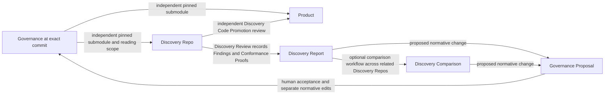

# Governed exploratory development

## Plan status and authorization

**Current execution authorization — 2026-09-15:** the user requested “implement
the next step in this plan.” Chunk 1 is active, through its Milestone 1 review
gate. This supersedes the planning-only status statements retained below as
review history. Chunks 2–10 remain unstarted and require their own authorization.
The authoritative plan has moved to `planning/wip/governed-exploratory-development.md`.
Marketplace commits, pushes and publication remain unauthorized.

[GLOSSARY.md](../../GLOSSARY.md) is authoritative for terminology and explicitly defined relationships. The user authorized repository-wide terminology alignment on 2026-09-14, including this plan and the handoff. Production implementation remains unapproved.

- State: **PLAN — persisted for review; implementation is not authorized.**
- Authoritative plan: `planning/notional/governed-exploratory-development.md`.
- Objective and planning root were confirmed by the user.
- The user confirmed `planning/handoffs/` as the authoritative handoff, replacing the absent `docs/handoffs/governed-exploratory-development/` location named in the original request and root instructions.
- The user authorized creation of this plan only: “do not start implementation until I have reviewed from persisted plan”.
- This document persists the plan and its approved design contracts. Concrete implementation artifacts remain subject to review at their owning chunk's gate; permission to create this file is not approval to execute a chunk.
- No implementation chunk is active. Do not move this plan to `wip`, install dependencies, or modify implementation files until explicitly authorized.
- The latest review prohibits a Python dependency and makes simplicity a standing goal and review metric. Bash is acceptable; any additional tool must address a specific capability and be chosen by the user before it becomes a requirement.
- The user selected Mike Farah’s `yq` for YAML/JSON processing and `jv` from santhosh-tekuri/jsonschema for schema validation. No Python dependency is permitted.
- The user approved the governed-development project-creation Git contract on 2026-09-14: stage approved generated files, create one initial commit in each new Governance/Product repository, and configure their local submodule connection. This capability-specific contract is recorded in R5 and must be carried into production skill instructions. It excludes existing repositories, Discovery creation, later workflows, pushes, hosting, and commits in this implementation repository.
- The user approved separating marketplace Git permissions, capability runtime contracts, and disposable test setup on 2026-09-14. Root guidance now permits test-owned temporary repository initialization, staging, commits, and local submodule relationships, with separate auditing of the workflow under test.
- The user approved common pinned Governance submodules for Product and Discovery, with Curated Governance Reading Scope enforced through agent exclusions, on 2026-09-14. This authorizes the associated plan, glossary, decision, schema, template, and handoff maintenance. R8 records the replacement architecture and its accepted physical-access tradeoff.
- The user requested review and reordering/rebundling of tasks on 2026-09-14. The ten-chunk sequence below replaces the original six-chunk breakdown while preserving behavior, open decisions, milestone scope, and per-chunk review gates. This authorizes plan maintenance only.
- These design and guidance approvals do not authorize starting a chunk or installing dependencies.

## Objective

Implement the capability in this repository, preserving separate Governance, Product, and Discovery Repos.

The first increment comprises the handoff’s first two milestones:

1. Marketplace/plugin skeletons and validation infrastructure.
2. Router-directed project creation of the initial Governance and Product repositories, their Governance submodule relationship, and Local Project Configuration; separately, on-demand creation of a valid local Discovery Repo.

Retain a human review checkpoint between those milestones. Chunk 1 delivers Milestone 1; Chunks 2–4 deliver Milestone 2 with additional focused review gates. The first increment ends at Chunk 4 acceptance. Subsequent lifecycle operations require separate approval.

Success means the single public router can create a new Product/Governance pair
through its project-creation workflow, then independently create a Discovery Repo
when requested. Each workflow conducts its own interview and honors explicit
choices. Project creation does not automatically create a Discovery Repo.
Discovery creation validates its fixed Governance pin and approved reading scope. Simplicity is a
success criterion: minimize setup steps, extra tools, custom mechanisms, and
the amount of code needed to maintain the workflow.

Pushes, hosted repository creation, and duplicated Shimmy bootstrap logic remain
excluded. The approved initial project-creation exception permits only the
staging, initial commits, and local submodule connection recorded in R5 for this capability.
It does not authorize starting implementation or running project creation now.

## Verified implementation inventory

At the planning baseline, the repository contained only root `AGENTS.md` and the handoff. There was no production code, test suite, runtime configuration, or existing plan. The glossary and its companion terminology notes were subsequently authorized as documentation work.

The complete handoff was inspected, including its package README, the six required documents in order, all referenced documentation, schemas, templates, reference layouts, workflow specifications, and open implementation details. Decisions take precedence over lower-level package material.

The following planning checks completed:

| Check | Result |
|---|---|
| Complete handoff inventory and reading | 52 files inspected |
| JSON parsing | All six JSON files passed |
| `git diff --check` | Passed |
| `git status --short` | Clean at the planning baseline |
| Baseline runtime inspection | Python 3.9.6 was available during investigation; this does not establish or authorize a repository dependency. |
| Shell/tool inspection during plan review | Bash 3.2.57, Git 2.50.1, and SHA-256 utilities are available locally. |
| Codex command inspection | No `plugin validate` or `--plugin-dir` command |

These are planning diagnostics, not implementation acceptance tests. This inventory is a verified baseline, not permission to ignore newly discovered dependencies.

Earlier resumed review, 2026-09-14: HEAD was `bb67b2d5b0c007f02ecaae618002e1340bfa9fc5`.
`git diff --stat bb67b2d..HEAD` and the staged diff were empty; the existing
untracked session-resume note was read and preserved (later consolidated into
this plan's Session bootstrap). There are
still no production plugins or tests. The review initially updated only this
plan; the user subsequently authorized root `AGENTS.md` changes, including
separation of marketplace permissions, capability contracts, and test setup.
The source handoff was unchanged at that earlier review. The subsequent user-approved R8 revision updates it, the glossary, and this plan together; production implementation remains unstarted.

Task-sequencing review, 2026-09-14: inspected HEAD `ea64234` with a clean worktree,
root guidance, the current plan, glossary, required handoff documents in order,
relevant workflow/schema/template references, and the repository file inventory.
There are still no production plugins or tests and no applicable child instructions
outside reference templates. This review changes only the authoritative plan.

## Packaging verification and differences

**Keep the reference portable packaging.** Current official documentation supports root `plugin.json`, `$schema`, and `extensions.com.openai.interface`. A `.codex-plugin/plugin.json` overlay is optional; no layout conversion is needed. [OpenAI packaging documentation](https://developers.openai.com/plugins/build/plugins)

Rechecked that portable-root and inline-extension support on 2026-09-14 against
the official page. This is documentation verification, not an installation test;
the earlier app-server invocation has not been revalidated or executed here.

The task-sequencing review rechecked the same packaging rules and the documented
local-install/new-conversation testing flow. This supports bringing the smoke
test forward to Chunk 1; the actual host behavior remains to be verified during
authorized execution. [Local plugin testing](https://learn.chatgpt.com/docs/build-plugins)

The marketplace location, sibling plugin layout, and `skills/<name>/SKILL.md` structure also match current documentation. Internal workflows can remain supporting references beneath the router. [Build plugins](https://learn.chatgpt.com/docs/build-plugins), [Build skills](https://developers.openai.com/plugins/build/skills)

Two tooling differences affect the plan:

- The installed plugin-creator validator targets the compatibility manifest and cannot validate these portable manifests unchanged. Implement documented portable-format checks instead of changing valid packaging to satisfy that validator.
- `PLUGIN_DATA` is documented for hooks; its presence is not established for ordinary skill-launched scripts. Use it when supplied, with an explicit local-storage fallback. [OpenAI hooks documentation](https://learn.chatgpt.com/docs/hooks)

Standalone skill discovery can be checked through the app-server `skills/list` API using additional skill roots. Packaged installation and namespacing require a separate local installation smoke test. [App-server skills API](https://learn.chatgpt.com/docs/app-server#skills)

The documented standalone check starts `codex app-server --stdio`, completes the `initialize`/`initialized` handshake, and calls `skills/list` with the two production skill roots supplied through `perCwdExtraUserRoots`. It does not install the plugins or prove marketplace loading. No `CODEX_HOME` override is required. This check was not executed during read-only planning.

## Target layout and terminology

All implementation paths below are repository-relative.

Abbreviations:

- `P` = `plugins/governed-exploratory-development`
- `S` = `plugins/governed-exploratory-development/skills/governed-development`
- `H` = `plugins/shimmy-onboarding`

These identify exact path prefixes, not additional directories.

Use the [glossary definitions](../../GLOSSARY.md#terminology-index) for domain
terms throughout this plan. **Project Setup** creates the initial Governance/Product
pair, pins Product to Governance's first commit, and saves Local Project Configuration.
**Project Activation** connects an existing pair on a workstation and establishes
or reuses **Local Project Configuration**. Activation does not recreate repositories
or perform Governance Adoption. Missing local configuration alone does not imply
a request for new-project creation. **Discovery Repo** names the
separate exploratory repository, **Discovery Review** names the process, and
**Discovery Report** and **Discovery Comparison** name its written outputs.
The comparison workflow produces the optional separate Discovery Comparison;
charter-required comparison results also belong in the individual Discovery Report.

```text
.agents/plugins/marketplace.json
plugins/
  governed-exploratory-development/
    plugin.json
    skills/governed-development/
      SKILL.md
      assets/
        schemas/
        templates/
      references/
        runtime-contract.md
        workflows/
      scripts/
        governed.sh
        lib/
  shimmy-onboarding/
    plugin.json
    skills/shimmy-onboarding/
      SKILL.md
      references/onboarding-contract.md
scripts/
tests/
docs/
planning/
  handoffs/                 # read-only
  notional/
  wip/
  complete/
```

### Per-repository Governance manifest and metadata layout

Approved on 2026-09-14: keep Governance context in an independent
`governance.yaml` owned by each consuming repository. Each Discovery Repo has
its own record; Product uses its own independent record where needed. This is
not one mutable project-wide record shared by Product and all Discovery Repos.
The Discovery Manifest and other local consumers resolve that repository's
Governance context through a defined location convention.

The Governance record owns source identity, Pinned Governance Revision, and
submodule location; it locates the Discovery's Governance Reading Scope record.
Product's pin retains its separate Adopted Governance Revision meaning. Local
Project Configuration continues to own workstation paths. This metadata is not
another normative authority level, a copy of Governance content, or a replacement
for the actual pinned Git submodule.

Approved on 2026-09-14: use `.governed/` for repository manifests and supporting
artifacts, with the following fixed layout. Create only files applicable to the
repository's role and approved Product Access Mode:

```text
<discovery-repo>/
  AGENTS.md
  .gitmodules
  .governance/                  # pinned read-only Governance submodule
  .governed/
    governance.yaml            # this repository's Governance context
    discovery.yaml             # Discovery Manifest
    reading-scope.yaml         # Governance Reading Scope
    contracts/                 # Contract-aware mode only
      export.yaml
      files/<approved exports>
```

Resolve local context at `<repository-root>/.governed/governance.yaml`, without
searching parent directories or falling back to another repository. Root
`AGENTS.md` directs agents there before Governance body reads. Shared schema
definitions remain packaged with the plugin; `.governed/` holds generated
repository records and approved exports. Product has its own Governance record
without Discovery-only files. Local Project Configuration and recovery journals
remain workstation-local; durable Discovery Reports remain Governance-owned.
Historical approvals and durable reports must retain the context they originally
covered, including when a Discovery Repo is later deleted.

This approved layout and ownership split replace the earlier root manifests
and repeated current Governance fields. Production schemas/templates and role
instructions must emit and consume the paths above together. Protected handoff
assets remain historical adaptation inputs. Cross-document validation follows
the approved R1 creation-completion contract; concrete checks remain implementation work.
Discovery Report context embedding is approved below.

Decision 13 now includes the Git submodule metadata and external reading-scope
record. Contract exports remain Product-derived Conformance Proofs with their own
source identity and file hashes; they live outside the Governance submodule and
gain no Governance authority. No copied Governance content manifest is needed.

`discoveries/` means a directory relative to the Governance repository root. No extra nested `governance/` directory will be introduced.

## Capabilities and dependency choices

**Tool provisioning correction — 2026-09-15:** the user prohibits agent tool
downloads and installation. The subsequent native-tool clarification permits
all existing native tools resolved with `command -v`, including Bash, Git, and
platform utilities; activated Shimmy shims remain eligible too. This supersedes
Shimmy-only restrictions and standalone-binary acquisition and installation guidance
elsewhere in this plan, including temporary validation copies. Selecting `yq`
and `jv` approves their capabilities, not installation by an agent. If a required
tool is unavailable, report it for user provisioning; do not acquire temporary
copies or use ad hoc container execution. Carry this rule into the production
skill, runtime contract, helpers, test instructions, and dependency documentation.
Do not infer an exception from implementation authorization or execution approval.

**No Python dependency.** Remove the earlier Python runtime, package requirements, virtual environment, and Python test-runner proposal. Do not replace them with another general-purpose runtime requirement by default.

Use Bash for straightforward orchestration and tests, Git for repository operations, and existing platform utilities for file operations and hashing. The proposed shell scripts must work with the available Bash 3.2 baseline unless a specific need for a newer version is demonstrated and approved. No external shell test framework is required.

The user approved the following narrow data dependencies:

| Capability | Where needed | Why it is needed | Selection status |
|---|---|---|---|
| Read and write YAML/JSON, including safe string escaping and deterministic output | Governed-development metadata, configuration, templates, and packaging checks | The handoff supplies structured manifests, schemas, and Markdown frontmatter. Text matching is not a reliable substitute for parsing them. | Mike Farah’s `yq` — approved |
| Check data against JSON Schema Draft 2020-12, including the required date/format assertions | Governed-development validation and tests | Preserve the supplied validation contract without writing a schema engine in shell. | santhosh-tekuri/jsonschema `jv` — approved |

Use direct, documented calls to these two tools; do not build a configurable provider framework. Scope the requirement to the governed-development operations and checks that need it; unrelated sibling plugins and reading this repository must not inherit it. Approval of the dependency choices does not start implementation or dependency installation.

Selected tools:

- Mike Farah’s `yq` reads/writes YAML and JSON and is distributed as a standalone binary. Use it for structured-data processing; schema validation belongs to `jv`. [Upstream yq documentation](https://github.com/mikefarah/yq)
- `jv` from santhosh-tekuri/jsonschema validates YAML/JSON against JSON Schema, including Draft 2020-12 and explicit format assertions. Do not impose a Go toolchain on consumers merely because its upstream build uses Go. [Upstream jv documentation](https://github.com/santhosh-tekuri/jsonschema)

During authorized implementation, verify the exact tool identity/version and the required behavior, including duplicate-key rejection, safe handling of values, deterministic output, and offline schema resolution. Record the tested versions and acquisition instructions in `docs/dependencies.md`. Do not silently substitute another tool named `yq` or weaken checks if either selected tool fails a requirement; report the concrete gap. Neither tool has been installed or behavior-tested during planning.

Bash alone is sufficient for much of the workflow. Preserving general YAML handling and the supplied schema contract using Bash alone would require substantial custom parsing/validation code. That would increase maintenance complexity. Do not silently reduce accepted formats, omit schema checks, or claim that grep/sed checks implement JSON Schema. Any deliberate reduction of the handoff’s validation scope requires an explicit reviewed decision.

Initial platform verification targets macOS and Linux. Other hosts remain unverified until tested. Git and available hashing/file utilities are operational prerequisites; a dependency on Python, Node, a compiler, a package manager, or a container engine is not proposed.

## Simplicity goal and metrics

Choose the simplest implementation that satisfies the approved behavior and safety requirements. Simplicity means low total operating and maintenance effort, not just a low count of installed tools.

At each chunk review, report:

| Metric | Review target |
|---|---|
| Additional required tools | Count and name each tool, the exact capability it supplies, and which operations require it. Add none without the user’s choice. |
| Setup steps | Count documented actions needed before the first successful run; avoid automatic bootstrap and unnecessary setup layers. |
| Implementation size | Report production script count and nonblank source lines, explaining material growth. These are comparison signals, not quotas that reward compressed code. |
| Custom mechanisms | Identify any new parser, framework, storage mechanism, or abstraction; prefer existing tools and direct operations. |
| Developer effort | Count avoidable manual steps and repeated questions; preserve the explicit choices required by the handoff. |
| Repeatability | A documented command runs each test group without an extra test framework or manual repository preparation, using the approved disposable test fixtures. |

Start with a small shell entrypoint and a few supporting files. Add modules only for concrete responsibilities, not one module per concept in the handoff. A focused external utility can be simpler than maintaining a custom implementation. Record that tradeoff for the user instead of deciding it silently.

## Recorded design decisions

The following summarize settled handoff constraints and explicitly approved review decisions. Concrete implementation and verification remain pending. Starting implementation still requires explicit authorization. [Unresolved](#unresolved) records no pending design decisions; [Design contracts and review status](#design-contracts-and-review-status) retains the detailed approved contracts.

| Area | Approved behavior |
|---|---|
| Authority | Constitution > Policies > Specifications > Active ADRs. Resolve explicit same-level supersession; surface ambiguous conflicts. Conformance Proofs and operational instructions never become additional normative levels. |
| Simplicity | Minimize setup, dependencies, custom mechanisms, and maintenance effort; report the metrics above at every review. |
| Dependencies | No Python requirement. Bash and Git cover straightforward work; Mike Farah’s `yq` and santhosh-tekuri/jsonschema `jv` are the approved data-processing and validation dependencies. |
| Test fixtures | Root guidance permits initialization, staging, commits, and local submodule setup in test-owned temporary repositories. Audit fixture preparation separately; tests must verify the production workflow's own permissions. |
| Installation verification | Successful local packaged installation, skill discovery, and namespacing remain required by the first-increment gate, now Chunk 4. Rebundling moves the smoke harness and its first required pass to Chunk 1 and repeats it at Chunk 4; broader hardening belongs to Chunk 10. The original R5 requirement was approved on 2026-09-14; checks remain unexecuted. |
| Router | One public governed-development skill routes project creation and on-demand Discovery Repo creation to separate internal workflows. Do not expose those internal modules as a user-facing menu. Project creation never implies a Discovery Repo request. Natural-language routing and recommendations belong in the skill; deterministic helpers validate state and perform filesystem operations. |
| Repository boundaries | Governance, Product, and each Discovery Repo are separate Git repositories. Do not combine them into one repository or replace Discovery Repos with branches or worktrees. This governs this capability's projects, not the architecture of unrelated marketplace plugins. |
| Interviews | One outstanding decision at a time. Persist answers locally with their relevant inputs. Preserve applicable approvals on resume and revisit only affected decisions; explain uncertain applicability before re-asking. Recommendations never populate missing choices. Resumption rule approved on 2026-09-14. |
| Creation decisions | Preserve portable creation decisions and their approval context in `.governed/discovery.yaml` after successful creation: approved choices, relevant inputs, provided rationale, approval dates, and material revisions/exposure. Reference the detailed reading-scope record. Workstation paths and recovery logs remain local. Approved on 2026-09-14; detailed schema adaptation remains R1 work. |
| Initial Governance maturity | Constitution must exist and may begin as an empty placeholder with no constitutional rules until matured Governance is deliberately promoted. Do not turn setup goals into starter rules. Provide non-normative guidance from domain questions through Discovery and promotion. Existence/empty-content distinction approved on 2026-09-14. |
| Local Project Configuration | Store confirmed project paths and a stable, credential-free Governance identity outside repositories. |
| Governance identity | Use the canonical repository URL when established, otherwise a developer-confirmed stable identifier for a local-only repository. Record that identity in provenance; keep workstation checkout locations in local configuration. Approved on 2026-09-14. |
| Governance retrieval | Use an established portable clone URL when available, otherwise a confirmed relative source for local-only projects. Keep absolute paths/local overrides on the workstation. Explain the source, availability, and next action in plain language; guide location repairs without requiring Git configuration knowledge. Approved on 2026-09-14. |
| Data location | Explicit `--data-dir`, otherwise supplied `PLUGIN_DATA`, otherwise `${XDG_DATA_HOME:-$HOME/.local/share}/beeline-technologies/governed-exploratory-development`. Reject storage inside project repositories or the installed plugin tree. |
| Project creation | Create the initial Governance and Product repositories and establish Product's Governance submodule, then save Local Project Configuration. This user clarification supersedes the earlier activation-only assumption. The approved initialization Git contract belongs to this capability's R5 and future skill instructions; chunk execution remains separately gated. |
| Project Activation | Allow ordinary unfinished edits outside the read-only Governance submodule when identity/path/Git checks pass; report and preserve them. Diagnose unresolved conflicts, changed Governance contents, and unexplained pin discrepancies before completing activation. Preserve history/index and never repair automatically. Ordinary-edit handling approved on 2026-09-14; intentional pending-adoption Activation approved on 2026-09-15. |
| Existing files | Seed missing role `AGENTS.md` files once as Materialized Governance. The receiving repository owns them thereafter; they remain subordinate to Governance. Preserve existing files and surface conflicts. |
| Revision selection | Discovery Repo creation interviews for Governance revision, offering the registered Governance checkout's HEAD as the default. Resolve and confirm its exact commit, then freeze that choice. Product's adopted pin remains independent and unchanged. Approved clarification on 2026-09-14. |
| Discovery independence | Discovery creation validates its selected Governance source and its own resulting submodule. It does not inspect or verify Product adoption as a prerequisite, rerun Product activation, or wait for Product commits. Product-derived inputs are checked only when explicitly selected and permitted. Corrected on 2026-09-14 to preserve the accepted independent-pin model. |
| Governance source | Initialize a read-only submodule at the approved exact commit; validate source identity, Git link, checkout, and clean state. Never consume dirty source-checkout content. |
| Git compatibility | Initially support the handoff’s SHA-1 commit format. Reject unsupported object formats explicitly. |
| Governance Reading Scope | Full permits the pinned tree; Curated permits explicit paths and excludes all other bodies across agent transports. Both retain the complete submodule and remain subject to Product Access Mode. |
| Contract exports | Explicit allowlist, source identity, optional source commit, and per-file hashes. No arbitrary Product scanning or inferred exports. |
| Discovery IDs | Governance-owned `discoveries/.reservations/DISC-xxxx.json`; atomic exclusive creation and collision retries. Failed reservations remain consumed; IDs are sequential, not necessarily gapless. |
| Concurrency | Guarantee local uniqueness against the same Governance checkout. Do not claim coordination across independent clones. |
| Recovery | Offer exactly Resume and Roll back after failed/interrupted setup. Explain the failure, show remaining resources, and recommend recovery based on observed state. Preview cleanup before rollback; preserve unexpected edits and report anything retained. Approved on 2026-09-14. |
| Isolation | Policy and workflow guardrails across transports. Detect obvious contamination and surface exposure; make no hard-sandbox claim. |

## Package inconsistencies and proposed handling

The terminology alignment updates the handoff to match the authoritative glossary. The rows below distinguish resolved documentation drift from approved production adaptations that remain unimplemented.

| Finding | Approved production handling |
|---|---|
| Handoff path drift — resolved | Root `AGENTS.md` now names the confirmed `planning/handoffs/` location. |
| Project Setup / Activation scope — clarified on 2026-09-15 | Project Setup creates the initial Governance/Product pair and first pin. Project Activation connects an existing pair on a workstation. The glossary, router and reference workflows now distinguish these activities; neither implicitly invokes Discovery creation or Governance Adoption. |
| Templates permit workstation paths in provenance, conflicting with Decision 29 | Add `governance_repository` to the production configuration model; write that stable identity into Discovery Repo provenance. |
| Contract export location/provenance is unspecified | Use the separate immutable contract namespace and manifest shown above. |
| Governance storage — resolved by R8 | Use Git pin and dirty-state validation; remove copied-tree integrity infrastructure. Validate reading-scope and manifest agreement separately. |
| Concurrency is required but deferred by phase outlines | Implement basic atomic reservations and recovery in the first increment. |
| Inherited-scaffold wording — resolved | The reference layout now explicitly requires minimal creation, including full-reference mode. |
| Full reading scope may allow Product-derived implementation Conformance Proofs | Require compatible Product access or an explicit Curated scope before body reads. Curated excludes reading, not local file presence. |
| Product authority-list drift — resolved | Implementation appears in a separate Conformance Proofs paragraph beneath the four normative levels. |
| Pending proposal metadata drift — resolved | The template uses directory location for pending state; resolution metadata records accepted/rejected outcomes. |
| Discovery Review approval-gate drift — resolved | The reference requires a generated-and-surfaced Discovery Report before independent Discovery Disposition choices. |

## Approved test-fixture approach

A **test fixture** means sample data used by a test: here, a tiny example Governance repository and a tiny example Product repository.

The user approved creating these examples automatically, including their initial Git commits, under a dedicated temporary directory. This keeps the tests repeatable and avoids manual preparation or maintaining prebuilt repository archives.

The 2026-09-14 guidance-separation approval resolved the fixture-staging and
submodule-setup boundary. Root guidance now explicitly permits this test setup.

Only test setup may create these example commits. Before doing so, it must verify that the target repositories are inside its own temporary directory and that inherited Git settings cannot redirect writes to a real repository. Test-only identity and configuration must not modify global Git configuration. Cleanup is limited to files owned by that test run.

Fixture permission does not permit commits in this repository or real Product,
Governance, or Discovery Repos. Tests may configure local submodule relationships
inside their temporary workspace; they must not push or create hosted repositories.
The production workflow under test follows its own contract: initial project
creation may make its approved initial commits, while Discovery creation stages
only its submodule metadata/link, leaves source history unchanged, and creates no
Discovery commit. Test setup and
workflow execution must be distinguishable in the command audit so fixture
commits cannot mask a workflow violation.

## Unresolved

None. R1–R8 and the Shimmy separation boundary are resolved as of 2026-09-15.
Approved decisions remain in [Design contracts and review status](#design-contracts-and-review-status).
Unexecuted verification belongs in the [Progress Checklist](#progress-checklist)
and each chunk's verification checklist. Implementation authorization remains separate.

## Implementation preparation and readiness

Readiness update, 2026-09-15: **all recorded design issues are resolved.**
The plan is ready for implementation authorization, beginning with Chunk 1.
Concrete schemas, templates and checks remain implementation work. External
Shimmy repositories and their bootstrap implementations remain outside this
repository's scope. Implementation has not been authorized.

The following are preparation or implementation tasks, not separate unanswered
user decisions unless completing them exposes a material behavioral ambiguity:

- Translate approved record content into concrete field names/types and schemas.
  Prepare the shared schema contract for Chunk 1 review, preserving approved
  actual-value bindings, explicit replacement, and historical provenance.
- Adapt schema/template producers and consumers to `.governed/`, with current
  Governance context owned once by `governance.yaml`. Protected reference assets
  remain historical inputs; production adaptation belongs to authorized chunks.
- Encode local interview/journal records from the approved resumption/recovery
  behavior; do not seek a new approval for each mechanical field choice.
- Run the already specified `yq`/`jv` canaries and installation/runtime checks in
  their owning chunks. Their unexecuted status is verification work, not an
  unresolved dependency choice or evidence of a tool capability failure.

Prepare concrete shared schemas from the approved contracts and review their
encoding at the assigned gates. No recorded design decision remains pending.
Implementation authorization and chunk acceptance gates remain separate.

## Design contracts and review status

This section retains the R1–R8 contracts, approval records, rationale, and
supporting references. R1–R8 are resolved; concrete schema encoding, implementation
and verification remain work for their owning chunks.
Use [Unresolved](#unresolved) for the current decision status and
[Lessons learned](#lessons-learned) for the history of reviews and corrections.
Neither a recorded approval nor this reorganization authorizes implementation.

| Contract | Implementation owner / verification timing | Approved behavior and tradeoff | Status |
|---|---|---|---|
| R1 — Data pipeline and schemas | Shared formats in Chunk 1; normative metadata in 2, local state in 3, reservation/export and creation integration in 4 | Adopt the constrained metadata profile and cross-document checks below. Broader YAML support would preserve more input flexibility but needs a demonstrated validation mechanism. | Constrained YAML, offline-schema approach, and portable creation-decision content approved on 2026-09-14; basic Charter-objective, calendar-date, and paired predecessor/reason validation approved on 2026-09-14; individual creation-decision record structure approved on 2026-09-14; creation-decision reference/selection rules approved on 2026-09-14; per-repository Governance context, `.governed/` layout, and Discovery Report embedding approved; fixed pin/scope and successor requirement approved; in-place scope revisions withdrawn; creation-completion checks approved on 2026-09-15; R1 resolved; concrete schemas require preparation/review; reference reading-scope schema predates the approved ownership/layout adaptation; tool canaries unexecuted |
| R2 — Authority and selection | Chunk 2; schema shape in Chunk 1 | Classify the complete source tree before selection; reject ambiguous supersession. This can reject a curated source because of invalid excluded metadata, but avoids silently changing authority. | Source-wide authority validation, no reactivation through exclusion, and blocking broken/ambiguous supersession approved; Constitution is required but may have no promoted rules; R8 scope applies to the placeholder too. Content-based classification independent of folder location approved; prompt for missing/ambiguous classification or ignore with a warning approved; minimum Constitution ID/class/title representation approved; detailed supersession checks and initial Git entry/path support boundary approved; R2 resolved, implementation and verification pending |
| R3 — Identity, topology, approval binding | Shared field implications in Chunk 1; setup/local-state encoding in 3; Discovery-specific bindings in 4 | Create the original Governance and Product repositories through project creation; retain Product's pinned submodule and interview for Discovery Governance revision with Governance HEAD as default. Retain unaffected answers on resume. | Initial pair creation, independent pins, source/identity rules, guidance, recovery, decision records, reuse of approvals, and activation with ordinary unfinished edits are approved. Constitution must exist but may start empty; premature rules are rejected. Project Activation during intentional pending adoption and initial README guidance arrangement approved on 2026-09-15; R3 resolved; persisted schema encoding remains preparation work |
| R4 — Allocation | Chunk 4; independent CMPR/GOVP sequences in Chunk 6 | Validate choices before reservation; count reports and consumed reservations. Reserve independent later namespaces. This allows gaps and provides only local coordination. | Allocation after interview approval, no reuse of occupied IDs, gaps, independent sequences, and same-checkout concurrency approved on 2026-09-14; reference-order conflict resolved in favor of approved plan behavior; allocation/occupancy, exclusive reservation, bounded retries and Resume/Roll back semantics approved on 2026-09-15; R4 resolved |
| R5 — Git contracts and packaging gate | Before fixture execution in Chunk 1 and each runtime mutation; installed smoke in Chunk 1 and again by Chunk 4 acceptance | Keep marketplace Git permissions and disposable test setup in root guidance; put initialization permissions in this capability's contract. Require basic installation verification at the first usable increment. | Resolved: Git scope separation, test setup, and first-increment installation gate approved on 2026-09-14; rebundled timing is described in R5; root guidance applied; installation verification unexecuted |
| R6 — Repeat review and retention | Chunk 5 | Preserve human edits and append reviewed report updates; journal finalization; record promotion intentions separately from execution. Archive closes in place; Report + Delete retains selected evidence before manual removal guidance. | Report context embedding, repeated reviews, in-place Archive and Report + Delete retention contract approved; R6 resolved, implementation/verification pending |
| R7 — Proposal resolution and Product handoff | Proposal lifecycle in Chunk 6; code handoff in 7; adoption recovery in 8 | Keep modified proposals pending until revised content is accepted/rejected; perform code promotion in Product context without returning Product knowledge to an isolated investigation. | Proposal resolution, separate Product-scoped handoff, coordinated adoption updates and recovery approved on 2026-09-15; R7 resolved |
| R8 — Common Governance submodules and reading scope | Shared contract in Chunk 1; validation in 2; setup/creation in 3–4; later workflows preserve it | Reuse pinned submodules; enforce Curated scope through agent exclusions over the complete checkout. Native Git checks replace custom Governance hashing. | Approved on 2026-09-14, including locally present excluded files; documentation/reference adaptation authorized; runtime unimplemented |

### R8 — Approved Governance submodule and reading-scope contract

Approved on 2026-09-14: Product and Discovery use read-only Governance submodules
at independently selected exact commits. Decision 16 owns the common mechanism;
Decision 3 is retired. The user accepted the complete Governance checkout in
Curated mode and authorized removing obsolete terminology and machinery from
all documentation and reference assets. Production execution remains unapproved.

**Pinned Governance Revision** identifies the exact commit for either repository.
**Adopted Governance Revision** retains Product's deliberate-adoption and belief-
in-conformance meaning. A Discovery pin establishes a fixed baseline without
that claim. Both the pin and Governance Reading Scope are fixed at creation.
Changing either requires a Successor Discovery Repo, preserving the predecessor's
pin, Charter, scope and prior exposure. A successor may use the same Governance
commit with a different scope; this is a different investigation context.

**Governance Reading Scope** has Full and Curated modes. Full permits artifact
bodies in the pinned tree subject to Product Access Mode. Neither mode authorizes
other Governance commits or history. Curated always allows
the Constitution and records an explicit allow/exclude decision for every tracked
file path. Excluded or unlisted bodies must not enter agent context through file
reads, searches, Git, links, nested instructions, connectors, summaries, or
another agent. These are workflow/agent rules; excluded files remain present.

Write `.governed/reading-scope.yaml` outside the submodule. Obtain source identity,
pin, and submodule location from `.governed/governance.yaml` by convention; the
Discovery Manifest owns the Discovery ID. The scope record owns its mode, reading
decisions, and generating workflow provenance. Historical bindings follow the
approved R1 contract; their concrete encoding remains implementation work.
Record each Curated path's relevance, benefit, reading risk,
exclusion risk, and developer decision. Full records an empty decisions list.
Use exact normalized repository-relative file paths; no globs or implicit directory
expansion. Validate unique paths, source membership, Constitution coverage, and
complete Curated coverage. Do not infer choices or silently fall back to Full.

Read root instructions, manifest, and scope record before any Governance bodies.
Allow only path names and minimal authority frontmatter (ID, title, class,
supersession links) for excluded candidates during interviews and authority
validation. Body exposure cannot be screened by first reading the prohibited body;
unknown exposure requires developer classification before allowing access. A
reading exclusion cannot remove obligations or reactivate superseded artifacts.
Both reading scope and Product Access Mode must permit access. Approved on
2026-09-14: Governance Reading Scope is part of the investigation's Governance
context and is fixed at creation. Adding or removing permitted paths, or changing
Full/Curated mode, requires a Successor Discovery Repo even at the same commit.
There is no in-place scope-amendment workflow. Scope differences do not change
artifact authority or remove obligations, but they change the Governance context
under which the agent investigates. Instruction edits alone grant no new access.

Git supplies the pinned commit and change detection. Check manifest/scope/source
agreement, parent HEAD and index links, checkout commit, and modified, untracked,
or ignored submodule contents. Preserve and surface discrepancies. There is no
custom Governance content inventory, duplicate hashing format, or copy builder.
Contract Exports still require their own approved paths and source/file provenance
under `.governed/contracts/`; they are not stored in the read-only submodule.

**Task-bound responsibility clarified on 2026-09-14:** the agent scaffolds the
Discovery Repo, conducts the requested investigation under its approved context,
and reports the results. It does not continuously monitor the repository or
police end-user actions. No watcher, background service, periodic drift scan,
or guarantee of detecting every external change belongs to this capability.

Existing validation is bounded to the inputs and outputs of the requested
workflow: verify the scaffold the agent creates and the context needed for its
own permitted work. Reading-scope rules govern the agent's access; they are not
an enforcement mechanism against repository owners. Do not introduce extra
monitoring checkpoints merely to detect hypothetical user interference.
If relevant contradictory state is encountered during ordinary task execution,
report its effect on the investigation and avoid unsupported conclusions or
silently treating it as new approval. An inconclusive or interrupted investigation
can still produce a Discovery Report with limitations; discrepancy handling must
not prohibit reporting what is actually known. Exact recovery remains bounded by
the existing workflow contract and authorization.

Apply consuming-repository checks to the workflow's actual subject: Discovery's
own submodule during creation, and Product's during explicit Project Activation or
adoption. They are not a mandate to inspect both consumers during either workflow.

Native submodule initialization needs `.gitmodules`, a staged Governance Git link,
and local submodule configuration. Carry this narrow Discovery creation allowance
into R5 and reference Decision 30; leave all other generated files unstaged and
create no Discovery commit. The staged pin is pending the developer's commit.
Fresh clones need submodule initialization and access to the retained Governance
commit. Source identities remain portable; workstation-specific clone locations
belong in local configuration, with `.gitmodules` using a confirmed portable
source locator. Do not invent a remote or treat a logical URN as a fetch URL.

Official behavior was checked against [Git submodules](https://git-scm.com/docs/gitsubmodules)
and [submodule commands](https://git-scm.com/docs/git-submodule). This was
read-only documentation verification, not execution of a workflow or a Git fixture.

### R1 — Metadata and schema contract

Scope this profile to structured workflow metadata and normative frontmatter,
not arbitrary Governance body text or copied binary files. Require exactly one
UTF-8 YAML document with string mapping keys and JSON-compatible values. Reject
duplicate decoded keys at every nesting level **on original input before
conversion**, anchors/aliases, merge keys, custom tags, and non-string keys.
Comments and ordinary multiline strings remain supported. Require dates and
versions to be strings; schema types constrain numeric values. Do not implement
a YAML parser using shell text matching. If the selected tools cannot enforce
this profile before losing information, stop and report that capability gap.

Package self-contained production schemas with internal fragment references
only. Validate schemas and instances offline, using the validator's bundled
Draft 2020-12 support and explicit format assertions. Reject external references
before resolution; do not fetch schema URLs from instance data. This restriction
was approved during the guided review on 2026-09-14; it is a production design
choice, not an existing handoff requirement. The three basic validation rules
below are approved; concrete schema encoding remains preparation work. R8
separately approves the reading-scope representation.

**Basic manifest validation approved on 2026-09-14:**

- Require `discovery_repo.objective` for the Discovery Charter, distinct from
  its research question and `framing.objective`.
- Validate `created_at` as a real calendar date, using asserted `format: date`
  in addition to its existing date-shape check.
- Require `derived_from` and `successor_reason` to be either both null or both
  populated; a predecessor requires a reason and a reason requires a predecessor.

Carry these rules into the production schema/template and Chunk 1 validation
cases. This approval does not change the protected reference assets or execute
schema tests.

Keep pre-production schema version `1.0`; no migration is required. The earlier
proposal to repeat and compare current Governance fields across every record is
superseded by `.governed/governance.yaml` ownership. Complete the validation
contract around that record, the actual pinned submodule, approved creation
inputs, and references to historical scope. Do not require independent artifact
generation events to have identical workflow versions. Later plugin upgrades
must not compare old provenance against the currently installed version or
rewrite repository-owned files. The creation-completion contract below governs failure/consistency handling;
the superseded duplication proposal is not a default.

Adapt the production Discovery Manifest schema/template to carry the approved
[portable creation-decision record](#approved-portable-creation-decision-record)
under R3 using the individual-record structure approved below. Finalize exact field types in the Chunk 1 schema review, preserving the approved reference/selection rules below. Validation
must bind approvals to the actual approved values and relevant input revisions,
not merely to field names whose values may later change. At creation, final
approved choices must agree with the manifest and referenced reading-scope record;
clearly identified superseded choices remain historical and may differ. Validate
approval dates and references, preserve provided rationale without inventing it,
and reject workstation paths or local recovery data in the portable record.
The creation record and approved scope remain fixed after creation under R8;
changed Governance context belongs to a Successor Discovery Repo. This schema work is planned; the reference schema has not been changed
to implement the newly approved record.

**Individual creation-decision structure approved on 2026-09-14:** store a list
of individual decision records inside the Discovery Manifest. Each record carries:

- A stable decision ID and subject.
- The actual approved value.
- Relevant inputs and revisions considered for that approval.
- The approval date and rationale when the developer supplied one.
- A reference to any earlier decision it replaces.
- Relevant prior exposure, when applicable.

Retain superseded records. For example, changing Product access from Full-reference
to Isolated preserves both decisions and any relevant prior Product exposure;
the later restriction cannot erase knowledge already acquired. Per-file reading
choices remain in the referenced reading-scope record, without duplicating its
full list in the manifest. This structure implements the previously approved
portable history policy; it grants no new access or permission to change a pin.

Accepted tradeoff: focused decision history requires validation to identify the
final applicable decision for each subject. Reference/selection behavior is now
approved below; exact field types remain implementation work for Chunk 1 review. No claim of complete
schema approval or runtime validation follows from these decisions.

**Creation-decision reference and selection rules approved on 2026-09-14:**

- A replacement explicitly references the earlier decision about the same subject.
- Approval records identify the actual inputs considered, including relevant
  revisions and other decision IDs.
- Creation requires one applicable approved decision for each required subject.
- Missing references, replacement cycles, or competing decisions block creation
  until clarified. Dates and list order cannot resolve ambiguity.

For example, conflicting Product-access approvals without a replacement link
require clarification. An explicit replacement preserves the earlier record and
identifies which approval applies, subject to its input bindings remaining valid.
Apply R3's approved resumption behavior when inputs change; retain applicable
answers and revisit affected decisions. This does not authorize automatic repair
or erase prior exposure. The accepted tradeoff is stricter consistency checking
and occasional clarification when records conflict. Exact schema representation
and concrete cross-document checks implement the approved creation-completion
contract below.

Preserve the marketplace mapping explicitly: provenance `Beeline-Technologies`,
catalog name `beeline-technologies`, display name `Beeline Technologies`. They
identify the same distribution boundary in different fields; do not require
literal equality or apply generic case normalization.

Use deterministic UTF-8 YAML/JSON rendering for metadata and safe string
round-trips. Governance byte provenance uses Git; no canonical JSON hashing
standard or Governance content-manifest schema is required. Contract Export
hashes cover the exact approved export bytes independently of Governance.

Chunk 1 canaries must exercise nested/escaped duplicate keys, a second YAML
document, forbidden YAML features, invalid leap dates, unavailable external
references, and safe string round-trips. The selected tools have not been
installed or behavior-tested here. Record exact tested binary versions during
authorized implementation. The basic validation rules above are settled; portable
creation-decision field types, remaining schema encoding, and cross-document
checks remain implementation preparation under the approved R1 contract.

### Fixed Discovery Governance context — approved

Approved on 2026-09-14: the Pinned Governance Revision and Governance Reading
Scope together define the Discovery Repo's Governance context. Both are fixed
when the Discovery Repo is created. A different reading scope is a different
Governance context for the investigation, including when its source commit is
unchanged. Changing either requires a Successor Discovery Repo with a new
Discovery ID, approved Charter/context, predecessor ID and reason.

Example: DISC-0042 uses G1 and may read the Constitution and retry Specification.
To additionally read the timeout Specification at G1, create DISC-0043 with that
expanded scope and DISC-0042 as predecessor. DISC-0042 retains its original scope.
Narrowing permitted reads also requires a successor; retain relevant prior
exposure rather than claiming a new repository erases knowledge already acquired.

The proposed current-scope pointer and list of scope revisions inside one
Discovery Repo are withdrawn. `.governed/reading-scope.yaml` holds that Repo's
single approved scope. Interview choices can still change before creation under
the approved resumption rules; they do not authorize post-creation changes.
Unexpected scope edits must not be treated as new approval or used to broaden
reads. Preserve and surface the discrepancy; the fixed-context contract governs
recovery and successor guidance. A changed pin or scope does not silently create
a successor or authorize its creation.

The remainder of the earlier consolidated R1 proposal was not approved wholesale.
The subsequent creation-completion approval below settles the remaining
consistency/failure behavior against this simpler model. Routine field encoding
remains preparation work. The protected handoff's
scope-amendment wording is superseded for production by this plan and glossary;
reference files remain unchanged and require explicit reconciliation if maintained.

### Creation-completion consistency contract — approved

Approved on 2026-09-15: before reporting successful creation, verify the scaffold
produced by the agent against the approved interview and its own operation records:

- The Discovery Manifest contains the reserved Discovery ID and approved Charter.
- `.governed/governance.yaml` identifies the approved Governance source and pin.
- The created Governance submodule actually contains that exact revision.
- The reading-scope record contains the approved reading choices.
- Creation-decision records describe the actual approved inputs and resolve their
  required references under the already approved decision-selection rules.

A failed check means creation is incomplete. Explain the failed check and follow
the approved Resume/Roll back process; do not invent approval or silently change
choices to make validation pass. R4 preserves reservation ownership and consumed
IDs during that recovery. Do not claim successful creation until required checks pass.

This is validation of the agent's own creation work, not ongoing drift monitoring
or policing of end-user actions. Relevant contradictory state encountered during
an investigation is explained and reflected in report limitations, consistent
with the task-bound responsibility already approved. No periodic audit, automatic
repair or new approval framework follows from this decision. R1 is resolved;
concrete schema encoding and executable checks remain implementation work.

### Approved Discovery Report context embedding

Approved on 2026-09-14: embed important historical context directly in the
Discovery Report. This approval applies specifically to Discovery Reports;
it does not settle the representation of every other historical record.

Preserve the Discovery ID, Governance source identity and exact Pinned Governance
Revision, Discovery Charter, Product Access Mode, and Governance Reading Scope
and relevant prior exposure used for the reported review. Existing report
requirements for Findings, Conformance Proofs, limitations and disposition remain.
Include the scope's approved path decisions and their recorded rationale in the
report or retain detailed supporting scope material durably in Governance; a
link solely into the disposable Discovery Repo cannot preserve that context.
Exact report formatting remains part of the R6 report contract.

The report's embedded context describes the investigation as reviewed, even if
Product later adopts another revision or the Discovery Repo is removed under
Report + Delete. It must remain understandable without the removed repository's
`.governed/governance.yaml`, reading-scope record, or workstation configuration.
Preserve earlier review context when a later review is added. Recording a commit
identifier does not itself guarantee continued access to that Git commit or to
referenced Conformance Proofs; retention must account for those separately.

This is historical provenance, not another editable source of current Governance
context. The repository's current local consumers continue to use its own
`.governed/governance.yaml` by convention. Chunk 5 owns report generation and
retention verification. No source template or production implementation is changed
by this approval.

### R2 — Approved source classification and coverage

Approved on 2026-09-14: validate authority across the entire selected Governance
commit before selection; exclusion cannot reactivate a superseded artifact.
Broken or ambiguous supersession blocks creation even for excluded artifacts.
The subsequent classification, fallback, Constitution, supersession and initial
source-entry decisions below are approved. R2 is resolved; implementing and
verifying its contract remain work for the owning chunks.

Enumerate the entire selected Git commit before curation, including committed
reservation metadata and unknown/supporting files. Approved on 2026-09-14:
classify Governance authority from artifact content, independently of directory
location. Folder structure is a human organizational convenience, not an authority
signal or a prerequisite for normative status. Withdraw the proposed mandatory
class/directory agreement and the rule that artifacts outside designated folders
are necessarily non-normative. Use explicit identifying content where available;
concrete metadata encoding remains implementation work under R1/R2. Missing/ambiguous classification
follows the approved prompt-or-ignore rule below. Operational instructions remain distinct from normative artifacts. Approved on 2026-09-14:
require at least one valid Constitution artifact, while accepting an initial
placeholder containing no constitutional rules. Existence and identifying
metadata are distinct from substantive requirements; do not require starter
clauses to pass validation. The minimum Constitution representation is approved
below; translating it into the production schema/template is implementation work. A missing or malformed artifact is not an empty valid Constitution.
Surface ambiguous or missing authority declarations; paths and filenames cannot
resolve them. Content-based classification must still respect Governance Reading
Scope: minimal identifying metadata may be inspected before selection, while
excluded artifact bodies must not be read to infer their class. The user may need
to classify an artifact when permitted identifying content is insufficient.

**Minimum Constitution representation approved on 2026-09-14:** require a unique
artifact ID, an explicit `class: constitution`, and a title in identifying
frontmatter. A document heading may accompany these fields; no substantive
constitutional rules are required. Location does not establish its authority.

```markdown
---
id: CONST-0001
class: constitution
title: Project Constitution
---

# Project Constitution
```

The ID and title above are illustrative, not mandatory literal values or a new
required ID prefix. Generate a unique artifact ID and appropriate title. Keep
setup/promotion guidance in separate non-normative material; do not add starter
principles, sample rules or TODO requirements to make the placeholder seem full.
A missing artifact or invalid required identifying content does not satisfy the
required Constitution. General classification fallback still applies to other
unclassified material and cannot waive this existence requirement.

**Missing/ambiguous authority classification approved on 2026-09-14:** prompt the
user to classify the artifact. Recommend a class from permitted content when
there is sufficient context; a recommendation is not itself a classification.
If classification is declined or remains unavailable, ignore the artifact as a
source of normative requirements and warn the user. Name the artifact, explain
that its authority could not be established, and identify the resulting limitation
on the investigation. Do not silently classify it, assert that it has no actual
requirements, or treat the omission as proof of complete Governance coverage.

This is an authorized fallback, not permission to read excluded bodies, delete
files, rewrite the pinned Governance source, or waive known requirements. Retain
the classification outcome/omission in creation context and relevant Discovery
Report limitations. A human classification applies to the exact artifact at the
selected commit. The record's mechanical encoding remains schema preparation.
The required valid Constitution must still be present; ignoring the only candidate
does not satisfy that requirement. Existing explicit authority and supersession
conflicts retain their separately reviewed handling.

**Detailed Supersession checks approved on 2026-09-14:** build the normative
ID/supersession graph source-wide. Duplicate artifact IDs require correction or
clarification. Missing targets require resolution. Reject self-links, cycles and
cross-authority-level supersession. Competing replacements require an explicit
relationship establishing which applies, or a later same-level artifact replacing
both; do not choose by date, filename, folder, or reading exclusion. These explicit
relationship problems are not resolved by the prompt-or-ignore fallback for
unclassified material. Surface them during source preparation without silently
repairing the pinned source. Preserve superseded status even when a superseder is excluded.
Derive the source-wide ID/class/relationship index from minimal metadata at the
pinned commit. This validation does not grant access to excluded artifact bodies
or require a duplicate provenance database.

R8 settles coverage semantics: the complete submodule is present in both modes.
Curated records allow/exclude choices for every path, including supporting and
operational files; always allow the Constitution. Full permits the complete pinned
tree only with compatible Product access. Grouping for display cannot conceal
individual Curated choices. Unknown exposure is resolved by the developer before
body reading. R8 and source Decision 20 define the agent reading boundary.

**Initial file-support boundary approved on 2026-09-14:** support ordinary tracked
files in any directory, including names containing spaces or Unicode. Reject
Governance sources containing symbolic links or nested Git submodules, even if
those entries would be excluded from reading. Reject paths that escape the
checkout and names that collide on the target filesystem, such as Policy.md and
policy.md on a case-insensitive filesystem. Explain the unsupported entry during
source preparation without following it, renaming it, or removing it.

This concerns entries inside the Governance source; it permits the consuming
Discovery Repo's own `.governance/` submodule. The accepted tradeoff is predictable
source handling at the cost of requiring preparation for repositories containing
unsupported entries. It introduces no ongoing repository monitoring.

### R3 — Approved identity, topology, and resumed choices

User clarification, 2026-09-14: initial project creation establishes Governance
at its first commit and Product's submodule points to that same commit. Governance
can advance independently while Product retains the older pin. The writable
Governance checkout means that original Governance repository, not an additional
third copy introduced by this plugin. A workflow separate from initial project
creation owns Product releases and must account for the Governance submodule
revision. The existing adoption workflow addresses pin changes; a complete
Product release workflow is not yet specified or approved for implementation.

Discovery Repo creation interviews for the Governance revision with the registered
Governance checkout's HEAD as the default. Present the resolved commit for
confirmation, permit another revision, and preserve the chosen commit even if
HEAD later moves. This never advances Product's pin and does not implicitly fetch
or choose a remote branch's tip. Product G1 with Governance HEAD G2 is an ordinary
supported state, not an inconsistency requiring repair.

**Discovery creation is independent of Product adoption.** The user's
2026-09-14 correction identified an erroneous dependency in the pending-adoption
proposal below. For an already connected project, use the confirmed local
project/Governance configuration and validate the selected original Governance
source directly. Do not revalidate Product's HEAD/index/submodule, require
adoption intent, report its pending state, or wait for a Product commit merely
to create a Discovery. Product's inaccessible checkout or unfinished adoption
does not block an Isolated Discovery with valid independent inputs.

Validate the selected Governance identity/commit, Constitution and authority,
reading scope, destination, reservations, and the new Discovery's own submodule
and metadata. Product state is relevant only to an explicitly selected input,
such as a permitted comparison or Contract Export; validate that input's own
source/provenance, not Product's general adoption readiness. Permission to use
Full-reference access does not itself require scanning Product. First-time
Project Setup and Project Activation retain their separately reviewed contracts; Discovery
does not silently rerun that operation on every request.

Scope resolved by the user on 2026-09-14: the agent's project-creation workflow
creates both initial repositories and their relationship. It is not merely a
activation workflow for an externally prepared pair. Discovery Repo creation
is a separate internal workflow invoked on demand through the same public router.
The plan's earlier activation-only assumption is withdrawn. Git initialization
permissions are approved under the narrow R5 exception; initial Governance content
follows the approved R2/R3 contracts, with metadata validation in Chunk 2 and
concrete setup guidance in Chunk 3. Recovery is approved below. Project Activation remains
available without modifying history or advancing the pin.

Approved on 2026-09-14: confirm a credential-free logical Governance identity
during Project Setup or Project Activation. Use a canonical repository URL when established, or
a developer-confirmed stable identifier (represented as a URN) for a local-only
repository. Record this identity in provenance; keep workstation checkout paths
in local configuration. Moving a checkout does not change its identity. Do not
invent a remote or treat a shared commit alone as proof of repository identity.
Another workstation confirms the same identity during Project Activation. The approved
retrieval rule below separately establishes where Git obtains that repository.

#### Approved Governance retrieval and user guidance

Approved on 2026-09-14: retain the confirmed source identity in
provenance and use a separately confirmed clone location for Git. Use a
credential-free clone URL in `.gitmodules` when an established portable URL is
available. For a local-only project, use a developer-approved relative
source location reflecting a portable project layout, such as
`../payments-governance` for sibling repositories. Keep the actual absolute
checkout path and any local source override in workstation configuration.
Initialize from the registered local Governance source under the approved R5
allowance; do not add an unrequested network fetch or top-level remote.

Git requires the submodule URL and supports relative locations; those locations
resolve against the parent repository's default remote, or its working directory
when no default remote exists. These behaviors were checked against the official
[gitmodules documentation](https://git-scm.com/docs/gitmodules) and
[submodule command documentation](https://git-scm.com/docs/git-submodule).
Validate the resolved source identity and availability of the selected exact
commit before initialization. Moving repositories or adding/changing remotes
requires rechecking retrieval assumptions; never substitute another commit.

If no portable URL or acceptable relative layout can be confirmed, surface the
missing source arrangement before creation rather than recording a machine path,
inventing a remote, or treating a logical URN as a clone URL. A new workstation
must have an available copy of the retained commit and may need an explicit local
override; activation still preserves existing Git state under R5. Do not claim
that verifying a local source proves the portable URL serves the commit. Any
needed existing-repository repair or remote access remains separately directed.

Accepted tradeoff: this supports local-only projects and keeps machine paths out of
versioned files, while requiring a confirmed relative layout or local override
when retrieval conditions differ. No submodule or fixture operations were
executed during review.

The user required understandable, actionable guidance because the explanation
of Git's resolution rules was difficult to follow. Apply this to setup, creation,
resumption, and recovery guidance in Chunks 3–4:

- Lead with the practical result: where Governance will come from, whether the
  required revision is available, and what the user needs to do next. Use the
  project name and an understandable folder location or repository link. Keep
  Git configuration keys and resolution details in supporting diagnostics.
- Use previously confirmed configuration and permitted checks to identify the
  source before asking. Reuse applicable approvals. If input is needed, ask one
  concrete question, such as where the Governance folder was moved; do not ask
  the user to calculate relative URLs or edit Git configuration by hand.
- Distinguish a moved/missing folder, unavailable server or access, wrong
  repository, and missing required revision. Describe the observed problem and
  recommend a specific next step; identify suspected causes as uncertain. Do
  not present every retrieval failure as a request to choose another revision.
- Explain the effect of any proposed repair: which local setting or shared
  source declaration would change, and that a location fix retains the selected
  Governance revision. Preview concrete changes and apply only what the current
  authorization permits under R5; guide separately directed repairs to existing
  repositories. User-friendly handling does not expand Git or network permissions.
- When initialization succeeds from a local source, say that the local source
  was verified. If retrieval from a shared URL is unverified, describe the
  consequence plainly: another computer will need access to a copy containing
  this revision. Never imply that a local check verified a remote source.
- Include short examples in `docs/project-setup.md`,
  `docs/discovery-creation.md`, and `docs/recovery.md`. A useful success summary
  is: "I found this project's Governance in [folder] and verified the required
  revision. Setup can continue." A missing-folder summary is: "I couldn't find
  Governance in [old folder]. If you moved it, tell me its new location so I can
  check it." Include details only when they help resolve the actual problem.

#### Initial Governance correction and promotion guidance

User direction, 2026-09-14: retain a minimal starting point, but do not turn vague
getting-started goals into constitutional rules before understanding their durable
requirements. Premature canonical rules can drive repeated architectural changes
and leave Architectural Sediment. The earlier proposal to draft a starting
Constitution from setup goals is withdrawn. Approval of initial file wording is
not, by itself, a finding that those goals belong at the highest authority level.

Provide a visible trail from current understanding to the appropriate promotion
process. The user explicitly invoked the domain-modeling skill: clarify terms
against the canonical glossary, probe concrete scenarios and edge cases, compare
claims with available implementation/Conformance Proofs, record resolved language
within authorization, and offer ADRs sparingly. That skill does not itself specify
the entire Governance promotion workflow; this capability's report, proposal,
resolution, and adoption contracts supply those steps.

The following content direction is established. The required-but-possibly-empty
Constitution rule is approved below and its minimum ID/class/title representation
is settled in R2; the README guidance arrangement is approved below:

1. **Orient:** explain what is known, what remains uncertain, and where existing
   authoritative requirements come from. Preserve any genuinely established
   obligations supplied by the developer. Label goals, assumptions, and candidate
   meanings accurately; none become requirements merely by being saved.
2. **Clarify and investigate:** guide a user from an unclear term or assumption
   to concrete scenarios, a bounded Discovery Charter, and relevant investigation.
   Keep resolved vocabulary in the canonical glossary and supporting context in
   its assigned location. A vocabulary decision cannot smuggle a new requirement
   into Governance. Create documents lazily when there is content to record.
3. **Preserve what was learned:** link the Discovery Report to Findings and their
   Conformance Proofs, including uncertainty, counterexamples, and failed ideas.
   Do not invent Findings or supporting material during setup.
4. **Propose:** when a change to requirements is warranted, connect the source
   report and supporting material to a Governance Proposal with concrete wording,
   rationale, alternatives, and an appropriate target. Recommendations for further
   investigation or no normative change belong in the Discovery Report or
   Discovery Comparison; a Governance Proposal requests a Governance change.
   A durable behavior may belong in a Specification; a Policy
   governs work; an ADR records a qualifying architectural decision. Constitution
   is reserved for understood foundational commitments, never the default target.
5. **Resolve and consider adoption:** a human resolves the Governance Proposal;
   acceptance requires a Product Impact Assessment and separate normative edits.
   The proposal remains non-normative. Preserve rejection reasons. Governance
   Adoption is a separate Product decision, and existing Discovery pins stay fixed.

For example, "must work offline" begins with clarifying which users, tasks,
outages, and failure consequences matter. A Discovery might investigate editing
saved work without a connection and record reconnection failures. Its report
could support a precise Specification about saved-work editing while leaving
other offline behavior unresolved. There is no automatic promotion to a blanket
constitutional rule. Existing externally established requirements need their
source and scope understood, not an invented experiment to make them binding.

Approved on 2026-09-15: put a short non-normative
"Start here" guide in Governance's `README.md`, reached from the generated role
instructions. It should explain each next step in ordinary language, name the
artifact it produces, and link to available local material and the single public
router. It must not become a new source of requirements. Resolve context/glossary
locations from repository conventions and create them when needed. Create the
required Constitution placeholder, but do not seed empty ADRs, fake reports, or
invented normative clauses. Keep Discovery's minimal
layout unless a separate reviewed change is needed. Links into Governance obey
the reading scope and Product Access Mode; navigation grants no additional access.
Do not make generated guidance depend on a personal absolute skill-install path.

**Approved R2/R3 starting Constitution:** the user clarified on 2026-09-14 that
a Constitution must exist, but may simply be an empty placeholder until matured
Governance has been promoted into it. This replaces the proposal to allow no
Constitution at all. Initial Discovery can proceed with that placeholder after
the normal approval and validation checks; it cannot proceed without the required
Constitution artifact.

"Empty" means no constitutional rules have yet been established. Identification
metadata and a document heading may identify the artifact without supplying
rules; R2 specifies the approved ID/class/title representation. Production schema/template adaptation remains implementation work. Keep explanatory
promotion guidance in the non-normative guide and role instructions. Do not add
sample principles, TODO requirements, or getting-started advice as constitutional
clauses. A missing file, malformed required metadata, or unexplained change to
previously populated content is not silently accepted as an initial placeholder.
Project Activation must not repair those states by replacing content.

R8 still requires Full/Curated coverage of the Constitution path, even while
empty, and the complete submodule stays pinned. The creation record and summary
must describe that starting revision accurately: Constitution present, no
constitutional rules yet. This makes no claim that the project has no other
requirements or is proven conformant; any established Policies, Specifications,
Active ADRs, charter limits, and operational controls retain their roles.

Later constitutional content requires deliberate promotion and separate
authoritative edits with the associated rationale and Product Impact Assessment.
Its new Governance revision does not rewrite creation history or advance existing
Discovery pins. Work requiring that revision follows the successor rule; Product
adoption stays independent. No new authority level or mandatory lifecycle-status
database is introduced by the placeholder distinction.

**Chunk dependency:** basic guidance belongs in Chunk 3 with new-project setup;
report automation arrives in Chunk 5 and proposal/resolution automation in Chunk
6. The guide must distinguish documented manual review steps from available
handlers and never claim unavailable automation completed. Guidance does not
authorize starting later chunks or modifying normative files automatically. Any
change to milestone scope must be explicit. The initial README guide and minimal
Constitution arrangement are approved. Producing their concrete template wording
is implementation work within those constraints, not an open R3 design decision.

#### Existing-project and pending-adoption details

Approved on 2026-09-14: permit activation with ordinary uncommitted edits
outside the read-only Governance submodule when identity, paths, and the relevant
Git relationship validate. For example, an edited Product README does not by
itself require cleanup before activation. Report that existing work and preserve
it; activation is not an assessment of those edits or of Product conformance.
Unresolved Git conflicts, modified consuming Governance contents, and unexplained
relationship/pin discrepancies require diagnosis before activation completes.
The pending-adoption state below was separately approved on 2026-09-15. This policy
avoids unnecessary interruption of normal work while requiring checks to identify
the actual source of a discrepancy instead of treating every edit the same way.

Use the original writable Governance checkout outside Product, distinct from
Product's and Discovery's read-only Governance submodules. Verify logical
identity and commit availability. Project Activation preserves dirty
files and never stages or repairs the relationship automatically. Record three observations separately: Product HEAD gitlink,
Product index gitlink, and checked-out submodule commit.

**R3 pending Product adoption (approved on 2026-09-15, Activation-scoped):** permit explicit
Project Activation while an approved Product adoption is applied
locally but not yet committed. Show the saved Product revision and the pending
revision separately and preserve both. This approved allowance concerns Project Activation and
Product-side adoption handling only. Its earlier extension to Discovery creation
was incorrect and is withdrawn; Discovery requires no pending-adoption check.

After this workflow's unstaged adoption, HEAD and index remain at G1 while the
checkout is G2. Recognize a verified intentional change as pending adoption
rather than silently calling G2 the committed Adopted Governance Revision.
An operation record or explicit developer confirmation must establish adoption
intent; differing commits alone do not prove an approved adoption occurred.
Require the expected source identity, exact commits, and clean submodule contents.

| Product HEAD link | Product index link | Submodule checkout | Approved interpretation |
|---|---|---|---|
| G1 | G1 | G1 | Committed baseline; no pending pin change |
| G1 | G1 | G2 | Approved adoption applied locally and unstaged; pending commit |
| G1 | G2 | G2 | Approved adoption staged by the developer; still pending commit |
| G2 | G2 | G2 | New revision recorded in Product history |

For either pending row, show the state and preserve HEAD, index, and checkout;
the workflow does not stage, unstage, commit, or reset them. Conflicts, unexpected
combinations, unverified intent, or modified submodule files require diagnosis
instead of automatic repair or a guessed state. A completed Git commit alone
is not conformance proof. Unrelated index conflicts remain diagnostic failures.

In an explicit Project Activation/adoption workflow, explain: "Product's saved revision
is G1. Your approved update to G2 is present locally but hasn't been committed."
The accepted tradeoff is permitting activation while making that provisional
Product state visible. Test adoption followed by explicit activation in Chunk
8; establish the Product state interpretation with synthetic inputs in Chunk 3.
Separately verify that Discovery creation does not consult this state or depend
on its verification. Activation recognition and R7's adoption-execution/recovery
contract are separately approved; Chunk 8 implements the latter. Neither approval
performs adoption or certifies Product conformance.

#### Approved interview resumption

Approved on 2026-09-14: preserve previously approved answers that remain
applicable; revisit only decisions affected by changed inputs. Record each
answer's relevant inputs locally and check them on resume and before creation.
If applicability is uncertain, explain the uncertainty and revisit that answer.
The accepted tradeoff is dependency bookkeeping in exchange for fewer repeated
questions without carrying stale approval into creation.

Bind each persisted answer to its project identity and relevant input revisions,
with the destination recorded only in local state. Source-commit changes require
fresh classification and reading-scope approval; retain charter/type/framing answers
unless their inputs changed. Access-mode changes revisit affected reading permissions,
exports and comparisons. Export-byte changes invalidate export approval and
integrity. Destination-only changes revalidate containment, collision and final
creation approval, retaining source and Charter choices. A changed project
identity starts a new interview. Never infer approval from elapsed time or a
recommendation. Revalidate bindings immediately before reservation and writes.

Preserve previous answers and approvals as history when superseded; distinguish
them from the current approved state and identify why a decision needs renewal.
The local interview record describes approved choices; the operation journal
describes attempted/completed side effects. Consult both before continuing so
reusing an approval does not repeat completed work. On successful creation,
retain the portable decision content in the manifest as specified below.
Exact persisted field structure remains schema work; this approval resolves
the resumption behavior. It does not permit changing an existing Discovery pin.

#### Approved portable creation-decision record

Approved on 2026-09-14: retain creation decisions and their approval context in
the Discovery Manifest after successful creation, so they remain understandable
on another workstation and during later Discovery Reviews. The Discovery Manifest
records the Charter, framing and Product access, and obtains current Governance
context from that repository's `.governed/governance.yaml` by convention.
Creation-decision records preserve the actual approved values and input revisions
as historical provenance; they do not duplicate ownership of current Governance context.

- Preserve developer-approved choices, the relevant inputs/revisions considered,
  the approval date, and rationale when provided. Do not invent a reason or
  convert an agent recommendation into developer approval.
- Retain material revisions to those choices, their recorded reasons, and any
  relevant prior exposure. Distinguish superseded choices from the final approved
  creation state; a later access choice cannot erase earlier exposure.
- Reference `.governed/reading-scope.yaml` for detailed per-path decisions rather
  than copying that full list into the manifest. Preserve the scope context used
  at creation for the lifetime of this Discovery Repo; changes require a successor under R8.
- Use portable project/source identities, exact commits, and repository-relative
  artifact references. Keep workstation paths, failed commands, local session
  details, and cleanup progress in local interview/operation records. The
  manifest must remain useful without access to those local records. Summaries
  must respect the approved reading and Product-access boundaries.
- Preserve this as historical creation provenance. Later changes follow their
  own approval rules and must not silently rewrite the creation record. It does
  not authorize subsequent actions, change normative authority, or establish
  conformance.

For example, the record can show that Isolated Product access was approved for
the retry-handling charter under Governance G1, with the provided reason of
exploring independently of Product's implementation. A destination move between
local directories stays in the local session record.

The accepted tradeoff is a larger manifest and additional consistency checks in
exchange for durable decision provenance. Keep the addition within the existing
manifest and reading-scope artifacts; no new top-level file or lifecycle database
is needed. R1 owns the shared manifest schema/template adaptation in Chunk 1; Chunk 3 owns
local interview bindings; Chunk 4 owns generation from that approved interview,
complete cross-document validation, and preservation after successful creation. R1 records the approved individual-record structure and reference/selection rules; exact field types remain implementation work for Chunk 1 review.

#### Approved setup recovery and troubleshooting

Approved on 2026-09-14: offer exactly **Resume** and **Roll back** for failed or
interrupted setup, with substantial troubleshooting support. On a detected
failure, or the next invocation after interruption, explain the failure and
current state before asking for that choice. No destructive cleanup happens
without the user's selection. Closing the session or providing no answer is
not a recovery choice; re-present the two actions when work resumes.

- **Resume:** verify completed work against approved inputs and continue missing
  steps without repeating initial commits or overwriting subsequent edits.
  Identify prerequisites that must be fixed before continuing. Check an
  interrupted step's actual result before retrying; absence of a success message
  does not prove that the step made no changes.
- **Roll back:** show the exact resources to remove or restore, then reverse
  only setup-owned local effects that remain unchanged. A wholly new repository
  containing only setup's initial state may be removed, including its initial
  commit; never reset or rewrite a pre-existing source repository. Check known
  dependent submodules and remove operation-owned dependants first. Preserve
  user changes, unexpected commits, shared repositories, and unclear ownership;
  explain any cleanup limitation and seek revised direction for those resources.

The failure report must help the user act, not merely expose a raw error:

1. **Failure and cause:** identify the failed step, intended result, relevant
   tool error/exit status, and confirmed cause. Clearly label a suspected cause;
   when unknown, give the next diagnostic check rather than guessing.
2. **Current state:** list completed, failed, pending, and uncertain steps;
   identify affected paths, repository/pin/index state where relevant, and local
   configuration changes. Show what remains usable and what setup left behind.
3. **Recovery recommendation:** recommend Resume or Roll back with a specific
   reason, required fixes, expected effect, and limitations. Offer both actions
   even when one needs prerequisites resolved. Preserve developer choice.
4. **Actionable troubleshooting:** provide ordered diagnostic checks and fixes
   appropriate to the actual error, explain what each result would establish,
   and distinguish read-only checks from changes. Do not recommend blind reruns,
   forced resets, weakened checks, or bypassing normal signing/hooks. A recovery
   choice does not authorize unrelated configuration or external-system changes.
5. **Inspectible details:** retain a small local operation report with its ID,
   step/status history, relevant tool versions and diagnostic output, owned
   resources, cleanup progress, and references to the pertinent recovery guidance.
   Link it in the concise summary. Exclude credentials, unrelated environment
   dumps, and content outside the approved reading boundary; do not automatically
   transmit diagnostics. Use the existing operation journal, not another service
   or a separate troubleshooting framework.

Record intended writes and ownership before attempting side effects and reconcile
actual state after interruption. Restore only this operation's local configuration
entries, preserving unrelated entries and user changes. Both recovery actions
must tolerate retries. If rollback fails or is interrupted, retain cleanup
progress, explain what was removed and what remains, and allow another Roll back
selection to continue safely. Never claim a complete rollback while resources
remain. Arbitrary hook or external-system effects are outside the local rollback
guarantee and must be identified if observed.

For Discovery creation, consumed ID reservations remain consumed under R4 even
after its partial directory is removed. Report those small intentional records
separately from leftover working directories. Retain only the compact diagnostic
record needed to explain the outcome, not redundant temporary work trees.

Deliver user-facing recovery guidance with Project Setup in Chunk 3 and extend
it for Discovery creation in Chunk 4. Cover causes such as an
unavailable source commit, conflicting destination, permission failure,
commit/signing/hook failure, submodule mismatch, malformed metadata, and a
failure during cleanup. Examples must connect the observed symptom to evidence,
a fix or diagnostic next step, and the appropriate recovery action. Runtime
recovery behavior and these diagnostics remain unimplemented during this review.

#### Approved local operation journal lifecycle

Approved on 2026-09-15: the Governed Development skill's workflow helpers own
journal creation, updates, completion and requested cleanup. The agent invokes
these helpers during requested operations; no background service or manual journal
editing is required. Journals live at `<data-root>/operations/<operation-id>.json`,
with the existing data-root precedence: explicit `--data-dir`, supplied `PLUGIN_DATA`,
then `${XDG_DATA_HOME:-$HOME/.local/share}/beeline-technologies/governed-exploratory-development`.
Local `projects.yaml` and interview `sessions/` share that data root. None belong
inside Product, Governance, Discovery Repos or the installed plugin directory.

- Before side effects, create the journal with approved inputs and owned resources.
- Update it as operation steps complete; reconcile actual state on interruption.
- Retain recovery information for failed/interrupted operations until recovery or
  explicit abandonment. Do not automatically expire unfinished work.
- On successful completion or completed rollback, remove temporary recovery
  payloads and retain a compact outcome record with useful diagnostics.
- Retain completed outcome records until explicit user-requested cleanup. Cleanup
  removes only completed records; unfinished operations require explicit abandonment.
  Abandoning bookkeeping does not itself undo or authorize deletion of project files.

Repository manifests and Discovery Reports retain durable decisions, provenance
and findings independently of these local records. A journal is operation recovery
bookkeeping, not another authoritative Governance context record. Journal lifecycle
and coordinated adoption updates/recovery are separately approved under R3 and R7.
Concrete schema encoding and lifecycle helpers remain implementation work.

### R4 — Approved allocation and recovery

Approved on 2026-09-14: allocate only after the creation interview is approved;
existing reports and failed reserved attempts keep their IDs occupied, permitting
gaps but no reuse. Comparisons and proposals have independent sequences. Concurrent
allocation protection applies to the same Governance checkout. The allocation,
occupancy and recovery contract below was approved on 2026-09-15. Concrete
encoding and retry tuning remain implementation work; R4 is resolved.

After approved inputs validate, allocate one greater than the maximum occupied
numeric suffix, padded to at least four digits. Occupancy includes committed,
indexed and working-tree reports plus reservations in the registered Governance
checkout. A missing reservation does not make an existing report ID available.
Treat alternate spellings of the same numeric ID as a collision; malformed
reservation contents never free its filename. Report malformed reservations and
preserve them without overwrite. Preserve consumed failed IDs.

Resume verifies and continues the same creation attempt using its reserved ID;
it does not allocate another ID merely because creation was interrupted. Roll back
removes only eligible operation-owned partial artifacts under the approved recovery
contract and retains the consumed reservation. A new independent attempt allocates
a new ID. Detect reservation ownership conflicts without overwriting another attempt.

Use atomic exclusive reservations with bounded collision retries (initially 20,
then safe failure). Recheck destination and report occupancy before finalization.
Reservation contents carry ID, operation ID, portable project/source identity,
commit and creation time, never workstation paths. Local journals own paths and
recovery state. External manual writers and independent clones are outside the
local cooperating-writer guarantee; conflicts must still fail without overwrite.

Implement DISC allocation in Chunk 4. Extend the same allocator in Chunk 6 for
`CMPR-*` under `discoveries/.reservations/`, checking `discoveries/CMPR-*.md`, and
for `GOVP-*` under `proposals/.reservations/`, checking both pending and resolved
proposal directories. Each prefix has its own sequence. Reports reuse their
Discovery Repo's ID. The reference creation workflow now matches the approved
validate-before-reservation order as part of the authorized R8 maintenance.

### R5 — Approved Git contracts and verification gate

Root `AGENTS.md` governs Git actions affecting this marketplace repository and
permits disposable test setup. It no longer defines Git permissions for every
skill's runtime behavior. The following approved contract applies specifically
to governed-development and must be included in its production skill and workflow
instructions when those files are implemented:

> Governed-development workflows do not stage files, create commits, push,
> configure remotes, or create hosted repositories, except that initial project
> creation may stage its approved generated files, create one initial commit in
> each newly created Governance and Product repository, and configure their local
> Governance submodule connection to pin Product to that Governance commit.
> Discovery creation may configure its local Governance submodule and stage only
> `.gitmodules` and the Governance Git link required to initialize that relationship.
> It creates no commit and stages no other generated files. These initialization
> allowances do not apply to existing repositories or later lifecycle operations.
> They permit no marketplace commits, pushes, or hosted repository creation.

The contract does not authorize chunk execution or actual repository creation
during this review. The local submodule source declaration/checkout may require
local Git remote configuration; that is included only in the initialization
allowances for initial Product and Discovery submodule setup. No extra remote is
required on top-level Product, Governance, or Discovery repositories. No Product
remote is added to Discovery. Show staged submodule entries separately from other
unstaged generated files; the native Git pin becomes durable with the developer’s
Discovery commit.
The implementation must preserve normal Git author identity, signing and hook
behavior; a failure is surfaced without bypassing them. Before the initial
Governance commit, present all generated content for developer review, including
the required Constitution, which may initially contain no rules. Do not commit
invented project requirements as placeholder content. R3 distinguishes a valid
empty Constitution from starter rules; setup approval alone does not promote
goals into normative artifacts.
Retried creation must recognize completed initialization and never create a
second initial commit. Detailed interrupted-creation behavior belongs to Chunks 3–4 with each workflow.

Fixture preparation may initialize repositories, stage files, create multiple
commits representing different source revisions, and establish local submodule
relationships in the test run's temporary workspace. Verify containment and
isolate inherited Git settings; do not modify global configuration or real
project repositories. Audit fixture setup separately from the workflow under
test. No fixture execution has occurred during this review.

Approved on 2026-09-14: require successful local packaged installation, skill
discovery, and namespacing verification before the first-increment acceptance
(original Chunk 2, now Chunk 4). The task-sequencing revision moves the reusable
smoke harness and its first required success to Chunk 1, then reruns it at the
Chunk 4 gate. Broad installation hardening belongs to Chunk 10. Report structural
checks, standalone parsing, and installed-plugin
discovery separately. If the host cannot perform the smoke test, report it as a
blocking verification item; structural checks or standalone parsing do not
satisfy this gate. This approval establishes the acceptance requirement; no
installation or verification has occurred during this review.

### Later-chunk prerequisites

**R6 repeated-review contract approved on 2026-09-15:** keep one durable Discovery
Report per Discovery ID, with a new dated section for each Discovery Review under
that Repo's fixed Governance context. Preserve earlier review sections and human
edits. Record changed conclusions explicitly, with their supporting Conformance
Proofs; do not silently rewrite earlier findings to match the latest result.

Generate and surface each review before asking for independent Discovery
Disposition choices, then record those choices in the report and applicable
manifest status. Before writing, check for changes since the report was read and
reconcile rather than overwrite. This is a task-bound write check, not monitoring.
Use the operation journal to reconcile interrupted report/manifest transitions;
retain completed writes, avoid duplicate review sections, and never falsely close
the Discovery Repo. Cancelling a review does not itself change disposition or
delete existing report content. Keep Active remains active. Record promotion
intentions as selected, declined or deferred without claiming unavailable later
handlers have executed. Accepted tradeoff: the report grows while retaining the
history of findings, corrections and decisions.

**R6 Archive contract approved on 2026-09-15:** Archive closes the investigation
and retains the Discovery Repo at its existing location. Record the Archive
choice in the Discovery Report and mark the Discovery Manifest closed. Retain
code, uncommitted work, Git history and access to the pinned Governance commit.
Do not move or compress the repository, change permissions, or create a commit.
Use the approved report/manifest recovery handling; report incomplete closure
when the paired updates cannot finish consistently. Archive means retained but
no longer active, not creation of an archive file.

**R6 Report + Delete contract approved on 2026-09-15:** preserve the Discovery
Report, important historical Governance context and supporting Conformance Proofs
needed to understand its findings. Show the developer what will be retained and
what will be lost; confirm the retention selection. Retain selected supporting
material in Governance and update the report's references. A typical arrangement
is `discoveries/DISC-0042.md` with supporting files in `discoveries/DISC-0042/`.

Record Report + Delete and close the Discovery Manifest only after required
retention work succeeds. If copying or reference updates fail, preserve existing
material and report incomplete retention; do not claim closure or readiness for
removal. Record omitted or unavailable evidence as report limitations. Retention
need not include the entire implementation, and no complete-conformance claim
follows from selecting a subset of supporting material.

After successful retention, provide instructions for the user to remove the
Discovery Repo manually. The agent does not delete it or claim deletion occurred.
The source repository may remain physically present with a closed status pending
manual removal. Apply existing interrupted-write/recovery rules without duplicate
report sections or loss of previously retained material. Keep Active retains
active status. All retention choices remain independent of both promotions.
R6 is resolved; these design approvals do not authorize executing implementation.

**R7 Governance Proposal resolution approved on 2026-09-15:** Modify revises the
proposal and surfaces the resulting wording; it remains pending until explicit
acceptance or rejection of that version. Accept records acceptance of the reviewed
wording, authorizes separate normative edits and requires a Product Impact
Assessment. The proposal remains non-normative. Reject retains the proposal and
supplied rejection reason in resolved records.

Preserve material revisions and supplied rationale. Changed proposal wording
cannot silently inherit acceptance of an earlier version. Explicit combined
instructions such as "change five retries to three and accept it" may authorize
both steps when the resulting change is unambiguous. This does not authorize
unrelated changes or infer Product Governance Adoption. Reuse the existing
conflict-aware writing and operation journal for interruption/retry handling;
never mark an unresolved modification accepted merely to complete the operation.

**R7 Product-scoped promotion handoff approved on 2026-09-15:** conduct Discovery
Code Promotion in a separate Product-scoped work session. Handoff the Discovery
Report, approved source code/design, relevant Conformance Proofs, source identity
and revision, plus applicable scope and exposure history. Inspect Product and
assess integration only in that Product session; recommend Transplant, Adapt or
Reimplement and require developer selection before approved working-tree changes.
Run relevant Product checks and report results/limitations in Product context.

Keep integration findings in Product context. Do not rewrite the original
Discovery Repo or feed Product internals back into its isolated investigation.
Preserve source provenance; a Product adaptation does not retroactively change
what the Discovery demonstrated. Commits, Governance Adoption and retention remain
separate decisions. Preserve existing Product edits and use the owned-change
journal for recovery without blanket resets. No new permission to stage/commit
or change Governance pins follows from promotion approval.

**R7 coordinated Governance Adoption and recovery approved on 2026-09-15:** after
explicit approval of Product's target revision, update both its Governance submodule
checkout and `.governed/governance.yaml` to that revision. Preserve Product HEAD,
index and unrelated edits; neither change is automatically staged or committed.
This replaces the older checkout-only adoption wording.

Record previous affected state and approved target in the local operation journal
before side effects. Resume inspects actual completed steps and finishes missing
steps without repeating completed work. Roll back reverses only unchanged,
operation-owned changes to their previous state. Preserve subsequent user edits,
staging or commits; if they prevent safe recovery, explain and ask for direction
rather than resetting them. Use the approved journal lifecycle and retain incomplete
recovery information.

Report successful local adoption, pending developer commit, only when the submodule
and Governance manifest agree with the approved target. Otherwise report incomplete
adoption. These checks run only while performing/recovering the requested workflow;
no monitoring is introduced. Discovery Repos and their fixed contexts remain
untouched. R7 is resolved; implementation and verification remain unexecuted.

**Shimmy separation boundary clarified on 2026-09-15:** Shimmy repositories,
bootstrap requirements and implementations remain owned by the separate Product.
This repository owns only the independent onboarding plugin's delegation boundary
and optional Project Activation handoff. Do not import, duplicate or investigate
those external implementations to complete this plan. Selecting an external
repository or documenting its installer internals is not an unresolved design
issue here. At an authorized onboarding invocation, follow the supplied
Product-owned instructions; missing instructions require a clear explanation,
not an invented installer. Validate the delegation boundary with controlled fixtures.

## Implementation sequence and ownership

Rebundled on 2026-09-14 at the user's request. The original six chunks mirrored
handoff milestones; subsequent decisions made the original setup/creation chunk
and promotion/adoption chunk too broad for a single implementation review.
The ten chunks below replace that task breakdown. The handoff remains read-only.
This changes delivery order and ownership, not approved behavior or authorization.

### Milestones and dependencies

The first increment still comprises handoff Milestones 1 and 2. Chunk 1 delivers
Milestone 1 and retains its human review gate. Chunks 2–4 divide Milestone 2 into
validated source inputs, operational Project Setup and Activation, and operational Discovery
creation. **The first increment is complete only after Chunk 4 is accepted.**
Chunks 2 and 3 are intentionally partial relative to that increment; neither may
advertise Discovery creation as available. Each chunk has its own acceptance gate.

| Order | Chunk / reviewable result | Implementation prerequisites | Original scope |
|---|---|---|---|
| 1 | Packaging, shared metadata validation, and installed skeleton | Approved R1 shared-schema contract; R5 | Original Chunk 1 plus early installation proof from 2/6 |
| 2 | Governance source, authority, and reading-boundary validation | Accepted Chunk 1; approved R2 contract | Read-only validation portion of original Chunk 2 |
| 3 | Project Setup and Activation with local state, interviews, and recovery | Accepted Chunk 2; approved setup-specific R3 contract | Original Chunk 2, Phase 1 |
| 4 | Independent Discovery creation, reservations, exports, and provenance | Accepted Chunk 3; approved creation-specific R1/R3/R4 contracts | Original Chunk 2, Phase 2; first-increment gate |
| 5 | Successor, Discovery Review, and retention | Accepted Chunk 4; R6 | Original Chunk 3 except separate comparison generation |
| 6 | Discovery Comparison and Governance Proposal lifecycle | Accepted Chunk 5; proposal-resolution part of R7 | Comparison from original Chunk 3; Governance-side part of 4 |
| 7 | Product-context Discovery Code Promotion | Accepted Chunk 5; code-handoff part of R7 | Code-promotion part of original Chunk 4 |
| 8 | Explicit Product Governance Adoption | Accepted Chunks 3 and 6; adoption-recovery part of R7 | Adoption part of original Chunk 4 |
| 9 | Shimmy onboarding delegation | Accepted Chunks 1 and 3; approved Product-owned delegation boundary | Original Chunk 5 |
| 10 | Cross-platform and complete-lifecycle hardening | Accepted Chunks 1–9 | Remaining original Chunk 6 |

The order is the default review sequence, not permission to execute any chunk.
The prerequisite column describes actual code/contract dependencies: code
promotion does not require a Governance Proposal, adoption does not require code
promotion, and Shimmy does not depend on Discovery lifecycle handlers. An explicitly
authorized scheduling change may use those boundaries without changing runtime
permissions. Independent capabilities remain separately installable.

### Why these boundaries

- Test the approved data tools before dependent helpers, and prove installation
  while the packages are small. Move the smoke harness to Chunk 1, then rerun it
  at Chunk 4's first-increment gate. This strengthens the timing of R5's existing
  requirement; it does not replace installed discovery with structural checks.
- Review source-wide authority and access rules before either creation workflow
  uses them. This gives unsafe paths, excluded bodies, fixed commits, and the
  empty Constitution distinction a focused validation checkpoint.
- Deliver each mutating workflow with its own interview, journal, diagnostics,
  recovery, documentation, and Git-boundary tests. Do not make recovery or basic
  concurrency contingent on final hardening.
- Keep the portable creation record and local interview bindings consistent,
  while implementing operation-specific schemas with their first writer and
  reader. Do not build speculative lifecycle state in the skeleton.
- Keep repeated reports and retention together because their durable writes
  must recover coherently. Bundle comparison and proposal resolution around the
  subsequent Governance-owned documents, with independent explicit invocation.
- Separate Product code changes from Product pin changes. Their inputs, access
  contexts, failure recovery, and approval effects differ.

### Shared work and review prerequisites

Chunk 1 owns the strict metadata pipeline, shared manifest/configuration/scope
schemas and templates, test harness, and package/discovery checks. Implement the
approved shared field meanings and cross-document bindings, then review their
concrete encoding at the Chunk 1 gate. Chunk 2
owns normative metadata/Constitution assets and semantic source validation.
Chunk 3 adds local session/operation schemas with their runtime and Project Setup/Activation.
Chunk 4 adds reservation/export schemas with allocation/creation, and completes
cross-document validation against actual generated repositories. Later schema
extensions belong to the first workflow that needs them and must preserve earlier
accepted behavior. Every such change updates its producers, consumers, and tests
together; chunk boundaries do not permit a temporarily invalid format transition.

Helpers are responsibilities, not a mandate for one module per concept. Extend
existing files unless a concrete responsibility justifies separation. Each chunk
updates its router availability, workflow references, help, and relevant docs in
the same change. Future workflow references may be explicit placeholders until
their owner chunk; they must not silently execute historical reference behavior.

R1–R8 are approved. Implement their shared schema implications in Chunk 1,
source validation in Chunk 2, setup/activation and local state in Chunk 3,
creation/allocation in Chunk 4, and later workflow behavior in Chunks 5–8.
Review concrete artifacts and verification at their owning chunk's gate without
reopening settled design decisions.

### Acceptance coverage ownership

Add `docs/acceptance-coverage.md` in Chunk 1 and maintain it at each gate. For each
AT case and the plan-specific checks below, record its owning chunk, executable
test or reviewed agent scenario, result, and limitations. A scripted fixture
cannot by itself prove natural-language routing or behavior across arbitrary agent
transports. Report those scenario reviews separately. Future cases remain pending.
Keep one canonical test per behavior and extend it for new consumers; the table's
recurring AT IDs identify regression coverage, not duplicate suites to build.

| Acceptance cases | First complete coverage owner | Earlier checks / later regression |
|---|---|---|
| AT-001–003 | Chunk 3 | Chunk 1 packaging; Chunk 4 setup-to-creation walkthrough |
| AT-004–008 | Chunk 4 | Chunk 2 source/access validators; Chunk 3 interview primitives |
| AT-009–011 | Chunk 5 | Chunk 4 fixed-pin creation and recovery |
| AT-012 | Chunk 6 | Chunk 5 recommends related comparisons; generation remains unavailable |
| AT-013–015 | Chunk 6 | Chunk 2 authority checks; Chunk 5 report provenance |
| AT-016 | Chunk 7 | Regress independence from Governance promotion |
| AT-017–018 | Chunk 8 | Chunk 3 synthetic pending-adoption activation states |
| AT-019 | Every mutating workflow: Chunks 3–9 | Shared command audit from Chunk 1; applicable R5 boundary in each |
| AT-020–021 | Chunk 9 | Skeleton must not run bootstrap |
| AT-022–024 | Chunk 2 for validation and authority scenarios | Regress with real records/proposals in Chunks 5–8 |
| AT-025 | Chunk 4 | Extend independent namespace contention in Chunk 6; stress in Chunk 10 |
| AT-026–029 | Chunk 5 | Generated instruction ownership starts in Chunks 3–4; integration in 6–8 |
| AT-030–033 | Chunk 4 | Chunk 2 validators and agent scenarios; Chunk 5 prior-review scope preservation |
| All AT-001–033 and plan-specific cases | Chunk 10 completeness audit | No critical workflow check deferred solely to Chunk 10 |

## Progress Checklist

- [x] Read repository instructions and complete handoff.
- [x] Confirm source directory, objective, and planning root.
- [x] Verify current official packaging requirements.
- [x] Remove the Python dependency proposal and make simplicity an explicit goal and metric.
- [x] Choose the YAML/JSON processing and schema-validation tools: Mike Farah’s `yq` and santhosh-tekuri/jsonschema `jv`.
- [x] Record disposable-fixture initialization, staging, commit and local-submodule permissions in root guidance.
- [x] Approve and record the initial project-creation Git contract in this capability's plan, for inclusion in production skill instructions.
- [x] Scope root guidance to marketplace work and explicitly route capability-specific constraints to the applicable plan/contracts.
- [x] Persist proposed plan with explicit user permission, for review only.
- [x] Resolve R5: require successful local installation, discovery, and namespacing by first-increment acceptance; rebundled smoke runs in Chunks 1 and 4, with broader hardening in Chunk 10.
- [x] Resolve R8: common Governance submodules, Curated agent reading rules, and removal of obsolete copied-tree mechanisms.
- [x] Approve R3's portable Governance identity rule: canonical URL when established, otherwise a developer-confirmed stable local identifier; workstation checkout locations remain local configuration.
- [x] Approve exactly Resume and Roll back for setup recovery, with cause analysis, actionable diagnostics, a recovery recommendation, cleanup preview, and an account of retained resources.
- [x] Approve retaining portable creation decisions and approval context in the Discovery Manifest after successful creation; keep paths and recovery details local.
- [x] Approve preserving applicable interview answers on resume and revisiting only decisions affected by changed inputs, with uncertainty explained.
- [x] Approve the Governance source-location policy with practical source/status guidance and guided repairs that do not require Git configuration knowledge.
- [x] Record the user's rejection of premature starter constitutional rules and requirement for guidance from domain understanding through deliberate promotion.
- [x] Require a Constitution while permitting an empty placeholder until matured Governance is deliberately promoted; initial Discovery can use that baseline under normal checks.
- [x] Allow Project Activation with ordinary unfinished edits outside the read-only Governance submodule when relevant checks pass; preserve/report them and diagnose conflicts or Governance discrepancies.
- [x] Correct the accidental Product-adoption prerequisite: Discovery creation uses independent Governance inputs and does not revalidate Product adoption or require its commit.
- [x] Review and rebundle tasks against current dependencies, preserving milestone scope and mapping all acceptance cases to owners.
- [x] Approve R1 basic manifest validation: separate Charter objective, real calendar dates, and paired predecessor/reason values.
- [x] Classify Governance authority by artifact content independently of folder location; withdraw mandatory directory/class matching.
- [x] Prompt for absent/ambiguous artifact classification, or ignore it as a normative input with a user-visible warning and recorded limitation.
- [x] Approve minimum Constitution representation: unique artifact ID, explicit constitution class, and title; substantive rules may be absent, and folder location is irrelevant.
- [x] Approve explicit Supersession checks for duplicate IDs, missing targets, self-links, cycles, cross-level replacements and unresolved competing replacements.
- [x] Approve initial non-normative Governance README guidance, separate minimal Constitution and role instructions, with other documents created when needed; R3 resolved.
- [ ] Implement the approved Constitution and guidance templates and validation cases in their owning chunks.
- [x] Approve individual creation-decision records with stable IDs, subjects, actual values, relevant inputs/revisions, approval dates, provided rationale, replacement references, and relevant prior exposure.
- [x] Approve creation-decision reference/selection rules: explicit same-subject replacement, actual input bindings, one applicable approval per required subject, and blocking ambiguous or invalid references.
- [x] Approve independent per-repository governance.yaml context, consumed by convention; Product and Discovery pins remain independent.
- [x] Approve `.governed/` layout, plugin-owned schema definitions, and workstation-local configuration/journals; align planned generated paths.
- [~] Implement coordinated schema/template/instruction adaptation for the approved layout during the authorized owning chunks. Chunk 1 adds the shared `.governed/` schemas, templates, and role seeds; source classification and workflow-specific producers remain in owning chunks.
- [x] Approve embedding important historical context in Discovery Reports so they remain understandable after the Discovery Repo is removed.
- [~] Implement and review R1 creation-decision field types in Chunk 1 and R3 persisted interview/operation schemas in Chunk 3; complete creation integration in Chunk 4. Chunk 1 now has the portable decision-record schema and binding helper; runtime creation integration remains pending.
- [x] Freeze Discovery pin and reading scope at creation; require a Successor Discovery Repo when either changes, including same-pin scope changes. Withdraw in-place scope revision machinery.
- [x] Resolve R2: approve source classification, fallback, Constitution representation, Supersession checks, and initial file/path support.
- [x] Distinguish Project Setup (initial pair creation) from Project Activation (connecting an existing pair); align glossary and references. Pending-adoption Activation is separately approved below and does not apply to Discovery creation.
- [x] Approve Project Activation during intentional uncommitted Governance Adoption, preserving files/index/history and distinguishing committed from pending revisions.
- [x] Resolve R4: occupied IDs include reports/reservations across committed/index/working state; use exclusive reservation and bounded retries; Resume retains its ID and Roll back leaves it consumed.
- [x] Resolve R1: verify the agent-created scaffold against approved ID, Charter, Governance source/pin, reading choices and decision references; failed checks use Resume/Roll back without invented approval. First-increment design decisions R1–R8 are resolved.
- [x] Approve R6 repeated reviews: one report per Discovery ID with dated review sections, preserved human/history content, explicit corrections, conflict-aware writes, resumable completion and non-destructive cancellation.
- [x] Approve Archive as in-place closure: record disposition and closed status, retain code/uncommitted work/history/pinned Governance, without relocation, compression, permission changes or commits.
- [x] Resolve R6: repeated reviews, in-place Archive and Report + Delete with confirmed evidence selection, durable retention, closed status after successful retention and manual removal guidance.
- [x] Approve R7 proposal resolution: modified text remains pending until accepted/rejected, reviewed wording binds acceptance, explicit unambiguous combined instructions may revise and accept, and rejected/material revision rationale is preserved.
- [x] Approve separate Product-scoped work session for Discovery Code Promotion, with report/source/proof handoff, explicit approach selection, Product checks and no Product-internal feedback into the isolated Discovery.
- [x] Approve workflow-owned local journal lifecycle: create before writes, update during work, retain unfinished recovery, compact terminal outcomes, and clean completed records only on explicit request.
- [x] Resolve R7: proposal resolution, separate Product-scoped promotion handoff and coordinated Governance Adoption/recovery; preserve unrelated work and subsequent developer changes.
- [x] Obtain approval to start implementation — Chunk 1 authorized on 2026-09-15.
- [~] Chunk 1 — Packaging and shared validation; Milestone 1 gate. Production skeleton, shared schemas/templates, explicit unavailable references, Bash pipeline, tests, and review docs are implemented; tool-backed test execution is partial because the Shimmy `yq` wrapper became unresponsive after successful canaries.
- [ ] Chunk 2 — Governance source and reading-boundary validation.
- [ ] Chunk 3 — Project Setup and Activation, interviews, and recovery.
- [ ] Chunk 4 — Independent Discovery Repo creation; first-increment gate.
- [ ] Chunk 5 — Successor, Discovery Review, and retention.
- [ ] Chunk 6 — Discovery Comparison and Governance Proposals.
- [ ] Chunk 7 — Product-context Discovery Code Promotion.
- [ ] Chunk 8 — Product Governance Adoption.
- [ ] Chunk 9 — Shimmy onboarding delegation.
- [ ] Chunk 10 — Cross-platform and lifecycle hardening.

Active state: **WIP — Chunk 1**, authorized on 2026-09-15; acceptance pending.

## Capability domain knowledge

Relocated from the final three sections of `GLOSSARY.md` by user direction.
These relationships, choices, and scenarios belong to
`governed-exploratory-development`; they are not shared marketplace policy or
requirements for unrelated plugins. The glossary continues to define terms.
Approved clarifications in this plan, including R5, govern the contracts below;
implementation authorization and chunk acceptance remain separate gates.

During authorized implementation, carry the applicable invariants and choices
into `S/SKILL.md`, `S/references/runtime-contract.md`, and the internal workflow
references. Map the boundary scenarios to the relevant chunk's acceptance checks
and record coverage or unresolved details at its review gate. Preserve this
material when the plan moves to `wip` and `complete`; relocation does not authorize
implementation or assert that these scenarios have been tested.

### Relationships and invariants



The records and proposals in the diagram live in Governance but remain non-normative. The reusable workflow mechanism operates these relationships from the independent marketplace repository.

1. **Authority is fixed:** Constitution > Policies > Specifications > Active ADRs. Same-level supersession must be explicit; unresolved conflicts are surfaced. Tests, Product code, proposals, records, and `AGENTS.md` add no authority levels.
2. **Recommendations are not choices:** Governance Reading Scope, framing, Product access, and the charter require explicit developer decisions. Curated scope always permits the Constitution and records reading decisions. An earlier explicit choice need not be asked again for the same action.
3. **Initial creation is minimal:** Decision 13 includes only the manifest, reading record, root instructions, Governance submodule and Git metadata, plus approved Contract Exports when selected. Full-reference permits inspection; it does not select an inherited implementation scaffold.
4. **Provenance is stable:** the Discovery Repo's Pinned Governance Revision and Governance Reading Scope stay fixed from creation. Charter and provenance fields should be treated as immutable after coding starts; later Findings belong in durable records. Work requiring a different Governance revision or reading scope uses a Successor Discovery Repo; advancement elsewhere alone does not force continuation or alter the predecessor.
5. **Conformance Proofs survive retention choices:** every Discovery Review generates and surfaces its Discovery Report before Discovery Disposition choices. `active`/`closed` manifest status and the promotion and retention choices within Discovery Disposition are distinct concepts; a surfaced record does not by itself mean the Discovery Repo is finished.
6. **Promotion decisions remain independent:** approving Discovery Governance Promotion can accompany rejecting Discovery Code Promotion, and accepting code can accompany no Governance change. Accepted proposals require a Product Impact Assessment and separate normative edits; they do not automatically change Product or its pin. Neither promotion determines retention or closed status. Governance Adoption remains a separate Product decision.
7. **Access and scope must agree:** a comparison target or Full reading scope cannot waive the Product-access boundary. Version 1 provides policy and workflow guardrails, not a hard technical sandbox.
8. **Repository actions preserve developer control:** governed-development workflows follow the [approved R5 Git contract](#r5--approved-git-contracts-and-verification-gate). Initial project creation may stage approved generated files, create the initial Governance and Product commits, and establish their local submodule connection. Discovery creation may stage only its `.gitmodules` and Governance Git link and configure that local submodule; it creates no commit. Project Activation and later workflows retain their index, commit, remote, and hosting restrictions. Marketplace Git permissions and disposable test setup are governed separately by root `AGENTS.md`. This supersedes the former glossary wording that recognized only the fixture exception.

Sources: [Settled decisions](../handoffs/decisions/DECISIONS.md), [Lifecycle](../handoffs/docs/03-discovery-lifecycle.md), [Persisted review decisions](#recorded-design-decisions).

### Required choices and state distinctions

| Concept | Values and meaning |
|---|---|
| Discovery Type | Architecture Candidate, Spike, Prototype/PoC, Benchmark, Compatibility Check, Adversarial Investigation, or Other. Describes the work, independently of Discovery Framing or access permissions, and does not override the Discovery Charter. |
| Discovery Charter | Developer-approved objective, research question, success criteria, and non-goals. Governs Discovery Repo scope relative to descriptive metadata and remains subject to normative Governance; framing objective is not a substitute. |
| Discovery Framing | Neutral: no imposed optimization bias. Optimize a quality: optimize an explicit quality. Challenge assumptions: challenge assumptions and seek failure modes. Custom: developer-defined lens. |
| Product Access Mode | Isolated: no Product implementation exposure. Contract-aware: approved Contract Exports only, excluding implementation internals and history. Full-reference: Product implementation and history may be inspected from a separate Discovery Repo. These permissions apply across transports; Governance Reading Scope independently constrains Governance reads. |
| Comparison Target | Product, another Discovery Repo, a Discovery Report, a quantitative baseline, or none. Approved comparison dimensions guide evaluation; a target establishes neither ancestry nor access permission. |
| Discovery Report and Discovery Comparison | The report records one Discovery Repo under its `DISC-*` ID, including charter-required comparison results and later disposition choices. The optional separate comparison document draws conclusions across related Discovery Repos under its own `CMPR-*` ID. Both live in Governance's `discoveries/` and remain non-normative. |
| Finding and Conformance Proofs | A Finding states what was learned, under which conditions, and with what limitations. Conformance Proofs provide material supporting or challenging it, including failures and results unrelated to conformance. Neither establishes requirements or certifies conformance. |
| Discovery Code Promotion approach | Transplant: reuse code that fits Product with minimal change. Adapt: reuse selected code with production changes. Reimplement: retain the design or behavior but implement it fresh in Product. |
| Proposal state | `proposals/pending/` → human resolution → `proposals/resolved/`. Resolved metadata records accepted/rejected and optionally a resolving commit. Acceptance leads to separate normative edits. |
| Discovery Repo status | Manifest values are `active` and `closed`. Findings are recorded separately from the original charter. |
| Repository retention within Discovery Disposition | Archive: close the Discovery Manifest and retain the repository in place, including code, uncommitted work, history and access to the pinned Governance commit, without moving or compressing it, changing permissions or creating a commit. Report + Delete: confirm retained/lost material, preserve the report/context and selected Conformance Proofs in Governance with updated references and disclosed omissions, then close only after retention succeeds and provide manual removal guidance. Keep Active: retain active status. Retention is independent of both promotions and follows the approved R6 contract. |

Sources: [Lifecycle](../handoffs/docs/03-discovery-lifecycle.md), [Promotion and adoption](../handoffs/docs/04-promotion-and-adoption.md), [Governance model](../handoffs/docs/02-governance-model.md), [Open implementation details](../handoffs/codex/OPEN-IMPLEMENTATION-DETAILS.md).

### Boundary scenarios

These scenarios exercise the specified model; they are not executed acceptance tests.

| Scenario | Expected interpretation |
|---|---|
| A test passes while its asserted behavior contradicts a Specification. | Surface the Governance inconsistency. Passing Conformance Proofs do not override the requirement. |
| A resolved proposal is accepted, but no normative artifact was edited. | The Governance Proposal remains a non-normative request, with its resolution recording the decision. Acceptance authorizes separate normative edits; moving or accepting the proposal alone did not change requirements. |
| Governance advances from G1 to G2 while a Discovery Repo uses G1. | Preserve the G1 submodule pin and reading scope. Work requiring G2 uses a Successor Discovery Repo with a new ID and predecessor reference; otherwise the investigation may continue at G1. Product may still pin G1 independently. |
| An activated project's Product has an unfinished adoption or is unavailable, while the selected Governance source is available. | Create an Isolated Discovery using its independently approved inputs without inspecting Product or requiring its adoption to be verified or committed. |
| DISC-0043 compares with DISC-0042 but does not continue it. | Record a Comparison Target; do not infer `derived_from` or permission to inspect its implementation. Record charter-required comparison results in DISC-0043's Discovery Report; a separate Discovery Comparison remains optional. |
| Isolated mode is selected with Full reading scope over Product-derived implementation Conformance Proofs. | Require a revised reading scope or compatible Product access before body reads. Curated excludes reading those bodies while the complete submodule remains present. |
| A Discovery Repo fails its success criteria but reveals a missing invariant. | Preserve the negative result and supporting Conformance Proofs. Discovery Governance Promotion may be useful even if Discovery Code Promotion is rejected. |
| A Discovery Report is surfaced and the developer chooses Keep Active. | Preserve the durable record without treating its existence as proof of closed status or immutable final findings. |
| A plugin update includes a new AGENTS template for an existing Product repository. | Repository ownership continues; do not silently replace the existing instructions. |
| Both promotion types are approved, followed by Archive. | Record Discovery Code Promotion, Discovery Governance Promotion, and repository retention independently; neither promotion implies the other or Governance Adoption. |
| A benchmark fails and measures a quality unrelated to requirements. | Preserve its measurements and limitations as Conformance Proofs without claiming successful conformance. |
| A repository edits generated instructions while its Governance pin and reading scope stay fixed. | Instruction ownership does not permit submodule writes, pin changes, broader reading, or overriding requirements. |
| An excluded report exists locally and a broad search would include its body. | Restrict the search to allowed paths before execution; local availability grants no reading permission. |

Read `GLOSSARY.md` and this plan's [Capability domain knowledge](#capability-domain-knowledge)
alongside the following protocol. Inspect context files where present; their absence
does not authorize inventing project requirements.

## Execution protocol

For every chunk:

1. Read `AGENTS.md`, `CONTEXT.md`, every child context on the path to a changed
   file, this plan, and the chunk's target files.
2. Execute only that chunk's scope.
3. Run its verification checklist and record `[x]`, `[ ]`, or `[~]` with notes.
4. Update the cumulative **Lessons learned** block.
5. Summarize changes, tests, failures, uncertainties, and remaining risks.
6. Stop for human review and explicit acceptance before starting the next
   chunk.

Repository paths in this plan are relative to `<repo>` so it remains portable
across workstations and sessions.

## Chunk 1 — Packaging and shared validation

### Goal

Deliver Milestone 1: independently installed plugin skeletons, the strict metadata
pipeline, and shared schemas/templates with repeatable checks. No project or
Discovery creation workflow is operational at this gate.

### Files

Create:

- `.agents/plugins/marketplace.json`, `README.md`, `.gitignore`
- `P/plugin.json`, `S/SKILL.md`, `S/references/runtime-contract.md`
- `S/references/workflows/` — `project-setup.md`, `project-activation.md`, `discovery-repo-create.md`,
  `discovery-repo-successor.md`, `discovery-review.md`, `discovery-compare.md`,
  `discovery-governance-promote.md`, `governance-resolve.md`,
  `discovery-code-promote.md`, and `governance-adopt.md`; explicitly unavailable
  until their owning chunks implement them
- `S/assets/schemas/governance-context.schema.json`
- `S/assets/schemas/discovery-manifest.schema.json`
- `S/assets/schemas/governance-reading-scope.schema.json`
- `S/assets/schemas/local-project-configuration.schema.json`
- `S/assets/templates/governed/governance.yaml`
- `S/assets/templates/governed/discovery.yaml`
- `S/assets/templates/governed/reading-scope.yaml`
- `S/assets/templates/LOCAL-PROJECT-CONFIGURATION.yaml`
- `S/assets/templates/agents/{product,governance,discovery-repo}/AGENTS.md`
- `S/scripts/governed.sh`, `S/scripts/lib/data.sh`
- `H/plugin.json`, `H/skills/shimmy-onboarding/SKILL.md`
- `H/skills/shimmy-onboarding/references/onboarding-contract.md`
- `scripts/check_packaging.sh`, `scripts/check_skill_discovery.sh`,
  `scripts/check_installation.sh`
- `tests/run.sh`, `tests/support.sh`, `tests/test_packaging.sh`,
  `tests/test_validation.sh`, `tests/test_templates.sh`, `tests/test_installation.sh`
- `docs/packaging.md`, `docs/testing.md`, `docs/dependencies.md`,
  `docs/installation.md`, `docs/acceptance-coverage.md`

Root `AGENTS.md` already records source/glossary authority and fixture permissions.
Preserve them; update its authoritative plan link when the authorized lifecycle
move to `wip` occurs. Braces above abbreviate three role directories.

### Implementation requirements and suggested reasoning level

Suggested reasoning: high for data and packaging contracts; medium for assets.
Implement the approved R1 shared-schema contract and field bindings, preserving
the approved R2/R3 behavior. Review concrete encoding and verification at this
chunk's gate; do not reopen settled design decisions.

Run approved-tool canaries first, recording exact `yq`/`jv` identities and versions.
Stop on a capability gap before building dependent helpers. Implement original-input
YAML-profile enforcement, deterministic rendering, safe string handling, unresolved
substitution rejection, schema self-validation, offline references, and asserted
formats. Reject unknown versions from the first loader. Preserve pre-production
schema version `1.0` and the marketplace identity mapping. Document which semantic
checks require the later source/creation validators rather than claiming complete
repository validation from schema validation alone.

Keep portable root manifests and one public governed router. Carry approved R5/R8
boundaries into the runtime contract and role instructions. Skill-owned routing
and recommendations remain agent behavior; shell helpers validate and operate
explicit inputs. Shimmy remains a non-executing skeleton. No dependency installation
occurs without applicable authorization; no new runtime or automatic installer.

Build a disposable-fixture harness with containment, isolated test Git settings,
and separate fixture/workflow command auditing. Add only examples needed now.
Establish structural checks, standalone app-server discovery, and a successful
local packaged installation/namespacing smoke test as distinct results. Keep local
installation changes reviewable and reversible; no marketplace publication.

### Verification checklist

- [ ] Portable manifests, catalog paths, skill metadata, and references validate.
- [ ] One governed public router and the independent Shimmy skill are discoverable;
      unavailable handlers cannot execute or claim support.
- [ ] Reviewed R1 canaries pass: nested/escaped duplicates on original input,
      second YAML document, forbidden features, invalid leap dates, unavailable
      external references, safe string round-trips, and deterministic output.
- [ ] Basic manifest cases require a separate Charter objective, reject impossible
      calendar dates, accept valid leap dates, and reject either predecessor or
      successor reason without the other; both-null and both-populated pairs pass.
- [ ] Generated metadata uses the approved `.governed/` paths; local consumers
      resolve this repository's Governance record without parent-directory search
      or cross-repository fallback. Shared schemas stay in the plugin. Product
      receives no Discovery-only records; Contract Exports use `.governed/contracts/`.
- [ ] Templates satisfy reviewed shared schemas; missing/unknown fields, malformed
      dates, missing substitutions, and unsupported versions fail clearly.
- [ ] Shared creation-decision fixtures preserve approved values, input bindings,
      rationale when provided, dates and history; workstation/recovery data and
      conflicting final choices fail the applicable shared validation checks.
- [ ] Individual decision records retain stable IDs, subjects, actual approved
      values, relevant inputs/revisions, approval dates, supplied rationale,
      replacement references, and prior exposure. A Full-reference-to-Isolated
      history preserves both decisions and exposure; per-file choices remain
      in the referenced reading-scope record.
- [ ] Decision selection requires one applicable approved decision per required
      subject, with actual input/revision/decision bindings. Valid same-subject
      replacement preserves history; missing references, replacement cycles,
      cross-subject replacement, and competing approvals fail clearly. Reordering
      records or changing dates cannot select a winner among ambiguous approvals.
- [ ] Fixture containment and Git auditing cannot redirect setup writes to real
      repositories or global configuration.
- [ ] Standalone skill parsing and actual installed-plugin discovery/namespacing
      each pass and are reported separately. A missing installed test blocks this gate.
- [ ] No protected source/handoff changes, runtime project creation, or Shimmy
      bootstrap execution occurred.

### Partial verification — Chunk 1 review state

Remediation update, 2026-09-16: the reading-scope schema and template-value
transport now have passing focused regressions. See the corresponding entry in
[Lessons learned](#chunk-1-remediation-schema-patterns-and-template-values--2026-09-16)
for exact results, the native-tool clarification, and remaining verification.
The historical checkpoint below does not constitute current milestone acceptance.

- `[x]` Bash syntax checks passed for all new helpers, scripts and tests.
- `[x]` Standalone skill structure passed, and the reversible local package
  namespace smoke passed. `git diff --check` passed after removing one trailing
  space from the pre-existing README edit.
- `[x]` Approved tool identities and focused canaries passed before implementation:
  `yq v4.53.6`, `jv v0.0.0-20260628173800-b0fc661f4939`, duplicate-key rejection,
  document counting, anchor/alias inspection and valid/invalid leap-date checks.
- `[~]` The full packaging, validation and template groups remain unverified.
  They require the selected Shimmy `yq`/`jv` wrappers; those wrappers later
  stopped responding even though escalated read-only `podman info` succeeded.
  This blocks Milestone 1 acceptance because the plan requires tool-backed
  schema and template checks. Repair the selected Shimmy profile/wrapper and
  rerun `bash scripts/check_packaging.sh` and
  `bash tests/run.sh packaging validation templates installation`.
- `[~]` Actual installed-plugin discovery and standalone app-server skill
  discovery remain unrun. The structural check cannot prove host application
  loading or namespacing. This remains a blocking verification item, not an
  accepted deferral.

Simplicity metrics for this partial review: two additional approved tools
(`yq` and `jv`), zero agent-run installation steps, five production Bash
scripts with 393 nonblank lines, one focused data helper rather than a parser
framework, and no new runtime service or storage mechanism. The remaining
developer action is to repair the selected Shimmy wrapper/profile and rerun the
documented checks.

Commands:

```text
bash scripts/check_packaging.sh
bash tests/run.sh packaging validation templates installation
bash scripts/check_skill_discovery.sh
bash scripts/check_installation.sh
git diff --check
```

### Human review gate

Review data-tool capability results, shared formats, package loading, and explicit
unavailable behavior. This is the retained Milestone 1 gate. Record installation
changes and reversal steps, acceptance coverage, and simplicity metrics. Acceptance
does not authorize Chunk 2. Rollback removes only unchanged chunk-owned additions;
preserve existing guidance and documentation.

## Chunk 2 — Governance source and reading-boundary validation

### Goal

Provide tested, read-only validation of a selected Governance commit and a
consumer's pin/reading scope before creation workflows rely on those checks.
Milestone 2 remains partial; no Project Setup, Project Activation or Discovery creation is available.

### Files

Create:

- `S/scripts/lib/git.sh` — exact-commit and repository inspection initially
- `S/scripts/lib/governance.sh` — authority, supported tree entries, scope checks
- `S/assets/templates/GOVERNANCE-ARTIFACT.md` and a minimal initial Constitution
  asset in the reviewed R2 representation
- `tests/test_authority.sh`, `tests/test_governance.sh`, `tests/test_path_safety.sh`

Update `data.sh`, CLI validation entrypoints, shared schemas/templates, role
instructions, runtime contract, and acceptance/testing docs as required by R2/R8.
Keep normative-frontmatter validation in the existing data/source helpers unless
a separate schema demonstrably simplifies it.

### Implementation requirements and suggested reasoning level

Suggested reasoning: high. Requires accepted Chunk 1 and reviewed R2 metadata,
classification, coverage and supported-entry limits, including the Constitution
placeholder. No new authority level or lifecycle-status database.

Validate the selected source identity and exact SHA-1 commit without replacement
objects, dirty-source content, implicit fetches, or consuming unrelated Product
state. Enumerate the committed tree and validate source-wide IDs/supersession
using only allowed minimal metadata for excluded candidates. Classify by artifact
content independently of folders. Prompt for missing/ambiguous declarations or
ignore the unclassified artifact with a visible warning and recorded limitation.
Reject duplicate IDs, broken targets, cycles, cross-level links,
and unresolved competing successors; exclusions cannot reactivate predecessors.

Validate normalized exact paths, supported entries, source membership, complete
Curated decisions, Constitution coverage, and manifest/scope agreement. Full and
Curated retain the complete submodule and both remain subject to Product Access
Mode. Unknown exposure requires developer classification before body reads.
Implement restricted helper reads and matching instructions/scenarios for searches,
Git, links, nested instructions, connectors, summaries, and delegated context.
These guardrails do not claim host-enforced isolation across arbitrary tools.

Distinguish parent HEAD link, index link, checkout commit, source identity, and
modified/untracked/ignored submodule files. Use fixture-created consumers for
these read-only tests; initialization belongs to Chunks 3–4. Callers supply the
actual subject: Discovery validation must not reach into Product. Preserve state
and provide useful diagnostics on discrepancies.

### Verification checklist

- [ ] AT-022–024 validator/agent scenarios pass; excluded superseders remain effective.
- [ ] Duplicate IDs, missing targets, self-links, cycles, cross-level replacements
      and unresolved competing replacements surface without source mutation. An
      explicit same-level relationship or common replacement resolves competing
      replacements; ignoring unclassified material cannot hide a known broken link.
- [ ] Identical authority declarations classify identically in different folders.
      A valid Constitution outside constitution/ satisfies required existence;
      supporting material inside policies/ gains no normative authority from its
      path. Reading-scope coverage still uses actual paths at the selected commit.
- [ ] Missing/ambiguous authority prompts for classification; unresolved or declined
      classification omits the artifact from applied normative requirements with a
      visible warning and recorded limitation. No excluded body read or pinned-source
      edit occurs. Ignoring the only Constitution candidate cannot satisfy existence.
- [ ] A Constitution with a unique ID, explicit constitution class and title passes
      without substantive rules, regardless of folder. Missing/invalid required
      metadata fails; ID/title examples are not imposed as literal values. The asset
      contains no starter rules, sample requirements, or promotion advice as clauses.
- [ ] Ordinary tracked files with spaces or Unicode names pass. Symlinks and
      nested submodules inside Governance fail even when excluded from reading;
      source entries remain unchanged. The consuming `.governance/` submodule
      is permitted. Target-filesystem name collisions fail with specific diagnostics.
- [ ] Dirty source-checkout files never enter the committed input. Unsupported
      formats, symlinks/Git links, path traversal, unsafe Git source/configuration
      and administrative-path indirection, and name collisions fail under the
      reviewed limits without mutation or execution of source-controlled hooks/filters.
- [ ] Full/Curated checks honor Product access; Curated covers all source paths,
      including supporting/reservation files and the empty Constitution.
- [ ] AT-030–033 validators/scenarios reject invalid scope/pin state before body
      access, including indirect reads, ignored files, and edited instructions.
      Actual creation/fixed-scope integration remains for Chunk 4.
- [ ] Minimal metadata checks do not expose excluded bodies, including through
      errors; command audits show no writes, fetches or unrelated Product inspection.

Commands:

```text
bash tests/run.sh validation templates authority governance path_safety
git diff --check
```

### Human review gate

Review authority resolution, permitted metadata reads, scope restrictions,
Constitution assets, and failure diagnostics. Record scenario evidence separately
from scripted tests and the intentionally partial Milestone 2 state. No operation
may rely on silently repaired Git state or claim physical isolation.

## Chunk 3 — Project Setup and Activation, interviews, and recovery

### Goal

Deliver operational new-project creation and Project Activation through
the router, with Local Project Configuration, resumable interviews, and recovery.
This completes the setup part of Milestone 2; Discovery creation remains unavailable.

### Files

Create:

- `S/scripts/lib/files.sh` — containment, exclusive writes, owned recovery
- `S/scripts/lib/interview.sh` — approved answer bindings and resumption
- `S/scripts/lib/project_setup.sh` — new pair creation and existing activation
- `S/assets/schemas/interview-session.schema.json`
- `S/assets/schemas/operation.schema.json`
- `S/assets/templates/governance-README.md` — approved non-normative guide for the new Governance repository root
- `tests/test_local_project_configuration.sh`, `tests/test_interview.sh`,
  `tests/test_project_setup.sh`, `tests/test_project_activation.sh`, `tests/test_recovery.sh`, `tests/test_git_boundary.sh`
- `docs/project-setup.md`, `docs/project-activation.md`, `docs/recovery.md`

Extend `git.sh` with narrow initialization, the router, `project-setup.md`, `project-activation.md`, runtime
contract, CLI, configuration schema/template, role assets, and acceptance docs.
Runtime outputs are local `projects.yaml`, `sessions/<uuid>.json`,
`operations/<uuid>.json`, new Governance/Product repositories, and safe missing
role instructions. Their schema/writer/reader changes ship together here.

### Implementation requirements and suggested reasoning level

Suggested reasoning: high. Requires accepted Chunk 2 and reviewed setup-specific
R3 contract; session/journal encoding implements approved bindings, existing
relationship diagnostics, and pending-adoption interpretation during Project Activation. R5 is
already approved; implement its boundary without reopening permissions.

Resolve local data storage using the approved precedence; reject repository/plugin
storage and preserve unrelated configuration entries. Bind interview answers to
project identity and relevant inputs. Ask one decision at a time, honor rejected
recommendations, retain applicable approvals, and explain uncertain applicability.
Keep intended/completed side effects in an ownership-aware journal distinct from
the answer record. Apply the approved local journal lifecycle, keeping unfinished
recovery information and compacting completed/rolled-back operations. Completed
outcomes remain until explicit cleanup. Recheck actual state before retrying an
interrupted step.

For a new project, confirm destinations, identity and portable Governance source
locator; present all generated content before initialization. Create the required
Constitution, possibly with no rules, and non-normative guidance from domain
clarification through investigation and deliberate promotion. Make only the
approved initial Governance and Product commits and their local submodule
connection; Product starts at that Governance commit. Preserve normal identity,
signing and hooks. Save configuration after validating the pair. No Discovery
Repo, invented requirements, top-level remote, push or hosted repository results.

For Project Activation, preserve history/index/pins and existing instructions;
seed missing instructions only when safe. Permit ordinary unrelated edits;
diagnose conflicts, dirty Governance contents and unexplained pin relationships.
Activation cannot repair by entering the new-project initialization exception.
Implement the reviewed pending-adoption interpretation with synthetic fixture
states; generating adoption updates remains Chunk 8. Keep this Product-scoped
check out of the future Discovery creation preflight.

Deliver exactly Resume and Roll back, previews, step/cause diagnostics and compact
local operation reports under approved R3 recovery. Resume recognizes completed
commits and user edits. Rollback removes/restores only unchanged operation-owned
local effects, considers dependants, preserves unexpected work, and journals
interrupted cleanup. Both tolerate retries. Explain source locations, missing
commits, local-versus-remote verification and guided repairs in plain language.
Guide later lifecycle steps as manual/unavailable until their handlers exist.

### Verification checklist

- [ ] Router distinguishes initial Project Setup from existing-pair Project
      Activation. Missing configuration routes an existing pair to Activation;
      repeated Activation reuses valid configuration without recreation or adoption.
- [ ] AT-001–003 and setup-specific AT-006/019 pass, including reviewed natural-
      language routing and the absence of a workflow-name menu.
- [ ] Storage precedence/containment, idempotence and independent workstation
      configuration pass; no portable metadata contains local paths or credentials.
- [ ] Initial Governance README explains requirements, Discovery Charter/Repo,
      Discovery Report with Findings/Conformance Proofs, Governance Proposals and
      separate Governance Adoption. It links available artifacts/public routing,
      labels manual/unavailable handlers honestly, and adds no normative clauses.
- [ ] New pair creation yields one initial commit per repository, Product's exact
      submodule link, reviewed empty/populated Constitution content and no Discovery.
- [ ] Activation with intentional pending adoption succeeds when source identity
      and the existing relationship validate and Governance contents are clean.
      Existing approval or user confirmation establishes intent. Both unstaged and
      developer-staged pending states preserve files/index/history; the summary
      distinguishes committed and pending revisions without claiming conformance.
- [ ] Existing activation preserves ordinary staged/unstaged edits and role
      instructions; conflicts or unexplained Governance state produce diagnosis,
      never repair. Reviewed pending states preserve HEAD, index and checkout.
- [ ] Changed inputs revisit only affected answers; unchanged answers resume at the
      first unanswered decision; superseded decisions retain history. Saved approval
      cannot repeat completed side effects or approve a changed destination.
- [ ] Journals are created before side effects, updated by workflow helpers and
      stored only in the configured local data root. Failed/interrupted operations
      retain recovery data; terminal operations remove temporary recovery payloads
      and keep compact outcomes. Requested cleanup preserves unfinished operations
      absent explicit abandonment and never removes durable repository records.
- [ ] Missing/moved source, unavailable commit, destination/permission failure,
      signing/hook failure and malformed metadata produce evidence-based guidance;
      repairs do not bypass protections or silently change source identity/pin.
- [ ] Fault injection before/after each creation write or commit verifies exactly
      Resume/Roll back, owned-resource previews, retry safety, uncertain-step
      reconciliation, partial rollback and preservation of subsequent user changes.
- [ ] Command audits separate fixture commits from workflow commits and exclude
      existing-repository initialization, global configuration changes and publishing.
- [ ] Non-normative guidance supports investigation and promotion without making
      goals constitutional rules or claiming unavailable automation has run.

Commands:

```text
bash tests/run.sh local_project_configuration interview project_setup project_activation recovery git_boundary path_safety
bash scripts/check_packaging.sh
git diff --check
```

### Human review gate

Review the complete setup walkthrough, generated pair/configuration, staged and
unstaged summaries, interview history, and failure/rollback demonstrations.
Record setup-specific recovery evidence and installation-doc updates. Discovery
creation is still intentionally unavailable; setup acceptance cannot stand in for
the first-increment acceptance in Chunk 4.

## Chunk 4 — Independent Discovery Repo creation

### Goal

Complete Milestone 2 and the first increment: independently create a valid minimal
Discovery Repo from registered Governance inputs, with safe reservations, exports,
portable decisions, resumed access rules, and verified packaged routing.

### Files

Create:

- `S/scripts/lib/discovery_repo.sh` — DISC allocation and minimal creation
- `S/assets/schemas/id-reservation.schema.json`
- `S/assets/schemas/contract-export.schema.json`
- `tests/test_ids.sh`, `tests/test_discovery_repo.sh`, `tests/test_concurrency.sh`
- `docs/discovery-creation.md`

Extend interview/files/Git/Governance helpers; manifest and scope assets/validation;
router, `discovery-repo-create.md`, runtime contract and CLI; recovery, Git-boundary,
installation and path-safety tests; relevant docs. Runtime outputs include consumed
Governance reservation files and the Discovery Repo in the target layout.

### Implementation requirements and suggested reasoning level

Suggested reasoning: high. Requires accepted Chunk 3 and reviewed R1/R3 creation
record/binding details, R4 reservation storage/retry/recovery, and export provenance.
Reuse the accepted source validators and setup state/recovery primitives.

Run only on a Discovery request. Interview for and freeze the exact Governance
commit, offering the original Governance checkout's HEAD as the default. Obtain
explicit scope, type, framing, access mode, Charter, optional comparison target
and dimensions. Curated makes every path decision explicit; recommendations never
supply missing approvals. Revalidate affected bindings before reservation/writes.

Use confirmed Governance inputs directly. Do not rerun Project Setup or Project Activation, inspect
Product adoption/status/index or require Product availability. Product access
occurs only for an explicitly selected permitted input, whose own provenance is
validated. Permission for Full-reference is not a request to scan Product.

After approved inputs validate, reserve DISC IDs atomically from report/reservation
occupancy under R4, with bounded retries and final collision checks. Keep failed
IDs consumed. Initialize a separate local repository without inherited templates;
initialize the complete Governance submodule at the approved commit. Stage only
`.gitmodules` and its Governance Git link; create no Discovery commit. Disable
replacement-object interpretation and implicit fetches. Generate other files
unstaged outside `.governance/`; copy only explicitly approved Contract Exports to
`.governed/contracts/` with source identity, optional commit, and exact-byte hashes.

Generate portable creation decisions from the approved interview; validate their
agreement with manifest, reading record, reservation and instruction provenance.
Keep local paths/recovery logs local. Preserve original creation scope, superseded
choices and exposure history. Enforce the recorded scope on resume despite edited
instructions. A Governance revision or reading-scope change requires a successor,
unavailable until Chunk 5; explain that boundary without changing the predecessor.
Pre-creation interview resumption still revisits only affected choices. No migration silently rewrites pins, owned instructions or provenance.

Extend exactly Resume/Roll back and diagnostics to Discovery initialization,
reservation and export failures. Detect actual completed steps before retry;
preview cleanup, retain consumed IDs and preserve user edits. Rerun actual local
installation/namespacing and demonstrate Project Setup followed by a separately
requested Discovery through the installed single router.

### Verification checklist

- [ ] AT-004–008, Discovery-specific AT-019, AT-025 and AT-030–033 pass;
      regress authority/ownership cases AT-022–024/029 in generated repositories.
- [ ] Full and Curated yield the same complete Governance checkout and distinct
      approved scope; excluded bodies stay out of agent context across reviewed
      transports. Missing choices never become defaults.
- [ ] With established configuration, Isolated creation succeeds with inaccessible
      Product, pending adoption or unrelated conflicts; command audit proves no
      Product status/adoption inspection. Explicit exports/comparisons check only
      their approved inputs and access scope.
- [ ] Source/destination problems give practical diagnostics without silent pin
      changes, network fetches or unapproved Git mutations. Dirty source content
      is unused; dirty/untracked/ignored Discovery submodule content blocks reliance.
- [ ] Empty Constitution succeeds with accurate provenance and Curated coverage;
      absent/malformed/excluded Constitution fails. Existing obligations and
      source-wide supersession remain effective.
- [ ] DISC occupancy includes existing reports without reservations, committed/
      indexed/working state, alternate numeric spellings and consumed failed IDs;
      malformed reservations do not free IDs. Concurrent requests yield unique
      IDs or safe failure without overwrite or unreported partial directories.
- [ ] New Discovery HEAD is unborn; only submodule metadata/link are staged;
      there is no Product remote or inherited scaffold, including Full-reference.
- [ ] Export allowlists, byte hashes and source provenance validate; changed bytes
      invalidate approval. No arbitrary Product scan or inferred export occurs.
- [ ] Completion validates reserved ID, Charter, Governance declaration/actual
      submodule pin, reading choices and approval references against approved inputs.
      Injected mismatches report incomplete creation and enter the approved recovery
      process; no silent approval rewrite or periodic drift monitor is introduced.
- [ ] Portable choices, bindings, rationale, dates, superseded decisions and prior
      exposure survive without workstation session files and agree with final inputs.
- [ ] Resume preserves the fixed creation pin and scope; edited instructions or
      scope files grant no additional access. Before creation, changed interview
      inputs renew only affected approvals. After creation, changed pin or scope
      requests require a successor; the unavailable handler cannot execute before
      Chunk 5. Prior-review preservation receives integration coverage in Chunk 5.
- [ ] Allocation counts committed, staged and working reports/reservations; failures
      leave IDs consumed. Same-checkout competing attempts cannot claim the same ID.
      Collision retries stop at their bound with an explanation. Resume keeps its
      owned reservation; Roll back retains it. Malformed reservation contents warn
      without freeing or overwriting the ID. Independent clones are not coordinated.
- [ ] Fault injection covers reservations, partial submodule setup, metadata/export
      writes and cleanup; repeated Resume/Roll back preserves user edits, retains
      consumed IDs, avoids duplicated effects and reports remaining resources honestly.
- [ ] Installed router completes new-project setup then a separate Discovery
      request. Basic installation/discovery/namespacing passes for both plugins;
      unavailable or failing verification blocks first-increment acceptance.

Commands:

```text
bash tests/run.sh ids governance discovery_repo concurrency interview recovery git_boundary path_safety
bash tests/run.sh
bash scripts/check_packaging.sh
bash scripts/check_installation.sh
git diff --check
```

### Human review gate

Review the generated tree, exact staged/unstaged state, approved interview and
portable provenance, failure recovery, negative-access evidence, installation
results and complete first-increment coverage. Apply R5's distinct initialization
allowances. This is the original setup-and-creation milestone gate, now Chunk 4.
Acceptance leaves all later lifecycle operations separately gated.

## Chunk 5 — Successor, Discovery Review, and retention

### Goal

Continue at a new Governance revision without changing the predecessor, and
preserve a durable Discovery Report before independent disposition/retention.

### Files

Create `S/scripts/lib/lifecycle.sh`, `S/assets/templates/DISCOVERY-REPORT.md`,
`tests/test_successor.sh`, `tests/test_discovery_review.sh`, and
`docs/discovery-lifecycle.md`. Update successor/review workflow references,
router, CLI, validation, operation records and recovery tests/docs.

### Implementation requirements and suggested reasoning level

Suggested reasoning: high. Requires accepted Chunk 4 and the approved R6 repeated-
review, human-edit, cancellation, durable-write and in-place Archive contracts.
The Report + Delete retention contract is also approved; R6 behavior is settled.

Reuse creation for successors when either the Governance pin or reading scope
changes, with explicit predecessor and reason. A scope-only successor may retain
the same Governance commit. Preserve the predecessor's Charter, pin, scope,
contents and history; retain relevant prior exposure. A Governance advance alone
does not require a successor when current work can continue at the old revision.

Generate and surface the durable report before any Discovery Disposition choices;
no extra report-approval gate is implied. Include charter-required comparison
results, Findings, Conformance Proofs, failed outcomes and uncertainty. Preserve
human edits and append a new dated review section under the approved repeat-review
contract. Explain corrections with their supporting Conformance Proofs rather than
overwriting earlier conclusions. Journal
report/manifest transitions so an interrupted write cannot lose decisions or
falsely close a repo. Bind reviews to the scope/exposure context used then;
successor creation cannot rewrite those records or creation provenance.

Embed important historical context under the approved Discovery Report contract:
source identity and exact Governance pin, Charter, Product access, scope and prior
exposure. Retain detailed supporting scope material in Governance when it is not
embedded. The report cannot depend solely on the disposable repository's current
metadata or local workstation state for its historical meaning.

Record Governance promotion, code promotion and retention independently. Keep
Active stays active. Archive closes in place under the approved contract, keeping
code, uncommitted work, history and access to the pinned commit. Record its report
disposition and closed manifest status consistently without relocation, compression,
permission changes or commits. Report + Delete presents retained/lost material for selection confirmation,
preserves the report/context and selected Conformance Proofs in Governance, and
updates references. Record disposition and close the manifest only after required
retention succeeds, disclosing omitted/unavailable evidence. Offer manual removal
guidance; do not delete the repository or claim deletion occurred.
Recommend a related comparison when useful, clearly stating that separate CMPR
creation arrives in Chunk 6. Likewise record promotion intentions without claiming
Chunks 6–8 executed. Ordinary report comparison analysis remains available here.

### Verification checklist

- [ ] AT-009–011, AT-019 and AT-026–029 pass; predecessor remains unchanged.
- [ ] Successor cases cover a changed pin, same-pin expanded scope, same-pin
      narrowed scope, and Full/Curated changes. Each receives a new Discovery ID
      and approved context; predecessor scope/pin remain fixed and prior exposure
      is retained. No in-place scope revision or current-scope pointer is generated.
- [ ] Every review surfaces its report before disposition, preserves subsequent
      independent choices and charter-required comparison results, and keeps
      selected active work active. Negative/unrelated results remain Conformance Proofs.
- [ ] Repeated reviews append dated sections in the same DISC report; changed
      conclusions name the earlier finding and supporting Conformance Proofs.
      Cancelling preserves existing report content and disposition.
- [ ] Repeated review preserves human edits, prior review scope and exposure;
      concurrent edits/cancellation and interrupted report/manifest writes reconcile
      without overwrite, duplicate review sections or premature retention/status changes.
- [ ] A retained Discovery Report identifies its Governance source/pin, Charter,
      Product access, reading scope and relevant prior exposure after the test-owned
      Discovery Repo and local configuration become unavailable. Any supporting
      scope references still resolve in Governance. Later Product adoption or
      subsequent reviews cannot alter the earlier report context.
- [ ] Archive records the choice and closed status while retaining original location,
      code, uncommitted work, history and pinned-commit access. No move, compression,
      permission change or commit occurs. Interrupted report/manifest updates are
      reported as incomplete closure and reconcile without false success.
- [ ] Local Archive retains implementation/history and pinned-commit access;
      Report + Delete retains durable knowledge and performs no automatic deletion.
- [ ] Report + Delete shows retained/lost material and obtains selection confirmation;
      selected Conformance Proofs and report references remain available in Governance.
      Failed retention leaves closure incomplete and preserves existing material.
      Successful retention records closed status and manual removal guidance without
      deleting the repo or claiming deletion; omitted evidence is disclosed.
- [ ] Promotion intentions and comparison recommendations cannot invoke unavailable
      handlers or imply Governance Adoption. Later plugin versions preserve ownership.

Commands:

```text
bash tests/run.sh successor discovery_review recovery git_boundary
bash tests/run.sh
git diff --check
```

### Human review gate

Review successor causality, repeat-review recovery, generated report, disposition
ordering and retention evidence against the approved R6 contract. Record verified
outcomes and obtain chunk acceptance before moving to Governance document workflows.

## Chunk 6 — Discovery Comparison and Governance Proposals

### Goal

Produce optional cross-Discovery synthesis and complete the Governance-owned
proposal path from pending request through human resolution and separate normative
edits. Neither operation requires the other to be selected.

### Files

Create `S/scripts/lib/proposals.sh`, `S/assets/templates/DISCOVERY-COMPARISON.md`,
`S/assets/templates/GOVERNANCE-PROPOSAL.md`, `tests/test_discovery_comparison.sh`,
`tests/test_proposals.sh`, and `docs/promotion-and-adoption.md`. Extend lifecycle
comparison handling, the allocator, normative assets, runtime/validation/journal
helpers, the three comparison/proposal/resolution workflow references, router,
CLI and acceptance/recovery docs.

### Implementation requirements and suggested reasoning level

Suggested reasoning: high. Requires accepted Chunk 5 and the approved R7 proposal-
resolution contract, including revised-content acceptance, preserved human edits
and conflict-aware interrupted multi-file writes. Reuse the report/journal behavior; do not add a lifecycle database.

First add optional CMPR generation from explicitly selected reports/dimensions,
retaining provenance, uncertainty and each Discovery's disposition. Then add
proposal generation from reports or comparisons. A separate comparison is never
a prerequisite for a proposal. Extend allocation for independent CMPR and GOVP
sequences with occupancy from their respective records and pending/resolved
proposal directories. Include collision/recovery tests with each new namespace.

Proposals request concrete Governance changes; recommendations for no change or
further investigation remain in reports/comparisons. Require human accept/modify/
reject decisions under the approved R7 rules. Modify keeps the revised proposal
pending until its resulting wording is accepted/rejected; explicit unambiguous
combined revision-and-acceptance instructions may authorize both steps. Modified
text cannot inherit approval of a different revision. Preserve rejection rationale and non-normative status.
Accepted proposals require separate normative edits and a Product Impact Assessment
using the glossary categories, including unknown requiring investigation. Preserve
source links and surface authority conflicts; neither resolution nor moving a file
alone changes requirements. Do not modify Product, its index or pin. Respect
permitted access in impact assessment; unknown Product effects stay unknown until
authorized investigation. Preserve creation pins and records on later promotion.

### Verification checklist

- [ ] AT-012–015, AT-019 and AT-022–024 pass with actual reports/proposals.
- [ ] Optional comparisons preserve convergence/divergence, limitations, authority
      boundaries and independent dispositions; no comparison or proposal is forced.
- [ ] CMPR/GOVP occupancy, failed reservations, concurrent allocation and namespace
      independence pass; existing reports/proposals cannot be overwritten.
- [ ] Rejected reasoning and material revision history survive resolution. Modify
      alone stays pending; explicit acceptance/rejection binds the resulting wording.
      Unambiguous combined revision-and-acceptance works; later unrelated edits do
      not inherit acceptance. Report/creation provenance remains unchanged.
- [ ] Accepted proposals remain non-normative, produce separate reviewed normative
      edits and impact assessment, and never silently modify Product or its pin.
- [ ] Interrupted/concurrent edits to proposal, resolution and normative files
      recover under the reviewed contract without losing human edits or duplicating effects.

Commands:

```text
bash tests/run.sh discovery_comparison proposals ids concurrency authority recovery git_boundary
bash tests/run.sh
git diff --check
```

### Human review gate

Review the CMPR output, proposal transitions, exact human-approved wording,
separate normative diffs and Product Impact Assessment. Verify there is no
implicit code promotion or adoption. Update the initial Governance guide to
identify the now-available report/proposal handlers accurately.

## Chunk 7 — Product-context Discovery Code Promotion

### Goal

Apply explicitly selected Discovery code/design changes in Product while preserving
Discovery's original access context, provenance and independent disposition.

### Files

Create `S/scripts/lib/promotion.sh` and `tests/test_promotion.sh`. Update
`discovery-code-promote.md`, router, CLI, runtime contract, journal/recovery tests,
`docs/promotion-and-adoption.md` and acceptance coverage.

### Implementation requirements and suggested reasoning level

Suggested reasoning: high at the context and mutation boundaries. Requires accepted
Chunk 5 and the approved R7 separate Product-scoped session handoff. It does not depend on selecting
or accepting Governance promotion in Chunk 6.

Confirm the promotion choice independently of Governance and retention. Handoff
approved source identities, scope/exposure history and supporting records into an
explicit separate Product-scoped work session. Do not inspect Product from an ongoing isolated Discovery
context or feed Product-derived findings back into it. Review Transplant, Adapt or
Reimplement against quality, dependencies, tests, conventions, security, portability,
integration and migration; require developer selection. Apply only approved
working-tree changes and run relevant Product checks. Keep integration findings
and results in Product context without rewriting the original Discovery Repo.
Preserve existing edits, stage/commit nothing, and keep
source/pin history intact. Journal/recover owned changes without blanket resets.

### Verification checklist

- [ ] AT-016 and AT-019 pass for each approach and declined/deferred promotion.
- [ ] Code promotion works without a Governance Proposal or adoption; approving
      either promotion never implies the other or a retention choice.
- [ ] Reviewed context scenarios and command audits show a separate Product-scoped
      session receives the report, approved code/design, relevant proofs and source
      identity/revision. Product inspection/results stay there, with no internal
      feedback into or rewriting of the isolated Discovery Repo.
- [ ] Provenance/exposure history survives handoff; only approved working-tree
      changes occur, with source repositories, Product index and pins preserved.
- [ ] Failure/resume/rollback preserves existing edits and reports exact remaining
      changes; appropriate Product tests and their limitations are presented.

Commands:

```text
bash tests/run.sh promotion recovery git_boundary
bash tests/run.sh
git diff --check
```

### Human review gate

Review the context handoff, chosen approach, Product diff/test results, access
history and recovery. Product code changes make no automatic conformance claim
and do not advance Governance pins.

## Chunk 8 — Product Governance Adoption

### Goal

Review and apply an explicitly selected Product Governance revision while accurately
representing committed, staged and pending adoption and preserving Discovery independence.

### Files

Create `S/scripts/lib/adoption.sh` and `tests/test_adoption.sh`. Update
`governance-adopt.md`, router, CLI, Git/project-activation helpers, operation
records, activation/recovery/Git-boundary tests, and promotion/adoption docs.

### Implementation requirements and suggested reasoning level

Suggested reasoning: high. Requires accepted Chunks 3 and 6 and the approved
R3 Activation interpretation and R7 coordinated adoption/recovery contract.
Code promotion is not an adoption prerequisite.

Review target identity/commit, intervening Governance changes, impact assessments,
implementation, conformance, tests and incompatibilities. Recommend readiness or
deferral, preserving the developer's final choice without certifying conformance.
Unsafe/invalid source state still requires diagnosis; a recommendation does not
waive Git/source validity. After explicit direction, update Product's submodule
checkout and `.governed/governance.yaml` together; preserve HEAD/index and do not
stage/commit or edit Governance through the submodule. Journal previous affected
state and the approved target before writes. Resume finishes missing steps; Roll
back restores only unchanged operation-owned effects. Preserve subsequent edits,
staging or commits and ask for direction if they prevent safe recovery. Claim
successful local adoption only when both agree with the target; otherwise report
incomplete adoption. Distinguish local pending adoption from committed history.

Reuse Chunk 3's activation interpretation and test the actual adoption-to-
activation path, including later developer staging/commit in fixture setup.
Discovery creation must remain independent: no Product adoption preflight,
readiness check or wait for a Product commit. Existing Discovery pins stay fixed.

### Verification checklist

- [ ] AT-017–019 pass; failing conformance checks yield a recommendation and preserve
      developer choice, while successful checks do not claim proof of conformance.
- [ ] Approved adoption changes only the intended checkout and Governance context manifest; HEAD/index and unrelated
      edits remain unchanged. Declined adoption makes no change.
- [ ] Actual adoption followed by activation recognizes reviewed unstaged/staged/
      committed states; intent is never inferred from differing commits alone.
- [ ] Interrupted updates to either checkout or manifest report incomplete adoption.
      Resume finishes missing effects; Roll back restores unchanged owned effects.
      Subsequent developer edits/staging/commits prevent blind rollback and are
      preserved for direction. Unrelated work is untouched; no stage/commit/reset
      occurs. Success requires both target revisions to agree.
- [ ] Independent Discovery creation still succeeds with inaccessible/conflicted/
      pending-adoption Product and performs no Product status/adoption inspection.

Commands:

```text
bash tests/run.sh adoption project_activation discovery_repo recovery git_boundary
bash tests/run.sh
git diff --check
```

### Human review gate

Review impact/readiness evidence, exact before/after HEAD/index/checkout states,
pending-adoption diagnostics, recovery and Discovery independence. Adoption
acceptance does not authorize a Product release workflow, which remains outside scope.

## Chunk 9 — Shimmy onboarding delegation

### Goal

Implement the independent sibling plugin's delegation to verified Product-owned
bootstrap logic and its optional contributor handoff to Project Activation.

### Files

Create `H/skills/shimmy-onboarding/scripts/onboard.sh`,
`tests/test_shimmy_onboarding.sh`, and `docs/shimmy-onboarding.md`. Update the
Shimmy skill, onboarding contract, manifest descriptions and installation tests.

### Implementation requirements and suggested reasoning level

Suggested reasoning: high at the execution boundary. Depends on accepted packaging
in Chunk 1 and Project Activation in Chunk 3 for the optional contributor handoff;
Discovery lifecycle handlers are not dependencies.

Keep external Shimmy repositories, bootstrap requirements and implementations
outside this repository. Delegate to supplied Product-owned instructions during
an authorized onboarding invocation; explain missing or contradictory instructions
without guessing a command. Do not explore sibling implementations as a planning
prerequisite, copy an installer, or implement Product lifecycle logic here.
Keep governed-development's `yq`/`jv` requirements out of independent Shimmy
onboarding. Offer contributor Project Activation separately.

### Verification checklist

- [ ] AT-020–021 pass using controlled test executables; unknown/contradictory
      contracts stop before execution and approved invocation is validated.
- [ ] Argument handling preserves boundaries without shell interpolation;
      post-install checks and recovery guidance come from Product's contract.
- [ ] Standalone installation has no accidental governed-development dependency;
      optional contributor handoff reaches Project Activation without creating Discovery.
- [ ] Applicable Git restrictions are audited; controlled delegation tests make
      no real installation, push or hosted repository.

Commands:

```text
bash tests/run.sh shimmy_onboarding installation
bash scripts/check_packaging.sh
bash scripts/check_installation.sh
git diff --check
```

### Human review gate

Review the separation boundary, controlled delegation tests and optional contributor
handoff. A real Shimmy installation is not required for controlled wrapper tests;
installation rollback belongs to Product documentation, not plugin-owned logic.

## Chunk 10 — Cross-platform and lifecycle hardening

### Goal

Complete integrated acceptance, macOS/Linux verification, installation/update
robustness and compatibility documentation for the already operational workflows.

### Files

Create `tests/test_schema_versions.sh` and `docs/schema-versioning.md`. Expand
existing concurrency, path-safety, recovery and installation tests/harnesses;
update affected helpers, docs, dependencies and root README. Add no duplicate
allocator, recovery framework or installation harness.

### Implementation requirements and suggested reasoning level

Suggested reasoning: high for platform behavior and multi-workflow failure cases.
Requires acceptance of Chunks 1–9. Basic safety, recovery, schema-version rejection,
local concurrency and installed discovery must already have passed with their
owning workflows; this chunk broadens coverage rather than repairing planned gaps.

Exercise repeated contention, mixed lifecycle operations, interrupted recovery,
fresh clones with retained Governance commits, independent workstation configuration,
and macOS/Linux path/file/Git differences. Run supported shell checks with the
Bash 3.2 baseline; document host/tool versions and platform-specific limitations.
Verify fresh-conversation loading, plugin updates and preservation of generated
instructions/old provenance. Unknown schema versions fail without mutation; no
automatic migration changes a Discovery pin, scope or owned files. Perform no
publishing or remote repository lifecycle operations.

### Verification checklist

- [ ] All AT-001–033 and plan-specific checks have recorded owners, results,
      evidence type and limitations; no future/pending case is reported as passed.
- [ ] Repeated contention/interruption and cross-workflow recovery pass without
      collisions, overwrites, unreported leftovers or lost human decisions.
- [ ] macOS and Linux checks establish supported behavior; any missing platform
      verification is explicit and cannot be represented as compatibility evidence.
- [ ] Fresh installation/conversation discovers both independent plugins with
      correct namespacing and exactly one governed router; update tests preserve
      existing instructions, fixed pins, scopes and creation provenance.
- [ ] Full integrated scenarios preserve authority and independent promotions,
      retention and adoption; agent scenarios are distinguished from shell tests.
- [ ] No protected handoff modifications or Git actions outside approved runtime/
      fixture boundaries occurred; no marketplace commits, pushes or hosting occurred.

Commands:

```text
bash scripts/check_packaging.sh
bash tests/run.sh
bash scripts/check_installation.sh
git diff --check
```

Run the documented suite on each supported platform and record results separately.

### Human review gate

Review final coverage, platform evidence, installation changes and reversal steps,
all partial checks and remaining limitations. Completion and the move to
`planning/complete/` require explicit final human acceptance. No remote release
or marketplace commit is part of this gate.

## Risk register

| Risk | Handling |
|---|---|
| Selected tool/version behaves differently than required | Verify `yq` and `jv` identities, tested versions, and required data/validation behavior; report concrete gaps without silently replacing tools. |
| Custom shell parsing becomes complex | Use a reviewed, focused utility rather than implement YAML or JSON Schema in shell. |
| Unnecessary implementation structure | Review dependency, setup, source-size, and custom-mechanism metrics; consolidate where it improves clarity. |
| Test-fixture exception escapes its scope | Assert temporary-directory ownership, isolate Git settings, and distinguish fixture setup from production workflow commands. |
| Packaging checks mistaken for installation proof | Report structural, standalone skill discovery, and installed-plugin checks separately. |
| Context contamination | Require explicit resolution of incompatible access/context selections; avoid hard-isolation claims. |
| Dirty files or interrupted writes | Fixed-commit validation, scope-restricted reads, exclusive creation, and ownership-aware recovery. |
| ID collisions across independent clones | State the local-concurrency boundary clearly. |
| Future functionality advertised prematurely | Keep router behavior and manifest descriptions aligned with implemented milestones. |
| Rebundling creates duplicated helpers or omitted checks | Assign shared work once, extend tests with each consumer, and maintain acceptance ownership from Chunk 1. |

## Lessons learned

### Chunk 1 recovery assessment and measured tool overhead — 2026-09-16

The user requested an assessment of whether the native-tool misunderstanding
requires restarting, plus a handoff and a call-duration sample. Preserve the
working tree and selectively repair the helper/harness; Chunk 1 is not accepted.
The [recovery handoff](../../docs/chunk-1-recovery-handoff.md) records the original
eight findings, scoped verification, recommended remaining work, and corrected
tool authority. It supplements this authoritative plan for the next agent.

- **Measure tool execution separately from tool-call waiting.** A directly timed
  `yq eval -n true` completed in 32.727 seconds. Process sampling saw the final
  Podman command by 1.013 seconds; most delay was in the container execution
  path, not wrapper preflight. The underlying startup/mount/execution/cleanup
  breakdown remains unresolved. Do not infer a stdin deadlock or a universal
  shell-output limitation from a slow wrapper call.
- **Count launches before broad test runs.** The current validation helper uses
  13 yq calls plus jv; the CLI adds a decision-presence query. YAML rendering uses
  15 yq calls plus jv. Each installed shim call repeats preflight and launches a
  container. Consolidate compatible inspections without weakening checks, and
  batch schema fixtures while keeping individual outcomes visible. Use existing
  native utilities for normal orchestration and filesystem operations.
- **Do not confuse recovery with acceptance.** Preserve corrected regex and
  literal-render behavior while redesigning paths, temporary-file ownership,
  failure propagation, and decision bindings. Native-tool eligibility does not
  itself resolve those independent defects or establish installed-plugin proof.
  The prior resumed prompt contained 39 shell calls, 34 polls, and 7 patches
  within 38 outer calls; the handoff and its CSV distinguish observed response
  spans from exact subprocess timing. No full passing suite is claimed.

### Chunk 1 remediation: schema patterns and template values — 2026-09-16

The user authorized fixing quality-review items 1 and 2, plus recording reusable
findings here. Subsequent guidance permits all existing native tools resolved
with `command -v`, alongside activated Shimmy shims. Tool downloads, installs,
builds, and bootstrap remain prohibited. Root guidance, dependency/testing docs,
the runtime contract, and the helper preflight now reflect that distinction.

- **Compile schemas with the selected validator before testing rejection.**
  The reading-scope path pattern used negative lookahead, which the installed
  `jv` rejects. Schema `not`/`anyOf` now combines supported patterns to reject
  absolute paths, dot/parent components, glob characters, and NUL. Five valid
  paths and fifteen invalid paths were checked, plus a complete Curated scope.
  Always include positive fixtures: an uncompilable schema can appear to pass
  every negative case. Apply this lesson to future schemas and packaging checks.
- **Treat a shim's input interface as part of its tool contract.** Host exports
  are not forwarded by the selected `yq` shim. Rendering now writes raw UTF-8
  substitution values to workspace-relative temporary files and reads them with
  `load_str`, then removes the value files. It does not interpolate user values
  into the yq program or require environment forwarding. Future installed-path
  remediation must preserve access to both packaged assets and caller data
  within the selected tool's mount boundary.
- **Use literal substitution for arbitrary strings.** Regex replacement can
  interpret dollar text as capture references. `split`/`join` preserves literal
  values instead; regression cases include repeated placeholders, empty values,
  quotes, dollar text, backslashes, tabs, Unicode, and trailing newlines. Avoid
  shell command substitution when transporting values with trailing newlines.
  References: [yq file loading](https://mikefarah.gitbook.io/yq/operators/load)
  and [string operators](https://mikefarah.gitbook.io/yq/operators/string-operators).
- **Separate tool eligibility from acquisition authority.** `command -v`
  establishes an available command, not permission to install one or proof of
  the required implementation/version. The helper accepts native tools and
  shims; dependency docs still require Mike Farah's `yq` and the selected `jv`
  capability. This clarification also removes the old shim-path guard's false
  success on a native executable; decision-query failure handling remains a
  separate unresolved review item.
- **Keep verification claims scoped.** Run test groups independently while the
  aggregate runner's failure propagation remains unresolved. Schema compilation,
  valid/invalid instance results, literal transport canaries, and end-to-end
  helper execution are separate evidence. Actual plugin installation/discovery
  and the other review findings are not resolved by these two fixes.
- **Retain diagnostics from failed success checks.** `expect_success` previously
  discarded stdout and stderr, hiding whether a failure came from a tool, the
  schema, or a test expression. It now prints the captured command output on
  failure. The aggregate runner's exit handling is still separate work. Stopping
  the broad validation run also showed that its signal trap deletes fixtures
  but continues executing test statements; future harness remediation should
  terminate after signal cleanup rather than report those secondary file errors
  as implementation failures.

Verification at this remediation checkpoint:

| Command/check | Result |
| --- | --- |
| `jv -f` with the complete reading-scope schema and a valid Curated record | Schema and instance accepted |
| `jv -f` with the extracted production path constraint | All five valid cases accepted; all fifteen invalid cases rejected, including NUL |
| `yq eval -e` with exact literal string comparisons | Passed for the value, repeated value, and empty value |
| Isolated literal block from `tests/test_templates.sh`, executed with native Bash against the real `governed.sh` | Passed rendering, exact strings, empty values, missing substitutions, and invalid placeholder names; temporary extraction removed |
| Native/missing-command preflight checks | Native Bash accepted; deliberately missing command rejected |
| `bash -n` for `data.sh`, `test_templates.sh`, `test_validation.sh`, and `support.sh` | Passed using native Bash 3.2.57 |
| `git diff --check` | Passed using native Git 2.50.1 |
| `bash tests/test_templates.sh` | Not a complete pass: one run rendered the production templates and passed their deterministic comparison, then failed the original new string assertion; the corrected assertion and literal block passed separately |
| `bash tests/test_validation.sh` | Intentionally stopped after more than eight minutes in unrelated YAML-profile checks; full group remains unverified |

Individual Shimmy data-tool calls took tens of seconds during the later checks.
The first string assertion was replaced with independent reads of the expected
value and then verified directly and through the helper. Its earlier failure is
not evidence of a general yq variable defect. Earlier interrupted test sessions
also do not count as passes. No runtime project creation, tool acquisition,
marketplace commit, or publication occurred. Simplicity remains five production
Bash scripts, now 405 nonblank lines, with no new tool or persistent storage
dependency. Temporary regression fixtures were removed.

**Partial verification:** the two reviewed defects have focused passing
regressions. The complete template/validation groups and installed discovery
remain unverified; other review findings remain open. Rerun complete groups
independently with working tool execution, preserve failure diagnostics, and fix
the remaining findings before accepting Chunk 1. No deferral is accepted and
the original Milestone 1 gate remains unaccepted.

### Chunk 1 implementation — 2026-09-15

- The approved `yq` and `jv` shims were initially usable through narrow outer
  approval. `yq` was `v4.53.6`; `jv` reported the santhosh-tekuri/jsonschema
  build `v0.0.0-20260628173800-b0fc661f4939`. `jv` rejected nested escaped
  duplicate keys and invalid leap dates, while parsed-node and document-count
  checks covered the remaining constrained YAML profile.
- Shimmy's context-first wrapper requires repository-relative input paths. Its
  stdout also must not be captured with shell command substitution; the shared
  Bash pipeline now uses repository-local temporary files and shell built-ins.
  This is an implementation constraint, not a new dependency or a host-tool
  fallback.
- Chunk 1 production source is now the two portable plugin manifests, one
  public governed router, shared schemas/templates, explicit unavailable
  workflow references, the delegation contract, a small Bash data helper, and
  repeatable tests/docs. No project or Discovery Repo workflow ran, no Shimmy
  bootstrap ran, and no marketplace commit was created.
- The later `yq` wrapper stopped responding even though an escalated read-only
  `podman info` succeeded and `podman ps` showed no running container. The
  packaging and test gates therefore remain partial: syntax checks and initial
  canaries passed; the full test groups, standalone app-server discovery, and
  actual installed-plugin discovery were not accepted as complete. Repair the
  selected Shimmy profile/wrapper, rerun the Chunk 1 checks, and review the
  helper's relative-path behavior before accepting this gate.

### Tool provisioning correction — 2026-09-15

- Implementation authorization did not authorize downloading CLI dependencies.
  Temporary acquisition is covered by the same prohibition as permanent installation.
- Removed the session-created `yq` and `jv` binaries, downloaded archive,
  release metadata, and canary files from `/tmp`; verified their absence.
  No global installation or PATH change had been made.
- Root `AGENTS.md` initially required Shimmy-only CLI usage. The subsequent
  native-tool clarification allows all existing native tools resolved with
  `command -v`, as well as activated shims. User provisioning of missing tools
  remains required; carry that boundary into implementation guidance.
- Earlier direct-binary canaries are exploratory evidence only. Required
  verification remains incomplete and must use eligible provisioned tools.

Historical entries below retain the chunk numbers used when written. Use the
[implementation sequence and ownership](#implementation-sequence-and-ownership)
for current numbering, dependencies, and review gates. Current contracts and
approval status live in [Design contracts and review status](#design-contracts-and-review-status);
only remaining decisions belong in [Unresolved](#unresolved).

### Initial

- Historical handoff path drift is resolved; root instructions now name `planning/handoffs/`.
- Current portable packaging is supported; the bundled validator targets a different format.
- Exact-commit provenance requires pre-existing source history.
- Basic concurrency and recovery cannot safely wait until final hardening.
- The supplied schemas need semantic checks beyond JSON Schema validation.
- Permission to persist this plan is explicitly separate from permission to implement it.

### Plan review — dependency scope and simplicity

- The earlier Python choice was broader than the demonstrated need and is withdrawn.
- Define needed capabilities first and let the user choose additional tools.
- Bash is acceptable for straightforward workflow and test orchestration; avoid a new test framework by default.
- A lower dependency count is not automatically simpler if it requires custom parsing or validation code.
- Explain test setup in terms of disposable example repositories, and keep its permissions separate from the production workflow.

### Plan review — approved dependencies and test setup

- The user approved `yq` and `jv` for their specific data-processing and validation capabilities.
- The user approved automatically creating commits only for disposable test fixtures, favoring repeatability and low manual effort.
- Resolving these choices does not authorize beginning implementation or installing dependencies during plan review.

### Resumed consistency review — 2026-09-14

- Reconciled the resume handoff against unchanged HEAD `bb67b2d`; modified only
  this plan and preserved the pre-existing untracked resume handoff.
- Replaced the unsupported first-increment readiness claim with R1–R7 and
  explicit proposals; corrected rollback text, Shimmy test naming, and bootstrap
  reading order. The constrained YAML and offline-schema approach was subsequently
  approved through the user's “Lets go” response to the first decision prompt.
- `git diff --check` passed. An inline Ruby document audit confirmed the plan's
  local Markdown file link resolves, R1–R7 are present, and stale readiness and
  Shimmy test-name text is absent. This is not schema or runtime validation.
- `rg --files -g AGENTS.md -g 'CONTEXT*.md'` initially failed inside the sandbox.
  `podman info` and the same `rg` inventory succeeded with narrow escalation;
  no engine startup or installation was necessary.
- Guided review has accepted R1's constrained metadata YAML and offline schemas.
  R2's source-wide authority validation and supersession failure boundary are
  also approved. Structured prompts were not visible to the user; continue with
  one plain-text question at a time. The user clarified normal Governance/Product
  pin divergence and approved Governance HEAD as the interviewed default for
  Discovery Repo creation. The user then explicitly confirmed that project
  creation creates both initial repositories; Discovery creation is a separate
  on-demand router workflow. The user approved the concrete R5 initialization
  Git contract, now recorded in this capability's R5. R4 allocation timing,
  occupied-ID retention, independent sequences and local concurrency are also
  approved. The subsequent guidance-separation request approved the disposable
  fixture boundary and moved capability runtime permissions out of root guidance.
  Next review remaining contract details. The subsequent installation-gate
  decision below resolves verification timing. Only after
  applicable decisions are recorded should the user be asked to authorize
  Chunk 1 execution and any necessary dependency acquisition.

### Installation-gate decision — 2026-09-14

- Compared the resume handoff with current HEAD `a8110c5`; the working tree was
  clean before this decision was recorded. Several handoff decisions are already
  approved, while R1–R4 and later lifecycle contracts remain partly proposed.
- The user approved a required local installation and skill-discovery check
  before accepting Chunk 2, with broader hardening retained in Chunk 6. Updated
  R5, the recorded decisions, progress, and the affected chunk requirements.
- This closes R5's design decision, not its future acceptance check. No
  implementation chunk or dependency installation is authorized by this answer.
- Documentation checks: `git diff --check` passed; a targeted `rg` scan found
  no stale R5 proposal wording or references to its former heading anchor.
  `git diff --stat` confirmed that only this plan changed.

### Root-guidance scope review — 2026-09-14

- Separated marketplace Git permissions, disposable test setup, and each skill's
  runtime contract. The governed-development initialization allowance remains
  approved in R5 and must be included in its future production skill instructions.
- Scoped the handoff reading order to the capabilities covered by that package.
  Its read-only source protection remains in root guidance.
- Kept the milestone sequence, one-router experience, separate repository roles,
  prohibition on Discovery branches/worktrees, and Shimmy delegation within this
  plan's capability scope. Unrelated plugins do not inherit those requirements.
- Preserved glossary authority for its defined terms without imposing the domain
  architecture on every future skill. Reference `AGENTS.md` templates describe
  generated project roles rather than general marketplace instructions.
- This was authorized guidance and plan maintenance; no production skill files,
  dependencies, fixtures, commits, or protected handoff files were created or changed.
- Validation: `git diff --check` passed; `git diff --exit-code -- planning/handoffs
  GLOSSARY.md planning/terminology-notes.md` confirmed those sources unchanged.
  An inline Ruby audit passed for two local document links, six required-reading
  paths, and seven guidance consistency checks. Its first attempt used a method
  unavailable in the installed Ruby; the compatible rerun passed. These were
  documentation checks, not runtime acceptance tests.

### Governance submodule and reading-scope revision — 2026-09-14

- The user accepted Curated scope as agent exclusions over a complete Governance
  checkout and authorized the plan, glossary, decisions, and reference cleanup.
  Decision 3 is retired into Decision 16. R8 records the resulting contract.
- Git supplies Governance pinning and change detection. The old separate copy
  machinery is removed; Contract Export provenance remains independently needed.
- Native Discovery submodule initialization stages only its relationship, creates
  no Discovery commit, and requires retrieval of the retained commit in fresh
  clones. Pinning does not make a Discovery conformance claim.
- Curated permission must be checked before reading, searching, following links,
  loading nested instructions, or retrieving summaries. Physical presence and
  reading permission are deliberately distinct. AT-030–033 cover these boundaries.
- Documentation/reference checks are recorded in `planning/terminology-notes.md`.
  Runtime tests, installed-plugin checks, and tool canaries remain unexecuted.

### Governance identity decision — 2026-09-14

- The user approved the canonical-URL-or-stable-local-identifier rule after an
  explanation of moving checkouts and using multiple machines. R3 now marks
  this rule approved; retrieval details and recovery remain open.
- Updated the decision table, progress checklist, terminology notes, and resume
  handoff to avoid reopening the identity choice. This is planning maintenance;
  no repository identities were assigned and no runtime files were created.

### Setup recovery decision — 2026-09-14

- The user selected exactly Resume and Roll back and required substantial help
  understanding failures and recommended recovery. R3 now records both choices,
  troubleshooting output, retry/cleanup boundaries, and diagnostic preservation.
- Recovery guidance moves into Chunk 2 with the first usable workflows; Chunk 6
  expands it. The verification checklist covers uncertain side effects,
  interrupted cleanup, useful diagnosis, and preservation of user changes.
- Current HEAD is `5cfaaf7`, containing the preceding submodule/reading-scope
  revision committed outside this review. Preserve the ongoing identity and
  recovery plan edits. This turn changes planning documents only.
- Validation: `git diff --check` and the temporary document/reference audit
  passed. A targeted search confirmed the withdrawn third recovery choice is
  absent. No runtime recovery tests were executed.

### Portable creation-decision approval — 2026-09-14

- The user approved retaining portable creation decisions and approval context
  in the Discovery Manifest after successful creation. R3 records the content
  and ownership boundary; R1 and Chunks 1–2 own its schema and generation checks.
- The approval followed an explanation of local interview bookkeeping. It
  approved durable manifest content; reuse of unaffected answers remained
  unanswered at that checkpoint and was approved separately below.
- Preserve the existing identity/recovery edits. Only planning documents are
  updated for this decision; reference schemas/templates and production files
  remain unchanged. Runtime and full schema validation remain unexecuted.
- Validation: `git diff --check` passed; `git diff --exit-code --
  planning/handoffs GLOSSARY.md` confirmed those sources unchanged. An inline
  Ruby audit passed for 28 local links/anchors and five planning consistency
  checks across the three planning documents. `git diff --stat` confirmed the
  change surface remains those three documents, including preserved earlier edits.

### Interview-resumption approval — 2026-09-14

- The user approved retaining applicable interview answers and revisiting only
  decisions affected by changed inputs. Destination changes repeat path checks
  and creation confirmation; selected Governance commit changes repeat authority
  classification and reading-scope approval. Uncertain applicability is explained.
- Updated R3, the recorded decisions, progress, and Chunk 2 verification. Exact
  persisted schema fields and the remaining source retrieval, initial Governance,
  existing-project, and pending-adoption details remain open.
- This is planning maintenance only. Preserve all earlier planning edits; no
  implementation, dependency installation, commits, or publication is authorized.
- Validation: `git diff --check` passed; `git diff --exit-code --
  planning/handoffs GLOSSARY.md` confirmed reference/glossary preservation. The
  inline Ruby audit passed for 28 local links/anchors and six planning consistency
  checks. `git diff --stat` showed only the same three planning documents changed.
  Official Git documentation informed the next source-location proposal; no
  runtime, fixture, or full schema checks ran.

### Governance retrieval and guidance approval — 2026-09-14

- The user approved the recommended source-location rule and required more
  understandable guidance. R3 now requires practical source/status summaries,
  one concrete question when needed, specific recovery advice, and details of
  proposed repairs. Technical Git mechanics belong in supporting diagnostics.
- Updated the decision register, progress, and Chunk 2 requirements/verification.
  The source-location behavior is settled; existing-project state validation and
  exact schema fields remain open. Initial Governance content is the next proposal.
- Only the same three planning documents are changed; preserve earlier edits.
  No source templates, runtime files, dependencies, or Git state were changed.
- Validation: `git diff --check` and `git diff --exit-code --
  planning/handoffs GLOSSARY.md` passed. The inline Ruby audit passed for 28 local
  links/anchors and seven planning consistency checks. `git diff --stat` confirmed
  the same three-document scope. Runtime and full schema checks remain unexecuted.

### Initial-Governance correction — 2026-09-14

- The user rejected drafting a starter Constitution from getting-started goals:
  durable requirements must be understood first. Recorded the requested guidance
  toward domain clarification and deliberate promotion, using domain-modeling
  practices alongside this capability's promotion contracts.
- Withdrew the earlier R3 starting-content proposal and flagged its conflict with
  R2's proposed mandatory Constitution and Chunk 2's missing-Constitution test.
  Initial Discovery without a Constitution was proposed at that checkpoint; the
  user subsequently resolved this below by requiring a possibly empty placeholder.
  Exact guidance and metadata representation still need finalization.
- A read-only parallel review confirmed that blocking the first Discovery until
  constitutional rules exist would reproduce the pressure the user described.
  Existing glossary meanings support the correction; no new term or ADR is needed.
- Preserve the three documents' prior edits. Only planning maintenance is in
  scope; source references, glossary, production code, and Git state remain unchanged.
- Validation: `git diff --check` and `git diff --exit-code --
  planning/handoffs GLOSSARY.md` passed. An inline Ruby audit passed for 28 local
  links/anchors and eight planning consistency checks. `git diff --stat` confirmed
  only the same three planning documents are modified. Runtime and schema
  acceptance checks remain unexecuted.

### Required Constitution placeholder — 2026-09-14

- The user clarified that a Constitution must exist but may be an empty
  placeholder until matured Governance is promoted into it. Recorded this in the
  glossary and R2/R3, replacing the proposal to permit no Constitution.
- Restored required existence in R5 and Chunk 2 while allowing no substantive
  constitutional rules. Added placeholder coverage, provenance, and missing/
  malformed/removal distinctions to planned checks. The guide remains
  non-normative and later promotion does not advance existing Discovery pins.
- A read-only parallel review confirmed that the existing reference layout and
  minimal metadata can support this distinction without a new lifecycle database.
  Exact metadata/template representation remains R1/R2 work; source template
  rationales must eventually describe both empty and populated Constitutions.
- This update changes planning documents and the glossary clarification only.
  Preserve all earlier edits. Source references, implementation files, dependencies,
  and Git state remain unchanged; no runtime or schema acceptance tests have run.
- Validation: `git diff --check` and `git diff --exit-code -- planning/handoffs`
  passed. The inline Ruby audit passed for 269 local links/anchors and nine
  planning consistency checks across four documents. The glossary diff contains
  only the placeholder clarification; all pre-existing planning edits remain.

### Existing-project unfinished-work approval — 2026-09-14

- The user approved allowing ordinary unfinished edits during existing-project
  setup when the relevant Governance checks pass. Updated R3, the decision table,
  progress, and Chunk 2 verification; preserve and report work without claiming
  to have assessed Product conformance or repaired Git state.
- Pending Product adoption remains a separate proposed decision. R3 now makes
  saved, staged, and checked-out revisions explicit, including developer-staged
  adoption. Recognition requires established intent and valid submodule state.
  Its initial extension to Discovery creation was subsequently corrected below.
- Used the available Shimmy-backed `rg` successfully for repository searches,
  following the user's correction. No tool installation or engine repair was needed.
- Preserve the existing glossary and planning edits. Only planning documents
  are updated in this turn; implementation and Git mutations remain unapproved.
- Validation: `git diff --check` and `git diff --exit-code -- planning/handoffs`
  passed. Targeted `rg -n -F` checks confirmed the approved registration wording
  and separately proposed adoption wording. The inline Ruby audit resolved all
  269 local links/anchors across four documents. Runtime checks remain unexecuted.

### Discovery/Product independence correction — 2026-09-14

- The user questioned why Discovery creation needed to verify Product's pending
  Governance update. It does not: the prior proposal conflated explicit Product
  registration/adoption with an independent Discovery request. Removed that
  prerequisite and corrected the stale "valid committed pair" dependency.
- R3 and Chunk 2 now validate Discovery's own inputs and submodule without
  Product status inspection. Product-derived inputs remain subject to their
  explicit access/provenance choices. Pending-adoption handling remains a
  Product-scoped proposal for separate review; no new approval is inferred.
- Added negative-access checks and a boundary scenario for unavailable Product,
  unrelated conflicts, and pending adoption. Source references and glossary
  definitions already support independent pins and remain unchanged this turn.
- Validation: `git diff --check`, source-reference preservation, and the inline
  Ruby audit of 269 local links/anchors passed. Targeted `rg` searches confirmed
  Discovery independence and the Product-only proposal scope. The first sandboxed
  search reported an unreachable Podman connection; the same read-only command
  succeeded with exact outer-command escalation (exit 0), as did the final
  targeted check. No profile/engine repair or installation occurred; persistent
  approval is not inferred. Runtime checks remain unexecuted.

### Resume handoff consolidation — 2026-09-14

- The user asked whether the separate resume handoff could be removed. Its
  decisions, artifact descriptions, and open work were already recorded here;
  consolidated the practical resume guidance into Session bootstrap and removed
  the redundant file. Review and implementation status remain unchanged.
- Current HEAD is `cce2f1d`, containing prior review decisions committed outside
  this turn. This cleanup changes only this plan and deletes the separate note.
- Validation: `git diff --check` and source-reference preservation passed;
  `rg -n -F` found no remaining Markdown references to the removed filename.
  The inline Ruby audit passed for 258 local links/anchors across the remaining
  plan, terminology notes, glossary, and root instructions, and confirmed the
  handoff is absent. No runtime tests were needed for this documentation cleanup.

### Plan/glossary consistency review — 2026-09-14

- Checked the plan against every glossary definition and its ownership boundaries.
  Project Setup already covers establishing the pair and relationship; removed
  the stale claim that its glossary alignment remains pending. Production
  adaptation of the historical registration-only reference remains planned.
- Distinguished Discovery Review from its Discovery Report, charter-required
  comparison results from the optional Discovery Comparison, and Findings from
  supporting Conformance Proofs. Updated the diagram, state table, Chunk 3
  requirements, and planned checks to preserve those distinctions and subsequent
  independent disposition choices.
- Kept no-change recommendations in reports; Governance Proposals request
  requirement changes and remain non-normative after acceptance. Clarified
  Product Impact Assessment and independent Governance Adoption, generated
  instruction ownership, supersession links, reading scope, and successor pins.
- This review changes only this plan, preserving prior edits and the previously
  deleted resume handoff. The glossary, terminology notes, and protected handoff
  are unchanged. Remaining design gates and implementation authorization are
  unchanged; this is documentation alignment, not runtime verification.
- Validation: `git diff --check` and `git diff --exit-code -- GLOSSARY.md
  planning/terminology-notes.md planning/handoffs` passed. An inline Ruby audit
  resolved 259 local Markdown links/anchors across the plan, glossary, terminology
  notes, and root instructions, and confirmed preservation of the prior Session
  bootstrap and handoff deletion. A targeted `rg -n` terminology scan passed;
  the Shimmy wrapper required narrow read-only escalation after a sandbox
  connection failure. No engine repair, installation, or runtime tests occurred.

### Task rebundling review — 2026-09-14

- Reviewed the current plan against the required handoff, selected workflow and
  metadata references, glossary relationships, repository inventory and clean
  baseline at `ea64234`. Implementation remains unstarted.
- Replaced six milestone-sized chunks with ten implementation/review units.
  Milestone 1 remains Chunk 1; source validation, Project Setup and Discovery
  creation divide Milestone 2 across Chunks 2–4. The first-increment acceptance
  remains after complete setup and separately requested Discovery creation.
- Moved basic installed-package verification to Chunk 1 and retained a repeat
  at Chunk 4. Kept recovery, access, Git-boundary and basic concurrency coverage
  with the workflows that introduce their risks. Chunk 10 broadens those checks.
- Kept durable report/retention transitions together; grouped subsequent
  comparison/proposal documents; separated Product code promotion from adoption.
  Recorded real dependencies so neither promotion nor Shimmy inherits unrelated
  workflow prerequisites. Updated current R1–R8 ownership and session bootstrap;
  historical lessons retain their original numbering.
- Added old-to-new scope mapping, shared-schema/helper ownership, explicit partial
  milestone states and coverage ownership for AT-001–033. Open contracts remain
  open and must be reviewed before their consuming chunks. Rebundling grants no
  implementation or dependency-installation authorization.
- Rechecked official portable packaging and local testing documentation. This
  was source verification only; no plugin, dependency, fixture or runtime test ran.
- Validation: `git diff --check` passed. `git diff --exit-code -- AGENTS.md
  GLOSSARY.md planning/terminology-notes.md planning/handoffs` passed, confirming
  those sources unchanged. `ruby /tmp/audit-governed-rechunk.rb` passed for ten
  ordered chunk/progress entries, all five required subsections per chunk,
  dependency order, ownership of all 33 AT cases, 260 local links/anchors, preserved
  historical lessons and authorization/milestone boundaries. The Ruby script is
  a temporary documentation audit, not a production dependency or runtime test.
  `git diff --stat` confirmed only this plan changed.

### Open-decision register cleanup — 2026-09-14

- Separated remaining decisions from the detailed R1–R8 contracts and approval
  records. R5 and R8 remain resolved; R1–R4 retain only their open details in the
  Unresolved register, alongside R6–R7 and the Shimmy bootstrap prerequisite.
- Kept current contracts and rationale in Design contracts and review status,
  with review history here. Unexecuted checks remain verification work in their
  owning chunks; no proposal was approved and no implementation was authorized.
- Validation: `git diff --check` passed. A local Markdown link/anchor audit and
  a focused preservation check passed: all detailed contracts, chunk requirements,
  and prior review history remain unchanged. Only this plan changed; no runtime
  tests were needed for this documentation reorganization.

### Basic manifest validation approval — 2026-09-14

- The user approved the separate Charter objective, real-calendar-date validation,
  and paired predecessor/reason rules. Marked them settled in R1 and added explicit
  Chunk 1 verification cases; the remaining R1 schema decisions stay open.
- This is plan maintenance only. Reference schemas/templates remain unchanged;
  no implementation or dependency installation is authorized.
- Validation: `git diff --check` and a focused plan consistency audit passed.
  Protected references remain unchanged. Runtime/schema checks remain unexecuted.

### Individual creation-decision structure approval — 2026-09-14

- The user approved a list of individual decision records in the Discovery
  Manifest, retaining approved values, input context, approval dates, supplied
  rationale, replacement links, and prior exposure. Detailed reading choices
  remain in the referenced reading-scope record.
- Narrowed remaining R1 work to exact field types, reference/selection rules,
  remaining schema details, and cross-document checks. Updated R3, progress,
  and planned Chunk 1 verification without changing earlier approvals.
- Validation: `git diff --check` and a focused plan consistency audit passed;
  protected reference files remain unchanged. Only the plan was edited, and
  runtime/schema tests remain unexecuted.

### Creation-decision reference and selection approval — 2026-09-14

- The user approved explicit same-subject replacement links, actual input bindings,
  one applicable approval per required subject, and blocking missing references,
  replacement cycles, and competing approvals. Dates/list order cannot settle
  ambiguity. Recorded the contract and planned Chunk 1 verification cases.
- Narrowed R1's remaining work without approving exact field types or broader
  cross-document validation. Earlier plan edits and decisions are preserved.
- Validation: `git diff --check` and a focused planning consistency audit passed;
  protected sources remain unchanged. No runtime/schema tests were executed.

### Dedicated metadata layout approval — 2026-09-14

- The user approved `.governed/` with independent Governance context, Discovery
  Manifest, Governance Reading Scope, and optional Contract Exports. Root
  instructions direct agents to the local context; schemas remain plugin-owned.
- Aligned planned paths, template/schema targets, R8 ownership, glossary wording,
  and Chunk 1 checks. Historical context representation and remaining validation
  rules stay open. Protected references and production files are unchanged.
- Validation: `git diff --check` and focused layout consistency checks passed.
  Runtime/schema checks remain unexecuted.

### Discovery Report context approval — 2026-09-14

- The user approved embedding important context in Discovery Reports. Scoped the
  approval to reports, preserving the separate current Governance manifest and
  leaving other historical-record representations open.
- Updated the report contract, glossary, progress and planned Chunk 5 retention
  checks. A report must remain understandable after its Discovery Repo is removed;
  historical context does not imply continued availability of referenced evidence.
- Validation: `git diff --check` and focused documentation consistency checks
  passed. Protected source templates remain unchanged; runtime tests did not run.

### Readiness and unresolved-register audit — 2026-09-14

- The user asked whether approvals had resolved all open work. They have not:
  R1–R4 retain narrower contract questions, and later lifecycle/Bootstrap contracts
  remain open. Routine schema encoding and unexecuted checks were misleadingly
  mixed into the decision list; separated them into implementation preparation.
- Corrected the stale R1 proposal to repeat current Governance fields and clarified
  the reference schema's pre-layout status. Recorded readiness by consuming chunk
  without granting implementation authorization or weakening existing gates.
- Validation: `git diff --check` and a focused readiness consistency audit passed.
  Protected references remain unchanged. No implementation or runtime tests ran.

### Fixed Governance context correction — 2026-09-14

- The user clarified that a different reading scope is a different Governance
  context and approved a Successor Discovery Repo for either pin or scope changes.
  This replaces the earlier amendment allowance and withdraws the proposed scope
  revision list/current pointer. Prior R1 proposals were not approved wholesale.
- Updated glossary relationships, R1/R8, creation/successor requirements, planned
  tests and resume guidance. Preserve the predecessor and relevant prior exposure;
  changing permitted reading does not create or remove normative obligations.
- Validation: `git diff --check` and focused fixed-context consistency checks
  passed. Protected handoff references remain unchanged; no runtime tests ran.

### Task-bound validation clarification — 2026-09-14

- The user challenged drift policing as outside the agent's responsibility.
  Clarified that validation serves scaffolding and requested investigation/reporting;
  it is not continuous monitoring or a guarantee against end-user changes.
- Existing context and output checks remain scoped to the invoked workflow.
  Unexpected relevant discrepancies may limit conclusions but do not prevent an
  honest Discovery Report. No new watcher, scan schedule or repair authority is added.
- Validation: `git diff --check` passed. This clarification edits only the plan;
  no implementation or runtime check was performed.

### Location-independent authority classification — 2026-09-14

- The user directed content-based authority classification; folder structure is
  a human convenience. Withdrew mandatory directory/class matching and exclusion
  from normative status merely for residing outside designated folders.
- Updated R2, glossary, progress and Chunk 2 checks. Explicit identifying content
  remains usable without reading excluded bodies. Handling missing/ambiguous
  declarations and exact metadata conventions still needs review.
- Validation: `git diff --check` and focused content-classification checks passed.
  Protected references remain unchanged. No production or runtime test ran.

### Prompt-or-ignore classification approval — 2026-09-14

- The user approved prompting for authority classification or ignoring the
  unclassified artifact with a warning. Recorded the omission as an investigation
  limitation, without treating it as proof the artifact has no requirements.
- Updated R2, glossary, progress and planned checks. This fallback preserves the
  required Constitution, known conflict handling, and excluded-body boundary.
- Validation: `git diff --check` and focused classification consistency checks
  passed. Protected reference files remain unchanged; runtime checks did not run.

### Minimum Constitution representation approval — 2026-09-14

- The user approved a unique artifact ID, explicit constitution class and title
  as minimum identifying content, with no substantive rules required. Example
  ID/title values remain illustrative; location does not establish authority.
- Updated R2, the glossary, progress and planned validation checks. Removed the
  identifying-content decision from Unresolved; production encoding remains work.
- Validation: `git diff --check` and focused representation consistency checks
  passed. Protected reference templates remain unchanged; no runtime tests ran.

### Detailed Supersession approval — 2026-09-14

- The user approved checks for duplicate IDs, missing targets, self-links, cycles,
  cross-level replacement and competing replacements. Explicit relationships
  resolve competing replacements; the unclassified-artifact fallback does not
  silently resolve a known broken normative relationship.
- Removed detailed supersession from Unresolved and updated R2, glossary, progress
  and planned source-preparation checks. Supported Git entries/paths remain open.
- Validation: `git diff --check` and focused supersession consistency checks passed.
  Protected source references remain unchanged; no runtime tests ran.

### Initial source file-support approval — 2026-09-14

- The user approved ordinary tracked files, including spaces/Unicode names, and
  rejection of source symlinks, nested submodules, escaping paths and target-host
  name collisions. The consuming Governance submodule remains permitted.
- Marked R2 resolved and removed it from Unresolved. Implementation and source
  validation checks remain pending; this does not authorize chunk execution.
- Validation: `git diff --check` and focused R2 closure checks passed. Protected
  references remain unchanged; no runtime or source-fixture test ran.

### Project Setup / Activation distinction — 2026-09-15

- The user approved and authorized reference alignment: Project Setup creates
  the initial Governance/Product pair; Project Activation connects an existing
  pair and establishes or reuses Local Project Configuration on a workstation.
- Updated glossary, current plan, reference workflows/router, Decision 28,
  acceptance/phase documents and contributor handoffs. Historical lessons retain
  their original names. Pending adoption remains an Activation-only proposal;
  this terminology decision does not approve that behavior or implementation.
- Validation: `git diff --check`, JSON parsing, local Markdown link/anchor checks
  and focused Setup/Activation consistency checks passed. These are documentation
  checks; no workflow execution, dependency installation or Git mutation ran.

### Pending-adoption Activation approval — 2026-09-15

- The user approved Project Activation while an intentional Governance Adoption
  is locally applied but uncommitted. Preserve files, index and history; report
  the committed and pending revisions separately. Establish intent from an
  existing approval or confirmation, with valid source/relationship and clean
  Governance contents. Activation does not perform adoption or certify conformance.
- Updated R3, progress, planned checks, terminology notes and Activation reference.
  R3 now retains the initial-guidance arrangement; R7 adoption recovery stays open.
- Validation: `git diff --check` and focused Activation consistency checks passed.
  No implementation, runtime tests or Git mutations were performed.

### Initial guidance arrangement approval — 2026-09-15

- The user approved a short non-normative Governance README explaining where
  requirements belong and the Charter → Discovery → Report → Proposal/adoption
  progression. Keep it separate from the minimal Constitution and role instructions;
  create other documents only when needed and identify unavailable handlers.
- Marked R3 resolved and removed it from Unresolved. Updated the planned template
  target, source reference, progress and guidance checks. Concrete wording and
  schema encoding remain implementation work under the approved contracts.
- Validation: `git diff --check` and focused R3 closure checks passed. No production
  implementation or runtime tests ran.

### Allocation and recovery contract approval — 2026-09-15

- The user approved occupancy across committed/index/working reports and
  reservations, exclusive reservation with bounded collision retries, reuse of
  the owned reservation on Resume, and retention of consumed IDs on Roll back.
  Malformed reservations remain occupied and are reported without overwrite.
- Marked R4 resolved and removed it from Unresolved. Added explicit planned
  checks; same-checkout coordination does not claim coordination across clones.
- Validation: `git diff --check` and focused R4 closure checks passed. This update
  changes only the plan; no runtime or allocation tests ran.

### Creation-completion approval and R1 closure — 2026-09-15

- The user approved checking the agent-created scaffold against approved identity,
  Charter, Governance pin, reading choices and decision references before reporting
  success. Failed checks use existing Resume/Roll back; no approval is invented.
- Marked R1 resolved and removed it from Unresolved. First-increment design
  decisions are now settled; later R6/R7/Bootstrap contracts remain open. Updated
  current readiness without authorizing implementation or reopening settled rules.
- Validation: `git diff --check` and focused R1/readiness checks passed. No runtime
  or scaffold-creation test ran; this turn changes only the plan.

### Repeated Discovery Review approval — 2026-09-15

- The user approved one durable report per Discovery ID with dated review sections,
  preserved human edits/history, explicit corrections and supporting material.
  Surface each review before disposition; reconcile concurrent/interrupted writes
  without duplicates or false closure. Cancellation changes no disposition itself.
- Narrowed R6 to local Archive/retention mechanics and updated glossary, progress,
  Chunk 5 requirements and planned checks. Earlier approvals remain intact.
- Validation: `git diff --check` and focused repeated-review checks passed.
  Runtime/lifecycle tests remain unexecuted; reference sources are unchanged.

### In-place Archive approval — 2026-09-15

- The user approved Archive as retained but inactive: record the disposition and
  close the manifest while retaining the original location, code, uncommitted work,
  history and pinned Governance. No move, compression, permission change or commit.
- Updated R6, glossary, progress and planned checks; interrupted paired updates
  use existing recovery and cannot claim complete closure. Report + Delete remains
  the final R6 retention decision; Keep Active already preserves active status.
- Validation: `git diff --check` and focused Archive checks passed. No runtime or
  retention operation was executed; reference sources remain unchanged.

### Report + Delete approval and R6 closure — 2026-09-15

- The user approved preserving the report/context and selected supporting proofs
  in Governance after confirming retained/lost material. Update references, record
  omissions, and close only after retention succeeds. Provide manual removal
  guidance; the agent does not delete the Discovery Repo or claim deletion.
- Marked R6 resolved and removed it from Unresolved. Updated glossary, progress
  and planned retention success/failure checks. R7 and Shimmy remain open.
- Validation: `git diff --check` and focused R6 closure checks passed. No runtime
  or retention operations were executed; reference sources remain unchanged.

### Governance Proposal resolution approval — 2026-09-15

- The user approved pending status after modification until the resulting wording
  is accepted/rejected, with explicit unambiguous combined instructions supported.
  Preserve revisions and supplied rationale. Accepted proposals remain non-normative
  and require separate normative edits/impact assessment, not Product adoption.
- Narrowed R7 to the Product code-promotion handoff and adoption recovery. Updated
  glossary, resolution reference, progress and planned acceptance cases.
- Validation: `git diff --check` and focused proposal-resolution checks passed.
  No proposal workflow or runtime tests were executed.

### Product-scoped promotion handoff approval — 2026-09-15

- The user approved a separate Product work session receiving the report, selected
  source/design, proofs and provenance. It recommends an approach, applies approved
  Product changes and tests them without rewriting or feeding internals back into
  the isolated Discovery. Adoption, retention and commits remain independent.
- Updated R7, glossary, the reference workflow and planned context checks. Adoption
  recovery and coordination with Product's Governance manifest remain open.
- Validation: `git diff --check` and focused Product-handoff checks passed. No
  session was launched and no promotion or runtime tests were executed.

### Local journal lifecycle approval — 2026-09-15

- The user approved workflow-helper ownership of local operation journals, written
  before side effects and updated during execution. Retain unfinished recovery;
  compact successful/completely rolled-back outcomes and keep them until explicit
  cleanup. Unfinished operations require explicit abandonment before removal.
- Recorded data-root precedence, separation from durable repository records, and
  planned lifecycle tests. This settles journal lifecycle, not the still-pending
  coordinated adoption/recovery proposal. No additional runtime or service is added.
- Validation: `git diff --check` and focused journal-lifecycle checks passed.
  No journal cleanup, recovery operation or runtime test ran.

### Coordinated adoption/recovery approval and R7 closure — 2026-09-15

- The user approved coordinated Product submodule/Governance-manifest updates,
  journaling previous state and target before writes, Resume of missing effects
  and Roll back of unchanged owned changes only. Preserve subsequent user changes;
  agreement with the target is required to report successful local adoption.
- Marked R7 resolved and removed it from Unresolved. Updated adoption reference,
  glossary, progress and planned interrupted-update/recovery checks. R1–R8 are
  settled; the authoritative Shimmy source/bootstrap contract remains open.
- Validation: `git diff --check` and focused R7 closure checks passed. No adoption,
  recovery, installation or runtime test was executed.

### 2026-09-15 — Keep external bootstrap implementation outside this plan

The user clarified that the bootstrap requirement is separation of repositories
and implementations. The external source-selection investigation was unnecessary
and has been removed. This plan owns delegation and the optional Project Activation
handoff; external Product bootstrap internals belong to their own repositories.
Closed the final Unresolved entry and aligned readiness and resume guidance.
Implementation remains subject to explicit authorization and chunk review gates.

## Session bootstrap

This plan is the single resume source for the ongoing review. The separate
session handoff was consolidated and removed at the user's request; this does
not authorize implementation or change the source package in `planning/handoffs/`.

### Current review state

**Execution update, 2026-09-15:** Chunk 1 is now authorized and active. The
planning-only notes below describe the prior review state; use the current
authorization and progress above when resuming. Do not advance to Chunk 2 until
Chunk 1 is accepted and Chunk 2 is authorized.

**Tool-use update:** agents may not download or install tools, including temporary
copies. All existing native tools resolved with `command -v` may be used
directly; activated Shimmy shims are also eligible. The temporary
dependency downloads from the initial execution attempt have been removed.
Await user provisioning for missing tools; do not follow older direct-binary
acquisition guidance or treat implementation authorization as installation approval.

- Remain in **PLAN / REVIEW**. No implementation chunk, dependency installation,
  marketplace commit, push, or publication is authorized. Last inspected HEAD
  was `ea64234`; inspect current status and staged/unstaged/untracked changes
  rather than resetting to that historical revision. Preserve existing edits.
- Continue one plain-text decision question at a time. Explain the problem,
  concrete example, recommendation, and tradeoff first. Structured prompts were
  not visible to the user. Prefer practical effects over Git/configuration jargon.
- Use glossary-defined terms and explain each artifact's role before discussing
  its fields or validation. Include hypothetical records when proposing rules
  about record contents or relationships. The user requested this context after
  the cross-document consistency question; its resulting contract is now approved.
- Do not reopen accepted identity/retrieval rules, recovery, interview resumption,
  portable creation decisions, ordinary unfinished-edit handling, R1's basic
  manifest validation rules, individual creation-decision structure and
  reference/selection rules, R5, or R8.
  Constitution must exist but may contain no rules until deliberate promotion.
  Setup guidance must not turn tentative goals into constitutional requirements.
- Latest task review rebundled six chunks into ten. Chunk 1 retains the skeleton
  milestone gate; Chunks 2–4 divide source validation, Project Setup/Activation, and Discovery
  creation. The first increment ends at Chunk 4. Basic installed discovery moves
  to Chunk 1 and repeats at Chunk 4; hardening is Chunk 10. No chunk is active.
- Discovery creation validates its own Governance source and
  submodule without verifying Product adoption, inspecting Product status, or
  waiting for a Product commit. Product-derived inputs matter only when explicitly
  selected and permitted. Activation during intentional pending Governance Adoption
  and R7 adoption execution/recovery are approved.
- Latest approval centralizes each consuming repository's Governance context in
  `.governed/governance.yaml`. The `.governed/` layout and plugin-owned schema
  definitions are approved. Planned generated paths are aligned; production
  assets still require adaptation. Discovery Report context embedding is approved;
  creation-completion consistency behavior is approved; R1 is resolved.
- All recorded design decisions are resolved, including R1–R8 and the Shimmy
  separation boundary. Concrete schema encoding remains implementation work.
  Await implementation authorization; no execution is authorized.
- Latest approval freezes both Discovery pin and reading scope at creation.
  A change to either requires a Successor Discovery Repo, including scope-only
  changes at the same pin. The in-place scope-revision proposal is withdrawn.
  Apply the approved R1 consistency/failure behavior to the single fixed scope.
- Validation is task-bound: scaffold, investigate and report. Do not add continuous
  monitoring or police end-user changes. Report relevant encountered discrepancies
  and limitations without claiming complete detection or blocking honest reports.
- R2 classification is content-based and independent of folder location. Missing
  or ambiguous declarations prompt for classification or are ignored as normative
  inputs with a warning. Minimum Constitution ID/class/title content is approved.
  R2 is resolved, including the file/path support boundary. Excluded bodies remain unread.
- Project Setup means initial Governance/Product creation at Governance's first
  commit. Project Activation connects an existing pair on a workstation. The
  pending-adoption Activation allowance is approved on 2026-09-15.
  Contributor onboarding routes to Activation. These names are now aligned in
  the glossary and authorized reference maintenance.
- R3 is resolved, including Project Activation during intentional pending adoption
  and initial non-normative README guidance. R4 allocation/reservation recovery
  is also resolved. R1 creation-completion checks are approved. R1–R8 are resolved; no ongoing monitoring is in scope.
- Journal lifecycle is approved: workflow-owned local operations records, retained
  unfinished recovery, compact outcomes and explicit cleanup. Coordinated adoption/recovery is approved. Shimmy Product bootstrap details
  stay in their separate repositories; do not investigate them for this plan.
- [Unresolved](#unresolved) now records no pending design issues. Detailed R1–R8
  contracts and their approval status live in
  [Design contracts and review status](#design-contracts-and-review-status).
- Documentation/link checks have passed as recorded above. Runtime tests, full
  schema validation, tool canaries, and the required installed-plugin check remain
  unexecuted. Reference schemas/templates still need the recorded production
  adaptations; the source packages are design artifacts, not installed capability.
- Use `rg` for repository searches. Its activated Shimmy wrapper has succeeded;
  a sandbox-only Podman connection failure was resolved with exact read-only
  outer-command escalation. Follow the installed escalation guidance before
  inferring that the tool is unavailable or that an engine repair is required.

### Reading order and execution boundary

Read root instructions, `GLOSSARY.md`, `planning/terminology-notes.md`, this plan
(including [Capability domain knowledge](#capability-domain-knowledge) and R1–R8
with their review status and the implementation sequence/coverage ownership),
the six required handoff documents in order, then the active chunk's references
and target files. Glossary-defined
relationships control alongside terminology. The confirmed handoff paths are:

1. `planning/handoffs/codex/IMPLEMENTATION-BRIEF.md`
2. `planning/handoffs/docs/01-architecture.md`
3. `planning/handoffs/decisions/DECISIONS.md`
4. `planning/handoffs/docs/05-plugin-architecture.md`
5. `planning/handoffs/codex/IMPLEMENTATION-PHASES.md`
6. `planning/handoffs/codex/ACCEPTANCE-TEST-MATRIX.md`

Preserve the read-only handoff, separate repository roles, single public router, explicit developer choices, and Git/bootstrap boundaries.

**Documentation maintenance includes the user-authorized glossary, common Governance submodules, and reading-scope alignment. Wait for the user to explicitly authorize production implementation.** Preserve the recorded `yq` and `jv` choices. Root guidance now permits disposable fixture setup; R5 defines this capability's separate runtime Git permissions. Do not reopen those settled approvals or infer chunk execution authorization from them. Do not reinstate a Python dependency. Treat simplicity as a goal and report its metrics at every review.

After explicit implementation approval, recheck instructions and repository state, then move this authoritative plan from `planning/notional/` to `planning/wip/` before changing implementation files. Start only the authorized chunk after its prerequisite chunks are accepted, using the approved contracts. Update the root plan link for its lifecycle move, progress, acceptance coverage, tests, partial verification, and lessons before stopping at its review gate. Move to `planning/complete/` only after final human acceptance, adding `Completed: YYYY-MM-DD` immediately after the title. Never overwrite a colliding plan destination.

At every executed chunk’s review, include a distinct partial-verification section. For each `[~]` item, state what passed, what remains, why, its impact, the next action, and whether it blocks acceptance or is proposed for explicit deferral. If none exists, state `None`.
